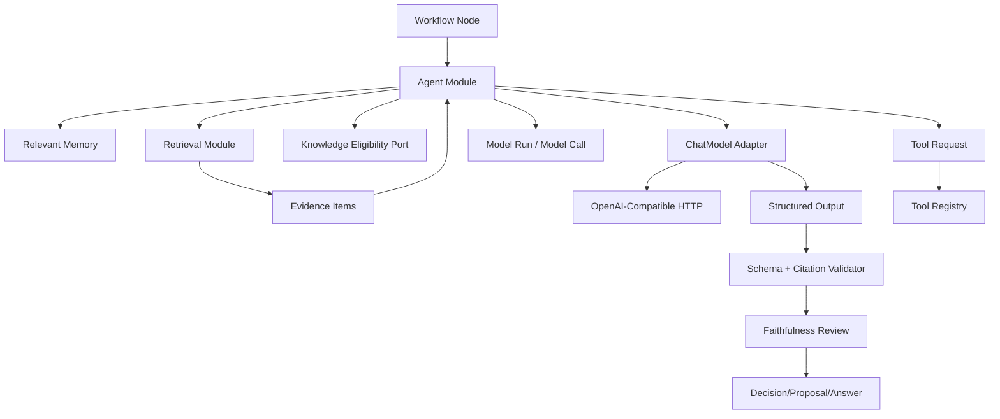
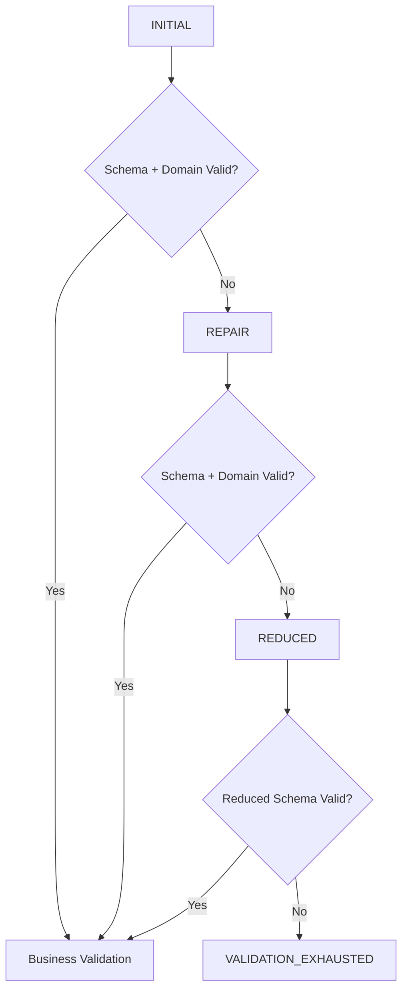
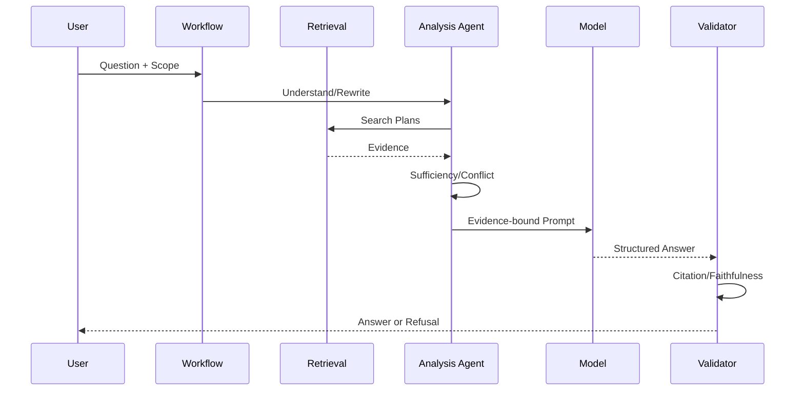

# Agent 与 RAG 架构

## 1. 目标

定义 Agent 角色、模型调用、结构化输出、RAG 证据链、记忆、冲突和评测边界。

## 2. 架构图

## 3. 逻辑角色

### Analysis Agent

- 问题理解。
- Claim 抽取。
- 查询规划。
- 关系分类。
- 证据充分度。

### Organization Agent

- 文章优化。
- Proposal 草稿。
- Artifact 大纲与正文。
- 关系建议。

### Review Agent

- Schema。
- 引用。
- 事实保持。
- 冲突。
- 风险。
- 评分合理性。

角色可以使用同一模型，但必须使用不同任务模板和输出 Schema。M6-02 至少冻结四类独立、版本化任务 Schema：

- Relation Assessment。
- RAG Answer。
- Refusal。
- Faithfulness Review。

不得用一个通用 Schema 的可选字段组合模拟四类任务。

## 4. 模型调用上下文

上下文组成：

1. System Policy。
2. Workflow Node Goal。
3. User Constraints。
4. Relevant Memory。
5. Evidence Items。
6. Tool Definitions。
7. Structured Output Schema。

外部 Source 和 Tool Result 标记为 untrusted data。

## 5. 结构化输出

公共 Envelope 只包含：

- result_type。
- schema_id。
- schema_version。
- model_run_ref。

Relation Assessment、RAG Answer、Refusal 和 Faithfulness Review 各自定义具体 payload，不使用一个巨型万能对象。
输出必须是单个严格 JSON document；Decoder 拒绝非法 UTF-8、重复 key、unknown field、尾随第二个值、错误类型或枚举，以及越界字符串、数组和嵌套深度。Schema 通过后仍须执行领域、Evidence、Workspace、Applicability 和动作权限校验，禁止 regex、Markdown fence、默认对象或自由文本 fallback。

## 6. Schema 修复

一次 Structured Run 最多三次模型响应：`INITIAL -> REPAIR -> REDUCED`。REPAIR 只接收脱敏错误摘要；REDUCED 使用任务定义的最小安全 Schema，不放宽 Decoder。耗尽后返回稳定失败，不允许额外 Provider 自动重试、跨模型 fallback 或自由文本假成功。Workflow 只可重试明确的 transient provider failure。

## 7. RAG 回答链

## 8. 证据充分度

因素：

- Top Evidence 相关性。
- 来源数量。
- 来源状态。
- 是否覆盖问题各子项。
- 是否存在冲突。
- 引用能否定位。

Retrieval 返回的 Active Index Evidence 只证明“当前可检索”，不证明“已批准可发布”。Agent 必须把本次选中的、最多 500 个 Provenance 交给 Knowledge Application 的批量 Evidence Eligibility seam：

- Confirmed Claim/Relation Evidence：eligible。
- Disputed Claim Evidence：eligible，但回答必须披露关联 Conflict。
- Suggested、Rejected、Deprecated 或没有正式知识绑定：ineligible。

资格查询必须按 Workspace fail closed、稳定排序且单批完成；Agent Adapter 不直接查询 Knowledge 表。

证据不足：

- 扩展本地查询。
- 用户允许时网页检索。
- 仍不足则拒答。

## 9. 冲突

- Conflict Claim 同时进入上下文。
- Answer 输出不同观点、适用条件和来源。
- 不允许用模型常识静默裁决。
- 可生成 Conflict Investigation Workflow。

## 10. 引用验证

Citation 必须绑定 `workspace_id + index_version_id + chunk_id + source_version_id + source_span_id`。按以下四层顺序验证：

1. Identity：引用来自本次 Evidence set，且 Workspace、Index Version、Chunk、Source Version、Source Span 绑定一致。
2. Openability：通过 Retrieval EvidenceReference 复核 Artifact hash、byte range 和 excerpt。
3. Eligibility：通过 Knowledge Eligibility Port，未批准、无正式绑定或跨 Workspace 时 fail closed。
4. Semantic Support：RAG Answer 拆为原子 Assertions，每项绑定 eligible Citation；Faithfulness Review 使用独立任务 Schema 判断支持关系。

失败：

- 前三层任一失败直接拒绝发布，不用模型重试修复损坏或无资格 Evidence。
- 每个事实性 Assertion 必须至少有一个支持引用，或显式标记 `model_inference`，不能把推断标为已验证事实。
- Semantic Support 失败可在有界预算内重生成一次；Review 不可用、再次失败或高风险结果无法验证时返回 Refusal。
- 批量打开最多 500 个 Citation；Repository 用一条参数化 SQL 证明完整 frozen Index tuple，Application 对同一
  Source Version 只读取和校验一次 Artifact，禁止逐 Citation 查询数据库或重复读取 Artifact。

## 11. 关系分类

`Existing Claim` 不是 Workflow 调用方或模型可声明的事实。Relation Analyzer 在模型调用前必须通过 Knowledge
Application 的 `FormalClaimReader` 读取 Confirmed/Disputed Claim，并逐项核对 Workspace、正文、canonical
Applicability 和 Source；Existing Evidence 还必须同时命中该 Claim Source，且 Eligibility binding 满足
`owner_type=CLAIM && owner_id=existing_claim_id`。任一漂移都在模型调用前 fail closed。

Disputed Existing Claim 的机器披露由服务端生成 `claim_id + conflict_ids + canonical applicability + UTC updated_at`。
该 `conflict_disclosures` 进入受信模型输入，模型输出必须精确复制；遗漏、额外 Conflict、条件或时间漂移均视为
不可信输出，不能创建 Relation 或发布结论。

步骤：

1. Claim Decomposition。
2. Candidate Retrieval。
3. Applicability Comparison。
4. NEW/COMPLEMENTARY/DUPLICATE/CONFLICT/LOW_CONFIDENCE。
5. Review Agent。
6. Proposal/Human Task。

置信度来自可解释因素，不使用模型单一自报概率。

## 12. 文章优化

Agent 输出 Change Items：

- change_type。
- original_span。
- replacement。
- reason。
- semantic_risk。
- evidence。

Review 检查：

- 禁止修改项。
- 事实。
- 代码块。
- 无来源新增。
- 删除信息。

## 13. Artifact

- 先 Plan，后 Section Generation。
- 每章独立检索。
- 缺失知识显式标记。
- Artifact 默认不进入正式 RAG。

## 14. Review Scoring

评分输入：

- Question。
- Answer Points。
- User Answer。
- Claim Evidence。

输出：

- correctness。
- coverage。
- boundaries。
- clarity。
- omissions。
- errors。
- citations。

Review Agent 防止无证据过度评分。

## 15. Memory

### Short-term

- Conversation。
- Workflow Context。
- 自动过期。

### Long-term

- 用户确认偏好。
- 用户授权反馈。

限制：

- Memory 不作为事实引用。
- Agent 只读取任务相关 Memory。
- 用户可删除。

## 16. Tool Calling

Agent 只输出 Tool Request：

- schema_version。
- tool_name。
- arguments。
- reason。

通用请求不接受 Workspace、Workflow identity、Capability、Approval、Credential、Target Version、
timeout、endpoint、path、command 或 Git args。Provider 原生 `tool_calls` 继续 fail closed；项目只解析
独立版本化 Tool Request v1，且 Tool Request 本身不直接执行。

Tool Registry 负责：

- 是否允许。
- Schema。
- 权限。
- 执行。
- 审计。

模型可见 Tool 目录只能使用 Worker 当前真实可执行、配置启用且持久 Workflow Node 精确允许的 Tool 版本。
M6-03 的 API 只冻结 11 个 Contract 用于 Definition 校验，尚未把动态目录接入模型；不能用 Fake Executor 冒充 Worker 能力。Tool Result
必须经过输出 Schema、大小限制和共享脱敏，并标记 `untrusted_data=true`；Source 或 Tool Result 不得递归
成为新的 Tool Request。

M6-03 先把 strict Agent Tool Request 转换为不含模型自由文本 `reason` 的 `PersistedToolInvocationV1`。持久
`agent-rag` Definition 只包含 `ReadSource`、`ValidateCitation`、`ReadGitStatus`：它们的输入为空或稳定 ID tuple。
Search query 与 Diff before/after 是内容型参数，不得作为 raw Workflow input 持久化。M6-04 的
retrieval-first RAG 在同一 Agent Attempt 内通过 Retrieval Application seam 执行 Search；持久 RAG Workflow
Input 只保存 Conversation/Question/Answer、请求/上下文 Hash 和版本绑定，仍未开放通用模型 Tool Loop。

M6-04 已完成 Conversation、RAG HTTP API、持久阶段/SSE、Feedback 和真实 `/chat` 页面；通用模型 Tool Loop
预算仍未实现，不能把 retrieval-first 单节点 Workflow 描述为任意 Tool Calling 会话。

## 16.1 Conversation RAG v2 执行契约

- 执行顺序为冻结上下文→Query Plan/Clarification→1..3 rewrites→Retrieval/Dedup→Eligibility/Topic
  批量绑定→RAG Answer v2→Citation→Faithfulness Review→原子发布。
- Query Plan 与 Faithfulness Review 的内存模型输入由服务端注入对应 `model_run_ref`；调用方不得伪造保留字段。
  持久 Workflow Input 不保存上述模型输入、Question 正文、历史或 Evidence。
- 正常 completed 路径固定形成 PLAN、ANSWER、REVIEW 三次 Model Call；每次仍使用 Structured Runner 的严格
  Schema/Domain 门禁，修复调用只在该阶段输出非法时按既有预算发生。
- RAG Answer v2 在 v1 基础上增加服务端验证的 `related_topics` 和 1..5 个 follow-up questions；Topic 必须来自
  Knowledge binding 并关联实际 Citation，不能信任模型自造 ID/名称。
- Retrieval summary、真实阶段事件和最终 Answer 都持久化；阶段通知不含正文/Evidence，刷新从数据库投影恢复。

## 17. 模型路由

按 Node Capability：

- 强推理：关系、冲突、复杂评审。
- 快速模型：Query Rewrite、分类预处理。
- Embedding：批量。
- Rerank：候选重排。

路由配置版本化；切换需评测。

主模块使用项目自有 `ChatModel` Interface，并提供 direct HTTP 与 Eino-backed 两个 OpenAI-Compatible Adapter；`ZHIXU_CHAT_IMPLEMENTATION` 只在 Composition Root 选择实现，默认 `direct`。RAG Answer 使用的 `StructuredRunner` 可由 `ZHIXU_STRUCTURED_SCHEDULER_RAG=direct|eino` 独立选择内部三阶段调度，但 Eino 不接管 Query Plan、Retrieval/Eligibility、Citation/Faithfulness、terminal proposal、Model Run/Call 或 River/PostgreSQL 工作流。Ollama 仍仅通过其 OpenAI-Compatible endpoint 接入，不维护 native Ollama 第二套 Chat 协议。同一 Node Attempt 内不得静默切换 Provider 或 Model；`provider=disabled` 表示 capability unavailable，Deterministic Fake 仅用于测试。

## 18. 降级

| 故障 | 行为 |
|---|---|
| Chat Model 不可用 | AI Node 等待/失败，非 AI 浏览可用 |
| Embedding 不可用 | Keyword Search 可用 |
| Rerank 不可用 | 显式降级 RRF |
| Review Model 不可用 | 不自动发布高风险结果 |
| Web Tool 不可用 | 本地证据不足则拒答 |

## 19. 评测门禁

- Prompt 变更。
- Model 变更。
- Schema 变更。
- Retrieval 变更。

均触发对应数据集。高风险指标下降阻止默认切换。

## 20. Model Run 事实源

一次 Node Attempt 只创建一个 Model Run；每次 `INITIAL`、`REPAIR`、`REDUCED` 和 `REVIEW` 是独立 Model Call。
Model Run 在首次调用前持久化并冻结 Workspace、Workflow Run、Node Run、Node Attempt、generation
Adapter/Model/Profile/Prompt/Schema 和 Retrieval 版本；每条 Model Call 还必须冻结该次实际使用的
Adapter/Model/Profile/Prompt/Schema 与 `max_output_tokens`，因此独立 REVIEW 版本可以直接历史查询，不能只保存
不可逆 request hash。Model Call 在请求前写入 `STARTED`，完成使用 CAS 归约。

Run 状态为 `RUNNING -> SUCCEEDED | REFUSED | FAILED | UNKNOWN`，Call 状态为 `STARTED -> SUCCEEDED | FAILED | UNKNOWN`。进程中断或结果不确定不能伪装成功；历史查询、Knowledge `model_run_ref`、Token/耗时/repair/error 统计以该专用事实源为准，不以日志或通用 Node output 代替。

## 21. 隐私

- 最小化发送到云端模型的内容。
- 按 Evidence Window 发送，不发送整个 Workspace。
- 日志、Trace、错误、Model Run/Call 和评测结果不保存完整 Prompt、Evidence、Source、原始模型响应、Credential 或绝对路径，只保存稳定 ID/版本、计数、哈希、Token、耗时和错误码。
- Disputed Evidence 的 `ConflictPosition.claim_id/applicability/updated_at` 必须精确匹配 Knowledge Eligibility 返回的
  Owner Claim、canonical Applicability 与 Claim 更新时间；Retrieval `CapturedAt` 只表示 Source Version 捕获时间，
  不能替代 Claim 更新时间。模型生成的 position 文本、Conclusion 与 Conflict Summary 仍需 Faithfulness Review。
- 模型 Adapter 记录数据保留配置。
