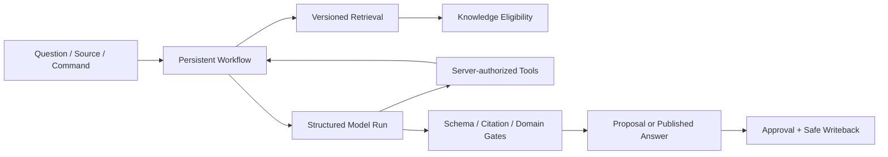
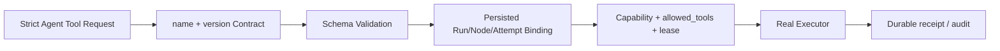

# AI 与工作流运行时

本章统一描述检索、模型运行、RAG、受控 Tool、持久 Workflow 以及依赖这些能力的业务执行流。产品验收见 [需求文档](../requirements.md)，安全/性能/评测门禁见 [质量架构](quality.md)，精确 HTTP wire 见 [OpenAPI](../../api/openapi/openapi.json)。

## 1. 运行时总览



核心边界：

- Retrieval 找到候选，不决定知识资格；Knowledge Eligibility 决定证据能否用于发布。
- Model 输出是不可信候选，必须经过严格 Schema 和领域校验。
- Tool 权限来自服务端持久 Workflow/Node/Attempt，不来自 Prompt 或 Provider `tool_calls`。
- 任何写入最多生成 Proposal；实际文件/Git 副作用只由批准后的 Change Control 执行。
- Workflow 是可恢复业务状态，River 是投递/领取实现；两者不能互相替代。

## 2. 检索与索引

### 2.1 输入与投影

- Ingestion 保存不可变 Source Version、Content Artifact、Parse Projection、Source Span 和 canonical Chunk。
- Retrieval 只引用 canonical Chunk 建立 FTS/vector 投影；不复制 Source 所有权，不把 Chunk 当 Claim。
- 每个投影绑定 Workspace、Revision、parser/chunk/embedding/config/index version 和可重建 owner。
- Draft、Historical、Quarantined、Deleted 和非批准 Revision 默认不进入 Active Index；Archived 仅显式范围可查。

### 2.2 Index 生命周期

```text
Building -> Validating -> Ready -> Active -> Archived
                     \-> Failed
```

- 一个 Workspace 同时只有一个 Active 完整 Index Version；新版本独立构建、验证和评测后原子切换。
- Reindex 使用持久 Delivery、lease、heartbeat、checkpoint 和 Outbox；同一 owner/version 幂等，响应丢失不能创建第二 Active。
- 切换失败继续服务旧 Active；失败版本和产物保留到诊断完成，不能为“清理”删除恢复证据。
- Embedding dimensions、normalization、distance metric、model/version 或 chunk strategy 变化必须创建新 version，不能原位混用。

### 2.3 混合检索

1. 规范化 query 与 Workspace/scope/filter。
2. 并行执行 PostgreSQL FTS 与可用的 vector search。
3. 在各路稳定排序和有界候选上做 RRF 融合、去重。
4. 可选 Rerank 只调整候选顺序，不改变 Evidence 身份或资格。
5. 返回 requested/effective mode、各阶段版本、degradation 和 Source Span locator。

Keyword、Vector、Fusion 与 Rerank 可独立观测。Rerank 失败可以显式使用 fused 顺序；Embedding 不可用时 Hybrid 明确退化 Keyword；纯 Semantic 返回 unavailable，不能返回空成功。Distance 必须保持 distance 语义，不能被前端重命名为 similarity。

### 2.4 Evidence

Evidence loader 只接受稳定身份，不接受文件路径。它从不可变 Content Artifact 读取，复核 Workspace、Source Version、Artifact、Hash、大小、Span byte range 和 excerpt Hash，并返回有界 UTF-8 excerpt。任何绑定异常 fail closed，不回退当前工作树。

## 3. 模型运行

### 3.1 角色与边界

逻辑角色包括 Analysis（理解/抽取/关系评估）、Organization（结构与变更建议）和 Review（验证结构、Citation、事实与评分）；它们可以由同一模型承担，不要求三个 Provider。

模型只能接收任务所需的最小、脱敏上下文。领域对象、Workflow、Proposal、Approval、Tool Permission 和 Write Authorization 由项目拥有；Provider/Eino/LangChain 类型不得持久化或进入对外 API。

### 3.2 Model Run 与 Call

- `Model Run` 冻结 Workspace、Node Attempt、Adapter、Model/Version、Prompt、Schema、Retrieval/Index version、预算和最终状态。
- `Model Call` 记录 `INITIAL`、`REPAIR`、`REDUCED` 或 `REVIEW` 的顺序、版本、输入/输出 Hash、Token、耗时与稳定错误；不保存完整 Prompt、Evidence 或原始响应。
- API 与 Worker 使用相同 configured model factory；一次操作通过 runtime lease 冻结完整 generation，运行中不得静默换 Provider/模型/版本。
- 新 Workflow Attempt 在 Claim 事务中冻结 Worker instance 与 `model_settings_revision`；历史 Attempt、Model Run 和 Artifact replay 不得改绑当前默认 revision。
- Provider timeout、rate limit、malformed response、model drift 和 budget exhaustion 使用不同稳定错误，不折叠为“AI 失败”。

### 3.3 Managed 模型配置热应用

Managed 模式继续区分 `desired`、`active` 和 API/Worker `applied`。Settings 的“保存并应用”先保存
immutable desired revision，再启动该 exact revision 的持久 activation；“仅保存”只推进 desired。
正常 Apply 不执行 launcher，也不停止、替换或重启 API/Worker 容器。

```text
idle|failed -> preparing -> arming -> activating -> idle
                 \-> failed
```

- `preparing`：两端构造并 Probe 同一 revision 的完整 Chat、Embedding 与角色依赖图，旧 active 继续服务。
- `arming`：短暂关闭新的默认模型 acquisition 和 Worker Claim；已开始请求、Attempt、Source refresh 或 Reindex 继续持有旧 lease。
- `activating`：PostgreSQL 已唯一提交 target；API/Worker 原子安装本地 generation、确认 applied 后再重开 admission。
- commit 前失败转 `failed` 并清理 candidate；commit 后禁止自动回滚，只按数据库 target 向前恢复。

每个进程的 `RuntimeHost` 同时拥有 candidate、active、retiring 和按需历史 generation。一次业务操作只
Acquire 一次不可拆分的 payload，并在最终化后 Release；旧 generation 最后一个 holder 释放后才关闭其
owned Transport。`./zhixu restart` 仍可用于升级和故障恢复，但不是配置生效步骤，且不会在 idle 时自动
应用 pending desired。完整决策见 [ADR-0022](adr/0022-model-runtime-hot-activation.md)。

受管理本地 Ollama 的进程与数据边界固定如下：主 Compose 保留一个
`local-model-runtime` 管理容器；管理器常驻但不等同于推理服务，只有 active、候选、
测试或仍被 generation lease 持有的本地模型需求存在时，才在同一容器内启动唯一的
`ollama serve` 子进程。模型权重位于独立 project-owned Docker Volume，停止子进程、
重建管理容器或切换到线上模型都不会删除该卷。Chat 与 Embedding 共用这个服务，
任一需要即运行，全部线上/关闭且停止栅栏满足后才停止。控制面、计算面和数据面的
完整取舍记录在 [ADR-0023](adr/0023-managed-local-ollama-runtime.md)。

Retrieval 不以“当前 settings Embedding”覆盖持久索引事实。Search 先读取 Active Index/Embedding
Version，再按 Provider、Adapter/Model、dimensions、normalization、distance、endpoint identity、limits
及 revision hint Acquire 兼容 generation；Source Refresh、Vector Builder 与 Reindex 在完整操作期间持有
同一 lease。相同 Contract 可跨 revision 复用，不兼容时按历史正 revision 重建；无法重建则显式
`RETRIEVAL_VECTOR_EMBEDDER_VERSION_UNAVAILABLE`，不得 fallback 到新默认 Embedder。revision `0` 的
canonical disabled/static runtime 不承诺历史重建。

### 3.4 Structured Output

```text
INITIAL strict schema
  -> valid: domain validation
  -> invalid: one bounded REPAIR with validation errors
  -> still invalid/oversize: REDUCED schema or explicit failure
  -> REVIEW for workflows that require independent verification
```

- JSON Schema 通过后仍执行领域校验：owner、版本、Applicability、Evidence、Citation、枚举、范围和不变量。
- Repair 只获得最小错误摘要，不获得 Credential 或扩大上下文；重试次数与 Token budget 有界。
- Provider 原生 Tool Call 不绕过项目 strict Agent Tool Request；自由文本中看似命令的内容只当不可信数据。
- 结构失败不得保存半合法对象、自动降级成字符串或返回假 Proposal/Answer。

### 3.5 当前 AI 选择

主模块当前使用项目 Application + 直接 OpenAI-Compatible Adapter；Eino PoC 未通过全部采用门禁，因此不是当前正式依赖，见 [ADR-0013](adr/0013-eino-adoption-gate.md)。未来 Eino/Agent 迁移只在 [路线图](../roadmap.md) 描述，不能改变本章当前事实。

## 4. RAG 发布门禁

### 4.1 当前执行流

当前 `/chat` 是固定 retrieval-first 单节点 RAG，不是开放 Tool Loop：

```text
Question -> PLAN -> Retrieval -> Knowledge Eligibility
         -> ANSWER -> REVIEW -> Citation/Faithfulness Gate
         -> Answer | Refusal | Clarification | Failure
```

三个阶段可以产生可恢复进度事件，但最终状态以 REST/数据库为准；阶段事件不是逐 Token Answer 草稿。

### 4.2 Query 与 Conversation

- Question 不可变，绑定显式 Workspace/scope 与一次 Answer Workflow。
- Conversation 只用于当前会话消歧和 query rewrite，不自动进入 Memory 或正式知识。
- 语义/范围不足先发 Clarification；不是证据不足 Refusal，也不是运行错误。
- Search/Retrieval 结果绑定 query/request hash、Index version 和实际模式，避免把旧 Evidence 用于新问题。

### 4.3 证据与回答

1. Retrieval 返回候选 Source Span。
2. Knowledge Eligibility 只接受批准 Claim Source、Relation Evidence 或受控 Conflict 绑定。
3. Answer 明确区分直接证据、推断、冲突和未知。
4. Citation 依次验证 Identity、Openability、Eligibility、Semantic Support。
5. Review 检查每个事实性结论；任何强结论缺支持都拒绝发布或降级说明。

Refusal 只用于检索完成但证据不足/冲突无法安全回答；DB/Provider/timeout/corruption 是 Failure。引用失效、Workspace 错绑或当前工作树与不可变 Artifact 不符时 fail closed。

### 4.4 恢复与反馈

- Question、Workflow、Model Run、Answer/Refusal/Clarification 分开持久化；重试按同一逻辑 key 恢复，不重复发布。
- SSE 只使 Conversation/Answer 查询失效；断线后用 Last-Event-ID + REST 回查。
- Answer Feedback 是 append-only Evaluation 事实，不直接改 Answer、Claim、Memory 或 Proposal。

## 5. 受控工具运行时

### 5.1 Registry 与授权链



每个 Tool Contract 声明输入/输出 Schema、Capability、side-effect level、timeout、retry/idempotency、sensitive fields 和 allowed workflows。API 可注册 Contract；Worker 只有在真实 Adapter、安全闭环和 Workflow 都可用时注册 Executor。Contract 存在不等于 capability ready。

模型请求只能包含 `schema_version`、`tool_name`、`arguments` 和说明。Workspace、Capability、Approval、Credential、timeout、endpoint、path、command、Git args、Run/Node/Attempt、lease/fence 都由服务端持久事实绑定；请求携带这些字段时忽略或拒绝。

### 5.2 当前工具边界

- `ReadSource`、`ValidateCitation`、`ReadGitStatus` 使用稳定 ID tuple 或空参数，并受 Workspace/Workflow 绑定。
- `SearchKnowledge`、`CalculateDiff` 等内容型工具必须有不复制 raw 内容的 request/receipt 或同一 Attempt 执行边界，缺少时不注册假 Executor。
- `FetchWebPage` 默认关闭；即使进程配置启用，缺少持久 Workspace/Workflow Web Policy 时 readiness fail closed。
- `RebuildIndex`、`RunRegressionEvaluation` 等 Contract 缺少真实 Application seam/receipt/Workflow 时只能不可用，不能返回空成功。
- 不提供公共任意 Tool execute API；HTTP 身份或高 Scope Token 不能直接构造 Workflow Tool Context。

### 5.3 副作用与 receipt

- 只读纯函数结果可以从 durable receipt replay；没有权威 receipt 时明确不可重放，不能重新发远程请求后冒充同一次 Call。
- 写工具不进入普通 Agent 目录。`ApplyApprovedPatch` 与 `CreateGitCommit` 只是 Safe Writeback 内固定逻辑审计身份，不是第二 Executor。
- `STARTED` 必须在副作用前持久化，`SUCCEEDED` 只在可验证 checkpoint 后写入；发现外部结果但没有历史 STARTED 时进入人工恢复，禁止事后补造审计。
- Source、网页和 Tool Result 均作为 untrusted data，不进入 System Message，不递归触发 Tool。

完整授权、SSRF、Prompt Injection、receipt 与审计要求见 [质量架构](quality.md)。

## 6. 持久 Workflow

### 6.1 模型

`Workflow Definition` 版本化保存节点、转移、权限、重试和补偿。`Workflow Run` 是实例；每个逻辑节点只有一个 `Node Run`，实际投递/重试追加 `Node Attempt`。River Job Args 只保存最小 version + stable ID + dispatch no，不复制正文、路径、Credential 或领域状态。

节点类型：同步 Application、Model、Tool、Human Task、Timer/Retry、Subworkflow/Projection 等。Human Task 等待不占 Worker lease；模型/工具节点必须声明 budget、timeout 和 capability。

### 6.2 状态与租约

- Run/Node 使用 Pending、Runnable/Queued、Running、WaitingHuman/WaitingRetry/Paused、Succeeded/Failed/Cancelled/ManualRecovery 等可归约状态；精确数据库枚举以迁移为准。
- Worker Claim 使用 DB time、lease owner/fence、heartbeat 和 Attempt；只有持有当前 fence 的 Attempt 可以 Complete。
- River transport retry 遇到未过期领域 lease 返回 retryable held；到期后新 delivery reclaim，同一 Node 不创建第二领域执行。
- Node Completion、结果摘要、next node/outbox 和幂等记录在同一数据库事务提交。

### 6.3 重试与幂等

- Validation/permission/contract 错误不重试；dependency/rate-limit/lease-held 按稳定分类退避；unknown side-effect 不自动重试。
- 幂等 key 覆盖 Workflow command、Node completion、Tool Call、Human Task、Writeback Execution、Reindex Delivery 和外部 response-loss。
- retry 创建新 Attempt 并保留旧错误；不能直接把 River Job 标 Completed、改 Context JSON 或清理未知 checkpoint。

### 6.4 暂停、取消与补偿

- Pause 停止新节点；Resume 从持久状态继续。Cancel 设置 requested，先阻止新节点，再等待当前副作用到可证明终态。
- 已发生副作用必须走领域补偿或明确保留；取消不是删除历史。Writeback 只有在 Execution 进入允许的终态后，Workflow 才能 terminal cancelled。
- Compensation 本身是有状态节点，失败进入 `MANUAL_RECOVERY_REQUIRED`；不得无限互相补偿。

### 6.5 升级与清理

- 在途 Run 使用创建时 Definition/Prompt/Schema/Tool version；新版本不原位改变旧 Run。
- 旧执行器不可用时提供显式 migration/upcaster；不直接修改持久 JSON。
- 历史 Attempt、Approval、receipt 与安全审计保留；大 payload 归档时保留 Hash、owner、版本与可重放引用。

## 7. 业务执行流

### 7.1 资料摄取与知识整理

```text
Capture/Source -> immutable artifact -> security -> parse -> chunk -> index
 -> profile/topic/claim candidates -> retrieve existing knowledge
 -> relation assessment -> Proposal/Conflict/Human Task -> Approval -> Safe Writeback
```

重复 Source 复用版本；隔离内容不索引；Profile 和 Suggested Material 只是候选。用户确认材料后冻结 Snapshot；正式知识必须经过 Proposal，失败从 Ingestion/Index/Workflow checkpoint 恢复。

### 7.2 文章优化与版本入库

Source/Document → 选择原文入库或优化模式 → 结构/语言/缺口分析 → Draft Revision → 受保护 Span、事实、代码、引用校验 → 逐项 Diff/Human Task → Proposal → Writeback。用户编辑目标后旧 Proposal stale，必须三方比较；无来源补强不得发布。

### 7.3 Proposal、Approval 与写回

Proposal Revision → Evidence/Diff validation → ReadyForReview → Approval 绑定 Change Hash/Target/Git HEAD → Atomic Begin 消费两类写授权 → file CAS → Git Commit proof → mapping/outbox → reindex/regression。响应丢失先 exact lookup，不确定则保留文件/Git/index 现场并人工恢复。

### 7.4 RAG 问答

Question/scope → Clarification（必要时）→ query plan → hybrid retrieval → eligibility → conflict check → structured answer → citation/faithfulness review → Answer/Refusal。Conversation 只提供短期上下文；网页补充需要独立授权，不能把网页内容当 System 指令。

### 7.5 Artifact 生成

目标/材料 → frozen Input Snapshot → coverage/gap analysis → versioned outline → Human Task → per-section retrieval/generation → Citation/Conflict/Coverage gate → Artifact Revision → export 或 publish Proposal。证据不足的章节保留 GAP；生成结果默认不入正式知识。

### 7.6 图谱与语义关联

Graph 查询直接投影 canonical Relation，按 Workspace/方向/类型/状态有界分页；全局、局部和路径均有列表 fallback。Semantic scan 生成 Candidate/Fingerprint；ignore 记录理由，confirm 只生成 Relation Proposal。HTTP/Worker 失败不得把 Candidate 放入 Graph Canvas。

### 7.7 知识健康

手动/定时/变更触发 → 冻结增量范围 → 检测孤立/重复/冲突/过期/来源/索引问题 → Fingerprint 去重 → Issue create/reopen → ignore/rescan/repair Proposal。相同证据只更新验证时间；Repair 经统一审批。

### 7.8 Review 与 Interview

选择 Topic/Collection/岗位 → 读取批准 Claim/掌握度 → 生成带 Citation Card → 审批 → Question snapshot → Answer → versioned scorer/review → FSRS 幂等更新 → gap/path。Interview 另有难度、deadline、连续追问和覆盖报告；失效 Claim 使 Card invalid，不继续调度旧题。

### 7.9 Conflict 调查与解决

关系/RAG/用户/健康创建 Conflict → 固定成员、Applicability、Evidence 与影响 → 追加调查 → choose one / accepted divergence / synthesize / defer → Resolution Proposal → 下游 Graph/RAG/Review/Artifact/Health impact。调查和旧结论 append-only，不静默覆盖。

### 7.10 知识生命周期

Document/Topic/Claim 的新建、重命名、移动、拆分、合并、归档和删除先计算引用/关系/Artifact/Review 影响，再生成事务组 Proposal。合并保留 Provenance，旧对象默认 Superseded；归档退出默认检索；删除保留审计和 Git 恢复路径。

## 8. 运行时禁止模式

- 不把 Active Index、向量相似度、模型置信度、Candidate 或 Artifact 当正式知识。
- 不在 Component/API Handler/Adapter 复制 Workflow 状态机、Evidence Eligibility 或 Tool Authorization。
- 不用日志、SSE、River Job 或 Provider response 代替持久领域事实。
- 不在失败时静默换模型、放宽 Schema、扩大 Root/Tool 权限、返回空成功或假 Completed。
- 不让 Agent、Tool 或用户输入直接创建文件/Git 副作用；所有正式写入回到统一 Change Control。
