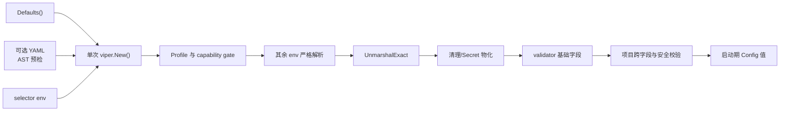

# 进程启动配置架构

> 状态：当前实现契约
> 实现入口：[`internal/platform/config`](../../internal/platform/config)
> 运维变量示例：[`.env.example`](../../.env.example)

本文说明 API、Worker、Migrate 与 ModelCtl 的启动配置如何合并、校验和隔离。它只覆盖进程启动时的
`Config`，不把 Viper 当成运行时配置总线，也不替代 Model Settings 数据库中的 revision 与 Rollout 状态。

## 1. 入口与进程范围

| 进程/用途 | 配置入口 | YAML 选择 | Profile |
|---|---|---|---|
| API | `config.Load(path)` | `zhixu-api -config <path>` | API |
| Worker | `config.LoadWorker(path)` | `zhixu-worker -config <path>` | non-API |
| Migrate | `config.LoadMigration(path)` | `zhixu-migrate -config <path>` | non-API |
| ModelCtl | `config.LoadMigration("")` | 当前没有 `-config` flag | non-API |
| 确定性测试 | `config.LoadWithLookup(path, lookup)` | 参数传入 | API |

API profile 读取通用配置和 API-only Bootstrap/Review Secret，并执行 Auth/Review 校验。Worker、Migrate
和 ModelCtl 复用同一 non-API profile：它们不查询或保留 API-only Secret，也不执行 Auth/Review 校验，
但数据库、Worker、Tool、模型、Telemetry、RRF 等其他共享配置仍完整加载和校验。`LoadMigration` 不是
DB-only Loader；缩小该范围会改变 Migrate/ModelCtl 的现有启动门禁。

## 2. 加载流程与实例边界



- 每次 `Load*` 都创建并独占一个 `viper.New()`，完成后只返回 `Config` 值。
- 禁止 Viper 包级单例、`AutomaticEnv`、`BindEnv`、`WatchConfig` 和 remote provider。
- 临时 Viper 不进入 Composition Root、日志或长生命周期服务；配置不会在进程内热更新。
- `Defaults()` 是默认值唯一事实源。Loader 根据 `Config` 的 `yaml` tag 注册默认值，并复制 slice，避免
  不同加载实例共享可变底层数组。
- 环境变量由声明式 registry 通过注入的 `LookupEnv` 读取，再以目标 Go 类型写入本次 Viper；核心路径不让
  Viper 直接读取进程环境。

## 3. 来源与覆盖优先级

字段有效值的固定优先级是：

```text
环境变量 > YAML > Defaults()
```

`-config` 只选择可选 YAML 文件，不是一层字段覆盖，也没有命令行逐字段配置。未传 `-config` 时直接合并
环境变量与默认值；ModelCtl 当前固定不读取 YAML 文件。

环境变量的 `(value, present)` 同时参与语义：只要变量存在，空字符串也会覆盖 YAML/默认值。字符串字段
随后按字段规则接受或拒绝空值；bool、整数、duration 和列表的空值会进入严格解析并失败，不会静默回退。
`review_question_ref_key` 额外保留来源 presence：缺省时允许安全派生/随机物化，显式空值必须失败。

## 4. 严格 YAML 边界

Viper 负责来源合并和 `UnmarshalExact`，`go.yaml.in/yaml/v3` AST 预检补足 Viper settings 会丢失的
原始结构信息。两者缺一不可，AST 预检不复制值合并逻辑。

| YAML 输入 | 行为 |
|---|---|
| 未知键，包括值为 `null` 或 `{}` | 拒绝 |
| 键大小写变化、重复键、非 mapping 根 | 拒绝 |
| 已知键为 `null` | 视为省略，保留低优先级值 |
| alias/merge | 解析并应用，仍检查合并键是否合法 |
| 第二个及后续 document | 保持兼容：只读取第一个 document |
| 标量写入 `[]string`、错误 bool/duration 类型 | 拒绝，不做弱转换 |
| 整数字段收到数值上为整数的 YAML float（如 `1.0`） | 在目标位宽内接受 |
| 整数字段收到小数或越界值 | 拒绝，不截断、不溢出 |

Decoder 显式使用 `yaml` tag、`WeaklyTypedInput=false` 和严格 duration hook。错误只暴露稳定配置键或环境
变量名与错误类别；不应回显原始值、完整配置、DSN、Endpoint、绝对密钥路径或 Rollout ID。

## 5. Secret 与 capability gate

环境变量查询本身属于安全边界，而不只是返回前清空字段：

| 条件 | 不得查询 | 返回前处理 |
|---|---|---|
| non-API profile | `ZHIXU_AUTH_BOOTSTRAP_TOKEN`、`ZHIXU_REVIEW_QUESTION_REF_KEY` | API-only 字段防御性清空 |
| Chat disabled | `ZHIXU_CHAT_BASE_URL`、`ZHIXU_CHAT_API_KEY`、`ZHIXU_CHAT_MODEL`、`ZHIXU_CHAT_MODEL_VERSION`、`ZHIXU_CHAT_ADAPTER_VERSION` | 清除低优先级 Endpoint/Key/Model/Model Version；保留并校验 Adapter Version 与通用 limits/timeout |
| Embedding disabled | `ZHIXU_EMBEDDING_BASE_URL`、`ZHIXU_EMBEDDING_API_KEY`、`ZHIXU_EMBEDDING_MODEL`、`ZHIXU_EMBEDDING_DIMENSIONS` | 清除低优先级 Endpoint/Key/Model/Dimensions；保留并校验 normalization、distance 与通用 limits/timeout |
| Telemetry disabled | `OTEL_EXPORTER_OTLP_ENDPOINT` | 清除 YAML/默认低优先级 endpoint |

只有现有 capability selector 形成查询 gate。`auth_mode=disabled` 仍读取 API Bootstrap/Review 配置并对非法
显式值 fail closed；`model_settings_mode` 也不新增对静态 Provider 或 managed 启动字段的查询短路。

non-API 仍会读取共享 YAML 文件的字节和结构，再从结果中清除 API-only 字段。因此当前保证是“禁止环境
Secret lookup 且返回值不保留”，不是共享 YAML 的字节级 Secret 隔离。需要更强威胁模型时，应提供进程专用
配置文件或 Secret mount。

`Config.String()` 与 `Config.GoString()` 只输出受控字段和 `Configured` 状态，不输出数据库凭据、Provider
API Key/完整 Endpoint、Bootstrap/Review Secret、managed key path 或 Rollout ID。不得记录 Viper settings；
validator 默认错误必须映射为项目错误，Viper/mapstructure decode 路径必须持续用 canary 测试证明不回显值。

## 6. 校验职责

`go-playground/validator` 由配置包私有构造，启用 `WithRequiredStructEnabled()`，只处理必填、非空、
独立范围等局部字段约束。项目通过稳定映射决定错误顺序和脱敏文本，不把默认 `ValidationErrors.Error()`
作为外部错误契约。

以下规则继续由项目代码拥有：

- URL、loopback、scheme、canonical path 与 Endpoint 安全；
- Provider/Secret 组合和 API/non-API 进程条件；
- lease/heartbeat、soft/hard stop、timeout/size 等跨字段关系；
- 数据库连接、RRF、Tool、Auth/Review 与 Secret 物化；
- Model Settings mode/key file/rollout ID/prepared 的启动组合。

新增字段时，先更新 `Config` 的 `yaml`/`validate` tag 与环境 registry，再判断规则属于局部 tag 还是项目跨字段
校验；不得为了“全部交给 validator”改变错误优先级或产品不变量。

## 7. Model Settings Rollout 边界

Viper 只解析 `model_settings_mode`、key file、rollout ID 和 prepared 这些启动控制字段：

- static 模式继续使用 Env/YAML 的静态 Chat/Embedding 设置，runtime revision 固定为 `0`；
- managed steady 继续从数据库加载 active revision；candidate 继续绑定固定 rollout target；
- 配置层只校验 Rollout ID 的 canonical string、长度与控制字符，不要求 UUID；
- UUID、phase、target/revision 一致性、desired/active/applied 状态和 commit/abort/recover 仍由
  `internal/modelsettings/runtime` 与数据库拥有；
- 每个 API/Worker 进程仍只构造并复用一个不可变 Model Runtime，Viper 不触发热切换。

Rollout 的完整状态机契约见 [模型设置与开发运行时契约](../../.trellis/spec/backend/model-settings-runtime.md)。

## 8. 维护与验证

- 环境变量名称和类型的代码事实源是
  [`internal/platform/config/loader.go`](../../internal/platform/config/loader.go)；`.env.example` 是 Compose/本地示例，
  不是第二份 Schema。
- 运行参数和部署说明见 [部署架构](deployment.md)；Secret 威胁边界见 [安全架构](security.md)。
- 修改加载行为至少运行：

```bash
go test ./internal/platform/config -count=1 -timeout 60s
go test -race ./internal/platform/config -count=1 -timeout 60s
go test ./internal/modelsettings/... ./cmd/api ./cmd/worker ./cmd/migrate ./cmd/modelctl -count=1 -timeout 60s
go vet ./internal/platform/config ./internal/modelsettings/... ./cmd/api ./cmd/worker ./cmd/migrate ./cmd/modelctl
git diff --check
```

重点断言来源优先级、显式空值、实例/slice 隔离、YAML wire 边界、lookup 零调用、低优先级清理、稳定脱敏
错误、non-API 共享校验范围，以及 Rollout UUID 仍由 runtime 拒绝。
