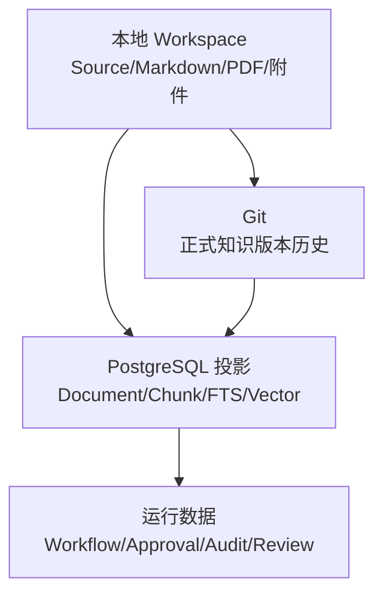
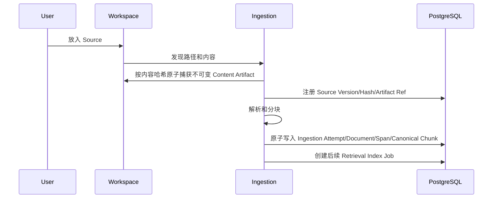
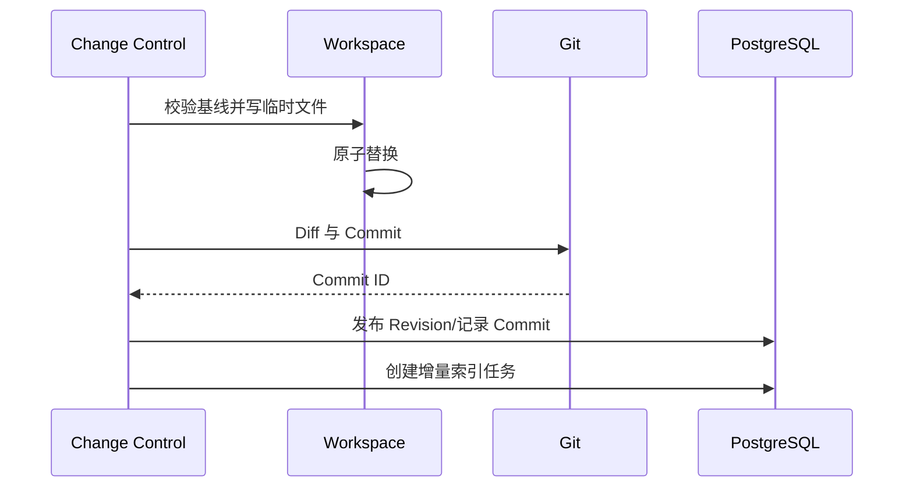

# 数据架构

## 1. 目标

定义本地文件、Git、PostgreSQL、向量索引和运行数据的所有权、一致性、生命周期、备份与恢复规则。

## 2. 三层存储模型



### 本地 Workspace

保存用户拥有的内容：

- 原始 Source。
- 正式 Markdown。
- PDF 和附件。
- 导出的 Artifact。

### Git

保存：

- 正式 Markdown 变更。
- 文件移动、合并、拆分和删除历史。
- 可纳入版本的稳定元数据。

不保存：

- Embedding。
- Workflow 租约。
- Token 统计。
- 临时缓存。

### PostgreSQL

保存：

- 文件与 Revision 映射。
- Chunk 文本投影。
- FTS 与向量。
- Topic、Claim、Relation、Conflict。
- Proposal、Approval、Workflow。
- Health、Memory、Review、Audit、Evaluation。

## 3. Workspace 目录

```text
workspace/
  inbox/
  sources/
    markdown/
    pdf/
    web/
    text/
  knowledge/
    topics/
  artifacts/
  attachments/
  .knowledge/
    sources/          # 按 SHA-256 create-only 保存的不可变 Source Content Artifact，普通扫描排除
    manifests/
    exports/          # Smart Collection Export 的受控 final 与 .staging 结果，不纳入普通扫描或 Git
  .git/
```

规则：

- sources/ 保存原始或抓取版本。
- knowledge/ 保存批准后的正式 Markdown。
- artifacts/ 保存用户显式导出的产物。
- .knowledge/ 保存应用托管的不可变 Content Artifact、清单和受控导出结果，不保存密钥；其中 `.knowledge/sources/<sha256>` 必须按内容哈希 create-only 写入，并从普通扫描和 Git 默认跟踪中排除。
- `.knowledge/exports/.staging` 只允许 M9-03 Export Job 的 create-only 临时文件；prepared binding 后的 staging/final
  路径、SHA-256 和 size 由 PostgreSQL Job 事实约束。普通 Workspace 文件、附件和用户 `artifacts/` 不能被 Export
  cleanup/orphan sweep 扫描或删除。
- 数据库 Volume 不放在 Workspace 内。

## 4. 事实源矩阵

| 数据 | 事实源 | 可否从事实源重建 |
|---|---|---|
| 原始 Source | Workspace | 是 |
| 正式 Document 内容 | Markdown + Git | 是 |
| Revision 历史 | Git + DB 映射 | 内容可，映射需恢复 |
| Chunk | PostgreSQL 投影 | 是 |
| Embedding | PostgreSQL 投影 | 是 |
| FTS | PostgreSQL 投影 | 是 |
| Topic/Claim | PostgreSQL + Provenance | 部分可重新抽取，但确认历史必须备份 |
| Confirmed Relation | PostgreSQL + Approval/Audit | 不能仅靠向量重建 |
| Proposal/Approval | PostgreSQL | 必须备份 |
| Workflow/Audit | PostgreSQL | 必须备份 |
| Review 进度 | PostgreSQL | 必须备份 |
| Artifact 导出 | Workspace | 是 |
| Smart Collection Export Job、下载统计、清理状态 | PostgreSQL `ops.export_job` + Audit | 必须备份 |
| Smart Collection Export 结果文件 | `.knowledge/exports` + Job prepared binding | 不能脱离 Job 的 revision/count/hash/size 重新解释 |

## 5. 文件身份

文件路径不是稳定 ID。

每个 Document 使用稳定 Document ID；路径移动只更新 Canonical Path。

版本令牌由以下组成：

- 内容哈希。
- Git Blob/Commit。
- Revision ID。

## 6. 数据流

### 导入



### 正式写回



## 7. 一致性模型

### 数据库内部

使用 ACID 事务：

- Proposal + Revision。
- Approval + Outbox。
- Node Completion + Next Nodes。
- Review Answer + Schedule。

### 文件/Git/数据库

无法使用单一数据库事务，采用有序 Saga：

1. 校验数据库目标版本。
2. 校验文件 Hash 和 Git HEAD。
3. 临时文件校验。
4. 原子替换。
5. Git Commit。
6. 数据库发布映射。
7. 索引。
8. 验证。

每一步记录可恢复状态。

## 8. 数据版本

- schema_version：JSON 契约。
- parser_version：解析器。
- chunk_strategy_version：分块。
- embedding_version：模型、维度和配置。
- index_version：完整索引快照。
- prompt_version：模型行为。
- workflow_definition_version：工作流。
- scheduler_version：FSRS。

## 9. 数据生命周期

### 永久保留

- Source Version。
- Git Commit。
- Approval。
- 正式 Revision 映射。
- 审计安全事件。
- Smart Collection Export Job、冻结范围、下载 Audit 与 cleanup 历史。

### 可归档

- 完成 Workflow 明细。
- 旧评测结果。
- 历史图谱投影。

### 可清理

- 临时文件。
- 失败模型原始响应。
- 可重建 Embedding。
- 过期缓存。
- 过期情景 Memory。
- 到期 Smart Collection Export 的受控 staging/final 物理文件；删除失败保留 Job cleanup 事实并重试，不能删除 Job 或 Audit。

清理策略必须保留重建所需版本信息。

## 10. 备份

备份单元：

- Workspace 文件。
- Git Repository。
- PostgreSQL。
- 配置模板，不含 Secret。

一致备份顺序：

1. 暂停新写入。
2. 等待 Side Effect 节点完成或进入安全检查点。
3. 记录 Git HEAD 和 DB Backup Marker。
4. 备份 Workspace/Git。
5. 备份 PostgreSQL。
6. 恢复写入。

## 11. 恢复

### DB 丢失但文件/Git 存在

- 重建 Source/Document/Chunk/FTS/Vector。
- 从稳定元数据导入 Topic/Relation（如有导出）。
- Proposal、Workflow、Review 只能从数据库备份恢复。

### 文件丢失但 Git 存在

- Git checkout 到独立恢复目录。
- 验证 Commit。
- 重新挂载 Workspace。
- 重建索引。

### Git 与 DB 不一致

- 进入 Read Only Recovery。
- 以文件和 Git 内容为正式基线。
- 重建 Revision/Commit 映射。
- 运行完整一致性检查。

## 12. 数据导出

产品目标仍包括 Markdown、附件、领域元数据、评测和审计等可迁移数据；当前已交付范围必须按 scope 说明：

- Smart Collection `MARKDOWN` 与 `METADATA_JSON` 通过 `export/v1` 异步 Job 输出，绑定 Workspace、Collection
  ID/version、query hash、首次 prepared 时冻结的 read-model revision、exact count、字段白名单、脱敏策略、
  SHA-256、size、TTL 与下载 Audit。
- 结果先写受控 staging，Prepare 持久化固定 binding 后原子 promote 到 `.knowledge/exports`。prepared 后恢复只验证
  固定文件，不能重读可变 Collection 或重新 render；结果文件不成为 Artifact、Document、Git、默认索引或 RAG 事实。
- TTL 到期只回收 staging/final 文件；Job、hash、下载统计和 append-only Audit 保留。每次下载前重验受控路径、
  symlink、hash、size，并在同一数据库事务记录服务端准备返回的 actor-bound Audit。
- Workspace attachment scope 从 canonical Workspace root handle 以 fd-relative no-follow 方式读取固定
  `attachments/`，生成 `attachment-export/v1` 确定性 ZIP/manifest；prepared 后只验证固定 archive binding，下载使用
  已校验 FD 流式返回。TTL/cleanup 只操作 `.knowledge/exports` 生成物，绝不修改或删除源附件。
- `ops.export_capability` 的 `workspace-attachments/v1` gate 默认关闭；兼容 API/Worker 全部就绪后才启用，关闭时不创建
  或 claim 新附件 Job。Collection 查询显式过滤 `COLLECTION`。
- Markdown、领域 Metadata JSON 与真实附件字节共同关闭 AC-33；`EVALUATION_JSON`、`AUDIT_JSON`、CSV/XLSX、
  通用字段映射与公式字段仍未交付，不能由占位成功文件替代。

## 13. 不变量

- DB 删除不能删除 Workspace 文件。
- 文件删除必须经过 Proposal。
- 历史 Revision 不进入默认检索。
- 向量相似不能直接创建 Confirmed Relation。
- 数据库投影版本必须能关联 Git Commit。
