# PostgreSQL 与 pgvector 数据库设计

## 1. 目标

定义逻辑 Schema、关键约束、索引、事务和迁移策略。本文不锁定最终 SQL 字段长度，但锁定实体职责和一致性规则。

## 2. Schema 划分

建议使用逻辑 Schema：

- core：Workspace、Source、Document、Knowledge。
- change_control：Proposal、Approval。
- workflow：Workflow、Node、Tool、Outbox。
- agent：Model Run、Model Call。
- retrieval：Chunk、Embedding、Index Version。
- learning：Artifact、Review、Memory。
- ops：Audit、Evaluation、Health。

也可使用单一 public Schema 加统一前缀；代码 Module 不依赖 Schema 组织方式。

## 3. ER 总览

```mermaid
erDiagram
    WORKSPACE ||--o{ SOURCE : owns
    SOURCE ||--o{ SOURCE_VERSION : versions
    WORKSPACE ||--o{ DOCUMENT : owns
    DOCUMENT ||--o{ ARTICLE_REVISION : revisions
    ARTICLE_REVISION ||--o{ CHUNK : chunks
    SOURCE_VERSION ||--o{ CLAIM_SOURCE : selects_provenance
    SOURCE_VERSION ||--o{ RELATION_EVIDENCE : selects_provenance
    CLAIM ||--o{ CLAIM_SOURCE : proven_by
    TOPIC ||--o{ RELATION : endpoint
    CLAIM ||--o{ RELATION : endpoint
    RELATION ||--o{ RELATION_EVIDENCE : evidenced_by
    CONFLICT ||--o{ CONFLICT_MEMBER : contains
    CLAIM ||--o{ CONFLICT_MEMBER : participates
    PROPOSAL ||--o{ PROPOSAL_REVISION : versions
    PROPOSAL ||--o{ APPROVAL : decisions
    WORKFLOW_RUN ||--o{ NODE_RUN : nodes
    NODE_RUN ||--o{ TOOL_CALL : calls
    NODE_RUN ||--o{ NODE_ATTEMPT : leases
    NODE_ATTEMPT ||--o| MODEL_RUN : executes
    MODEL_RUN ||--o{ MODEL_CALL : invokes
    WORKFLOW_RUN ||--o{ HUMAN_TASK : waits_for
    NODE_RUN ||--o{ COMPENSATION_RECORD : compensates
    WORKFLOW_RUN ||--o{ TOOL_AUTHORIZATION : grants
    REVIEW_DECK ||--o{ REVIEW_CARD : cards
    REVIEW_CARD ||--|| REVIEW_SCHEDULE : schedule
    WORKSPACE ||--o{ SMART_COLLECTION : saves
    WORKSPACE ||--o{ ARTIFACT : derives
    ARTIFACT ||--o{ ARTIFACT_REVISION : versions
    WORKSPACE ||--o{ MEMORY : owns
    WORKSPACE ||--o{ KNOWLEDGE_EVENT : projects
    WORKSPACE ||--o{ AUDIT : records
    EVALUATION_DATASET ||--o{ GOLD_SET_CASE : contains
    EVALUATION_DATASET ||--o{ EVALUATION_RUN : runs
    EVALUATION_RUN ||--o{ EVALUATION_RESULT : produces
    WORKSPACE ||--o{ INDEX_VERSION : builds
    INDEX_VERSION ||--o{ CHUNK : indexes
    HEALTH_ISSUE }o--|| WORKSPACE : found_in
```



## 4. 核心表

### workflow runtime state machine

M4-B 的前向迁移 `00012_workflow_runtime_state_machine.sql` 在 `workflow` Schema 增加：

- `run/node_run` 独立状态约束：`pending/running/waiting_for_human/retry_wait/paused/succeeded/failed/cancelled`。
- `node_attempt` append-only 历史，冻结 `attempt_no/dispatch_no/retry_no/delivery_id`、River identity、lease、结果和脱敏错误摘要；只有运行中 Attempt 能续租或一次性归约。
- `run.pause_requested_at/cancel_requested_at`、Node retry/failure/next-attempt 投影，以及 `control_command` 的 `(run,command,idempotency_key)` 幂等绑定。
- `(node_run_id, attempt_no)`、`(node_run_id, dispatch_no, delivery_id)` 和单活动 Attempt 唯一索引。

Claim/Heartbeat/结果归约按 Run → Node → Attempt 锁序，时间戳由数据库生成；迁移 Down 在存在 Attempt、控制命令或新状态时以 SQLSTATE `55000` 拒绝。

### workspace

关键列：

- id UUID。
- name。
- root_path。
- git_repository_path。
- active_index_version_id。
- status。
- version。

约束：

- root_path 唯一。
- status 枚举。

### source / source_version

source：

- id。
- workspace_id。
- type。
- logical_name。
- original_location。

source_version：

- id。
- source_id。
- content_artifact_id。
- content_hash。
- byte_size。
- mime_type。
- security_status。
- parser_version。
- captured_at。

`security_status` 与 `parser_version` 是早期兼容字段，不能承载后置处理状态：Source Version 全行不可变。正式实现新增按 Workspace + content_hash 去重的不可变 Content Artifact，并由 Source Version 引用；原路径只保存 Provenance。

约束：`content_artifact_id` 非空 FK；Repository 必须验证 Source、Source Version、Artifact 属于同一 Workspace。旧 Source Version 回填时若原路径内容与记录哈希不一致，迁移必须停止并报告冲突，不能捕获新内容冒充旧版本。

唯一约束：

- source_id + content_hash。

### content_artifact / parse_projection / ingestion_attempt

content_artifact：

- id、workspace_id、content_hash、byte_size、managed_location、created_at。
- managed_location 位于 Workspace 管理目录，create-only、扫描排除、不可变。
- workspace_id + content_hash 唯一；不同 Source 路径可共享内容与解析投影。

parse_projection：

- id、workspace_id、content_artifact_id。
- parser_id、parser_version、parser_config_hash、schema_version。
- normalized_content_hash、warnings、created_at。
- content_artifact_id + parser_id + parser_version + parser_config_hash + schema_version 唯一。

source_version_projection：

- source_version_id、parse_projection_id、source_revision_id、created_at。
- Source Version 保留路径和导入 Provenance；相同内容共享 Parse Projection、Source Span 和 canonical Chunk，不复制解析正文。

ingestion_attempt：

- id、workspace_id、source_version_id、workflow_run_id nullable。
- status、security_status、failure_stage、error_code、retryable。
- parser_id、parser_version、parser_config_hash、chunk_strategy_version、schema_version。
- idempotency_key、attempt、warnings、started_at、completed_at、version。
- parse_projection_id nullable；成功后指向共享 Parse Projection。
- status 枚举：validating、parsing、parsed、chunking、chunked、parse_failed、cancelled。
- security_status 枚举：pending、passed、quarantined；quarantined 时 status 保持 validating 终止组合，不能进入 parsing。
- 同一 Source Version + Parser + Parser Config + Chunk Strategy + Schema + Idempotency Key 唯一处理请求；重试创建新 Attempt，不覆盖历史失败。

### document / article_revision

document：

- id。
- workspace_id。
- canonical_path。
- title。
- current_published_revision_id。
- lifecycle_status。
- version。

解析 Source 时每个逻辑 Source 对应一个 SOURCE Document，`canonical_path` 使用经过 Workspace 安全规范化的原始相对路径；Content Artifact/Parse Projection/Chunk 可以跨同哈希 Source 共享，但不合并 Document 身份。

article_revision：

- id。
- document_id。
- source_version_id nullable。
- parent_revision_id nullable。
- content_hash。
- status。
- optimization_mode。
- git_commit nullable。
- created_by_type。

约束：

- 每个 Document 只有一个 Published Current Revision。
- Published 必须有 git_commit。

### source_span / canonical chunk

source_span：

- id、workspace_id、content_artifact_id、parse_projection_id。
- span_type、start_line、end_line、start_byte、end_byte。
- selector JSONB、excerpt_hash、parser_version、schema_version。
- Source Span 不可变；行号 1-based 闭区间；byte offset 0-based 半开区间，并受 Content Artifact 原始字节长度约束。
- Citation/Provenance 通过 `source_span_id + source_version_id` 选择具体导入路径；Source Version 必须映射到同一 Parse Projection。
- v1 每个 canonical Chunk 恰好引用一个连续 Source Span；Span 可以被多个投影消费者引用。

canonical chunk：

- id。
- workspace_id。
- parse_projection_id。
- sequence。
- heading_path。
- content。
- content_hash。
- source_span_id。
- byte_count。
- rune_count。
- parser_version。
- chunk_strategy_version。
- schema_version。
- atomic_oversized。
- status。

唯一约束：parse_projection_id + chunk_strategy_version + schema_version + sequence。相同内容、Parser 和策略只生成一套 canonical Chunk。

Canonical Chunk 属于 Ingestion，可重建但必须可追溯。`search_vector`、`embedding`、模型 Token Count、`index_version_id` 和 `embedding_version_id` 移到 Retrieval 投影表并引用 chunk_id，避免解析生命周期与索引生命周期混合。

retrieval_chunk_projection：

- index_version_id、chunk_id、workspace_id。
- search_vector、embedding、embedding_version_id、token_count。
- lexical_status、vector_status、failure_code、created_at。
- index_version_id + chunk_id 唯一；Workspace 必须与 Chunk/Index Version 一致。
- vector_status 枚举包含 pending、ready、skipped_oversized、failed；未 ready 的向量不能进入向量检索。
- 单个超大原子块仍可建立 FTS；向量标记 skipped_oversized。Index Version 保持 lifecycle `status=active`，另存 `degraded_capabilities`（例如 `["vector"]`）并向 API 暴露，不能用 degraded 取代 active，也不得宣称完整能力 READY。

索引：

- GIN(search_vector)。
- HNSW 或 IVFFlat(embedding)。
- parse_projection_id + sequence（canonical Chunk）。
- workspace_id + status（canonical Chunk）。
- index_version_id + chunk_id（Retrieval Projection）。

### topic / claim

topic：

- id。
- workspace_id。
- name。
- normalized_name。
- description。
- status：ACTIVE、MERGED、DEPRECATED。
- merged_into_topic_id nullable。
- version。

topic_alias：

- topic_id/workspace_id。
- alias/normalized_alias。
- Workspace 内规范化名称和别名不得互相冲突；记录不可变。

claim：

- id。
- workspace_id。
- statement。
- normalized_statement。
- applicability JSONB。
- status。
- confidence_factors JSONB。
- version。

claim_source：

- claim_id/workspace_id。
- source_version_id/source_span_id。
- support_type：SUPPORTS、REFUTES。
- reason/evidence_hash/model_run_ref。
- Claim Source 不复制正文、Search score 或当前工作树路径；插入时验证完整 Provenance 绑定。

### relation / relation_evidence

relation：

- id。
- workspace_id。
- source_node_type/source_node_id。
- target_node_type/target_node_id。
- relation_type。
- status。
- confidence_score。
- fingerprint/evidence_fingerprint。
- confirmation_method/confirmation_ref；REJECTED 可保留历史确认，Evidence 保存各自确认来源。
- valid_from/valid_to。
- version。

relation_evidence：

- id。
- relation_id/workspace_id。
- source_version_id/source_span_id。
- reason。
- evidence_hash。
- applicability/applicability_schema_version/applicability_hash。
- model_run_ref。
- confirmation_method。
- confirmed_by。

Claim Source 与 Relation Evidence 是不同语义实体，但共用一套 Workspace → Source Version → Content Artifact →
Source Version Projection → Source Span 绑定验证。Search Evidence 和 Proposal Evidence 不写入这两张表。

M6-02 的 Evidence Eligibility 不新增可由 Agent 写入的 Approved 标志，而是由 Knowledge Repository 对最多 500 个
Provenance 做一次参数化、Workspace-scoped 批量查询：Confirmed Claim/Relation Evidence 为 eligible；Disputed Claim
Evidence 为 eligible 但必须返回 Conflict 绑定、Claim canonical Applicability 与 Claim `updated_at`；Suggested、Rejected、
Deprecated 和无正式绑定默认 ineligible。Applicability Schema/Hash 在 Adapter 中重新规范化校验，避免把 PostgreSQL JSONB
文本格式当作 Domain canonical JSON；冲突回答的条件和更新时间必须精确匹配该 Knowledge 事实，不能来自模型猜测或
Retrieval Source 捕获时间。
Retrieval `index_version.status=active` 只决定可检索投影，不能升级知识资格；Agent 不得直接查询 Knowledge 表。

对称关系规范化：

- DUPLICATES、CONFLICTS_WITH 使用稳定 ID 排序，防止反向重复。

多态引用策略：

- `source_node_type/source_node_id` 与 `target_node_type/target_node_id` 是受限的稳定领域引用。M5-05 只注册 `TOPIC`、`CLAIM`；Document、Article Revision 等必须在真实领域对象和查询契约落地后扩展，不能接受任意表名、路径或模型文本。
- PostgreSQL 不能用一个普通外键直接约束多态目标，因此 Knowledge Module 在同一事务内校验目标存在、属于同一 Workspace、处于允许的生命周期状态，并校验 relation_type 与两端类型的兼容性。
- 数据库负责非空、类型枚举/检查、Workspace 归属、稳定排序后的唯一性和基础版本约束；模块负责语义合法性、禁止自环、证据要求和状态转移。每种类型的查询必须使用固定代码路径，禁止把 type 拼进 SQL 标识符。
- 目标对象不物理删除；归档、替代或失效通过生命周期状态表达。目标失效时 Relation 保留历史并生成 Health Issue，不得留下无来源的“有效”边。
- Claim 进入 SUPERSEDED、DEPRECATED 或 INVALID 前，相关 SUGGESTED/CONFIRMED Relation 必须先在同一事务或更早提交中进入历史状态；数据库以 deferred constraint 阻止有效 Relation 指向失效 Claim。
- Topic 进入 MERGED 或 DEPRECATED 前同样必须先退休相关有效 Relation；Relation 创建/重新激活以 `FOR SHARE` 锁定端点，与 Topic/Claim 生命周期更新串行，避免并发穿透。
- 若未来需要数据库级多态外键，必须先证明约束缺口并新增稳定对象注册表/等价方案；M0 不锁最终 SQL 形态。

端点兼容矩阵：

- CITES、DERIVED_FROM、SUPPORTS、CONFLICTS_WITH：Claim → Claim。
- BELONGS_TO：Claim → Topic；它是 Topic–Claim 正式归属的唯一写入事实。
- COMPLEMENTS、DUPLICATES、PREREQUISITE_OF、VERSION_OF：同类型 Topic → Topic 或 Claim → Claim。
- IMPACTS：当前已注册 Topic/Claim 的任意组合。

#### Graph 只读查询投影（M7-01）

- Knowledge Module 及 `core.topic`、`core.claim`、`core.relation`、`core.relation_evidence` 继续是 Topic、Claim、Relation 和 Evidence 的唯一事实源。Graph 不拥有写模型，不新增 Graph 表、物化视图、独立图数据库或双写链路；Graph 页面和 API 也不能直接创建、确认或修改 Relation。
- `internal/graph/adapter/postgres` 直接参数化读取上述 canonical facts，首版正式端点只投影 Topic/Claim。默认正式图只读 `CONFIRMED` Relation；`STALE` 只能由显式过滤读取，其他状态不能伪装为正式关系。
- 每个 Graph Repository 公共查询由 Adapter 自己持有一个 PostgreSQL `READ ONLY REPEATABLE READ` 事务，并以 transaction-local `statement_timeout=1500ms` 限制语句。Neighborhood 按完整 frontier 批量展开，Path 在同一快照内批量双向 BFS，Evidence 独立分页；禁止逐节点或逐 Evidence 查询。
- 邻接与证据分页复用 `00017_knowledge_domain.sql` 已有索引：出边使用 `idx_knowledge_relation_source (workspace_id, source_node_type, source_node_id, relation_type, id)`，入边使用 `idx_knowledge_relation_target (workspace_id, target_node_type, target_node_id, relation_type, id)`，Evidence owner 分页使用 `idx_knowledge_relation_evidence_owner (workspace_id, relation_id, created_at, id)`。
- 在 20,000 Active Topic、100,000 Confirmed IMPACTS Relation、100,000 Relation Evidence 的确定性参考拓扑上，Neighborhood、Path、Evidence 三类生产 SQL 的 `EXPLAIN (ANALYZE, BUFFERS)` 均命中上述既有索引，目标 Relation/Evidence 表的 Seq Scan 均为 0。Mixed Topic/Claim 与 BELONGS_TO 正确性由功能集成门禁覆盖；该证据不覆盖 claim-heavy/mixed 容量或 500k/FPS，也不支持新增 `00024` 索引迁移或持久 Graph projection，因此 M7-01 没有 Schema 变化，也不修改历史迁移；完整实测记录见 [性能与容量设计](performance.md#8-graph)。

功能 fixture 使用已配置的测试数据库，`seed` 输出的 `workspace_id` 必须用于对应清理：

```bash
test -n "$ZHIXU_TEST_DATABASE_URL"
fixture_json="$(go run -tags=integration ./internal/graph/testfixture/cmd/graphfixture seed)"
printf '%s\n' "$fixture_json"
workspace_id="$(printf '%s\n' "$fixture_json" | jq -er '.workspace_id')"
go run -tags=integration ./internal/graph/testfixture/cmd/graphfixture cleanup --workspace-id "$workspace_id"
```

清理只接受 canonical Workspace ID，并要求测试 Workspace 的 name/root marker 精确匹配；不得用 fixture 清理业务 Workspace。`make graph-benchmark` 会自动创建并清理容量 fixture。M7-01 发布回滚只需撤下 `/graph` 前端入口和 Graph route/adapter，Knowledge 事实不变且没有数据库 Down；若未来容量证据要求新增索引或可重建投影，必须作为新的前向迁移单独评审和回滚。

#### Semantic Link Candidate 与 Topic Scan（M7-02）

- `graph.semantic_link_candidate`、Evidence、Decision、Command Receipt 与 Scan 保存待审阅发现和运行状态，
  不属于正式 Graph Projection，也不替代 `core.relation`。Decision append-only，Candidate 当前状态通过 CAS 投影。
- `change_control.proposal` 以 additive `knowledge_change` discriminator 保存结构化 Relation Revision；历史
  `file_patch` 行不回填假路径或假正文。Approval 后由 Knowledge apply 在同一事务重新校验端点版本、Evidence、
  Candidate/Proposal binding，并幂等写一条 Confirmed Relation。
- Candidate fingerprint 在 Workspace 内稳定去重；Scan 只对 `(workspace_id,idempotency_key)` 唯一。
  FAILED/CANCELLED 的旧 key 精确重放，新 key 可以创建同 fingerprint 的新 attempt。
- Topic scan 每页最多 100 source；生产 pair SQL 使用 `CROSS JOIN LATERAL` 在每个 source 内 `LIMIT 100`。
  部分索引 `idx_knowledge_relation_semantic_scan_topic_claim(workspace_id,target_node_id,source_node_id)` 只覆盖
  CLAIM→TOPIC/BELONGS_TO/CONFIRMED。205 Claim 集成与 EXPLAIN 门禁证明三页 pair 数 `10000/5440/10`、
  索引命中、Relation 无 Seq Scan、每 source 的 Limit 实际执行。
- Candidate page 的 `CLAIM` scope 继续按 source/target 精确匹配；`TOPIC` scope 还可返回 Claim↔Claim Candidate，
  但两端都必须分别通过参数化 `EXISTS` 命中该 Topic 的 CLAIM→TOPIC/BELONGS_TO/CONFIRMED Relation。使用
  `EXISTS` 而非 membership JOIN，避免重复 Relation 让候选分页出现重复行；禁止退化为 Workspace 全量结果。
- PostgreSQL `timestamptz` 按微秒持久化；Application 对 terminal command 与返回 projection 的时间比较允许
  小于 1 微秒差异，防止 Scan 已提交成功后因纳秒丢失把 Workflow Run 误判为 failed。

### conflict

- id。
- workspace_id。
- topic_id nullable。
- status。
- severity。
- summary。
- resolution。
- resolution_reference/resolved_at。
- applicability_assessment：EXACT、REVIEWED_OVERLAP。
- applicability_hash（EXACT）或 overlap_reason（REVIEWED_OVERLAP）。
- fingerprint。
- version。

conflict_member：

- conflict_id。
- claim_id。
- applicability。
- position_summary。

Conflict fingerprint 绑定 Workspace、Applicability Assessment，以及排序后的 `Claim ID + Applicability Hash`
成员集合；未终结的相同 fingerprint 只能有一个。提交时至少两个不同成员；OpenConflict 与成员写入、
Claim→DISPUTED 在同一事务。
未终结 Conflict 的成员 Claim 必须持续保持 DISPUTED；Claim 进入 CONFIRMED、SUPERSEDED、DEPRECATED 或
INVALID 前，必须在同一事务或更早提交中终结所有相关 Conflict，数据库以 deferred constraint 在提交时校验。

### proposal / proposal_revision / approval

proposal：

- id。
- workspace_id。
- type。
- status。
- current_revision_no。
- target_refs JSONB。
- base_versions JSONB。
- workflow_run_id。
- risk_level。
- version。

proposal_revision：

- proposal_id。
- revision_no。
- change_set JSONB。
- evidence_refs JSONB。
- change_hash。
- rollback_plan JSONB。
- schema_version。

approval：

- id。
- proposal_id。
- proposal_revision_no。
- action。
- approved_change_hash。
- approved_git_head：服务端审批时观察到的 Git HEAD；历史 NULL 可读但不可 Safe Writeback。
- comment。
- created_at。

### writeback_execution / proposal_commit

writeback_execution：

- 绑定 workspace、workflow run/node、proposal/revision/approval 和两份 Tool Authorization。
- 保存 target path、base/result/change hash、approved Git HEAD、Git Commit/Parent/Diff Hash、状态、失败码、受控 temp/backup locator、`file_byte_size/file_mode/file_lock_token/file_result_lock_token/file_backup_lock_token`、`base_blob_id/result_blob_id/base_mode`、cleanup marker、version 和时间戳。三个 file token 是不暴露裸 device/inode 的 opaque identity binding。
- 不保存正文、Credential、Token 或绝对路径。
- `(workspace_id,idempotency_key)` 与 `(proposal_id,revision_id)` 唯一；状态变化必须 `version=old+1`。
- Safe Writeback Execution 的 durable checkpoints 为 `prepared → file_prepared → file_applied → git_prepared → git_committed → verifying`；`file_prepared` 必须具备完整文件 intent，`git_prepared` 必须具备 Diff/Blob/Mode intent。重启恢复只依赖这些持久字段和 Adapter 重新校验，不依赖进程内对象。

proposal_commit：

- 不可变关联 writeback execution、proposal revision、approval 与 Git Commit。
- `(writeback_execution_id)`、`(proposal_id,revision_id)`、`(workspace_id,git_commit)` 唯一。
- Mapping、Execution/Proposal verifying 和 `retrieval.revision.reindex_requested` Outbox 在同一事务内发布。
- Begin 不是“先创建 Execution、再分步消费授权”：PostgreSQL Atomic Begin 按固定锁顺序校验两份绑定、过期时间和 running lease，在同一事务内消费双授权、创建/重放 Execution 并推进 Proposal `approved → applying`；任一步失败全部回滚。已 consumed 授权仅能重放已存在的 exact Execution，不能在无 Execution 时再次发起首次 Begin。
- Publish 成功后为 `verifying/index_pending`；temp/backup 由可重试 cleanup finalize 标记清理完成，不能把清理或 M6 Retrieval 伪装成 `completed`。
- Workflow Cancel 在 Runtime 当前事务内查询同一 `node_run_id` 的 Writeback
  Execution。不存在 Execution，或状态已到 `needs_revision`、`apply_failed`、
  `compensated`、`manual_recovery_required`、`verify_failed`、`rolled_back`、
  `completed`，或 `verifying` 且 `cleanup_completed_at` 非空时才可 terminal
  cancelled；查询失败 fail closed，其他 durable checkpoint 返回
  `WORKFLOW_CANCELLATION_DEFERRED` 并保留可恢复 Job/lease。

### workflow

workflow_definition：

- id。
- name。
- version。
- definition JSONB。
- active。

workflow_run：

- id。
- workspace_id。
- definition_id/version。
- status。
- input JSONB。
- context JSONB。
- current_checkpoint。
- version。

node_run：

- id。
- workflow_run_id。
- node_id。
- attempt。
- status。
- lease_owner。
- lease_expires_at。
- input/output JSONB。
- idempotency_key。
- error_code。

唯一：

- workflow_run_id + node_id + attempt。
- idempotency_key where not null。

tool_call：

- id。
- node_run_id。
- tool_name。
- permission。
- request_summary。
- response_summary。
- idempotency_key。
- status。

### agent.model_run / agent.model_call

M6-02 使用专用 Model Run/Call 事实源记录模型流水线，不能把多次调用压入 `node_run.output`、日志或 Trace。
前向迁移 `00018_agent_runtime.sql` 只新增 `agent` Schema 和相关约束，不修改历史迁移。

model_run：

- id、workspace_id、workflow_run_id、node_run_id、node_attempt_id。
- adapter_name、adapter_version、model_id、model_version。
- prompt_template_id、prompt_template_version、output_schema_id、output_schema_version、reduced_schema_id、reduced_schema_version。
- retrieval_index_version_id、embedding_version_id nullable、rerank_model_version nullable。
- status：RUNNING、SUCCEEDED、REFUSED、FAILED、UNKNOWN。
- final_result_type、error_code、version、started_at、completed_at。

model_call：

- id、model_run_id、call_no、phase：INITIAL、REPAIR、REDUCED、REVIEW。
- 该次实际 adapter/model、profile、prompt template、output schema 的 ID/version，以及 max_output_tokens。
- request_hash、response_hash、request_bytes、response_bytes。
- input_tokens、output_tokens、latency_ms、error_code。
- status：STARTED、SUCCEEDED、FAILED、UNKNOWN；started_at、completed_at。

约束和执行规则：

- 一个 Node Attempt 最多一个 Model Run；`(model_run_id, call_no)` 唯一，Call No 严格递增且实际 phase 可审计。
- Run/Call 都在 Provider 请求前持久化，完成通过版本 CAS 归约；`RUNNING/STARTED` 崩溃恢复为 UNKNOWN，不自动标成功。
- Model Run 创建时冻结 generation/retrieval 基线；每条 Model Call 再冻结该次实际 Model/Profile/Prompt/Schema，
  包括 REVIEW 的独立版本。运行中默认配置变化不得改写历史，也不得用 request hash 代替可查询版本字段。
- 只保存 canonical request/response hash、字节数、Token、耗时、状态和稳定错误；完整 Prompt、Evidence、Source、原始响应、Credential、Endpoint Secret 和绝对路径禁止入库。
- Workspace、Workflow Run、Node Run、Node Attempt 必须同 Workspace 且保持不可换绑；Knowledge `model_run_ref` 指向稳定 Run ID。
- Down 只允许空表；已有 Run/Call 时返回 SQLSTATE `55000`，应用回滚保留数据并采用 forward fix。

### outbox

- id。
- aggregate_type/id。
- event_type。
- event_key：由聚合稳定引用、聚合版本/逻辑操作和事件类型计算的事件身份。
- event_version、schema_version。
- payload。
- available_at。
- published_at。
- attempt。
- last_error_code、created_at。

事务内写入，Worker 异步投递。Outbox 记录本身是事实源的一部分，不以发布成功与否改变领域状态。

事件身份与幂等作用域：

- 同一聚合一次逻辑状态变化只能产生一个 `event_key`；数据库在聚合/事件版本作用域内阻止重复插入，应用重试应返回既有 Outbox 记录。
- 投递幂等与业务命令幂等分开：消费者使用 `(consumer_name, event_id)`（或同等明确作用域）去重，不能用一个跨所有 Workspace/聚合的全局业务键。
- 副作用命令沿用 `workflow_run_id + node_id + logical_operation + target_version` 的作用域；Review Answer、Tool Call、File Write、Git Commit、Index Revision 和 Event Publish 都必须使用明确目标版本/资源。
- 同一事务内先写 Workflow Definition/Run/Node/Outbox，再由 River `InsertTx` 投递可运行 Node；M4-A 的 Job Kind/Args 只携带 schema version、Node Run ID 和 dispatch no，不能成为业务事实源。M4-B 实现 DB-time Claim/Attempt/retry/control；M4-C 的 `00013_approval_writeback_dispatch.sql` 增加 nullable、partial unique、复合 FK 保证同 Workspace 且不可换绑/移动 Workspace 的 `proposal.workflow_run_id`，并把 Approval/Run/Node/Outbox/Job 纳入单一 UoW。M4-D 将同一配置 queue 同时用于 Producer/Consumer，并在 River insert 显式写入 queue；项目自有 River metadata 仅允许校验后的 `traceparent`，River 保留的 `river:*` recovery metadata 可共存但不会进入 Application，正文、Credential、路径或任意标签禁止复制。发布失败只增加 attempt/错误摘要并重试，不能重新执行已完成的领域副作用。
- 事件 payload 必须带 schema_version 和最小必要数据；敏感正文不直接放入事件。Knowledge Event、SSE 和审计均从稳定事件身份投影，投影重复必须可去重。

### health_issue

- id。
- workspace_id。
- type。
- severity。
- target_ref JSONB。
- evidence JSONB。
- fingerprint。
- status。
- first_detected_at。
- last_verified_at。

唯一：

- workspace_id + fingerprint + active status。

M7-03 的实际持久化模型使用稳定 `identity_hash` 找回逻辑 Issue，使用包含 Evidence/Object/Detector Version 的
`fingerprint` 判断 unchanged 或 reopen；相同 fingerprint 只推进 `last_verified_at`，不改变业务 version、状态、
Evidence 或检测时间。`ops.health_issue_observation`、`ops.health_issue_evidence` 和 append-only decision receipt
保留历史；只有 detector/scope 完整覆盖后才能把本轮未出现的 active Issue 自动 RESOLVED。

`ops.health_scan`、`ops.health_scan_detector` 保存 Workflow 绑定、scope snapshot、coverage、checkpoint、计数和
终态；`ops.health_schedule` 保存默认关闭的 DAILY/WEEKLY/Cron 配置与持久 due/lease，命令 exact replay 由
`ops.health_schedule_command` receipt 证明。`migrations/00025` 至 `00029` 还增加受影响事实 outbox、查询索引、
append-only/复合 Workspace 约束和有业务数据时 SQLSTATE `55000` 的 guarded Down。

### review

review_deck、review_card、review_schedule、review_session、review_answer。

关键约束：

- Active Card 必须至少一个 claim_ref。
- review_answer.idempotency_key 唯一。
- schedule 更新与 answer 同事务。

### smart_collection

Smart Collection 是保存的查询和视图配置，不复制任何 Domain 对象，也不成为正式知识事实源。

- id、workspace_id、name、description。
- query_definition：版本化 Query AST；同时保存 query_schema_version/query_version。
- view_type：列表、表格或紧凑卡片；view_config 保存列、固定列、排序和分组配置。
- created_at、updated_at、status、version。
- cached_result_version、last_executed_at 可作为可丢弃的执行元数据，不能替代实时查询结果。

约束和执行规则：

- Query AST 只允许注册字段、运算符和关系，正式 v1.0 最大嵌套深度为 3；未知字段、无效枚举和已删除对象必须报错，不能静默忽略。
- 公共查询统一 cursor + limit；表格、列表和卡片必须复用同一 read model，不能各自实现过滤逻辑。
- 结果随 Domain 状态变化重新计算；删除集合不删除知识。写入类批量操作只创建 Proposal/Workflow。
- 查询定义的语义校验由 Collection Module 负责，AST 的结构和版本完整性由数据库约束/迁移负责。

M7-03 已落地 `learning.smart_collection`、append-only command receipt 和统一 PostgreSQL read model。
Collection create/update/archive 使用 Workspace-scoped `Idempotency-Key` 与 expected version；receipt 保存完整历史
snapshot，后续更新或归档不能改变旧命令的 replay 响应。结果 cursor 绑定 Workspace、Collection/version 或
canonical preview、query hash、sort、limit、read-model revision 和 keyset；篡改、跨请求、事实变化或进程重启
必须返回 invalid/stale，不能回退为新第一页或静默重排。

`core.workspace_read_model_revision` 按 Workspace 保存 `knowledge_revision`、`conflict_revision` 和
`health_revision`。Canonical fact/Health Issue trigger 在同一事务中原子递增对应维度；Collection 后续页只做
O(1) revision 校验，首屏/最终页仍执行完整 binding、count 和 keyset 约束。跨 Workspace move 同时使旧、新
Workspace 失效；`00029` 的 Down 在存在业务数据时返回 SQLSTATE `55000`。

### artifact / artifact_revision

Artifact 是由已批准知识派生的学习或面试产物，默认不参加正式知识 RAG。

artifact：

- id、workspace_id、type、title、status。
- scope_definition、source_coverage、current_revision_id。
- created_at、updated_at、version。

artifact_revision：

- id、artifact_id、revision_no、outline、content、citations、source_coverage。
- status、content_hash、created_by_type、created_at。
- prompt_version、model_version、workflow_definition_version、schema_version（若由 Agent 生成）。

约束和执行规则：

- `artifact_id + revision_no` 唯一；当前 Revision 只能由 Artifact Module 通过乐观锁切换。
- 大纲变化、正文再生成或用户编辑都创建新 Revision，不覆盖历史内容。
- 每章/章节计划的来源覆盖状态必须可查询；缺失知识明确记录，不用模型常识静默补齐。
- 只有 `PUBLISH_ARTIFACT` Proposal 写回后才可创建/关联正式 Document；导出不改变 Artifact 的正式性。

### memory

Memory 保存用户明确确认的偏好或有生命周期的任务情景，不是 Claim、Source 或 RAG 事实。

- id、workspace_id、type（偏好、情景、反馈）、content、source、scope。
- created_by_type、status、effective_at、expires_at、last_used_at、version、schema_version。
- 可选的 confirmation_ref 关联明确的 Approval/Feedback；不得把模型推断直接写成已确认 Memory。

约束和执行规则：

- Agent 只能生成 Memory Candidate；ConfirmMemory 才能写入正式 Memory，且写入必须可审计。
- 情景 Memory 必须有过期策略；删除、暂停或过期后不得进入新任务上下文。
- Memory 查询按任务范围过滤，不能作为引用显示为知识来源；访问和删除由 Memory Module 负责。

### knowledge_event

Knowledge Event 是正式状态变化的时间线投影，不是独立可写的 Event Sourcing 主存储。

- id、workspace_id、event_type、object_ref、source_event_ref、source_ref。
- occurred_at、event_version、summary、schema_version、created_at。
- correlation 字段可关联 proposal、workflow_run、git_commit、audit 等稳定对象。

约束和执行规则：

- 由领域事务产生的 Outbox/正式状态变化驱动投影；客户端和普通业务代码不能直接写任意 Knowledge Event。
- `source_event_ref`（或等价稳定事件身份）在作用域内唯一，投影重放不得产生重复时间线记录。
- 事件摘要可查询，完整敏感正文不写入时间线；修正通过新事件表达而不是更新历史事件。
- 投影失败进入可观测/恢复流程，不得阻塞已提交的领域事务，也不能把投影成功当作事实源。

### audit

Audit 是安全和业务决策的 append-only 记录，独立于普通日志和 Knowledge Event。

- id、workspace_id、occurred_at、actor_type、actor_ref、action/event_type。
- aggregate_ref、proposal_ref、approval_ref、workflow_run_ref、node_run_ref、tool_call_ref、git_commit_ref（按事件适用）。
- outcome、error_code、correlation 字段、redacted_metadata、schema_version、idempotency_key。

约束和执行规则：

- 追加记录后禁止业务 API 更新或删除；数据库角色/迁移必须限制 DELETE/UPDATE，保留和归档策略不能被普通清理任务绕过。
- 同一不可幂等副作用的重试复用原 Audit 身份或通过唯一幂等键返回既有结果，不能重复制造“已写入/已提交”事实。
- 需要追踪安全边界的事件至少包括登录/认证、Approval、Tool Authorization、File/Git、Memory/Settings、Rollback 和 Security Block。
- 参数、Prompt、Source、用户回答和 Authorization 只保存摘要或脱敏值；审计可反查但不泄露 Secret。
- 审计写入责任由产生业务不变量变化的 Module 控制；跨存储副作用在获得结果后追加对应事件，并保留恢复状态。

### evaluation_dataset / gold_set_case / evaluation_run / evaluation_result

评测数据和生产知识分离，Gold Set 版本化且不可被一次运行覆盖。

evaluation_dataset：

- id、name、domain、version、status、schema_version、created_at。
- baseline_ref、source_policy、redaction_policy；不保存生产 Secret。

gold_set_case：

- id、dataset_id、case_version、input、scope、expected_evidence_refs、expected_refusal、labels、status。
- 生产反馈必须人工清理/标注后才能成为 Gold Set Case；修订创建新 case_version。

evaluation_run：

- id、dataset_id、dataset_version、status、started_at、ended_at。
- model_adapter/model_version、prompt_template_version、output_schema_version、embedding_version、chunk_strategy_version、rerank_version、index_version、workflow_definition_version、review_model_version。
- baseline_run_ref、metrics_summary、schema_version。

evaluation_result：

- id、run_id、case_id、metrics、evidence_summary、error_code、status、created_at。

约束和执行规则：

- `dataset_id + version`、`case_id + case_version` 和 Run/Case 组合必须可去重；发布后的 Gold Set 只能通过新版本更正。
- 每次 Model、Prompt、Embedding、Chunk Strategy、Rerank 或 Retrieval 版本切换都记录实际版本并运行相应评测；高风险指标下降时不能激活默认版本。
- 评测结果可归档，但保留数据集版本、运行配置和基线引用，保证结果可复现。

### index_version / embedding_version

Index Version 表示某个 Workspace 的可追踪完整检索投影，包含 FTS、向量及其构建配置。

- id、workspace_id、status（building、ready、active、retiring、archived、failed）、
  degraded_capabilities JSONB、manifest_hash、expected_chunk_count、idempotency_key、version。
- tokenizer_id、tokenizer_version、tokenizer_config_hash、fusion_config、
  embedding_version_id、source_snapshot_ref。
- built_at、activated_at、retired_at、archived_at、failed_at、failure_code、created_at、updated_at。
- embedding_version 记录 provider、adapter name/version、model、dimensions、normalization、
  distance_metric、config_hash；不保存 API Key 或 Endpoint Credential。

约束和执行规则：

- 一个 Workspace 同时只能有一个活动 Index Version；`status=active` 可同时带 `degraded_capabilities`，例如仅 FTS 可用但 vector 缺失。切换必须是数据库内原子状态变化，失败版本不能被默认检索使用。
- Chunk/Embedding 投影必须引用 Index Version；旧版本可保留用于回滚或重建，但默认 RAG 只读取最新批准正式 Revision 的活动索引。
- 同一 Index Version 的向量维度固定；维度或模型配置变化创建新 Embedding/Index Version，不在旧版本混写。
- Index Module 负责构建和激活，Workspace/Database 约束负责唯一活动版本和引用完整性；Embedding 可重建，不属于永久备份最低要求。
- Manifest 保存 Chunk ID、Content Hash、Sequence、Parser/Chunk Strategy/Schema Version；创建后
  不允许更新或删除。Projection 只引用 Canonical Chunk，不复制正文。
- Activation 是 append-only 切换 Receipt，保存 `activate|rollback` 类型、目标/上一 Index 及
  切换后版本。首次激活、替换和回滚均锁定 Workspace Index 集合，旧 Active→Retiring、
  新目标→Active 与 Receipt append 必须同事务提交；延迟重放按 Receipt 重建历史结果快照。

M6-C `embedding_cache`：

- 主键为 `workspace_id + embedding_version_id + content_hash`，不保存正文、Source 或路径；Workspace
  维度提供缓存隔离，FK 证明全局不可变 Embedding Version 存在，不把同配置跨 Workspace 缓存共享。
- INSERT 时数据库再次校验维度、有限值和非零范数；UPDATE/DELETE 禁止。相同 key 的精确向量
  是 replay，不同向量是 ConsistencyViolation。
- Cache 写入使用单条参数化 `INSERT ... SELECT FROM unnest(...) ON CONFLICT DO NOTHING`，随后一次
  批量 readback；Projection 终态使用单条 `UPDATE ... FROM unnest(...)`。两者位于同一事务，禁止
  以 `pgx.Batch` 包装逐行 statement 冒充集合写入。
- `00016_embedding_hybrid_search.sql` 同时扩展 V2 Regression/Completion。存在 cache、V2 Delivery
  或 Hybrid Index 数据时 Down 返回 SQLSTATE `55000`，历史 `00014/00015` 不修改。
- Search Lexical/Vector 两路复用同一参数化 filter builder，只读取 Workspace 当前 Active Index、
  included Source Manifest、active Canonical Chunk 与 ready Projection。distance operator 只能由
  持久 `cosine|inner_product|euclidean` 枚举选择三个固定 SQL 模板。

### reindex_delivery / index_manifest_source

M6-B 使用独立 Delivery 事实消费 Safe Writeback Reindex Outbox，不复用 Outbox `published_at`
表示业务完成。

- `index_manifest_source` 以 `(index_version_id,source_id)` 冻结 included/excluded Source；included
  必须绑定同 Workspace 的 SourceVersion 与 ParseProjection，excluded 必须保存受限排除码。
- `reindex_delivery` 保存 Outbox/Workspace/Writeback identity、dispatch/attempt/version、Source/
  Projection/Index/Regression/Activation checkpoint、失败分类和 completed 时间。
- `reindex_delivery_attempt` append-only 保存 River transport identity、DB-time lease、owner、
  heartbeat、Ingestion Attempt 与终态；旧 owner 不能越过 fence 修改新 Attempt。
- 同 Workspace 同时最多一个 pending/dispatched/processing/retry_wait/manual_recovery Delivery；
  Dispatcher 使用 Reindex unpublished partial index 与 `SKIP LOCKED`，retry 路径使用 try advisory
  lock，避免扫描其他事件类型并避免与 Completion 锁序反转。
- `CompleteReindexTx` 按 Workspace→Proposal→Execution→Delivery→Attempt→Index 固定锁序，在一个
  事务内追加 Activation、切换唯一 Active、完成 Delivery/Execution/Proposal。deferred constraint
  trigger 在提交时验证 Outbox、Commit Mapping、Source/Chunk closure、cleanup、Workflow、Regression
  与 Activation 全绑定；任何不一致全部回滚。
- `activation_id IS NOT NULL` 当且仅当 Delivery succeeded；Down 只允许空 Source Manifest/
  Delivery，已有 M6-B 数据时返回 SQLSTATE `55000`。

### human_task

Human Task 表示 Workflow 等待用户输入的持久化节点，不持有 Worker 租约。

- id、workspace_id、workflow_run_id、node_run_id、task_type、status。
- expected_input_schema、target_ref、target_version、expires_at。
- submitted_input、submitted_by、submitted_at、idempotency_key、version、schema_version。

约束和执行规则：

- 一个等待中的 Node 只能有一个有效 Human Task；提交必须校验 Task 状态、目标版本和 Idempotency-Key。
- Approval/Reject/Defer 与 Human Task 完成、Node 状态更新、后继 Outbox 必须在同一数据库事务内完成。
- 重复提交返回既有决定；过期或已完成 Task 不得再次推进 Workflow。等待期间不占用 Worker lease。
- Workflow Module 负责状态机和幂等，数据库负责唯一性/版本约束，API 负责认证、输入 Schema 和审计。

### compensation_record

Compensation Record 追踪已经发生或可能发生的副作用及其补偿结果。

- id、workspace_id、workflow_run_id、node_run_id、side_effect_ref、compensation_type。
- target_version、status、attempt、idempotency_key、started_at、completed_at。
- input_summary、result_summary、error_code、manual_recovery_required、schema_version。

约束和执行规则：

- Side Effect 执行前必须登记可查询的幂等身份；成功、失败或未知结果都要有记录。
- 补偿不是假装撤销：Git 使用反向 Commit，文件恢复基线，索引失败可单独重试；无法安全判断时进入人工恢复。
- 同一副作用的补偿操作按作用域幂等；补偿失败不能标记原 Workflow 成功，必须保留 Manual Recovery 状态。
- Workflow Module 负责补偿图和状态，Adapter 负责实际外部动作，Audit 记录每次关键决策。

### workflow.tool_call

`workflow.tool_call` 是 M6-03 的版本化 Tool 执行事实，不保存可重放 raw payload。

- 身份：`workspace_id`、`workflow_run_id`、`node_run_id`、`node_attempt_id`、`call_no`。
- Contract：`requested_tool_name`、`tool_version`、`definition_hash`、输入/输出 Schema、Capability、side-effect level、invocation policy。
- 请求：可选幂等键、request hash、字节数和受控 JSON 摘要。
- 结果：response hash、字节数和受控摘要，以及稳定 `result_ref` 或 `side_effect_type/id`；不保存 raw Prompt、arguments/output、Source/网页正文、Credential、Authorization、Cookie、绝对路径或 stderr。
- 生命周期：`STARTED`、`SUCCEEDED`、`FAILED`、`REFUSED`、`UNKNOWN`，使用 version CAS；拒绝和终态字段组合由 CHECK/Trigger 双重约束。

数据库约束：

- `(node_attempt_id, call_no)` 唯一；同 Attempt 最多一个活动 STARTED。
- 有副作用调用按 `(workspace_id, idempotency_key)` 唯一，重复绑定只返回历史事实，不同绑定冲突。
- 外键同时约束 Workspace/Run、Run/Node、Node/Attempt，防止跨 Workspace 或跨 Run 拼接身份。
- INSERT 要求 active Run/Node/Attempt 和一致的数据库时间 lease；终态更新只能从 STARTED 迁移并保持所有身份/请求/副作用绑定不可变。
- 通用 stale recovery 使用 `SKIP LOCKED` 和数据库时间重检，只把失租且无法证明结果的普通 STARTED 归约 UNKNOWN；带 `writeback_execution` 预期 receipt 的 trusted write Call 由 Safe Writeback reconciliation 处理。
- 有 Tool Call 数据时 `00019_tool_registry_security.sql` Down 返回 SQLSTATE `55000`；应用回滚保留表并 forward fix。

### tool_authorization

Tool Authorization 是服务端短时、单任务、最小权限的授权记录，不是登录凭据，也不把令牌发送给模型。

- id、workspace_id、workflow_run_id、node_run_id、tool_name、capability。
- proposal_ref、proposal_revision_ref、approval_ref、approved_change_hash、target_version。
- scope、issued_at、expires_at、revoked_at、status、consumed_at、token_hash、idempotency_key、version。

约束和执行规则：

- WRITE_KNOWLEDGE/GIT_WRITE 必须同时绑定 Proposal、Approval、Change Hash、Target Version 和当前 Workflow Run；读取能力也必须受 Workflow Definition allowlist 限制。
- 授权令牌只保留不可逆摘要/版本化引用，模型仅看到工具 Schema；每次执行在 Registry 再次校验权限、参数、租约和目标版本。
- 同一授权作用域只能成功消费一次；重复写回通过既有 Writeback Execution 与 Tool Call receipt 恢复，未知副作用进入人工恢复。
- Tools Module 负责普通 Capability、Workflow `allowed_tools` 和 Tool Call receipt；Change Control 的 Atomic Begin 负责写授权签发、完整绑定校验与双授权单事务消费，数据库负责唯一性、过期和状态约束。

### agent.conversation / question / answer / answer_feedback

M6-04 使用显式 Conversation、Question 和 Answer 事实，不建立通用 Message 第二事实源。

- Question append-only，保存 canonical Scope/Options、Context Hash、Conversation 内 ordinal 与幂等绑定；正文和历史不复制到 Workflow Input、Server Event 或日志。
- Answer 在 Question 接收事务中预分配为 `pending`，只允许一次发布为 `completed|refused|clarification_required`；Workflow failed/cancelled/retry 状态继续由 `workflow.run` 拥有。
- `pending` 表示“尚未发布”，不表示 Workflow 一定仍活动。初始 `00020` 的 pending 部分唯一索引会在 failed/cancelled 后封死会话，`00021_conversation_active_workflow.sql` 已以前向迁移移除。
- Question UoW 先锁 Conversation 并按 Run 状态拒绝非终态 Workflow；Answer INSERT Trigger 获取同一 Conversation 锁并执行数据库兜底，因此同一 Conversation 最多一个非终态 Answer Workflow，但允许保留多个终态故障对应的历史 pending slot。
- Conversation 归档只阻止新 Question；既有幂等键仍优先完成 exact replay 或冲突判定。Trigger 通过稳定 constraint 名区分 active Workflow 与 archived Conversation，确保数据库兜底错误与应用层错误码一致。
- `00021` Down 仅在可无损恢复旧索引时允许；存在多个历史 pending slot 时返回 SQLSTATE `55000`，发布回滚保留数据并 forward fix。

### node_run 与 model_run 的版本职责

Workflow Definition 只是声明；Node Run 记录 Workflow/输入输出/Retrieval 等通用节点快照，Model Run/Call 记录 ChatModel
流水线的专用版本和调用历史。两者通过 Node Attempt 关联，但不复制成两个可独立修改的模型事实源。

在现有 `node_run` 逻辑字段基础上补充：

- workflow_definition_id、workflow_definition_version。
- input_schema_version、output_schema_version。
- index_version_id、embedding_version_id、chunk_strategy_version（Retrieval/Index 节点按适用记录）。
- schema_version、started_at、completed_at。

约束和执行规则：

- 这些实际版本字段在 Node Run 启动时从 Definition/配置快照写入，完成后不可被当前默认配置覆盖。
- ChatModel 的 Adapter/Model/Prompt/输出 Schema、每次调用 Token/耗时/错误只写 Model Run/Call；Node Run 可保存其稳定引用或结果摘要，但不得复制调用明细。
- Prompt、Model、Schema、Workflow 的版本引用必须能够反查配置/评测基线；缺失版本时节点失败，不静默使用最新版本。
- Workflow 与 Agent Application 分别捕获自身版本快照，数据库负责非空、格式、唯一性和同 Workspace 关联；敏感配置正文不直接存入 Node Run 或 Model Run。

## 5. 向量设计

embedding_version：

- provider。
- model。
- dimensions。
- normalization。
- config_hash。

规则：

- 同一索引版本只使用一个维度。
- 更换维度创建新列/新表或新索引版本，不能混写。
- Embedding 可重建，不进入永久备份最低要求。

## 6. 索引策略

### 高选择性 B-tree

- workspace_id。
- status。
- updated_at。
- foreign keys。
- due_at。
- workflow lease。

### GIN

- tsvector。
- 必要 JSONB 字段，但避免所有 JSONB 无差别索引。

### Vector

- M6-A 使用可变维度 `vector` 支持多个 Embedding Version 共存，并在写入时校验版本维度、
  非空、有限值和非零范数。
- 当前不建立跨维度全局 HNSW；数据量较小时使用 exact scan 作为可验证基线。
- 真实模型、固定维度和容量基线明确后，再按 Embedding Version/维度建立部分表达式 HNSW，
  并通过压测调整 ef_search、m 和 ef_construction。

### Relation

- source_type/source_id/relation_type。
- target_type/target_id/relation_type。
- 对称规范化唯一索引。

## 7. 事务边界

- Source Version 注册 + Parse Job Outbox。
- Proposal Approval + Apply Job Outbox。
- Node Complete + Next Node Outbox。
- Review Answer + Schedule。
- Relation Confirm + Knowledge Event。

文件与 Git 不放入 DB 事务。

## 8. 并发控制

- 可变 Aggregate 使用 version 乐观锁。
- Worker 使用 SKIP LOCKED 或等价安全领取。
- 文件写入使用目标 Version Token + Workspace File Lock。
- Proposal 使用 base_versions。

## 9. 约束责任矩阵

数据库设计必须把“能由数据库证明的结构约束”和“只能由领域/应用证明的业务语义”分开，避免把校验散落成多个事实源。

| 约束类别 | 责任方 | 必须保证的内容 |
|---|---|---|
| 结构完整性 | PostgreSQL 迁移/约束 | 非空、基础类型/枚举、外键、唯一键、稳定事件身份、版本字段和同 Workspace 关联 |
| 聚合不变量 | 对应 Domain Module + 同模块事务 | 状态机、Proposal/Approval/Change Hash、Claim/Relation/Conflict 语义、Review 调度、Artifact 当前 Revision |
| 查询契约 | Collection/Retrieval Module + Application | Query AST 白名单、最大深度、cursor/limit、默认只读最新批准版本、Index Version 选择 |
| 幂等与并发 | Workflow/Change/Review Module + 数据库唯一约束 | 命令作用域、Node/Tool/Answer/写回/发布去重、乐观锁、租约和 Human Task 双提交 |
| 安全与权限 | API/Tool Registry/Change Control | 身份、Capability、Approval 绑定、CSRF/Origin、路径/SSRF、敏感字段脱敏；数据库不替代授权判定 |
| 外部副作用 | Adapter + Workflow/Compensation | 文件/Git/模型/网页动作的超时、未知结果、补偿和资源释放；不放入 DB 事务 |
| 派生投影 | Index/Knowledge Event/Health Projector | 从事实源重建、事件去重、索引活动切换、投影失败可恢复；投影不覆盖事实源 |
| 评测门禁 | Evaluation Module/CI | 数据集和 Gold Set 版本、实际模型/Prompt/Schema/Index 版本、基线比较和高风险指标不下降 |

代码审查和集成测试必须按该矩阵定位缺陷：不能用 Controller 的校验替代唯一约束，也不能用数据库记录存在替代 Approval、权限或领域状态机。

## 10. 数据迁移

- 迁移只向前执行。
- DDL 与数据回填拆分。
- 大表索引使用非阻塞策略。
- Schema 新版本先支持双读，再切换，再移除旧字段。
- 每次迁移记录应用版本和校验结果。

## 11. 分区与归档

正式 v1.0 不强制分区。

满足任一条件再考虑：

- node_run/tool_call/audit 超千万。
- 时间范围查询明显退化。
- 归档维护窗口过长。

优先对 Audit、Node Run 和 Evaluation 按月归档。

## 12. 数据库备份

必须备份：

- Domain 状态。
- Proposal/Approval。
- Confirmed Relation。
- Workflow/Audit。
- Review。

可选排除或重建：

- Embedding。
- 临时缓存。

详见 [备份与恢复 Runbook](runbooks/backup-and-restore.md)。

## 13. 数据库验收

- 所有外键和唯一约束有对应故障测试。
- EXPLAIN 验证核心查询使用预期索引。
- 迁移可在生产等价数据量验证。
- 重复消息不会创建重复 Node、Tool、Answer 或 Health Issue。
- 无效 Query AST、超过三层嵌套、未知字段和无界 Collection 查询被明确拒绝。
- Relation 两端不存在、跨 Workspace、类型组合非法、自环或对称反向重复时不能成为有效关系。
- 同一 Workspace 无法同时激活两个 Index Version，失败构建不会污染当前活动检索。
- Human Task 重复提交、过期 Tool Authorization、重复补偿和重复 Outbox 投递不会产生第二次副作用。
- Node Run 能反查实际 Workflow/Index/Embedding 版本，并通过 Node Attempt 唯一 Model Run 反查 Prompt、Model、Schema 及 INITIAL/REPAIR/REDUCED/REVIEW 调用；默认配置变化不改写历史运行。
- Model Run/Call 的状态机、调用前 STARTED、CAS 归约、crash→UNKNOWN、同 Workspace FK、唯一 call_no 和 guarded Down 均有真实 PostgreSQL 故障测试。
- Audit 的业务角色无法更新或删除历史记录，脱敏测试证明 Secret、Authorization 和不必要正文不会落库。
- Evaluation Run 能固定 Gold Set 和全部实际版本，并能与基线结果做可复现对比。
