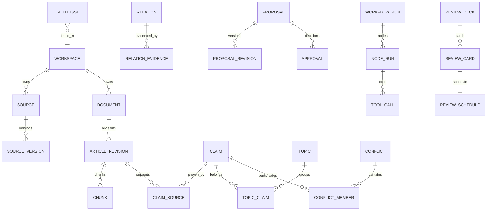

# PostgreSQL 与 pgvector 数据库设计

## 1. 目标

定义逻辑 Schema、关键约束、索引、事务和迁移策略。本文不锁定最终 SQL 字段长度，但锁定实体职责和一致性规则。

## 2. Schema 划分

建议使用逻辑 Schema：

- core：Workspace、Source、Document、Knowledge。
- change_control：Proposal、Approval。
- workflow：Workflow、Node、Tool、Outbox。
- retrieval：Chunk、Embedding、Index Version。
- learning：Artifact、Review、Memory。
- ops：Audit、Evaluation、Health。

也可使用单一 public Schema 加统一前缀；代码 Module 不依赖 Schema 组织方式。

## 3. ER 总览

## 4. 核心表

### workspace

关键列：

- id UUID。
- name。
- root_path。
- git_repository_path。
- active_index_version_id。
- status。
- version。

约束：

- root_path 唯一。
- status 枚举。

### source / source_version

source：

- id。
- workspace_id。
- type。
- logical_name。
- original_location。

source_version：

- id。
- source_id。
- content_hash。
- byte_size。
- mime_type。
- security_status。
- parser_version。
- captured_at。

唯一约束：

- source_id + content_hash。

### document / article_revision

document：

- id。
- workspace_id。
- canonical_path。
- title。
- current_published_revision_id。
- lifecycle_status。
- version。

article_revision：

- id。
- document_id。
- source_version_id nullable。
- parent_revision_id nullable。
- content_hash。
- status。
- optimization_mode。
- git_commit nullable。
- created_by_type。

约束：

- 每个 Document 只有一个 Published Current Revision。
- Published 必须有 git_commit。

### chunk

- id。
- workspace_id。
- revision_id。
- sequence。
- heading_path。
- content。
- content_hash。
- source_span JSONB。
- token_count。
- search_vector tsvector。
- embedding vector(N)。
- embedding_version_id。
- status。

索引：

- GIN(search_vector)。
- HNSW 或 IVFFlat(embedding)。
- revision_id + sequence。
- workspace_id + status。

### topic / claim

topic：

- id。
- workspace_id。
- name。
- normalized_name。
- aliases JSONB。
- status。

claim：

- id。
- workspace_id。
- statement。
- normalized_statement。
- applicability JSONB。
- status。
- confidence_factors JSONB。
- version。

### relation / relation_evidence

relation：

- id。
- workspace_id。
- source_type/source_id。
- target_type/target_id。
- relation_type。
- status。
- confidence。
- valid_from/valid_to。
- version。

relation_evidence：

- id。
- relation_id。
- source_span_ref。
- reason。
- evidence_hash。
- model_run_ref。
- confirmed_by。

对称关系规范化：

- DUPLICATES、CONFLICTS_WITH 使用稳定 ID 排序，防止反向重复。

### conflict

- id。
- workspace_id。
- topic_id nullable。
- status。
- severity。
- summary。
- resolution。
- version。

conflict_member：

- conflict_id。
- claim_id。
- applicability。
- position_summary。

### proposal / proposal_revision / approval

proposal：

- id。
- workspace_id。
- type。
- status。
- current_revision_no。
- target_refs JSONB。
- base_versions JSONB。
- workflow_run_id。
- risk_level。
- version。

proposal_revision：

- proposal_id。
- revision_no。
- change_set JSONB。
- evidence_refs JSONB。
- change_hash。
- rollback_plan JSONB。
- schema_version。

approval：

- id。
- proposal_id。
- proposal_revision_no。
- action。
- approved_change_hash。
- comment。
- created_at。

### workflow

workflow_definition：

- id。
- name。
- version。
- definition JSONB。
- active。

workflow_run：

- id。
- workspace_id。
- definition_id/version。
- status。
- input JSONB。
- context JSONB。
- current_checkpoint。
- version。

node_run：

- id。
- workflow_run_id。
- node_id。
- attempt。
- status。
- lease_owner。
- lease_expires_at。
- input/output JSONB。
- idempotency_key。
- error_code。

唯一：

- workflow_run_id + node_id + attempt。
- idempotency_key where not null。

tool_call：

- id。
- node_run_id。
- tool_name。
- permission。
- request_summary。
- response_summary。
- idempotency_key。
- status。

### outbox

- id。
- aggregate_type/id。
- event_type。
- payload。
- available_at。
- published_at。
- attempt。

事务内写入，Worker 异步投递。

### health_issue

- id。
- workspace_id。
- type。
- severity。
- target_ref JSONB。
- evidence JSONB。
- fingerprint。
- status。
- first_detected_at。
- last_verified_at。

唯一：

- workspace_id + fingerprint + active status。

### review

review_deck、review_card、review_schedule、review_session、review_answer。

关键约束：

- Active Card 必须至少一个 claim_ref。
- review_answer.idempotency_key 唯一。
- schedule 更新与 answer 同事务。

## 5. 向量设计

embedding_version：

- provider。
- model。
- dimensions。
- normalization。
- config_hash。

规则：

- 同一索引版本只使用一个维度。
- 更换维度创建新列/新表或新索引版本，不能混写。
- Embedding 可重建，不进入永久备份最低要求。

## 6. 索引策略

### 高选择性 B-tree

- workspace_id。
- status。
- updated_at。
- foreign keys。
- due_at。
- workflow lease。

### GIN

- tsvector。
- 必要 JSONB 字段，但避免所有 JSONB 无差别索引。

### Vector

- 先 HNSW。
- 通过压测调整 ef_search、m 和 ef_construction。
- 数据量很小时允许精确扫描。

### Relation

- source_type/source_id/relation_type。
- target_type/target_id/relation_type。
- 对称规范化唯一索引。

## 7. 事务边界

- Source Version 注册 + Parse Job Outbox。
- Proposal Approval + Apply Job Outbox。
- Node Complete + Next Node Outbox。
- Review Answer + Schedule。
- Relation Confirm + Knowledge Event。

文件与 Git 不放入 DB 事务。

## 8. 并发控制

- 可变 Aggregate 使用 version 乐观锁。
- Worker 使用 SKIP LOCKED 或等价安全领取。
- 文件写入使用目标 Version Token + Workspace File Lock。
- Proposal 使用 base_versions。

## 9. 数据迁移

- 迁移只向前执行。
- DDL 与数据回填拆分。
- 大表索引使用非阻塞策略。
- Schema 新版本先支持双读，再切换，再移除旧字段。
- 每次迁移记录应用版本和校验结果。

## 10. 分区与归档

正式 v1.0 不强制分区。

满足任一条件再考虑：

- node_run/tool_call/audit 超千万。
- 时间范围查询明显退化。
- 归档维护窗口过长。

优先对 Audit、Node Run 和 Evaluation 按月归档。

## 11. 数据库备份

必须备份：

- Domain 状态。
- Proposal/Approval。
- Confirmed Relation。
- Workflow/Audit。
- Review。

可选排除或重建：

- Embedding。
- 临时缓存。

详见 [备份与恢复 Runbook](runbooks/backup-and-restore.md)。

## 12. 数据库验收

- 所有外键和唯一约束有对应故障测试。
- EXPLAIN 验证核心查询使用预期索引。
- 迁移可在生产等价数据量验证。
- 重复消息不会创建重复 Node、Tool、Answer 或 Health Issue。

