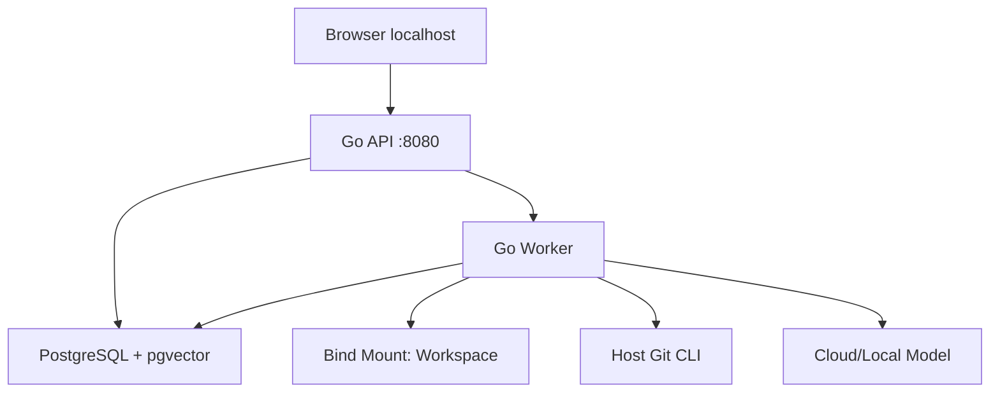
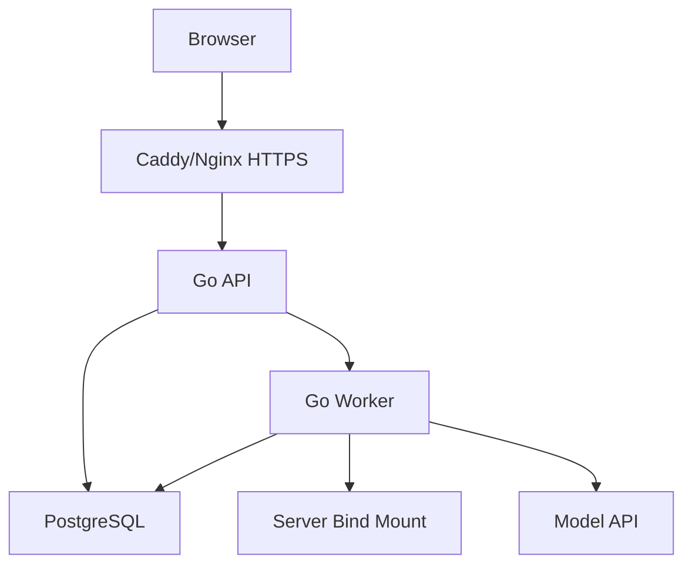

# 部署架构

## 1. 目标

支持本地优先和个人自托管，不引入 Kubernetes 与微服务运维。

## 2. 本地模式



推荐：

- Docker Compose 启动 PostgreSQL、一次性 Migrate、API、Worker。
- Workspace 使用 Bind Mount。
- PostgreSQL 使用 Named Volume。
- Secret 使用 .env（不提交）或 Secret File。

## 3. 自托管模式



要求：

- HTTPS。
- 单用户认证。
- Workspace 和 DB 位于用户控制的服务器。
- 反向代理限制上传大小和超时。

## 4. Compose 服务

### migrate

- 与 API/Worker 使用同一镜像中的 `/app/zhixu-migrate`。
- 固定执行项目 Goose Up → River Up → River Validate。
- PostgreSQL 健康后才运行；非零退出会阻止 API/Worker 启动。
- 不挂载或维护第二套 shell migration runner。

### app

- Go API。
- 运行时服务中唯一接收 `ZHIXU_AUTH_BOOTSTRAP_TOKEN` 和可选 `ZHIXU_REVIEW_QUESTION_REF_KEY` 的进程；Compose 启动前按已解析配置校验 Secret 契约。
- Readiness 检查 DB 和 API 依赖。
- Liveness 只检查进程。
- 宿主默认只发布 `127.0.0.1:8080`。
- M6-D 起 API 构造 PostgreSQL Retrieval Search/Evidence 与 Query Embedder；缺失 Search/Evidence/Cursor
  依赖时保留路由并显式返回 503，不返回假空结果。
- M6-04 起 API 构造 Conversation/Answer/Feedback Repository 与共享 Server Event Store。Question 命令只在
  Chat 显式启用且 RAG Definition/Dispatcher 依赖完整时开放；否则读 API/SSE 保持可用，提交返回稳定 503。

### worker

- 同一镜像不同命令。
- 不接收也不读取 API Bootstrap Token 或 Review question-reference key；使用 Worker 专属配置加载，只校验自身消费的配置组。
- 可扩为多个实例。
- 使用 DB 租约。
- 独立监听容器内 `0.0.0.0:8081`，不发布宿主端口。
- Compose healthcheck 实际请求 `http://127.0.0.1:8081/readyz`。
- SIGINT/SIGTERM 使用 graceful `Stop`；fatal invariant 可选择互斥的
  `StopAndCancel`，hard deadline 超时非零退出。
- Chat 启用时同时注册 Relation 与 RAG Definition/Executor；任一 Chat/Retrieval/Knowledge/Conversation/
  Event/Workflow 依赖不完整都 readiness fail closed，不注册 fake executor。

### postgres

- pgvector 扩展。
- 健康检查。
- Named Volume；Compose 通过 `PGDATA=/var/lib/postgresql/data` 固定 PostgreSQL 18 数据目录。

### optional model

- Ollama 等本地模型为可选 Profile。

## 5. Volume

| 内容 | 类型 | 备份 |
|---|---|---|
| Workspace | Bind Mount | 必须 |
| Git | Workspace 内 | 必须 |
| PostgreSQL | Named Volume | 必须 |
| 临时文件 | Ephemeral | 不必 |
| Model Cache | Optional Volume | 可选 |

## 6. 网络

- PostgreSQL 不映射公网端口。
- API 本地模式绑定 127.0.0.1。
- Worker 无外部入口。
- 自托管仅 Proxy 暴露公网。
- 模型和网页使用受控出站。

本地模型 relay 通过 `network_mode: service:app|worker` 加入对应进程的网络命名空间，并只监听该 namespace 的
`127.0.0.1:11434`。`host.docker.internal:host-gateway` 只配置在 app/worker owner；relay 不重复声明 `extra_hosts`。

M10-02 已接入 Auth、Session、API Token、CSRF/Origin 和 Capability Middleware。业务 API 默认要求
认证身份；`/livez`、`/readyz`、`/api/v1/system/status` 和 Bootstrap 交换端点保持公共。M6-D 的
Workspace 隔离仍不是身份凭据。官方 Compose 让 API 进程监听容器 loopback，并由共享网络命名空间的代理发布宿主
loopback 端口；代理只接受 Docker bridge gateway 转发的流量，拒绝其他 bridge peer。`ZHIXU_AUTH_MODE=disabled`
不能通过 LAN、公网端口、普通反向代理或同 Docker 网络的容器变成自托管安全边界。

## 7. 启动顺序

1. PostgreSQL Ready。
2. `/app/zhixu-migrate` 完成项目 Goose Up、River Up 和 Validate。
3. API/Worker 构造配置与依赖。
4. Worker 再次 Validate River Schema、冻结 Registry、启动 health server 和 River。
5. API `/readyz` 与 Worker `/readyz` 分别就绪。
6. 接收流量。

开发 launcher 在 PostgreSQL healthy 后，使用 `compose run --rm --no-deps -T` 依次执行模型密钥初始化与迁移；
完成即退出的 one-shot 不进入 `compose up --wait`。普通重复 `./zhixu up` 采用 Compose 差异驱动启动，镜像和配置未变时
不强制替换 API/Worker；只有应用 desired model revision 的 `./zhixu restart` 强制重建候选与 steady runtime。

## 8. Readiness

API Ready 需要：

- DB 可用。
- Migration 当前。
- Workspace 可读。
- 如果存在 Manual Recovery，返回 degraded/read-only 状态。

Worker Ready 需要：

- DB 可用。
- River `workflow` Schema migration Validate 成功。
- River Client 已启动。
- Workflow Definition Registry 已冻结。
- Executor Registry 已冻结。
- 启用 Definition 的依赖已注入。
- Worker 尚未进入 shutdown。

Worker `/livez` 只证明进程与 health server 存活，不检查上述依赖。健康响应只
暴露稳定 `status/code/version`；底层数据库、Registry 或错误 cause 不返回客户端。

## 9. 配置

来源优先级：

1. 命令行。
2. 环境变量。
3. 配置文件。
4. 默认值。

Secret 不写配置导出。

M1 Compose 不把密码直接拼接到 PostgreSQL URL；API/Worker 使用独立的
`ZHIXU_DATABASE_HOST/PORT/NAME/USER/PASSWORD` 配置，由 Go 配置层负责安全构造连接字符串。

Worker 运行参数：

| 环境变量 | 默认值 | 说明 |
|---|---:|---|
| `ZHIXU_WORKER_HEALTH_ADDR` | `0.0.0.0:8081` | Worker 独立 health listener |
| `ZHIXU_WORKER_QUEUE` | `workflow` | Producer/Consumer 必须一致 |
| `ZHIXU_WORKER_MAX_WORKERS` | `4` | 队列并发上限 |
| `ZHIXU_WORKER_JOB_TIMEOUT` | `15m` | 单 Job timeout |
| `ZHIXU_WORKER_RESCUE_STUCK_AFTER` | `30m` | River stuck rescue interval |
| `ZHIXU_WORKFLOW_LEASE` | `2m` | 领域 Node lease |
| `ZHIXU_WORKFLOW_HEARTBEAT` | `30s` | 必须小于 lease 的三分之一 |
| `ZHIXU_REINDEX_DISPATCH_POLL_INTERVAL` | `1s` | Reindex Outbox 轮询间隔，最大 `1m` |
| `ZHIXU_REINDEX_DISPATCH_BATCH_SIZE` | `10` | 单轮派发上限，范围 `1..1000` |
| `ZHIXU_REINDEX_DISPATCH_ERROR_BACKOFF` | `5s` | Dispatcher/业务重试退避，最大 `1m` |
| `ZHIXU_REINDEX_LEASE_DURATION` | `2m` | Reindex Delivery DB-time lease |
| `ZHIXU_REINDEX_HEARTBEAT_INTERVAL` | `30s` | 必须小于 Reindex lease |
| `ZHIXU_AUTH_MODE` | `required` | `required/disabled`；`disabled` 仅允许 development loopback |
| `ZHIXU_AUTH_BOOTSTRAP_TOKEN` | 无 | API-only：首次换取 Session 的运行时凭据；不得注入 Worker、写日志或提交仓库 |
| `ZHIXU_REVIEW_QUESTION_REF_KEY` | 无；Compose 示例提供 development-only 值 | API-only：可选共享 HMAC key；显式值至少 32 UTF-8 bytes、无首尾空白且不得为空。直接运行 API 且缺失时，`required` 从 Bootstrap Token 域隔离派生，local `disabled` 生成进程随机值；多实例必须显式共享同一值 |
| `ZHIXU_AUTH_SESSION_TTL` | `12h` | Session 有效期；登出、轮换或撤销后立即失效 |
| `ZHIXU_AUTH_API_TOKEN_TTL` | `720h` | API Token 最大有效期；明文只在创建响应返回一次 |
| `ZHIXU_AUTH_SECURE_COOKIE` | `false` | HTTPS 部署必须为 `true`；Cookie 仍为 HttpOnly/SameSite |
| `ZHIXU_AUTH_ALLOWED_ORIGINS` | 普通进程 `http://127.0.0.1:8080`；Compose 从 `ZHIXU_HTTP_PORT` 派生 | 精确 Origin 白名单；显式值优先于 Compose 派生值，浏览器 unsafe 请求同时校验 CSRF |
| `ZHIXU_TOOL_RUNTIME_MODE` | `disabled` | Compose 模板默认关闭；仓库 `.env.example` 为本地 Tool smoke 显式启用。启用时 API/Worker 必须共享冻结 Contract 且 Worker真实 Executor/Workflow 全部可达 |
| `ZHIXU_WEB_FETCH_MODE` | `disabled` | 默认关闭；持久 Workspace/Workflow Web Policy 未接线时显式 `enabled` 也必须 fail closed |
| `ZHIXU_WEB_FETCH_TIMEOUT` | `30s` | 每次 Fetch 总 deadline，包含逐跳解析、TLS、Header 与 Body |
| `ZHIXU_WEB_FETCH_RESPONSE_HEADER_TIMEOUT` | `10s` | 响应 Header 上限时间 |
| `ZHIXU_WEB_FETCH_TLS_HANDSHAKE_TIMEOUT` | `10s` | TLS 握手上限时间 |
| `ZHIXU_WEB_FETCH_MAX_REDIRECTS` | `5` | 每一跳重新执行 URL/DNS/IP 安全校验 |
| `ZHIXU_WEB_FETCH_MAX_URL_BYTES` | `8192` | 输入 URL 字节上限；禁止 userinfo、opaque URL、非法 host/port |
| `ZHIXU_WEB_FETCH_MAX_RESPONSE_HEADER_BYTES` | `65536` | 响应 Header 累计上限 |
| `ZHIXU_WEB_FETCH_MAX_BODY_BYTES` | `2097152` | 解压后 Body 读取上限，不信任 Content-Length |
| `ZHIXU_WEB_FETCH_MAX_TEXT_BYTES` | `524288` | HTML parser 输出受控文本上限 |
| `ZHIXU_WEB_FETCH_MAX_RESOLVED_IPS` | `16` | 单跳 DNS 地址上限；任一禁止地址使整跳拒绝 |
| `ZHIXU_WEB_FETCH_ALLOWED_CONTENT_TYPES` | `text/plain,text/html` | 固定 Content-Type allowlist，不接受响应自行扩大 |
| `ZHIXU_EMBEDDING_PROVIDER` | `disabled` | `disabled/openai-compatible/ollama`；显式启用后新 Reindex 才构建向量 |
| `ZHIXU_EMBEDDING_BASE_URL` | 无 | 启用时必填；禁止 userinfo/query/fragment，OpenAI-compatible 仅 HTTPS，Ollama 仅 loopback 可用 HTTP |
| `ZHIXU_EMBEDDING_API_KEY` | 无 | 仅 `openai-compatible` 必填；`ollama` 必须为空 |
| `ZHIXU_EMBEDDING_MODEL` | 无 | 启用时必填的 canonical Provider 模型名 |
| `ZHIXU_EMBEDDING_DIMENSIONS` | `0` | 启用时必须为 `1..16000`；禁用时保持 `0` |
| `ZHIXU_EMBEDDING_NORMALIZATION` | `l2` | `none/l2`，属于 Embedding Version 与 Config Hash |
| `ZHIXU_EMBEDDING_DISTANCE_METRIC` | `cosine` | `cosine/inner_product/euclidean`，只选择固定 SQL operator |
| `ZHIXU_EMBEDDING_MAX_BATCH_SIZE` | `128` | 单次 Provider 批量上限，范围 `1..1000` |
| `ZHIXU_EMBEDDING_MAX_INPUT_BYTES` | `65536` | 单输入字节上限，范围 `1..10485760`，属于 Config Hash |
| `ZHIXU_EMBEDDING_MAX_BATCH_INPUT_BYTES` | `8388608` | 单批正文累计字节上限，必须不小于单输入上限且最大 `67108864`，属于 Config Hash |
| `ZHIXU_EMBEDDING_TIMEOUT` | `30s` | 单次 Embedding HTTP 超时，最大 `5m` |
| `ZHIXU_EMBEDDING_MAX_RESPONSE_BYTES` | `67108864` | 响应读取上限，最大 `134217728` bytes |
| `ZHIXU_CHAT_PROVIDER` | `disabled` | `disabled/openai-compatible`；禁用时旧 API/Worker 正常，Agent capability 明确 unavailable |
| `ZHIXU_CHAT_BASE_URL` | 无 | 启用时必填；远程仅 HTTPS，loopback OpenAI-compatible endpoint 可用 HTTP，禁止 userinfo/query/fragment |
| `ZHIXU_CHAT_API_KEY` | 无 | OpenAI-compatible Credential；本地兼容端点可为空，不写日志、Model Run 或配置摘要 |
| `ZHIXU_CHAT_MODEL` | 无 | Provider 请求使用的 canonical 模型 ID |
| `ZHIXU_CHAT_MODEL_VERSION` | 无 | Provider 响应必须精确回显的实际模型版本，不允许运行中漂移 |
| `ZHIXU_CHAT_ADAPTER_VERSION` | `v1` | 直接 HTTP Adapter 的稳定版本 |
| `ZHIXU_CHAT_TIMEOUT` | `30s` | 单次 Chat Provider timeout，最大 `5m`；三阶段仍受 Agent 总预算约束 |
| `ZHIXU_CHAT_MAX_REQUEST_BYTES` | `4194304` | 单次 Provider 请求上限，最大 `16777216` bytes |
| `ZHIXU_CHAT_MAX_RESPONSE_BYTES` | `4194304` | 单次 Provider 响应上限，最大 `16777216` bytes |
| `ZHIXU_RETRIEVAL_RRF_K` | `60` | RRF v1 的 `k`，必须为正数 |
| `ZHIXU_RETRIEVAL_RRF_LEXICAL_CANDIDATE_LIMIT` | `200` | Lexical 候选上限，范围 `1..500` |
| `ZHIXU_RETRIEVAL_RRF_VECTOR_CANDIDATE_LIMIT` | `200` | Vector 候选上限，范围 `1..500` |
| `ZHIXU_RETRIEVAL_RRF_FUSED_CANDIDATE_LIMIT` | `100` | 融合候选上限，范围 `1..500` 且不超过两路候选和 |
| `ZHIXU_RETRIEVAL_RRF_RERANK_CANDIDATE_LIMIT` | `50` | Rerank 候选上限，范围 `1..500` 且不超过 fused 上限 |
| `ZHIXU_WORKER_SOFT_STOP_TIMEOUT` | `30s` | River soft stop/cancel 边界 |
| `ZHIXU_WORKER_HARD_STOP_TIMEOUT` | `60s` | 进程级退出 deadline |
| `ZHIXU_TELEMETRY_MODE` | `disabled` | `disabled/optional/required` |
| `OTEL_EXPORTER_OTLP_ENDPOINT` | 无 | optional/required 时必填 URL |

`optional` exporter 不可用时 Worker 明确 degraded 但不阻塞 Runtime；`required`
不可用时 fail-fast。当前 Composition 没有真实 exporter factory，不能声称已向
外部平台导出。Secret 只通过本地 `.env`/Secret 管理，不写镜像或提交仓库。

Embedding 配置按 Provider 分组 fail-fast：`disabled` 不消费 Base URL、API Key、Model
或 Dimensions；`openai-compatible` 要求完整 HTTPS Endpoint、API Key、Model 和 Dimensions；
`ollama` 要求 Endpoint、Model 和 Dimensions，同时拒绝 API Key。配置诊断只显示 Provider、
模型、维度、限制和“是否已配置”，不会输出 API Key 或完整 Base URL。Provider、模型、维度、
归一化、距离、Endpoint identity 与 batch/input limits 共同冻结为 Embedding Config Hash；
Credential、timeout 和 response limit 不进入持久版本身份。

Chat 配置同样由 Configured Factory 唯一解释。`disabled` 不读取 Endpoint、API Key、Model 或 Model Version，
不注入 Deterministic Fake，也不阻断不依赖 Agent 的 Worker Definition；启用后 Worker 才注册 Agent Executor/Definition。
每个 Model Run 固定 generation/retrieval 基线，每条 Model Call 固定该次实际 Adapter/Model/Profile/Prompt/Schema
版本和 max output tokens；Provider 不在 Adapter 内自动重试或静默切换模型。
Compose 的共享 Chat 环境块同时注入 API 与 Worker。API 用它决定 Question dispatch capability，Worker 用它
构造真实 RAG Model/Executor；两端 Provider/Model/Version 必须一致。`ZHIXU_CHAT_PROVIDER=disabled` 是默认的
明确关闭状态，此时 `/chat` 可查看/创建 Conversation，但 Question 提交不可用且不得假成功。

Tool Runtime 同样由 API/Worker 共享配置解释：API 只验证/冻结 Contract 和可启动 Definition，Worker 才注入真实 Executor。
`disabled` 不构造普通 Tool ExecutionService或可启动 Tool Definition，Tool capability 明确 unavailable但进程仍可 ready；Safe Writeback trusted audit 仍必须可用。`enabled` 时缺 Contract、Executor、
Repository、Workflow Node 或 Retrieval/Git 依赖均 readiness fail closed。Web Fetch 的配置预算已存在，但在持久 Web Policy 与
Executor wrapper 完成前不能因 `ZHIXU_WEB_FETCH_MODE=enabled` 而访问 DNS 或网络。

API 与 Worker 必须通过同一 Configured Embedder Factory 解释上述配置，Compose 使用共享环境配置块向
两个进程注入完全相同的 Provider/Model/Dimensions/Normalization/Distance/limits。Worker 用于构建
Index Vector，API 用于 Semantic/Hybrid Query Embedding；两进程不得各自维护配置转换。`disabled`
仍允许 Keyword 和明确退化的 Hybrid，Semantic 返回 503，不应阻断 API 启动或 FTS-only Active。

### 9.1 Managed 模型设置

官方开发 Compose 使用 `ZHIXU_MODEL_SETTINGS_MODE=managed`：Chat/Embedding 设置以 immutable revision
保存在 PostgreSQL，AES-256-GCM 主密钥只存在专用 named volume，并以只读文件挂载给 API、Worker 和
modelctl。Compose 不读取 `.env` 中的旧模型身份或 API Key；static Env/YAML 只供直接运行二进制和隔离 smoke。

`desired_revision` 是最后保存版本，`active_revision` 是全局已提交版本，API/Worker 的 `applied_revision`
是各进程实际冻结版本。Settings 保存只推进 desired，不热加载；`./zhixu restart` 固定 target，暂停 Queue，
阻止新 Workflow 入队，排空已开始 attempt，启动 API/Worker prepared candidate，两个 role 都 fresh 且 revision
一致后才提交 active 并恢复 Queue/入口。每个进程只构造一次 Model Runtime，全部 Chat/Embedding 消费者复用
同一 Adapter 与 Contract；每个真正开始的 Workflow attempt 持久化其冻结 revision。

无设置时 revision 0 是 canonical disabled，基础 API、Worker、Keyword Search 和 Settings 仍可 ready。
Key 缺失、密文损坏或 Provider 预检失败时模型能力 fail closed，active 保持 previous，日志只报告稳定错误码。
`./zhixu down` 保留 PostgreSQL、模型密钥和 Workspace；只有显式确认的 `./zhixu reset` 删除 Compose volumes。

## 10. 升级

1. 创建备份 Marker。
2. 备份 DB/Workspace。
3. 停止 Worker 领取新任务。
4. 摘除 Worker readiness，并等待 River graceful `Stop` 到安全检查点。
5. 执行 Migration。
6. 启动新 API/Worker。
7. 一致性与 Smoke Test。
8. 恢复任务。

仅应用新的模型设置使用 `./zhixu restart`，不执行 Schema rollback，也不删除 volume。launcher 中断、单 role
prepared 失败或 drain timeout 时必须 abort/recover 到 previous active；未 claim River job 保留等待新 active。

## 11. 回滚

- 应用版本可回滚到兼容旧 Schema 的版本。
- DB Migration 优先 Expand/Contract。
- 不使用破坏性 down migration 作为默认。
- Prompt/Workflow 可切回上一 Active Version。
- Index 可切回上一 Ready Version。
- 回滚应用前先停止所有 Worker；保留 River Jobs、Workflow Attempt 和 Writeback
  Execution/checkpoint，不使用 River Down 作为普通回滚动作。
- 旧版本只有在兼容当前 Job Kind/Args、Workflow Schema 与 Writeback 状态时才能
  重新消费；不兼容时保持 Worker 停止并按恢复 Runbook 处理。

## 12. 备份

- Workspace/Git。
- PostgreSQL。
- 配置模板。

详见 [备份 Runbook](runbooks/backup-and-restore.md)。

## 13. 资源建议

个人本地基线：

- 4 CPU。
- 8–16 GB RAM。
- SSD。
- PostgreSQL shared memory 按环境调整。

本地模型不计入上述基线。

## 14. 发布产物

- Go API/Worker/Migrate Binary。
- Web Static Assets。
- Docker Image。
- docker-compose.yml。
- Migration。
- 示例配置。
- SBOM。

## 15. CI/CD

- Go Test。
- Frontend Test/Build。
- Migration Check。
- Security Scan。
- Architecture Link/Mermaid Check。
- Docker Build。
- Smoke Test。

### 15.1 Compose 发布验证

以下命令是发布候选必须执行的操作手册。M4-D 于 2026-07-17 已在本地 Docker
环境完成一轮验证，后续发布仍需重新执行：

```bash
docker compose --project-name zhixu -f deploy/compose.yml --env-file .env.example config --quiet
docker build -f deploy/Dockerfile -t zhixu:local .
docker compose --project-name zhixu -f deploy/compose.yml --env-file .env.example up -d --build --wait
curl -fsS http://127.0.0.1:8080/readyz
docker compose --project-name zhixu -f deploy/compose.yml --env-file .env.example exec -T worker \
  wget -q -O - http://127.0.0.1:8081/readyz
./zhixu down
```

`.env.example` 显式选择 development `disabled`，因此空 Bootstrap Token 是合法基线；同时提供只供本地
开发的 Review question-reference key，非开发部署必须替换。`make compose-up` 会先解析 Compose 最终模型：
`required` 缺少 canonical 32+ 字符 Token、`disabled` 却提供任意非空 Token、Review key 缺失/为空/不足
32 UTF-8 bytes/带首尾空白，或 Worker/Migrate 环境出现任一 API-only Secret 时，都会在 build/up 之前失败。
只修改 `ZHIXU_HTTP_PORT` 时，默认允许 Origin 同步为宿主 loopback 端口；显式
`ZHIXU_AUTH_ALLOWED_ORIGINS` 覆盖该派生值。

RAG Conversation 的可重复黑盒门禁为：

```bash
ZHIXU_TEST_DATABASE_URL='postgres://...' make rag-integration
make compose-rag-smoke
```

`compose-rag-smoke` 叠加 `deploy/compose.rag-smoke.yml`，随机创建 Compose project、宿主端口、PostgreSQL
密码和 Chat Bearer canary。模型 fixture 与 Worker 共用 network namespace，使生产 Adapter 仍访问 loopback；
fixture 只接受匹配 Bearer、已知 strict Schema 和有界 JSON。脚本经公共 Workspace/Scan/Ingestion/Approval/
Reindex 与 Conversation/Question/Answer/SSE/Feedback API 运行真实 Worker，只用测试 harness 补目前没有公开命令的
Knowledge Eligibility 事实；不会直接 seed Conversation、Answer 或 Workflow。退出时必须删除容器、volume 和临时目录。

该门禁证明 M6-04 容器闭环，不单独证明正式 Provider 质量、M10-02 认证安全负测、50 万容量、备份恢复或
最终发布包；这些必须由各自 M10/M11 门禁给出独立证据。

本轮已确认镜像以 UID `10001` 运行、Migrate 在 API/Worker 前成功完成、Worker
health 端口未发布宿主、API/Worker 同时 ready、SIGTERM 退出码为 0，并验证 PostgreSQL
短断时 Worker `/readyz` 返回 503、恢复后重新 200。真实子进程 `SIGKILL` 与 River
stuck rescue 由 `worker_kill_smoke_integration_test.go` 覆盖；双 Worker 与领域副作用
唯一性由 Approval/Reindex River fault smoke 和 Workflow lease/cancel 集成测试覆盖。发布前应执行
`ZHIXU_TEST_DATABASE_URL=... go test -race -tags=integration ./internal/changecontrol/application -run TestApprovalDispatchRealRiverSafeWritebackSmoke -count=1`，证明 Reindex Dispatcher/Worker、checkpoint 恢复、Completion response-loss 和单一 Active。发布时仍不得用 `restart: on-failure` 或一次 readiness 代替这些独立证据。

### 15.2 M6-D Search API 发布门禁

M6-D 归档与后续发布候选必须额外执行仓库锁定的 Compose Search smoke target。该 smoke 必须：

1. 使用唯一 Compose project 与 disposable Git Workspace，避免污染开发 volume/目录。
2. 通过公开 API 执行 Scan/Ingestion/Proposal/Approval，等待真实 Worker Reindex 与唯一 Completion。
3. 在 `ZHIXU_EMBEDDING_PROVIDER=disabled` 基线下调用 `POST /api/v1/search`，断言 Hybrid 实际返回
   Keyword 命中并显式报告 vector/rerank degraded，而不是空结果或假 Semantic。
4. 打开返回的 Source Version/Span href，证明 excerpt 来自不可变 Content Artifact。
5. 使用 trap 在成功和失败路径都删除 Compose volume 与临时 Workspace，并检查输出不包含 Secret、DSN、
   绝对路径或 Artifact locator。

本任务已独立通过真实 PostgreSQL HTTP integration、River fault smoke 与 Compose API smoke：Compose
黑盒证明部署契约，PostgreSQL HTTP 证明 Workspace/SQL/Evidence 边界，River fault smoke 证明
response-loss 下唯一 Activation/Completion。后续发布候选仍必须重复执行；这不代表最终全仓门禁已完成。

### 15.3 M6-03 Tool Runtime 发布门禁

执行：

```bash
make compose-tool-smoke
```

该 target 使用唯一 Compose project、随机数据库 Credential 和临时 Git Workspace，显式启用 Tool Runtime、关闭
Web Fetch/Chat/Embedding，构建并启动真实 API/Worker/Migrate/PostgreSQL 镜像，检查 API/Worker readiness；随后测试
容器只通过 RuntimeRepository 投递生产 `agent-rag` Definition 的 `ReadGitStatus` Job 并观察数据库，不构造或启动第二个
Worker。Job 必须由 Compose 内 `/app/zhixu-worker` 完成，结果包含 untrusted summary 且只产生一条 Tool Call。

独立真实 PostgreSQL/River integration `TestPersistedWorkflowRiverToolRequestExecutesRefusesAndReplays` 继续验证通用 Node
Executor 的 Prompt Injection REFUSED、同 Attempt completion response-loss canonical replay 和 Executor 次数；其中
CalculateDiff 只用于 disposable test Definition，不表示内容型 Diff request 已进入生产持久 Tool 目录。成功或失败都删除
volume 与临时目录。

Compose target 还会在同一一次性数据库上执行 Safe Writeback 的 response-loss fault recovery 与两条 Tool audit 断言。
在 Compose 外部使用已迁移的一次性 PostgreSQL 时，可执行：

```bash
ZHIXU_TEST_DATABASE_URL='postgres://...' make tool-integration
```

该 target 在 URL 缺失时直接失败，避免把集成测试 SKIP 误报为通过。这个 smoke 不表示 Web Fetch 已启用，也不替代
SSRF/命令/路径安全 suite 或 M10 Auth/通用 Audit；仅 readiness 或 `docker compose config` 不能作为 Tool 业务闭环证据。

## 16. 不采用

- Kubernetes。
- Service Mesh。
- Kafka。
- 独立 Redis 必需依赖。
- 多区域复制。
