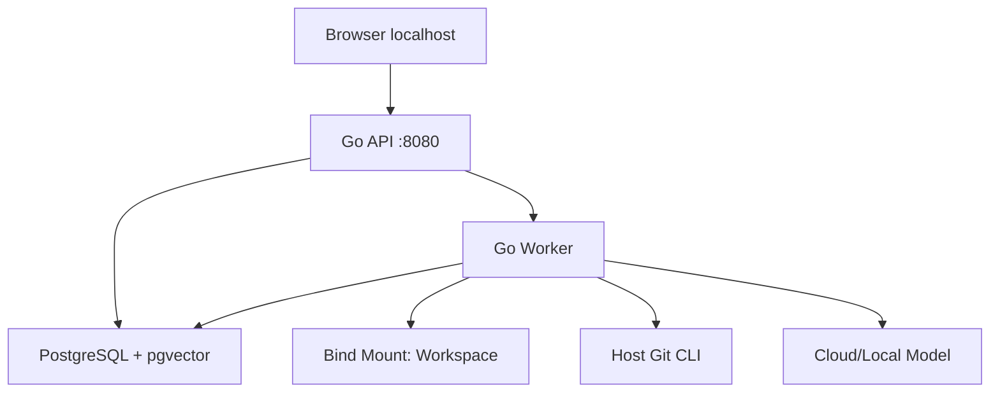
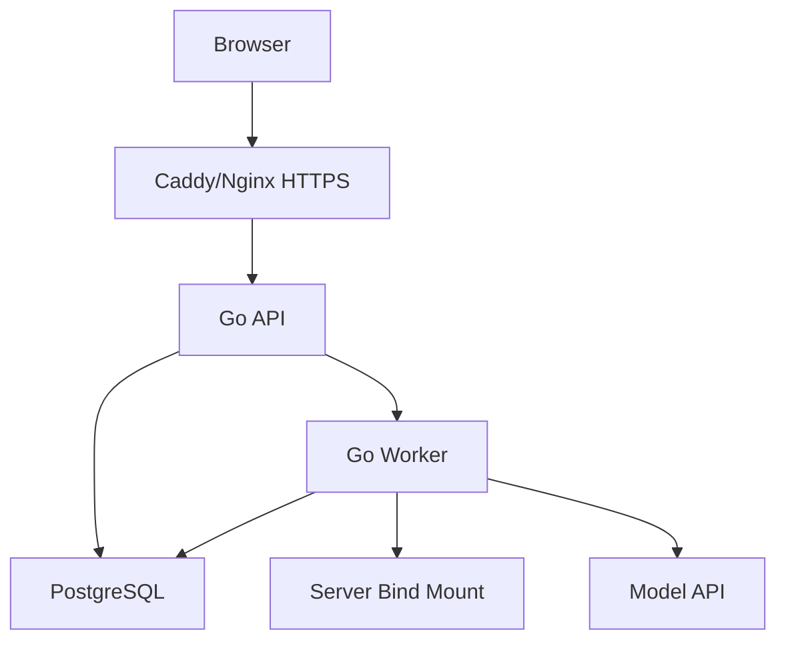

# 部署架构

## 1. 目标

支持本地优先和个人自托管，不引入 Kubernetes 与微服务运维。

## 2. 本地模式



推荐：

- Docker Compose 启动 PostgreSQL、一次性 Migrate、API、Worker。
- Workspace 使用 Bind Mount。
- PostgreSQL 使用 Named Volume。
- Secret 使用 .env（不提交）或 Secret File。

## 3. 自托管模式



要求：

- HTTPS。
- 单用户认证。
- Workspace 和 DB 位于用户控制的服务器。
- 反向代理限制上传大小和超时。

## 4. Compose 服务

### migrate

- 与 API/Worker 使用同一镜像中的 `/app/zhixu-migrate`。
- 固定执行项目 Goose Up → River Up → River Validate。
- PostgreSQL 健康后才运行；非零退出会阻止 API/Worker 启动。
- 不挂载或维护第二套 shell migration runner。

### app

- Go API。
- Readiness 检查 DB 和 API 依赖。
- Liveness 只检查进程。
- 宿主默认只发布 `127.0.0.1:8080`。

### worker

- 同一镜像不同命令。
- 可扩为多个实例。
- 使用 DB 租约。
- 独立监听容器内 `0.0.0.0:8081`，不发布宿主端口。
- Compose healthcheck 实际请求 `http://127.0.0.1:8081/readyz`。
- SIGINT/SIGTERM 使用 graceful `Stop`；fatal invariant 可选择互斥的
  `StopAndCancel`，hard deadline 超时非零退出。

### postgres

- pgvector 扩展。
- 健康检查。
- Named Volume；Compose 通过 `PGDATA=/var/lib/postgresql/data` 固定 PostgreSQL 18 数据目录。

### optional model

- Ollama 等本地模型为可选 Profile。

## 5. Volume

| 内容 | 类型 | 备份 |
|---|---|---|
| Workspace | Bind Mount | 必须 |
| Git | Workspace 内 | 必须 |
| PostgreSQL | Named Volume | 必须 |
| 临时文件 | Ephemeral | 不必 |
| Model Cache | Optional Volume | 可选 |

## 6. 网络

- PostgreSQL 不映射公网端口。
- API 本地模式绑定 127.0.0.1。
- Worker 无外部入口。
- 自托管仅 Proxy 暴露公网。
- 模型和网页使用受控出站。

## 7. 启动顺序

1. PostgreSQL Ready。
2. `/app/zhixu-migrate` 完成项目 Goose Up、River Up 和 Validate。
3. API/Worker 构造配置与依赖。
4. Worker 再次 Validate River Schema、冻结 Registry、启动 health server 和 River。
5. API `/readyz` 与 Worker `/readyz` 分别就绪。
6. 接收流量。

## 8. Readiness

API Ready 需要：

- DB 可用。
- Migration 当前。
- Workspace 可读。
- 如果存在 Manual Recovery，返回 degraded/read-only 状态。

Worker Ready 需要：

- DB 可用。
- River `workflow` Schema migration Validate 成功。
- River Client 已启动。
- Workflow Definition Registry 已冻结。
- Executor Registry 已冻结。
- 启用 Definition 的依赖已注入。
- Worker 尚未进入 shutdown。

Worker `/livez` 只证明进程与 health server 存活，不检查上述依赖。健康响应只
暴露稳定 `status/code/version`；底层数据库、Registry 或错误 cause 不返回客户端。

## 9. 配置

来源优先级：

1. 命令行。
2. 环境变量。
3. 配置文件。
4. 默认值。

Secret 不写配置导出。

M1 Compose 不把密码直接拼接到 PostgreSQL URL；API/Worker 使用独立的
`ZHIXU_DATABASE_HOST/PORT/NAME/USER/PASSWORD` 配置，由 Go 配置层负责安全构造连接字符串。

Worker 运行参数：

| 环境变量 | 默认值 | 说明 |
|---|---:|---|
| `ZHIXU_WORKER_HEALTH_ADDR` | `0.0.0.0:8081` | Worker 独立 health listener |
| `ZHIXU_WORKER_QUEUE` | `workflow` | Producer/Consumer 必须一致 |
| `ZHIXU_WORKER_MAX_WORKERS` | `4` | 队列并发上限 |
| `ZHIXU_WORKER_JOB_TIMEOUT` | `15m` | 单 Job timeout |
| `ZHIXU_WORKER_RESCUE_STUCK_AFTER` | `30m` | River stuck rescue interval |
| `ZHIXU_WORKFLOW_LEASE` | `2m` | 领域 Node lease |
| `ZHIXU_WORKFLOW_HEARTBEAT` | `30s` | 必须小于 lease 的三分之一 |
| `ZHIXU_REINDEX_DISPATCH_POLL_INTERVAL` | `1s` | Reindex Outbox 轮询间隔，最大 `1m` |
| `ZHIXU_REINDEX_DISPATCH_BATCH_SIZE` | `10` | 单轮派发上限，范围 `1..1000` |
| `ZHIXU_REINDEX_DISPATCH_ERROR_BACKOFF` | `5s` | Dispatcher/业务重试退避，最大 `1m` |
| `ZHIXU_REINDEX_LEASE_DURATION` | `2m` | Reindex Delivery DB-time lease |
| `ZHIXU_REINDEX_HEARTBEAT_INTERVAL` | `30s` | 必须小于 Reindex lease |
| `ZHIXU_EMBEDDING_PROVIDER` | `disabled` | `disabled/openai-compatible/ollama`；显式启用后新 Reindex 才构建向量 |
| `ZHIXU_EMBEDDING_BASE_URL` | 无 | 启用时必填；禁止 userinfo/query/fragment，OpenAI-compatible 仅 HTTPS，Ollama 仅 loopback 可用 HTTP |
| `ZHIXU_EMBEDDING_API_KEY` | 无 | 仅 `openai-compatible` 必填；`ollama` 必须为空 |
| `ZHIXU_EMBEDDING_MODEL` | 无 | 启用时必填的 canonical Provider 模型名 |
| `ZHIXU_EMBEDDING_DIMENSIONS` | `0` | 启用时必须为 `1..16000`；禁用时保持 `0` |
| `ZHIXU_EMBEDDING_NORMALIZATION` | `l2` | `none/l2`，属于 Embedding Version 与 Config Hash |
| `ZHIXU_EMBEDDING_DISTANCE_METRIC` | `cosine` | `cosine/inner_product/euclidean`，只选择固定 SQL operator |
| `ZHIXU_EMBEDDING_MAX_BATCH_SIZE` | `128` | 单次 Provider 批量上限，范围 `1..1000` |
| `ZHIXU_EMBEDDING_MAX_INPUT_BYTES` | `65536` | 单输入字节上限，范围 `1..10485760`，属于 Config Hash |
| `ZHIXU_EMBEDDING_MAX_BATCH_INPUT_BYTES` | `8388608` | 单批正文累计字节上限，必须不小于单输入上限且最大 `67108864`，属于 Config Hash |
| `ZHIXU_EMBEDDING_TIMEOUT` | `30s` | 单次 Embedding HTTP 超时，最大 `5m` |
| `ZHIXU_EMBEDDING_MAX_RESPONSE_BYTES` | `67108864` | 响应读取上限，最大 `134217728` bytes |
| `ZHIXU_RETRIEVAL_RRF_K` | `60` | RRF v1 的 `k`，必须为正数 |
| `ZHIXU_RETRIEVAL_RRF_LEXICAL_CANDIDATE_LIMIT` | `200` | Lexical 候选上限，范围 `1..500` |
| `ZHIXU_RETRIEVAL_RRF_VECTOR_CANDIDATE_LIMIT` | `200` | Vector 候选上限，范围 `1..500` |
| `ZHIXU_RETRIEVAL_RRF_FUSED_CANDIDATE_LIMIT` | `100` | 融合候选上限，范围 `1..500` 且不超过两路候选和 |
| `ZHIXU_RETRIEVAL_RRF_RERANK_CANDIDATE_LIMIT` | `50` | Rerank 候选上限，范围 `1..500` 且不超过 fused 上限 |
| `ZHIXU_WORKER_SOFT_STOP_TIMEOUT` | `30s` | River soft stop/cancel 边界 |
| `ZHIXU_WORKER_HARD_STOP_TIMEOUT` | `60s` | 进程级退出 deadline |
| `ZHIXU_TELEMETRY_MODE` | `disabled` | `disabled/optional/required` |
| `OTEL_EXPORTER_OTLP_ENDPOINT` | 无 | optional/required 时必填 URL |

`optional` exporter 不可用时 Worker 明确 degraded 但不阻塞 Runtime；`required`
不可用时 fail-fast。当前 Composition 没有真实 exporter factory，不能声称已向
外部平台导出。Secret 只通过本地 `.env`/Secret 管理，不写镜像或提交仓库。

Embedding 配置按 Provider 分组 fail-fast：`disabled` 不消费 Base URL、API Key、Model
或 Dimensions；`openai-compatible` 要求完整 HTTPS Endpoint、API Key、Model 和 Dimensions；
`ollama` 要求 Endpoint、Model 和 Dimensions，同时拒绝 API Key。配置诊断只显示 Provider、
模型、维度、限制和“是否已配置”，不会输出 API Key 或完整 Base URL。Provider、模型、维度、
归一化、距离、Endpoint identity 与 batch/input limits 共同冻结为 Embedding Config Hash；
Credential、timeout 和 response limit 不进入持久版本身份。

## 10. 升级

1. 创建备份 Marker。
2. 备份 DB/Workspace。
3. 停止 Worker 领取新任务。
4. 摘除 Worker readiness，并等待 River graceful `Stop` 到安全检查点。
5. 执行 Migration。
6. 启动新 API/Worker。
7. 一致性与 Smoke Test。
8. 恢复任务。

## 11. 回滚

- 应用版本可回滚到兼容旧 Schema 的版本。
- DB Migration 优先 Expand/Contract。
- 不使用破坏性 down migration 作为默认。
- Prompt/Workflow 可切回上一 Active Version。
- Index 可切回上一 Ready Version。
- 回滚应用前先停止所有 Worker；保留 River Jobs、Workflow Attempt 和 Writeback
  Execution/checkpoint，不使用 River Down 作为普通回滚动作。
- 旧版本只有在兼容当前 Job Kind/Args、Workflow Schema 与 Writeback 状态时才能
  重新消费；不兼容时保持 Worker 停止并按恢复 Runbook 处理。

## 12. 备份

- Workspace/Git。
- PostgreSQL。
- 配置模板。

详见 [备份 Runbook](runbooks/backup-and-restore.md)。

## 13. 资源建议

个人本地基线：

- 4 CPU。
- 8–16 GB RAM。
- SSD。
- PostgreSQL shared memory 按环境调整。

本地模型不计入上述基线。

## 14. 发布产物

- Go API/Worker/Migrate Binary。
- Web Static Assets。
- Docker Image。
- docker-compose.yml。
- Migration。
- 示例配置。
- SBOM。

## 15. CI/CD

- Go Test。
- Frontend Test/Build。
- Migration Check。
- Security Scan。
- Architecture Link/Mermaid Check。
- Docker Build。
- Smoke Test。

### 15.1 Compose 发布验证

以下命令是发布候选必须执行的操作手册。M4-D 于 2026-07-17 已在本地 Docker
环境完成一轮验证，后续发布仍需重新执行：

```bash
docker compose -f deploy/compose.yml --env-file .env.example config --quiet
docker build -f deploy/Dockerfile -t zhixu:local .
docker compose -f deploy/compose.yml --env-file .env.example up -d --build --wait
curl -fsS http://127.0.0.1:8080/readyz
docker compose -f deploy/compose.yml --env-file .env.example exec -T worker \
  wget -q -O - http://127.0.0.1:8081/readyz
docker compose -f deploy/compose.yml --env-file .env.example down -v
```

本轮已确认镜像以 UID `10001` 运行、Migrate 在 API/Worker 前成功完成、Worker
health 端口未发布宿主、API/Worker 同时 ready、SIGTERM 退出码为 0，并验证 PostgreSQL
短断时 Worker `/readyz` 返回 503、恢复后重新 200。真实子进程 `SIGKILL` 与 River
stuck rescue 由 `worker_kill_smoke_integration_test.go` 覆盖；双 Worker 与领域副作用
唯一性由 Approval/Reindex River fault smoke 和 Workflow lease/cancel 集成测试覆盖。发布前应执行
`ZHIXU_TEST_DATABASE_URL=... go test -race -tags=integration ./internal/changecontrol/application -run TestApprovalDispatchRealRiverSafeWritebackSmoke -count=1`，证明 Reindex Dispatcher/Worker、checkpoint 恢复、Completion response-loss 和单一 Active。发布时仍不得用 `restart: on-failure` 或一次 readiness 代替这些独立证据。

## 16. 不采用

- Kubernetes。
- Service Mesh。
- Kafka。
- 独立 Redis 必需依赖。
- 多区域复制。
