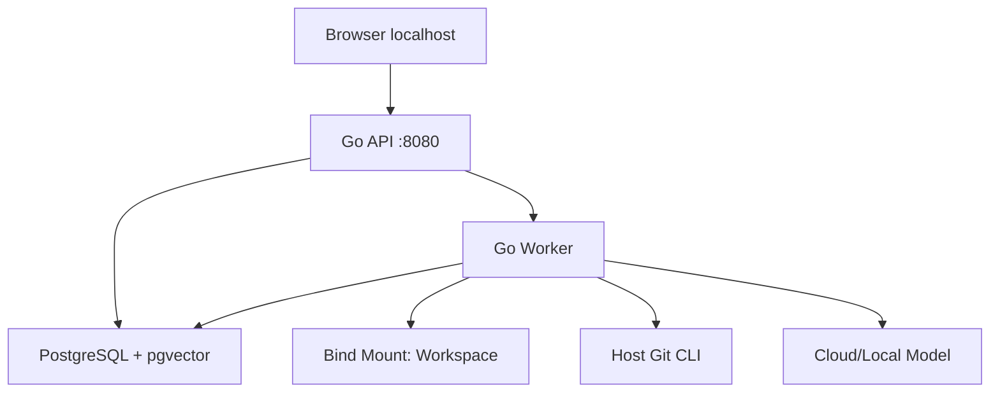
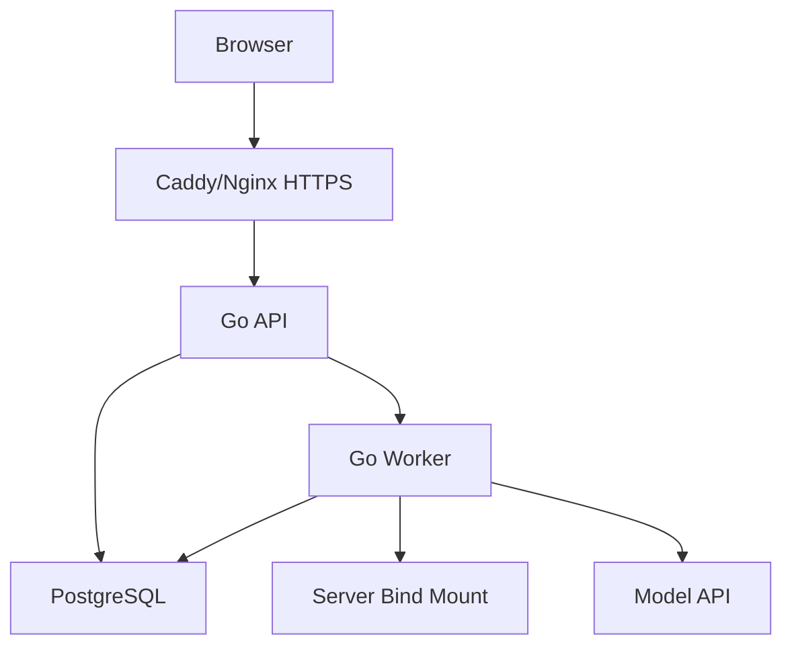

# 部署架构

## 1. 目标

支持本地优先和个人自托管，不引入 Kubernetes 与微服务运维。

## 2. 本地模式

推荐：

- Docker Compose 启动 PostgreSQL、API、Worker。
- Workspace 使用 Bind Mount。
- PostgreSQL 使用 Named Volume。
- Secret 使用 .env（不提交）或 Secret File。

## 3. 自托管模式

要求：

- HTTPS。
- 单用户认证。
- Workspace 和 DB 位于用户控制的服务器。
- 反向代理限制上传大小和超时。

## 4. Compose 服务

### app

- Go API。
- Readiness 检查 DB、配置和 Workspace。
- Liveness 只检查进程。

### worker

- 同一镜像不同命令。
- 可扩为多个实例。
- 使用 DB 租约。

### postgres

- pgvector 扩展。
- 健康检查。
- Named Volume；Compose 通过 `PGDATA=/var/lib/postgresql/data` 固定 PostgreSQL 18 数据目录。

### optional model

- Ollama 等本地模型为可选 Profile。

## 5. Volume

| 内容 | 类型 | 备份 |
|---|---|---|
| Workspace | Bind Mount | 必须 |
| Git | Workspace 内 | 必须 |
| PostgreSQL | Named Volume | 必须 |
| 临时文件 | Ephemeral | 不必 |
| Model Cache | Optional Volume | 可选 |

## 6. 网络

- PostgreSQL 不映射公网端口。
- API 本地模式绑定 127.0.0.1。
- Worker 无外部入口。
- 自托管仅 Proxy 暴露公网。
- 模型和网页使用受控出站。

## 7. 启动顺序

1. PostgreSQL Ready。
2. Migration Job。
3. API/Worker。
4. Workspace Consistency Check。
5. Index Health Check。
6. 接收流量。

## 8. Readiness

API Ready 需要：

- DB 可用。
- Migration 当前。
- Workspace 可读。
- 如果存在 Manual Recovery，返回 degraded/read-only 状态。

Worker Ready 需要：

- DB 可用。
- Workflow Definition 加载成功。
- Tool Registry 完整。

## 9. 配置

来源优先级：

1. 命令行。
2. 环境变量。
3. 配置文件。
4. 默认值。

Secret 不写配置导出。

M1 Compose 不把密码直接拼接到 PostgreSQL URL；API/Worker 使用独立的
`ZHIXU_DATABASE_HOST/PORT/NAME/USER/PASSWORD` 配置，由 Go 配置层负责安全构造连接字符串。

## 10. 升级

1. 创建备份 Marker。
2. 备份 DB/Workspace。
3. 停止 Worker 领取新任务。
4. 等待安全检查点。
5. 执行 Migration。
6. 启动新 API/Worker。
7. 一致性与 Smoke Test。
8. 恢复任务。

## 11. 回滚

- 应用版本可回滚到兼容旧 Schema 的版本。
- DB Migration 优先 Expand/Contract。
- 不使用破坏性 down migration 作为默认。
- Prompt/Workflow 可切回上一 Active Version。
- Index 可切回上一 Ready Version。

## 12. 备份

- Workspace/Git。
- PostgreSQL。
- 配置模板。

详见 [备份 Runbook](runbooks/backup-and-restore.md)。

## 13. 资源建议

个人本地基线：

- 4 CPU。
- 8–16 GB RAM。
- SSD。
- PostgreSQL shared memory 按环境调整。

本地模型不计入上述基线。

## 14. 发布产物

- Go API/Worker Binary。
- Web Static Assets。
- Docker Image。
- docker-compose.yml。
- Migration。
- 示例配置。
- SBOM。

## 15. CI/CD

- Go Test。
- Frontend Test/Build。
- Migration Check。
- Security Scan。
- Architecture Link/Mermaid Check。
- Docker Build。
- Smoke Test。

## 16. 不采用

- Kubernetes。
- Service Mesh。
- Kafka。
- 独立 Redis 必需依赖。
- 多区域复制。
