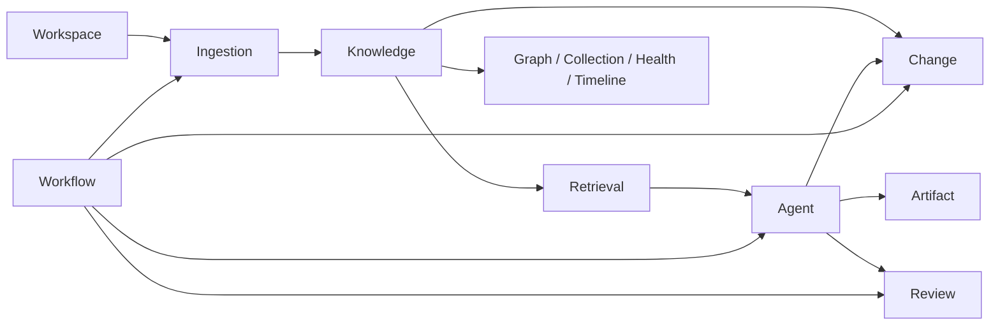
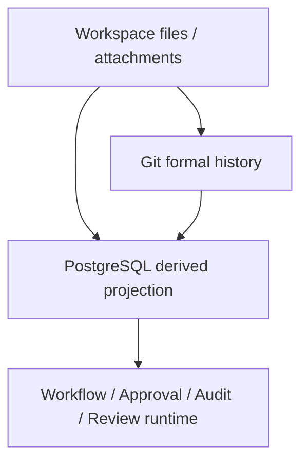

# 领域与数据设计

本章是统一领域语言、领域不变量、数据所有权和物理数据库边界的唯一事实源。精确表、列、索引、枚举、触发器和迁移 SQL 以 [`migrations/`](../../migrations/) 为准；本章只保留能指导跨模块行为的概念约束。

## 1. 领域上下文



| Bounded Context | 责任 |
|---|---|
| Workspace | 用户 Root、Git、路径与访问授权 |
| Ingestion | Source、不可变版本、解析、Span、canonical Chunk 输入 |
| Knowledge | Topic、Claim、Relation、Conflict、Provenance、Evidence Eligibility |
| Retrieval | FTS/vector 投影、Index Version、融合、Rerank、查询 Evidence |
| Change Control | Proposal、Approval、一次性写授权、Safe Writeback、Commit 映射 |
| Workflow | Definition、Run、Node、Attempt、lease、重试、Human Task、补偿 |
| Agent | Model Run/Call、结构化决策、RAG Plan/Answer、受控 Tool Request |
| Graph/Health | 关系查询投影、Semantic Candidate、Health Issue、Impact |
| Artifact | 大纲、分章产物、Learning Path 和发布候选 |
| Review | Deck、Card、评分、FSRS、Review/Interview Session、Memory Candidate |

## 2. 统一术语

### Workspace 与工作台

| 术语 | 定义 | 不应混用 |
|---|---|---|
| Workspace | 用户控制的一个知识空间，包含原始资料、正式知识、附件与历史 | Vault、租户、知识库实例 |
| Workspace Root | 用户明确选定的单一本地目录边界 | 父目录、容器路径、挂载白名单 |
| Root Grant | 运行时访问当前 Root 的精确权限；替换必须先撤销旧 grant | 父目录授权、隐式磁盘权限 |
| Workspace Switch | 在不同 Workspace 身份间切换，不改变任一 Root 身份 | 重绑、迁移目录 |
| Root Migration | 证明内容/Git 连续性后改变同一 Workspace Root 的显式操作 | 普通 Switch、直接改路径 |
| Registry | 已知 Workspace 身份与 Root 的目录记录，不授予访问 | Grant、Active、索引 |
| Active Workspace | 当前唯一获得 Root Grant、可由业务运行时访问的身份 | 最近选中项、所有登记项 |
| Unavailable Workspace | Registry 中仍存在但 Root 不可访问、缺失或待迁移的身份 | 自动迁移候选 |
| Quiescence | 停止新 Root 工作且在途文件操作到安全检查点 | 强制停机、普通空闲 |
| Workspace Control Command | `zhixu` 在启动/切换时一次性调用的本机控制命令，不监听网页或读内容 | 常驻 Host Controller、业务 API、Docker Socket |
| Workbench Entry/Working | 无 Active 时的连接入口 / 有 Active 时恢复真实上下文 | 欢迎封面、系统诊断页 |
| Inbox | 等待接收与处理资料的入口 | 正式知识目录、草稿箱 |
| Quick Capture | 不要求先定标题/Topic/目录的低摩擦原始输入 | 新建 Document、自动入库 |

### 资料、文档与整理输入

| 术语 | 定义 | 不应混用 |
|---|---|---|
| Source | 一份原始资料逻辑对象 | Document、正式知识 |
| Source Version | Source 在某时点的不可变内容版本 | Article Revision、可变快照 |
| Content Artifact | 按 Workspace + 内容 Hash create-only 保存的不可变原始字节；路径只是 Provenance | Source Version、用户可变路径 |
| Document | 可组织并发布到正式目录的文章对象 | Source、文件记录 |
| Document Draft | 尚未发布的 Document | Artifact、Source、Quick Capture |
| Working Draft | 可更新、可恢复的创作工作状态 | Article Revision、浏览器缓存 |
| Authoring | 以形成可发布 Document 为目标的创作活动 | Artifact 生成、Quick Capture |
| Article Revision | Document 的一个不可变内容版本 | Source Version、Working Draft |
| Chunk | 从 Parse Projection 确定性切出的索引片段，不是知识事实 | Claim、知识点 |
| Source Span | Content Artifact 内可精确定位的 byte range/Excerpt | Chunk、模型引用文本 |
| Document Knowledge Profile | 由明确 Source Version 派生的候选 Topic、术语、知识点与定位集合 | 正式 Topic、Claim、摘要字段 |
| Suggested Material Set | 围绕整理意图检索出的、等待用户增删确认的材料 | Smart Collection、冻结输入 |
| Workflow Input Snapshot | 用户确认后为一次 Run 冻结的材料、Evidence 与版本集合 | 当前搜索结果、Smart Collection |
| Organizing Template | 版本化的材料要求、输出结构、证据/冲突规则与结果去向 | Prompt、Workflow Definition、文件模板 |

### 知识、关系与证据

| 术语 | 定义 | 不应混用 |
|---|---|---|
| Topic | 组织知识的主题/概念 | 标签、目录 |
| Claim | 带 Applicability、可由证据支持/反驳的最小主张 | 摘要、Chunk |
| Applicability | Claim/Relation 成立所依赖的条件 | 置信度、检索过滤器 |
| Claim Source | 支持或反驳 Claim 的来源绑定 | 泛化 Evidence |
| Relation | 两个知识节点间的正式类型关系 | 向量相似、候选边 |
| Relation Assessment | NEW/COMPLEMENTARY/DUPLICATE/CONFLICT/LOW_CONFIDENCE 判断 | RelationType、正式边 |
| Relation Evidence | 支撑正式 Relation 的来源、理由、条件与确认信息 | 相似度分数 |
| Semantic Link Candidate | 等待用户处理的潜在 Topic/Claim 关系 | Relation、Search Candidate |
| Candidate Evidence | 候选判断的不可变来源定位与依据 | Relation Evidence、模型原始响应 |
| Candidate Fingerprint | 绑定双方版本、建议类型、证据与生成版本的稳定去重身份 | 缓存键、Relation Fingerprint |
| Graph Query Projection | 从 canonical 事实构建的只读、有界图查询模型 | 可写图谱副本 |
| Conflict | 相同/相近条件下不能同时成立的持续知识对象 | 错误提示、重复 |
| Provenance | 原始资料、位置、版本与形成过程的来源链 | 单个 URL、备注 |
| Evidence Eligibility | Knowledge seam 对证据是否具备发布资格的判断 | Active Index、排名、模型置信度 |
| Citation | 绑定 Workspace、Chunk、Source Version、Span 并通过多层校验的回答引用 | 仅 Chunk ID、当前工作树路径 |

Citation 发布至少检查四件事：Identity（对象与 Workspace 正确）、Openability（Span 可打开）、Eligibility（来自批准知识且未失效）和 Semantic Support（证据确实支持答案）。Active Index 只表示可检索，不能替代资格。

### 变更、运行与学习

| 术语 | 定义 | 不应混用 |
|---|---|---|
| Proposal | 对正式知识、关系、Topic 或文件的结构化变更建议 | 已执行修改、草稿全文 |
| Approval | 用户对指定 Proposal Revision 的明确决定 | 自动校验、写回成功 |
| Safe Writeback | 将批准变更应用到文件/版本并验证的过程 | 普通保存 |
| Git Remote Config | Workspace 的 HTTPS Remote、分支、自动同步偏好和凭据存在状态；Token 只写 | `.git/config`、明文 Token |
| Git Sync Run/Attempt | 持久远端同步运行及其有 lease/checkpoint 的一次尝试 | 单条 Git 命令、无状态重试 |
| Workspace Git Operation Lock | Safe Writeback、Remote Sync 等 Git 变更共享的 Workspace 互斥 | DB 事务、Workflow lease |
| Manual Git Recovery | 外部 Git 结果无法证明时的只读人工恢复终态 | 普通离线失败 |
| Artifact | 基于正式知识生成的报告、文章、大纲或 Learning Path，默认不是正式知识 | Document、正式笔记 |
| Smart Collection | 保存查询与视图配置，不复制知识 | 文件夹、数据副本 |
| Review Deck/Card/Session | 复习集合、带正式 Claim 引用的问题、一次复习/面试过程 | Collection、Conversation |
| Health Issue | 有证据、严重度、Fingerprint 和状态的知识质量问题 | 系统异常 |
| Knowledge Event | 知识生命周期的正式变化记录 | 普通日志 |
| Workflow Definition | 版本化节点、转移、重试、权限和补偿定义 | Prompt、Run |
| Workflow Run | Definition 的持久执行实例 | HTTP 请求、Review Session |
| Node Run/Attempt | 一个逻辑节点的状态 / 带 lease、dispatch 和 retry 身份的尝试 | Tool Call、Model Run |
| Model Run/Call | 冻结一条 Agent 模型流水线 / 其中一次 INITIAL、REPAIR、REDUCED 或 REVIEW Provider 调用 | 日志、Tool Call |
| Tool Call | 绑定服务端上下文、Contract、Capability 与 receipt 的受控工具调用 | 模型自由文本、Write Authorization |
| Conversation/Question/Answer | 短期 RAG 上下文、不可变问题、通过门禁的回答或拒答 | Memory、模型原始响应 |
| Clarification/Feedback | 结构化补充信息请求 / 用户对 Answer/Citation 的评测事实 | Error、Approval |
| Memory | 用户确认的长期偏好或有生命周期的情景信息 | Claim、聊天历史 |
| 正式知识 / 候选知识 / 事实源 | 已批准写回内容 / 尚未批准对象 / 决定正式内容的 Markdown + Git | 模型答案、向量索引 |

## 3. 聚合与不变量

### Workspace

- 根目录、Git 标识、活动索引和配置引用属于 Workspace；文件目标必须在 Root 内。
- 同一 Workspace 同时只有一个 Active 完整 Index Version；Root Grant 与 Workspace 身份分开管理。

### Source 与 Document

- Source Version、Content Artifact、Span 和 Ingestion Attempt 保持不可变/追加式；内容 Hash 负责幂等。
- Document 可有多个 Article Revision，但默认只有一个 Published Revision；Draft 不参加默认 RAG，Published Revision 必须对应 Git Commit。
- Source/CHUNKED 状态不等于正式 Published/READY；安全、解析、分块和索引状态由各自事实记录。

### Knowledge

- Confirmed Claim 有 Provenance；Confirmed Relation 有 Relation Evidence 与确认方式；Conflict 不能通过覆盖 Claim 消失。
- Topic/Claim 正式归属只使用 `BELONGS_TO`；不维护第二套可写归属关系。
- Applicability 完全相同时才可自动判断；相近或重叠必须有 reviewed reason。向量相似、模型置信度和用户确认互不等价。
- Claim 失效后更新图谱、Review、Artifact 和评测影响，不自动重写下游内容。

### Proposal 与 Workflow

- Approval 绑定 Proposal Revision、Change Hash、Target Version 和批准时 Git HEAD；任一漂移都使 Proposal stale。
- `completed` 只能在文件、Commit、映射、索引和回归验证均有证据时归约；未知副作用进入人工恢复。
- Node Run 的幂等键、lease、Attempt 和 checkpoint 追加保存；Human Task 等待不占 Worker lease。

## 4. 关系与状态

关系评估与正式类型分开：评估值为 `NEW`、`COMPLEMENTARY`、`DUPLICATE`、`CONFLICT`、`LOW_CONFIDENCE`；正式类型包括 `CITES`、`DERIVED_FROM`、`BELONGS_TO`、`SUPPORTS`、`COMPLEMENTS`、`DUPLICATES`、`CONFLICTS_WITH`、`PREREQUISITE_OF`、`VERSION_OF`、`IMPACTS`。

端点兼容规则：Claim→Claim 允许 CITES、DERIVED_FROM、SUPPORTS、CONFLICTS_WITH；Claim→Topic 的正式归属只有 BELONGS_TO；同类型端点可用 COMPLEMENTS、DUPLICATES、PREREQUISITE_OF、VERSION_OF；IMPACTS 可连接 Topic/Claim。候选确认先产生 typed Relation Proposal，Approval 后才写 Relation。

核心状态机：

- Proposal：Draft → Validating → ReadyForReview → Approved/Rejected/Deferred → Applying → Applied → Verifying → Completed；Apply/Verify 失败进入 ApplyFailed/VerifyFailed/RolledBack/ManualRecoveryRequired。
- Claim：Suggested → Confirmed/Invalid；Confirmed 可 Disputed、Superseded、Deprecated、Invalid。
- Relation：Suggested → Confirmed/Rejected；Confirmed 可 Stale/Deprecated，证据变化可从 Rejected 重新生成候选。
- Conflict：Open → Investigating → ResolutionProposed → Resolved/AcceptedDivergence；证据不足可 Deferred 后继续调查。

## 5. 领域命令与事件

命令由各 owner 提供：`RegisterSource`、`ParseSourceVersion`、`ConfirmClaim`、`AssessRelation`、`ConfirmRelation`、`OpenConflict`、`CreateProposal`、`ApproveProposal`、`ApplyApprovedProposal`、`RollbackAppliedProposal`、`CreateReviewDeck`、`SubmitReviewAnswer`、`InvalidateReviewCard` 等。命令不接受模型提供的 Workspace、Capability、Credential、路径或 Git 参数。

领域事件包括 `SourceVersionRegistered`、`SourceQuarantined`、`RevisionPublished`、`ClaimConfirmed`、`RelationSuggested`、`RelationConfirmed`、`ConflictOpened`、`ProposalApproved`、`ProposalApplied`、`ProposalRolledBack`、`IndexActivated`、`HealthIssueOpened` 和 `ReviewCardInvalidated`。事件用于 Timeline、Projection 和异步后续，不采用完整 Event Sourcing 作为主存储。

## 6. 三层数据所有权



### Workspace 与 Git

```text
workspace/
  inbox/ sources/ knowledge/ artifacts/ attachments/
  .knowledge/
    sources/<sha256>   # create-only Content Artifact，普通扫描/Git 排除
    manifests/
    exports/           # 仅 Export Job 管理的 staging/final 结果
  .git/
```

- 用户文件、正式 Markdown、附件和 Artifact 属于 Workspace；DB Volume 不放在 Workspace。
- `.knowledge/sources/<sha256>` 只追加不可变字节；`.knowledge/exports` 的 cleanup 不能扫描或删除附件、普通文件或用户 `artifacts/`。
- DB 删除不删除 Workspace 文件；文件删除、移动、合并和归档必须有 Proposal。历史 Revision 不进默认检索。

### PostgreSQL 概念所有权

逻辑分区可包括 core（Workspace/Source/Document/Claim）、change control（Proposal/Approval/Writeback）、workflow（Definition/Run/Outbox）、agent/retrieval（Model/Tool/Index/Evidence）、learning（Review/Memory）和 ops（Health/Audit/Export）。这些是领域所有权，不是可替代迁移文件的物理 Schema。

DB 负责结构约束、唯一性、外键、事务和并发基础；Domain 负责状态机、Applicability、授权语义和跨资源规则；API/Worker 负责边界输入和编排。任何层都不能用 DB 约束替代 Permission/Approval，也不能让 ORM Model 自动创建 Schema。

## 7. 数据流与一致性

### 导入

1. 接收 Source/Capture，计算 Hash 并在 Workspace 内 create-only 捕获 Content Artifact。
2. 注册 Source Version/Provenance，安全失败则隔离。
3. 解析、分块并保存 Span/Chunk 投影。
4. 通过 Outbox 创建 Retrieval Index Job；Index 版本独立构建和激活。

### 写回

1. 校验 Proposal/Approval/Target Version/Git HEAD 与一次性写授权。
2. 在目标同目录创建 `0600` 临时文件并校验内容。
3. 原子替换，生成并验证 Git Diff/Commit Trailer。
4. 发布 Revision/Commit 映射和 Reindex Outbox；回归通过后完成。

文件、Git 和 DB 不在同一事务中，按有序 Saga 和 durable checkpoint 处理 response-loss、Worker crash、索引失败和补偿。Git 成功而 DB 失败时以文件/Git 为正式基线进入只读恢复，不用 DB Chunk 覆盖用户文件。

## 8. 版本、生命周期与备份

所有派生行为绑定 `schema_version`、`parser_version`、`chunk_strategy_version`、`embedding_version`、`index_version`、`prompt_version`、`workflow_definition_version` 和 `scheduler_version`。Source Version、Git Commit、Approval、正式 Revision 映射、关键安全审计和 Export Job 历史永久保留；临时文件、旧缓存、可重建 Embedding 和到期 Export 文件可按 Job 证据清理。

一致备份顺序：暂停新写入 → 等待副作用到安全检查点 → 记录 Git HEAD/DB Schema/Active Index marker → 备份 Workspace/Git → 备份 PostgreSQL → 恢复写入。恢复先文件/Git，再 DB，再只读一致性检查、索引和 Smoke；不一致时进入 `READ_ONLY_RECOVERY`。

## 9. 数据库设计原则

- 物理表、列、枚举、FK、Check、Trigger、索引、迁移编号和 SQL 只在 [`migrations/`](../../migrations/) 维护；当前迁移序列覆盖仓库实际文件，不在本文复制字段清单。
- SourceVersion、ContentArtifact、SourceSpan、Chunk、Artifact Revision 等内容证据不可变；跨 Workspace 的引用必须有明确 owner 绑定。
- Workspace 内只有一个 Active Index；历史索引可保留、归档和回滚，不能与当前索引并行对外冒充事实。
- Approval、Workflow Attempt、Tool Receipt、Outbox、Audit 和评测事实追加保存；Node Claim/Heartbeat 使用 lease、SKIP LOCKED 或等价并发边界。
- 外部 FS/Git 副作用不进入 DB 事务；通过 Version Token、CAS、Operation Lock、Outbox 和恢复记录协调。
- Schema 演进只向前，采用 Expand → Backfill → Contract；禁止依赖 ORM AutoMigrate。归档和分区阈值以迁移与容量基准为准。

## 10. 导出边界

当前已交付 Collection `MARKDOWN`、`METADATA_JSON` 和 Workspace `ATTACHMENTS_ZIP`。Export Job 固定 Workspace、查询 Hash、read-model revision、字段白名单、Hash/size、TTL 和下载 Audit；prepared 后恢复只验证固定文件，不重新读取可变 Collection。`EVALUATION_JSON`、`AUDIT_JSON`、CSV/XLSX、字段映射和公式字段仍 deferred，不能生成占位成功。
