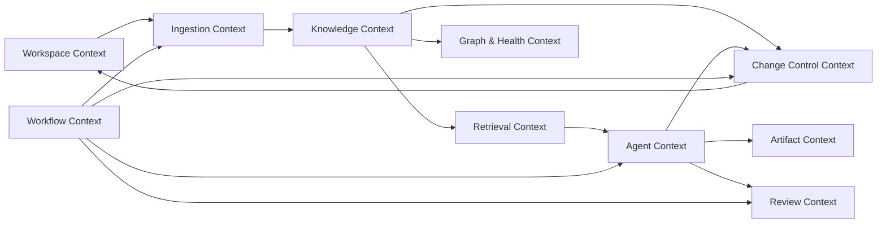
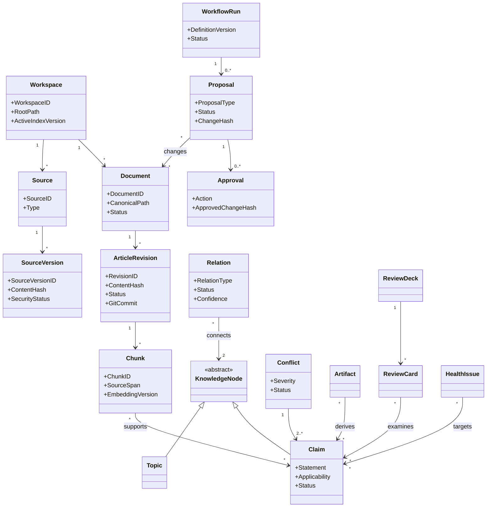
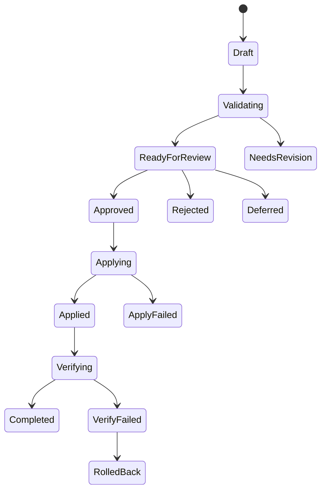
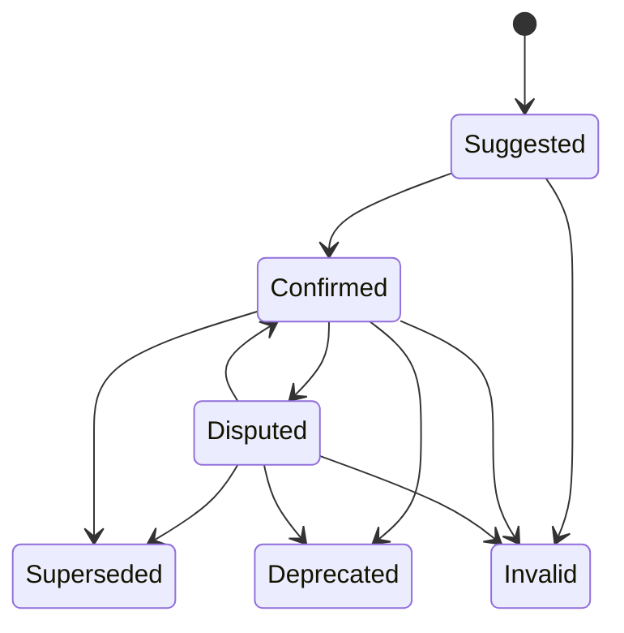
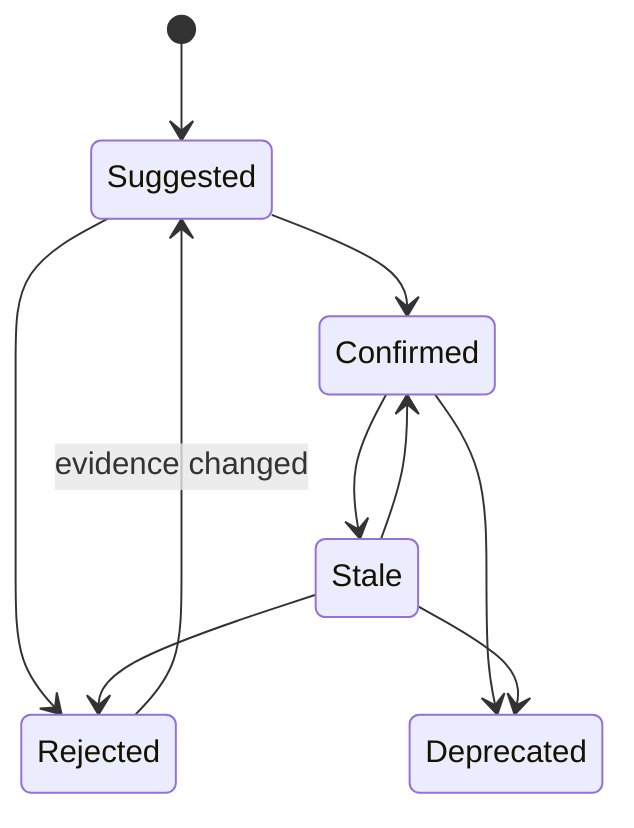
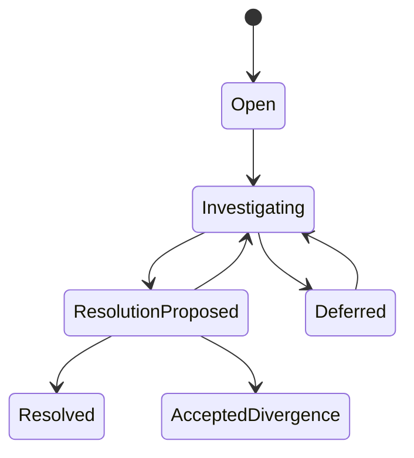

# 领域模型设计

## 1. 目标

将 PRD 中的知识、版本、关系、变更、工作流和复习概念组织为稳定领域模型，避免以数据库表或页面结构代替业务语义。

统一术语见 [CONTEXT.md](CONTEXT.md)。

## 2. 领域上下文

上下文说明：

- Workspace：用户文件与版本的合法操作范围。
- Ingestion：Source 到可检索 Document 投影。
- Knowledge：Topic、Claim、Relation、Conflict 和 Provenance。
- Change Control：Proposal、Approval、Safe Writeback。
- Retrieval：全文、向量、过滤、融合、重排和引用。
- Graph & Health：关系视图、候选关联、Health Issue 和影响分析。
- Agent：结构化模型决策和工具请求。
- Artifact：大纲、面试文档和学习路径。
- Review：闪卡、评分、FSRS 和面试模拟。
- Workflow：跨上下文的持久化过程管理。

## 3. 聚合设计

### 3.1 Workspace Aggregate

根：Workspace。

维护：

- 根目录和子目录策略。
- Git Repository 标识。
- 活动索引版本。
- 模型和功能配置引用。

不变量：

- 文件目标必须在 Workspace 内。
- 一个 Workspace 同时只有一个活动完整索引版本。

### 3.2 Source Aggregate

根：Source。

实体：

- Source Version。
- Content Artifact。
- Source Span。
- Ingestion Attempt。

不变量：

- Source Version 不可变。
- Source Version 的原路径是 Provenance；历史重读依赖不可变 Content Artifact。
- 内容哈希决定版本去重。
- 隔离版本不能进入默认检索。
- 安全、解析、分块与索引状态分别由 Ingestion、Workflow 和 Retrieval 事实记录，不能写回 Source Version 冒充单一状态。

### 3.3 Document Aggregate

根：Document。

实体：

- Article Revision。

不变量：

- 同时只有一个默认 Published Revision。
- Draft 不参加默认 RAG。
- Published Revision 必须对应 Git Commit。
- 解析 Source 产生状态为 SOURCE 的 Revision；SOURCE/CHUNKED 不等于 Published 或 READY。

### 3.4 Knowledge Aggregate

根可以是 Topic、Claim 或 Conflict，取决于命令目标。

实体：

- Claim Source。
- Relation。
- Relation Evidence。
- Conflict Member。

不变量：

- Confirmed Claim 有有效 Provenance。
- Confirmed Relation 有证据和确认方式。
- Conflict 不能通过覆盖 Claim 静默消失。

### 3.5 Proposal Aggregate

根：Proposal。

实体：

- Proposal Revision。
- Approval。
- Change Set。

不变量：

- Approval 绑定 Proposal Version 与 Change Hash。
- 目标基线变化后 Proposal 进入 Stale/Needs Revision。
- Completed 必须证明写回、Commit、索引和验证完成。

### 3.6 Workflow Aggregate

根：Workflow Run。

实体：

- Node Run。
- Tool Call。
- Human Task。
- Compensation Record。

不变量：

- Node Run 的幂等键在作用域内唯一。
- 已完成副作用不重复执行。
- Human Task 等待时不占 Worker 租约。

### 3.7 Review Aggregate

根：Review Deck。

实体：

- Review Card。
- Review Schedule。
- Review Session。
- Review Answer。

不变量：

- Active Card 绑定有效 Confirmed Claim。
- 同一 Answer Idempotency Key 只更新一次调度。

## 4. 核心对象关系

## 5. 关系类型语义

关系分析先产生 `Relation Assessment`：`NEW`、`COMPLEMENTARY`、`DUPLICATE`、`CONFLICT`、`LOW_CONFIDENCE`。
它是判断结果，不是正式 RelationType；`NEW` 和 `LOW_CONFIDENCE` 不得落为数据库关系边。

| 类型 | source → target 语义 | 对称 |
|---|---|---|
| CITES | source 引用 target | 否 |
| DERIVED_FROM | source 来源于 target | 否 |
| BELONGS_TO | source 属于 target Topic | 否 |
| SUPPORTS | source 证据支持 target | 否 |
| COMPLEMENTS | source 补充 target 的条件或内容 | 可视为对称但保留方向 |
| DUPLICATES | 两者核心结论等价 | 是 |
| CONFLICTS_WITH | 相同条件下不能同时成立 | 是 |
| PREREQUISITE_OF | source 是理解 target 的前置知识 | 否 |
| VERSION_OF | source 是 target 的版本 | 否 |
| IMPACTS | source 变化可能影响 target | 否 |

M5-05 首个端点注册表只包含 Topic 和 Claim：CITES、DERIVED_FROM、SUPPORTS、CONFLICTS_WITH 为
Claim→Claim，BELONGS_TO 为 Claim→Topic；COMPLEMENTS、DUPLICATES、PREREQUISITE_OF、VERSION_OF
只允许同类型端点；IMPACTS 允许当前两种类型的组合。Topic 与 Claim 的正式归属只使用 BELONGS_TO，
不维护可独立写入的第二套关联事实。

## 6. 核心状态机

### Proposal

### Claim

### Relation

### Conflict

## 7. 领域命令

### Workspace

- CreateWorkspace。
- ScanWorkspace。
- ValidateWorkspaceConsistency。

### Ingestion

- RegisterSource。
- ParseSourceVersion。

Ingestion 在 CHUNKED 后发布可索引事件；`IndexRevision/IndexChunks` 属于 Retrieval，由 Workflow/Application 编排，不能由 Ingestion 直接拥有索引生命周期。

### Knowledge

- SuggestClaim / ConfirmClaim。
- AssessRelation / SuggestRelation / ConfirmRelation。
- OpenConflict / TransitionConflict / ResolveConflict。

Applicability 使用版本化 canonical value；领域层只自动判断完全相同的条件。条件仅“相近/重叠”时，
必须携带可追踪的 reviewed overlap 理由；JSON 不相等不能自动推断冲突或条件分歧。

### Change Control

- CreateProposal。
- ReviseProposal。
- ApproveProposal。
- RejectProposal。
- ApplyApprovedProposal。
- RollbackAppliedProposal。

### Review

- CreateReviewDeck。
- GenerateReviewCards。
- ApproveReviewCard。
- SubmitReviewAnswer。
- InvalidateReviewCard。

## 8. 领域事件

- SourceDiscovered。
- SourceVersionRegistered。
- SourceQuarantined。
- RevisionPublished。
- ClaimConfirmed。
- RelationSuggested。
- RelationConfirmed。
- ConflictOpened。
- ProposalReadyForReview。
- ProposalApproved。
- ProposalApplied。
- ProposalRolledBack。
- IndexActivated。
- HealthIssueOpened。
- ReviewCardInvalidated。

这些事件用于生成时间线、投影和异步后续任务，不采用完整 Event Sourcing 作为主存储模式。

## 9. 边缘场景

### 相同内容不同文件

共享内容哈希和解析结果，但保留不同 Source 路径与 Provenance。

### 同一 Claim 不同适用条件

不能直接判断冲突；先比较 applicability。不同条件可以形成 ACCEPTED_DIVERGENCE。

### 用户手工修改正式 Markdown

文件扫描生成新 Source/Revision 基线，相关 Proposal 标记 Stale，索引增量更新。

### Git Commit 成功但数据库失败

启动一致性检查从 Git 和文件重建投影；进入只读恢复直到映射恢复。

### Claim 失效

更新图谱状态、使 Review Card 失效、标记 Artifact 和评测样本影响，不自动重写。

## 10. 明确不采用的模型

- 不把 Chunk 视为知识事实。
- 不把向量相似度视为 Relation。
- 不把 AI 置信度视为用户确认。
- 不把 Artifact 默认视为 Document。
- 不把数据库记录视为正式文章的唯一原件。
