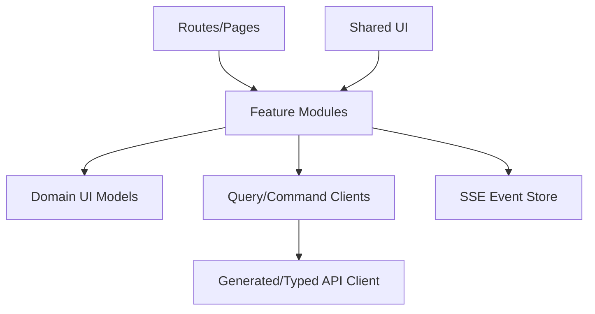

# 前端架构

## 1. 目标

构建可理解异步任务、证据、Diff、图谱和复习状态的 React Web UI。

## 2. 技术基线

- React。
- TypeScript。
- Vite。
- TanStack Query。
- React Router。
- Cytoscape.js。
- Monaco Diff Editor。
- SSE Client。

UI 组件库可选，但业务状态不依赖组件库。

## 3. 分层



## 4. Feature Modules

- dashboard。
- inbox。
- documents。
- optimization。
- search。
- rag。
- proposals。
- graph。
- collections。
- health。
- artifacts。
- review。
- workflows。
- settings。

禁止 Feature 直接导入另一个 Feature 内部状态；共享领域显示模型放 Domain UI。

## 5. 状态分类

### Server State

TanStack Query：

- Documents。
- Proposals。
- Workflow。
- Graph。
- Collections。

### URL State

- 筛选。
- 排序。
- 当前对象。
- 图谱中心节点。

### Local Draft

- Proposal 编辑。
- Article Diff 选择。
- Artifact 大纲。

### Event State

- Workflow 进度。
- Human Task。
- Index 激活。

SSE 事件触发 Query Invalidations，不作为唯一数据源。

## 6. 路由

```text
/
/inbox
/documents/:id
/optimize/:revisionId
/search
/chat/:conversationId
/proposals
/proposals/:id
/graph
/collections/:id
/health
/artifacts/:id
/review
/workflows/:id
/settings
```

## 7. 异步 UX

- 命令提交后导航到 Workflow 或保持页面显示任务卡片。
- 页面刷新后根据 Workflow ID 恢复。
- 显示阶段而非不确定进度百分比。
- Waiting for Human 显示明确待办。

## 8. Diff

模式：

- 行级。
- 段落级。
- 结构变化列表。

操作：

- 接受/拒绝单项。
- 手动编辑。
- 恢复原文。
- 高风险二次确认。

Diff Draft 保存服务器 Proposal Revision，不只存浏览器。

## 9. 图谱

- 服务端分页邻居。
- Web Worker 计算布局（如需要）。
- 节点类型使用形状+图标。
- 状态使用线型+标签。
- 选择节点打开详情抽屉。
- 过滤条件写入 URL/保存视图。

禁止一次获取全部节点。

## 10. RAG

- Streaming 仅用于展示生成阶段/文本。
- 最终 Answer 以服务端校验结果为准。
- 引用面板可定位 Source Span。
- 冲突卡片独立显示。

## 11. Review

- 回答前不加载答案正文到可见 DOM（减少意外查看）。
- 提交后显示多维评分。
- 调度结果以服务器返回为准。
- 重复点击提交使用同一 Idempotency Key。

## 12. 错误

统一 Error Boundary 只处理渲染错误。

业务错误：

- 页面内显示 error_code、说明、已完成影响、下一步。
- Version Conflict 进入专用合并 UI。
- Manual Recovery 跳转 Runbook/Workflow。

## 13. 缓存

- 查询按 Workspace 隔离。
- Mutation 成功只失效相关 Key。
- 不长期缓存 Source 全文。
- Logout/Workspace Switch 清理缓存。

## 14. 安全

- 不存 API Key。
- HTML 预览严格清理。
- Markdown 禁止执行脚本。
- 外部链接显示域名和新窗口策略。
- 自托管启用 CSRF/Origin 策略。

## 15. 性能

- 大表虚拟滚动。
- 图谱分批渲染。
- Diff 大文件分段加载。
- Artifact 章节懒加载。
- Bundle 按路由拆分。

## 16. 测试

- Component Test：Diff、Evidence、Status。
- Integration：Command→Workflow→SSE。
- E2E：六个最高层 Seam。
- Accessibility：键盘、颜色、焦点。

## 17. 构建产物

React 静态资源可：

- 由 Go Binary embed。
- 或由反向代理单独提供。

本地模式优先单一 Go 分发包 + PostgreSQL，开发模式保持前后端独立。
