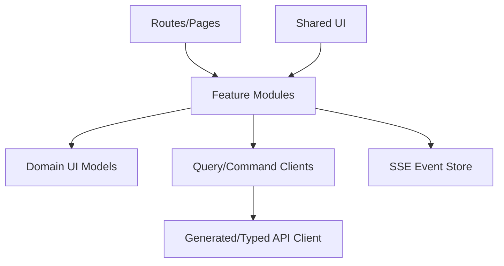

# 前端架构

## 1. 目标

构建可理解异步任务、证据、Diff、图谱和复习状态的 React Web UI。

## 2. 技术基线

- React。
- TypeScript。
- Vite。
- TanStack Query。
- React Router。
- M7-01 Graph 使用有界 SVG/CSS 画布与语义化列表 fallback。
- Monaco Diff Editor。
- SSE Client。

UI 组件库可选，但业务状态不依赖组件库。
Cytoscape.js 与 Web Worker 是后续大图容量和交互证据支持时才评估的选项，当前未作为 Graph 依赖或既定
架构；M7-01 不以提前引入大图运行时替代服务端边界和可访问性。

## 3. 分层



## 4. Feature Modules

- dashboard。
- inbox。
- documents。
- optimization。
- search。
- rag。
- proposals。
- graph。
- collections。
- health。
- artifacts。
- review。
- workflows。
- settings。

禁止 Feature 直接导入另一个 Feature 内部状态；共享领域显示模型放 Domain UI。

## 5. 状态分类

### Server State

TanStack Query：

- Documents。
- Proposals。
- Workflow。
- Graph。
- Collections。
- Conversation pages、Turns、Answer/Clarification、retrieval summary 和 Feedback results。

### URL State

- 筛选。
- 排序。
- 当前对象。
- 图谱中心节点。
- 图谱模式、Path 起终点、深度、方向和实际生效的过滤器。
- 当前 Conversation ID 与可选 Citation 选择。

### Local Draft

- Proposal 编辑。
- Article Diff 选择。
- Artifact 大纲。
- 未提交 Question、检索范围、回答深度/格式和面板开关。
- Graph 当前选择、画布/列表模式、会话内锁定坐标和固定布局。

### Event State

- Workflow 进度。
- Human Task。
- Index 激活。
- RAG 阶段通知与 SSE 重连游标。

SSE 事件触发 Query Invalidations，不作为唯一数据源。

## 6. 路由

```text
/
/inbox
/documents/:id
/optimize/:revisionId
/search
/chat
/chat/:conversationId
/proposals
/proposals/:id
/graph
/collections/:id
/health
/artifacts/:id
/review
/workflows/:id
/settings
```

## 7. 异步 UX

- 命令提交后导航到 Workflow 或保持页面显示任务卡片。
- 页面刷新后根据 Workflow ID 恢复。
- 显示阶段而非不确定进度百分比。
- Waiting for Human 显示明确待办。

## 8. Diff

模式：

- 行级。
- 段落级。
- 结构变化列表。

操作：

- 接受/拒绝单项。
- 手动编辑。
- 恢复原文。
- 高风险二次确认。

Diff Draft 保存服务器 Proposal Revision，不只存浏览器。

## 9. 图谱

### M7-01 已交付边界

- `/graph` 是真实 Topic/Claim 只读查询页面，支持 Global、Local、Path 三种模式；Source、Document、
  Conflict、Artifact 等最终节点类型等待领域事实与 Relation 端点契约落地后兼容扩展。
- `web/src/api/graph.ts` 是七个 Graph endpoint 的唯一 `unknown` 到领域模型严格 decoder/client；组件不解析
  snake_case wire 数据。`features/graph/queries.ts` 使用 TanStack Query 管理 Global、Neighborhood、Path、
  Node/Relation Detail 与 Relation Evidence 服务端状态，Query Key 包含 Workspace 和全部生效条件。
- 节点搜索是 Workspace 范围的服务端查询，搜索 Active Topic name/alias 与 Confirmed/Disputed Claim
  statement；输入为 2..256 UTF-8 bytes，默认 20、最大 50，不得退化为当前页面内过滤。
- React Router URL 持有 mode、center、Path 起终点、depth、direction 及过滤器，并对非法或互相冲突的
  deep link 恢复为安全状态。Opaque cursor 只由 TanStack Query 的分页过程持有，客户端不解析签名内容。
- Global 使用 Topic 聚类 cursor 分页；Local 默认一跳、允许 1 至 3 跳，一跳分页而深层使用有界快照；
  Path 返回已证明的确定性最短路径或明确 `not_found`，共同 Topic 只作为建议，不伪装为路径。

### 渲染与交互

- 当前使用确定性的有界 SVG/CSS 布局，画布最多展示 60 个节点、100 条边；超过视觉上限、坐标无效或端点
  不闭合时自动切换到包含当前完整结果的列表。服务端查询另有最多 500 节点、1000 边和 frontier/深度预算，
  禁止一次获取整个 Workspace。
- Topic 与 Claim 使用形状、文字标签区分；Confirmed 与 STALE Relation 同时使用线型和文字状态，不能只靠
  颜色。用户可以主动在画布和完整列表之间切换，并从两种视图选择节点或关系。
- 节点锁定和“固定当前布局”只保存在当前页面会话；URL 查询变化时清除。跨刷新布局、多人视图、
  Cytoscape/Web Worker 最终大图体验属于后续阶段，不能把会话状态描述为已保存视图。
- Node/Relation 选择打开详情；Relation Evidence 只有在关系详情中主动展开后才按 cursor 请求。移动端详情
  使用 modal drawer，约束焦点，支持 Escape 关闭并把焦点恢复到触发控件。

### 状态与失败

- Loading 使用 skeleton/progress；无 Workspace、缺中心/端点、empty、truncated、no-path、STALE Relation、
  cursor stale、budget、timeout、dependency unavailable 与 projection inconsistent 均有独立可操作反馈，
  不以空画布或假成功互相替代。
- 布局失败或结果超过视觉上限时只降级渲染方式，不丢失服务端节点/关系事实；Graph 查询失败不由 Error
  Boundary 吞掉，并保留稳定错误码及重新查询入口。

## 10. RAG

- `/chat` 和 `/chat/:conversationId` 已实现。前者创建/选择 Conversation，后者提供 Conversation rail、
  Answer timeline/composer 和 Evidence 区；移动端改为单列与 Citation drawer。
- `web/src/api/conversation.ts` 是 Conversation/RAG JSON 的唯一严格 decoder/client 边界，
  `web/src/events/**` 是唯一 SSE fetch-stream owner。事件只做定向 Query invalidation。
- Answer 严格区分 pending、completed、refused、clarification_required；刷新时通过最新 Turn、Answer 的
  `current_stage` 与 Workflow 投影恢复，不把客户端内存或流式草稿当最终事实。
- SSE 断线显示重连状态并执行有界轮询；过期游标先重查权威资源，再无游标重连。轮询成功或失败都计预算，
  禁止无限后台请求。
- 页面已覆盖 Scope、depth/format、Clarification、Conflict、Citation、retrieval summary、Related Topic、
  follow-up 和五类 Feedback；Citation drawer 关闭后恢复触发控件焦点。
- M6-04 SSE 传输阶段/终态摘要，不传逐 token 正文；最终 Answer 始终以服务端校验结果为准。

## 11. Review

- 回答前不加载答案正文到可见 DOM（减少意外查看）。
- 提交后显示多维评分。
- 调度结果以服务器返回为准。
- 重复点击提交使用同一 Idempotency Key。

## 12. 错误

统一 Error Boundary 只处理渲染错误。

业务错误：

- 页面内显示 error_code、说明、已完成影响、下一步。
- Version Conflict 进入专用合并 UI。
- Manual Recovery 跳转 Runbook/Workflow。

## 13. 缓存

- 查询按 Workspace 隔离。
- Mutation 成功只失效相关 Key。
- 不长期缓存 Source 全文。
- Logout/Workspace Switch 清理缓存。

## 14. 安全

- 不存 API Key。
- HTML 预览严格清理。
- Markdown 禁止执行脚本。
- 外部链接显示域名和新窗口策略。
- 自托管启用 CSRF/Origin 策略。

## 15. 性能

- 大表虚拟滚动。
- 图谱服务端有界分页/快照，前端使用 60 节点/100 边画布上限与完整列表 fallback。
- Diff 大文件分段加载。
- Artifact 章节懒加载。
- Bundle 按路由拆分。

M7-01 的容量验证是 20,000 Topic、100,000 Relation、100,000 Evidence，5 次预热加 30 次采样；它证明
查询有界和无 N+1，不是最终 500,000 Relation 或 UI FPS 验收。正式资源预算下的 500,000 Relation 与
交互 FPS 门禁属于 M10；只有该证据表明当前渲染方案不足时，才评估 Cytoscape/Web Worker。

## 16. 测试

- Component Test：Diff、Evidence、Status。
- Integration：Command→Workflow→SSE。
- E2E：六个最高层 Seam。
- Accessibility：键盘、颜色、焦点。

M6-04 已有组件/路由测试和真实临时 PostgreSQL/API 的桌面 1280px、移动 390px 浏览器烟测；全产品
Playwright 六 seam、其他主要业务页面、统一全站 SSE 扩展与最终可访问性验收仍归 M9/M11。

M7-01 Graph 已通过 strict decoder/query key/URL round-trip/view model/component/route 测试，以及真实
PostgreSQL/API 的 Global→Local→Path→Relation Evidence smoke。浏览器验收覆盖 1440×900 桌面与
390×844 移动视口的三种模式、URL 恢复、画布/列表、会话布局、Evidence lazy drawer、Escape 与焦点恢复；
两种视口均无横向溢出或应用 console warning/error。该结果不等同于 M10 的 500,000 Relation/FPS 或全产品
六 seam 最终验收。

## 17. 构建产物

React 静态资源可：

- 由 Go Binary embed。
- 或由反向代理单独提供。

本地模式优先单一 Go 分发包 + PostgreSQL，开发模式保持前后端独立。
