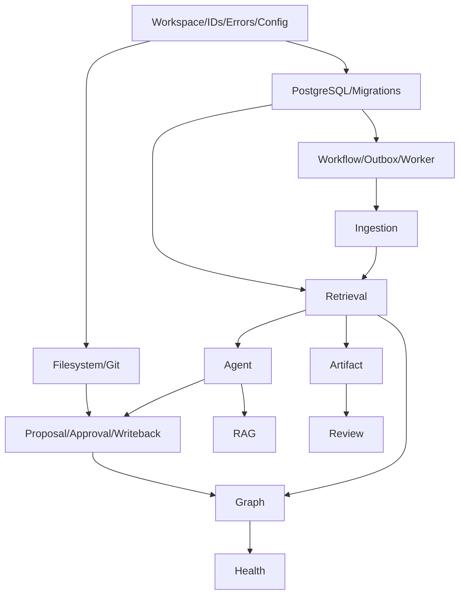

# 架构落地实施计划

## 1. 目标

按依赖与垂直闭环把架构转化为可持续实现的 Go 项目。正式 v1.0 范围不降级，但实现按检查点逐步集成。

## 2. 依赖图

## 3. Phase 0：项目骨架

交付：

- Go Module。
- API/Worker 两个命令。
- 配置与 Composition Root。
- PostgreSQL Compose。
- Migration。
- React App。
- CI。

验收：

- 一条命令启动。
- API/Worker Readiness。
- 前端打开非空页面。

## 4. Phase 1：Workspace 与事实源

垂直切片：

- 本机命令选择 Root、注册稳定 Workspace 身份并激活精确 grant。
- Docker 固定 Web 入口、Active Workspace API 与低频安全切换。
- 文件扫描。
- Source Version Hash。
- Git Status。
- 数据库映射。

高风险优先：

- 路径越界。
- 外部编辑。
- Git Dirty。

## 5. Phase 2：Workflow 与 Proposal seam

- Workflow Definition/Run/Node。
- Worker Lease。
- Outbox。
- Human Task。
- Proposal/Approval。
- Fake Side Effect。

检查点：

- Worker Crash 恢复。
- Human Double Submit。
- Idempotency。

## 6. Phase 3：摄取与检索

- Markdown/TXT Parser。
- PDF/Web Adapter。
- Chunk。
- FTS。
- Embedding。
- pgvector。
- RRF。
- Search UI。

检查点：

- 500k Chunk 压测雏形。
- Source Span。
- Index Version。

## 7. Phase 4：知识整理与安全写回

- Claim/Topic/Relation/Conflict。
- Relation Classification。
- Proposal Diff。
- File Atomic Write。
- Git Commit。
- Index Update。
- Compensation。

检查点：

- 完整知识变更 E2E。
- 每个失败点故障注入。

## 8. Phase 5：文章优化与 RAG

- Optimization Modes。
- Protected Spans。
- Revision/Diff UI。
- RAG Conversation。
- Citation Validation。
- Refusal/Conflict。

## 9. Phase 6：图谱、集合、健康与时间线

- Relation Projection。
- Local/Global Graph。
- Semantic Candidate。
- Smart Collection。
- Health Detector/Fingerprint。
- Knowledge Event/Impact。

## 10. Phase 7：Artifact 与 Review

- Artifact Planning/Section。
- Review Deck/Card。
- Scoring。
- FSRS。
- Interview Session。
- Invalidated Card。

## 11. Phase 8：质量与发布

- Full Evaluation。
- Security。
- Observability。
- Backup/Restore。
- Upgrade。
- Docker Release。
- README/Demo。

## 12. 每阶段通用验收

- Unit/Contract/Integration。
- Architecture Dependency Check。
- Migration。
- Audit。
- Metrics。
- Security Negative Test。
- 文档更新。

## 13. 任务大小

- 单任务 1–5 文件为目标。
- 超过一个垂直行为拆分。
- 每任务明确 Acceptance 与 Verification。
- 不按“先全部数据库、再全部 API、再全部 UI”横向切。

## 14. 技术风险顺序

1. File/Git/DB 一致性。
2. Workflow 幂等恢复。
3. Retrieval 质量。
4. Structured Output。
5. Graph 性能。
6. Review 评分。

## 15. 发布门禁

- PRD AC-01..AC-36。
- 六个最高层 Seam。
- AI Eval。
- Fault Injection。
- Backup Restore Drill。
- Security Scan。
