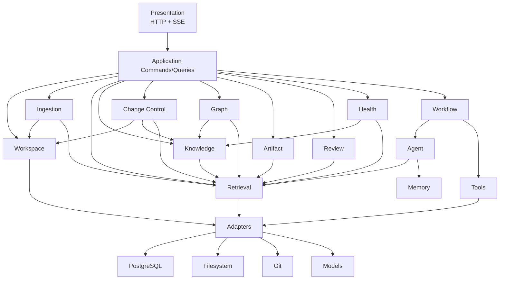
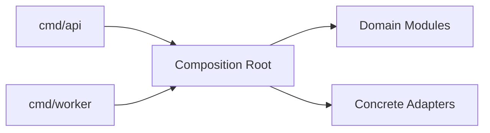

# Go 模块化单体架构

## 1. 架构选择

系统采用模块化单体：

- 一个代码仓库。
- API 与 Worker 两个可独立运行进程。
- 共享领域模块。
- 一个 PostgreSQL。
- 模块通过明确 Interface 协作。

原因见 [ADR-0001](adr/0001-modular-monolith.md)。

## 2. 深模块原则

- Module 对外只有一个小 Interface。
- Interface 包含输入、输出、不变量、错误和性能约束。
- 复杂度隐藏在 Implementation 内。
- Adapter 只位于真实变化 seam。
- 测试通过同一 Interface 验证行为。

## 3. 模块图



## 4. 模块职责

### Workspace Module

Interface：

- 创建和校验 Workspace。
- 安全读取与准备写入。
- 计算文件版本。
- 管理目录布局。

隐藏：

- 路径规范化。
- 文件锁。
- 临时文件。
- 符号链接检查。

### Ingestion Module

Interface：

- 注册 Source。
- 解析 Source Version。
- 生成标准 Document 和 Chunk。

隐藏：

- 格式识别。
- 解析器选择。
- 去重。
- 安全标记。

### Retrieval Module

Interface：

- IndexRevision。
- Search。
- ActivateIndexVersion。

隐藏：

- FTS、pgvector、RRF、Rerank。
- Chunk 去重。
- 过滤和版本规则。

### Knowledge Module

Interface：

- ConfirmClaim。
- AssessRelation。
- SuggestRelation。
- ConfirmRelation。
- OpenConflict。
- ResolveConflict。
- BatchGetClaims/Relations/Conflicts。

隐藏：

- Claim 适用条件。
- 关系不变量。
- 冲突状态。
- Provenance 校验。
- Relation Assessment 到正式命令的映射。
- NodeType × RelationType 兼容矩阵和对称端点规范化。

Knowledge Module 是 Relation 唯一写入 owner。Graph、Collection、Agent 只能通过公开查询/命令 seam 消费，
不得直接写 Relation 表或维护可独立写入的 topic_claim。当前文件型 Proposal 也不能用假字段冒充关系审批。

### Change Control Module

Interface：

- CreateProposal。
- ValidateProposal。
- DecideProposal。
- ApplyProposal。

隐藏：

- Proposal Revision。
- Change Hash。
- 目标基线。
- 写权限令牌。
- 补偿。

### Graph Module

Interface：

- QueryGlobalGraph。
- QueryNeighborhood。
- FindPath。
- DiscoverCandidates。
- ReviewCandidate / StartTopicScan。

隐藏：

- 聚类。
- 图查询投影。
- 候选去重。
- Candidate/Decision/Scan 持久化与 typed Proposal 编排。
- 布局缓存。

### Collection Module

Interface：

- ValidateCollection。
- PreviewCollection / ExecuteCollection。
- CreateCollection / UpdateCollection / ArchiveCollection。
- PlanDurableScan / ReadDurableScanPage。

隐藏：

- `collection-query/v1` AST、字段/operator/sort registry 与 canonical hash。
- 参数化 Topic/Claim 统一 read model、hydration 和 query-dependent revision。
- HMAC cursor、完整历史命令 receipt 与有界 durable membership cache。

### Artifact Module

Interface：

- PlanArtifact。
- GenerateSection。
- ReviseArtifact。
- PublishArtifactProposal。

隐藏：

- 大纲状态。
- 章节覆盖。
- 引用聚合。

### Review Module

Interface：

- CreateDeck。
- GenerateCards。
- SubmitAnswer。
- ScheduleNextReview。

隐藏：

- 卡片去重。
- 多维评分。
- FSRS 参数。
- 失效处理。

### Health Module

Interface：

- Scan。
- ListIssues。
- DecideIssue。
- CreateRepairProposal。
- ScheduleScan / DispatchAffectedChange。

隐藏：

- 检测规则。
- Fingerprint。
- 严重度。
- 忽略与重新打开。
- detector coverage、checkpoint、complete-only resolve、schedule due/lease 与 affected-scope outbox。

M7-03 中 Collection/Health 是独立深模块：HTTP -> Application -> Domain Ports -> PostgreSQL/Workflow Adapter。
Graph 的 SMART_COLLECTION Candidate Scan 和 Health 的 Smart Collection scope 只消费 Collection owner 提供的
ID/version/query hash/read-model revision/exact count；任何漂移都 fail closed。River 只负责投递，Scan、Issue、
Schedule 和 receipt 的业务状态仍以 PostgreSQL 为事实源。

### Workflow Module

Interface：

- Start。
- ClaimRunnableNode。
- CompleteNode。
- SubmitHumanDecision。
- Retry。
- Cancel。

隐藏：

- DAG。
- 租约。
- 幂等。
- 退避。
- 补偿。

### Agent Module

Interface：

- Analyze。
- Organize。
- Review。

隐藏：

- Prompt。
- Structured Output。
- Model 选择。
- 修复重试。

### Tools Module

Interface：

- Contract Registry：冻结版本化 Definition/Schema。
- Execution Service：使用服务端 Workflow policy 执行 typed Tool。
- Tool Call Repository：STARTED/REFUSED/CAS terminal、replay 与 recovery。
- Trusted Write Audit：关联 Safe Writeback receipt，不拥有文件/Git 副作用。

隐藏：

- Schema。
- Capability/allowed_tools/Workflow binding 判定。
- timeout、retry、idempotency 和输出预算。
- PostgreSQL、Retrieval、Web、文件/Git Adapter 细节。
- 脱敏摘要和 Tool Call 持久状态。

依赖方向固定为 `tools/adapter → tools/application → tools/domain → capability/foundation`；Tools Domain
不得依赖 Workflow、Change Control、HTTP、pgx、模型、文件系统或 Git。Safe Writeback 通过窄 audit bridge
调用 Tools Application，Tools 不得反向创建第二条文件/Git 写入路径。

### Memory Module

Interface：

- SuggestMemory。
- ConfirmMemory。
- QueryRelevantMemory。
- DeleteMemory。

## 5. 允许依赖

```text
presentation → application
application → domain modules
workflow → agent/tools/domain module interfaces
domain modules → shared kernel
adapters → domain interfaces
bootstrap → all modules
```

## 6. 禁止依赖

- Domain Module → HTTP 类型。
- Domain Module → pgx/sqlc 生成类型。
- Domain Module → 模型 SDK。
- Agent Module → 文件系统或 Git Adapter。
- Presentation → Repository。
- Module A → Module B 的内部包。
- Adapter → Application Command Handler。

## 7. 建议 Go 目录

```text
cmd/
  api/
  worker/
internal/
  app/
  workspace/
  ingestion/
  retrieval/
  knowledge/
  changecontrol/
  graph/
  collection/
  artifact/
  review/
  health/
  workflow/
  agent/
  tools/
  memory/
  audit/
  platform/
    postgres/
    filesystem/
    gitcli/
    models/
    parser/
web/
migrations/
```

规则：

- 每个领域 Module 有 public package 和 internal implementation package。
- platform 只实现 Adapter。
- shared kernel 只保留 ID、时间、分页和通用错误等真正共享概念。

## 8. API 与 Worker 复用



API：

- 同步查询。
- 创建命令和 Workflow。
- Human Decision。

Worker：

- 获取节点租约。
- 执行长任务。
- Side Effect。

## 9. 事务 seam

事务由发起不变量变化的 Module 控制：

- Change Control 控制 Proposal/Approval。
- Workflow 控制 Node Run 与 Outbox。
- Review 控制 Answer 与 Schedule。
- Knowledge 控制 Claim/Relation/Conflict。

禁止在 HTTP Handler 中开始跨模块事务。

跨模块最终一致使用 Outbox/Event，不扩大数据库事务到文件和 Git。

## 10. 测试 seam

最高层：

- Change Control Interface。
- Workflow Interface。
- Retrieval Interface。
- Review Interface。

Adapter Contract Test：

- PostgreSQL Repository。
- Filesystem Workspace。
- Git CLI。
- Model Adapter。
- Parser。

## 11. 演进策略

- 新 Parser：增加 Adapter。
- 新模型：增加 Model Adapter。
- 新 Workflow：注册 Definition。
- 新 Artifact：增加 Artifact Type 与 Workflow。
- 换向量库：替换 Retrieval 内部 Adapter，不改调用者。
- 引入 Graph DB：仅替换 Graph Query Adapter，正式 Relation 仍由 Knowledge Module 管理。
