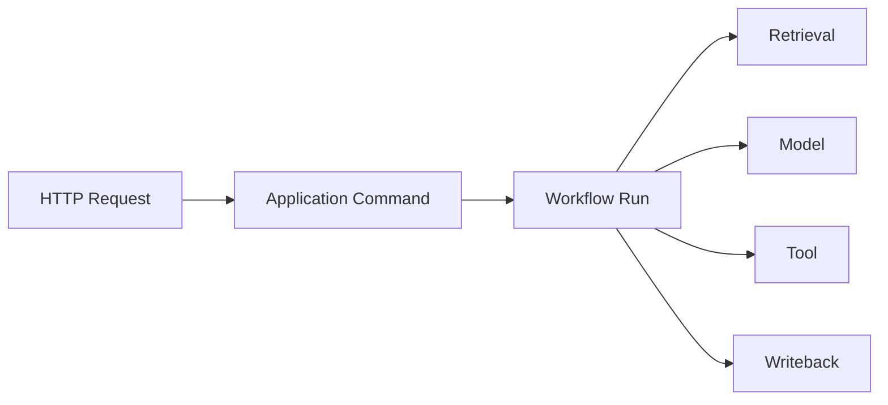

# 可观测性与审计架构

## 1. 目标

回答任务发生了什么、为什么失败、影响了什么、使用了什么模型/版本以及如何恢复。

## 2. 三支柱

- Logs：结构化事件。
- Traces：跨 API、Workflow、Model、Tool。
- Metrics：容量、延迟、错误和队列。

审计独立于普通日志，记录安全和业务决策。

## 3. Correlation

字段：

- request_id。
- trace_id。
- workspace_id。
- workflow_run_id。
- node_run_id。
- proposal_id。
- tool_call_id。
- document_id。

## 4. 日志

使用 slog JSON。

级别：

- DEBUG：开发诊断。
- INFO：状态变化。
- WARN：降级、重试、低置信度。
- ERROR：节点失败、依赖失败。

禁止：

- API Key。
- Authorization Header。
- 完整 Prompt/Source 默认记录。
- 用户回答全文无保留期限记录。

## 5. Trace

Span 属性：

- operation。
- model。
- prompt_version。
- index_version。
- retry_attempt。
- degraded。

## 6. Metrics

### API

- request_total。
- latency。
- error_code_total。
- active_sse。

### Workflow

- run_total/status。
- node_duration。
- retry_total。
- lease_expired。
- human_wait_duration。
- compensation_total。

### Retrieval

- query_latency。
- fts/vector/rerank latency。
- candidates。
- zero_result。
- degraded_total。

### Model

- calls。
- tokens。
- latency。
- errors。
- schema_repair。

### Data

- documents/chunks/relations。
- index_version。
- stale_projection。
- health_issues。

## 7. 审计事件

- Approval Decision。
- Tool Permission。
- File Write。
- Git Commit。
- Rollback。
- Memory Change。
- Settings Change。
- Security Block。

审计不可由普通清理任务删除。

## 8. 用户时间线

面向用户：

- 业务节点。
- 检索摘要。
- Tool 名称。
- Proposal。
- Approval。
- Commit。
- 错误和恢复。

不展示模型私有思维链。

## 9. Dashboard

本地默认不强依赖 Grafana。

应用内提供：

- Workflow。
- 模型 Token。
- 错误分类。
- Index Health。
- Knowledge Health。

可选导出 OTel/Prometheus 到外部平台。

## 10. 告警

本地 UI 告警：

- DB 不可用。
- Git/DB 不一致。
- Index Stale。
- Manual Recovery。
- Worker 无心跳。
- 模型持续失败。

自托管可增加 Webhook/Email，但非 Must。

## 11. 保留

- Audit：长期。
- Workflow Summary：长期。
- Node Full Output：可配置。
- Debug Prompt：短期且默认关闭。
- Metrics：滚动保留。

## 12. 可观测性测试

- Correlation 完整。
- Secret Redaction。
- Error Code 可查询。
- Duplicate Retry 不重复审计副作用。
- Trace 在异步边界连续。

