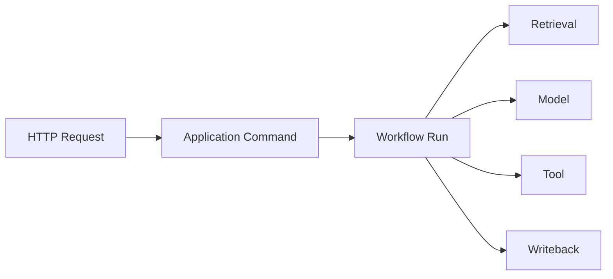

# 可观测性与审计架构

## 1. 目标

回答任务发生了什么、为什么失败、影响了什么、使用了什么模型/版本以及如何恢复。

## 2. 三支柱

- Logs：结构化事件。
- Traces：跨 API、Workflow、Model、Tool。
- Metrics：容量、延迟、错误和队列。

审计独立于普通日志，记录安全和业务决策。

## 3. Correlation

字段：

- request_id。
- trace_id。
- workspace_id。
- workflow_run_id。
- node_run_id。
- proposal_id。
- tool_call_id。
- document_id。
- attempt_no。
- dispatch_no。
- retry_no。
- river_job_id。

这些字段由 Context 合并并自动注入日志和 Trace。调用方传入空值不会清除父
Context 已有的关联字段。高基数 ID 不得进入 Metrics labels。

## 4. 日志

使用项目封装的 slog JSON Handler。Handler 在写出前 fail closed 脱敏，而不是
依赖每个调用方都记得清洗。

业务包优先依赖 `internal/observability` 稳定 facade；具体 slog、Metrics、Trace 与
Telemetry 实现仍由 `internal/platform/observability` 单一事实源持有。facade 不复制
Provider 或脱敏实现，只转发项目自有合同。

级别：

- DEBUG：开发诊断。
- INFO：状态变化。
- WARN：降级、重试、低置信度。
- ERROR：节点失败、依赖失败。

禁止：

- API Key。
- Authorization Header。
- 完整 Prompt/Source 默认记录。
- 用户回答全文无保留期限记录。
- Credential/Password/Token/Cookie/DSN/数据库 URL。
- 请求/响应正文、Git stderr、lock token 和绝对文件路径。
- 未知复合对象直接序列化；应改为稳定 code/kind/count/hash 等标量摘要。

敏感 key、内嵌凭据 URL、`key=value` Secret 以及常见绝对路径均替换为
`<redacted>`；`[]byte` 只输出长度。配置日志使用安全摘要，不输出数据库密码或
Telemetry endpoint。

Credential marker 优先于 `_id`、`_hash`、`_status` 等摘要后缀；例如
`token_hash`、`credential_id`、`session_status` 仍按敏感字段处理。只有不携带凭据
marker 的 `content_hash`、`prompt_version`、`source_count` 等受控摘要可保留。
未知 `error`/`fmt.Stringer` 默认整体替换为 `<redacted>`，调用方应另记稳定
`error_code`。文本检测覆盖 Session、CSRF、Set-Cookie、access/refresh token、JWT、
URL userinfo 和绝对路径。

## 5. Trace

Span 属性：

- operation。
- model。
- prompt_version。
- index_version。
- retry_attempt。
- degraded。

当前项目自有异步传播契约只允许 River metadata 中的 W3C `traceparent`。Producer 编码前
校验 trace/span ID，Consumer 使用严格 JSON 解析；除 River 自身保留且不会向
Application 暴露的 `river:*` recovery 字段外，拒绝额外字段、非法格式和多 JSON
值。不传播 baggage、正文、Credential、路径或任意项目 metadata。即使外部 exporter
disabled，API middleware 仍会为每个请求创建可传播的 child/root trace context，合法
trace context 可继续跨 Approval、River Job、Runtime Node 与 Safe Writeback 传播。

## 6. Metrics

### API

- request_total。
- latency。
- error_code_total。
- active_sse。

### Workflow

- `river.queue.depth{queue}`。
- `river.workers.active{queue}`。
- `workflow.node.duration_ms{node_kind,result}`。
- `workflow.node.result_total{node_kind,result,error_code?}`。
- `workflow.retry_total{node_kind,error_code?}`。
- `workflow.manual_recovery_total{node_kind,error_code?}`。
- `workflow.lease_expiry_total{node_kind}`。
- `workflow.heartbeat_failure_total{node_kind,error_code?}`。
- `river.duplicate_delivery_total{node_kind}`。
- `worker.shutdown_total{shutdown_kind,result}`。

Metric 名称、kind、允许/必填 label 都由项目 registry 固定。Label value 限长并
拒绝 UUID、长十六进制、Secret 和未注册字段；`workspace_id`、`proposal_id`、
`workflow_run_id`、`node_run_id`、`river_job_id` 等只能进入日志或 Trace。

M4-D 的生产发射语义固定如下：

- queue depth 只统计目标 queue 中 `state='available' AND scheduled_at<=数据库当前时间`
  的可立即领取 River Job；查询失败不发 0。
- active workers 使用当前进程 `RuntimeNodeWorker` 进入/退出的原子绝对值，不使用可能
  包含 SIGKILL stuck Job 的数据库 `running` 数量。
- Node duration/result、retry 和 manual recovery 只在 Workflow 结果事务已提交且不是
  幂等 replay 时发射；duration 使用持久 Attempt 的 `started_at/ended_at`。
- lease expiry 只在 Claim 事务已把旧 Attempt 归约为 `lease_lost` 并成功创建新 Attempt
  后发射；duplicate delivery 只使用 Claim 返回的可信 observation。
- heartbeat control 信号不计 failure；真实 heartbeat error 才发射 failure。
- metrics 记录失败只写稳定告警，不改变业务结果，也不触发 emergency shutdown。

### Retrieval

- query_latency。
- fts/vector/rerank latency。
- candidates。
- zero_result。
- degraded_total。

### Model

- `model.chat.result_total{component,phase,result,error_code?}`。
- `model.chat.duration_ms{component,phase,result,error_code?}`。
- tokens 继续由项目 Model Call 事实拥有，不从 callback 重复生成持久事实。
- schema_repair。

Eino Chat callback 由每次 `Chat` 通过调用 Context 的 `callbacks.InitCallbacks` 注入独立 handler，
不使用进程级全局可变 handler。它只把稳定 component、Model Call phase、result/error code、耗时和现有
correlation 写入 Trace/Metrics，不读取 callback input/output/raw error，不记录 API Key、Authorization、
Cookie、Prompt、请求/响应正文或 Endpoint，也不替代 `RecordingChatModel`、Model Run/Call、Audit 或
Workflow Progress。Telemetry 失败不改变 Chat 结果。

Eino Embedding callback 的标准 input/output 会携带原始文本和向量，当前生产 Adapter 禁止注册全局 handler，
也不把 callback manager 传入 Embedding 调用。未来如需 Embedding telemetry，必须先定义只接收 Provider、
结果分类、数量、维度和耗时等稳定摘要的调用级桥接，正文和向量不得进入 Trace、Metrics 或日志。

Eino Agent/Stream 的可观测性仍以项目 `ModelRun`、`ModelCall`、`ToolCall`、NodeAttempt 和 draft session 为事实源。
每次 `AGENT`、`ANSWER` 或结构化 phase 在调用前记录 STARTED，使用项目规范化 hash、usage 与终态归约；Eino callback
只补充脱敏 trace/metric，不能写入业务审计或持久进度。指标至少覆盖首 token 延迟、完成延迟、draft degradation、
Agent iteration、Tool Call、Graph node error 和拒答率；Workspace、Answer 或 Provider ID
不得作为 metric label。草稿正文、Agent 中间消息、Tool 参数和输出均不得进入日志、trace 或持久 event。

正式 Eino Runtime 使用以下项目指标：

- `agent.answer.first_token.duration_ms{result}`、`agent.answer.completion.duration_ms{result,error_code?}` 和
  `agent.answer.result_total{result,error_code?}`；首 token 只在收到第一个非空正文 frame 后记录，完成耗时覆盖到 EOF 或错误。
- `agent.draft.degradation_total{error_code?}`；同一 Answer stream 的 sink 首次降级只计一次，Provider 流仍必须继续 drain。
- `agent.runtime.iterations{result,error_code?}`、`agent.runtime.tool_calls{result,error_code?}` 和
  `agent.runtime.result_total{result,error_code?}`；迭代/工具直方图只记录通过输出合同的成功 Agent Run。
- `agent.rag.graph_node.result_total{node_kind,result,error_code?}`；`node_kind` 只能来自编译期固定的 Eino RAG Graph 节点。
- `rag.outcome_total{outcome}`；只在 v2 Finalizer 事务成功、receipt 校验通过且不是 replay 后记录
  `completed/refused/clarification_required`，因此可作为正式拒答率分母。

所有指标 exporter 错误或 panic 都必须降级为观测失败，不能改变 Agent、Stream、Graph、Finalizer 或 Worker 结果。
上述指标已经接入正式 Worker 组合根，并通过进程作用域的 OTLP/HTTP Provider 导出；它们只提供观察能力，
真实 Provider 灰度数据和一个稳定发布观察周期仍是独立发布质量检查。

### Data

- documents/chunks/relations。
- index_version。
- stale_projection。
- health_issues。

### Stable observation query surface

稳定观察作业使用 Prometheus-compatible Metrics API 和 Tempo-compatible Trace Search API。OTLP Collector 仅负责接收和
转换，不作为采集器查询端点。API/Worker 的 `runtime.process.presence` 与 `runtime.telemetry.required` 是无 label 的
进程级 LastValue gauge；Collector 作业用固定 `service_name` 聚合查询，不能把 workspace、run、provider 或模型放入
label。查询、阈值和后端 URL/path 信任摘要分别由 `deploy/eino_stable_observation_queries.json`、
`deploy/eino_stable_observation_thresholds.json` 和 `deploy/eino_stable_observation_backend_trust.json` 冻结；在独立审批
配置前均保持 `unconfigured`，不得用人工 manifest 或本地接收器宣称稳定观察通过。受保护采集器为每份 start/day
evidence 计算 HMAC 并绑定完整 manifest；每日续写、最终 attestation 和独立 verifier 都重新验证 evidence 目录，
因此签发后删除或替换 evidence 也会使正式门禁失败。evidence v2 还将实际 `collected_at` 纳入 HMAC；每日查询必须在
对应窗口结束后的同一观察时区自然日内完成，禁止在窗口末尾集中补采历史日期。

## 7. 审计事件

- Approval Decision。
- Tool Permission。
- File Write。
- Git Commit。
- Rollback。
- Memory Change。
- Settings Change。
- Security Block。

审计不可由普通清理任务删除。

### 7.1 Append-only Audit 合同

`internal/audit/domain` 定义 `audit-event/v1` 事件、Actor/Outcome 枚举、稳定错误码、
严格 JSON/canonical 编码和递归脱敏；`internal/audit/application.Recorder` 在调用
Repository 前再次执行统一清洗，并拒绝 Repository 返回的 Workspace 或完整事件
binding 漂移。

PostgreSQL Adapter 追加到 `ops.audit_event`，不提供 UPDATE/DELETE 路径。迁移中的
append-only trigger 使用 SQLSTATE `55000` 拒绝修改和删除。每个事件必须携带由业务
调用方稳定生成的 ID、`occurred_at` 和 `idempotency_key`；重试时相同完整 binding
返回既有事件，不制造第二条记录。同 key 不同 binding 返回稳定
`AUDIT_IDEMPOTENCY_CONFLICT`。

由于 PostgreSQL unique constraint 不会把 `NULL workspace_id` 视为冲突，Adapter 在
追加前按 Workspace+幂等键取得事务级 advisory lock，并使用
`IS NOT DISTINCT FROM` 查询，保证全局 Audit 的并发重放也只有一行。数据库读回若
发现未脱敏 Secret、非法 JSON 或保留字段损坏，按 `AUDIT_EVENT_CORRUPT` fail closed，
不把已污染载荷继续暴露给调用方。

查询默认只返回一个显式 Workspace；`workspace_id=nil` 仅表示全局事件，不代表跨
Workspace 管理查询。列表按 `occurred_at,id` 倒序并使用二元游标，避免同微秒事件在
翻页时丢失。跨 Workspace 运维读取需要未来单独的授权入口，不能复用默认 List。

## 8. 用户时间线

面向用户：

- 业务节点。
- 检索摘要。
- Tool 名称。
- Proposal。
- Approval。
- Commit。
- 错误和恢复。

不展示模型私有思维链。

## 9. Dashboard

本地默认不强依赖 Grafana。

应用内提供：

- Workflow。
- 模型 Token。
- 错误分类。
- Index Health。
- Knowledge Health。

可选导出 OTel/Prometheus 到外部平台。

### 9.1 Telemetry mode

| 模式 | Endpoint | 初始化失败 | Runtime 行为 |
|---|---|---|---|
| `disabled` | 必须为空 | 不构造 exporter | 使用 noop metrics/tracer，不声称外部导出 |
| `optional` | 必填绝对 HTTP(S) Base URL | 构造失败时稳定 `TELEMETRY_EXPORTER_UNAVAILABLE` | 使用 noop provider 并记录 degraded，进程仍可 ready |
| `required` | 必填绝对 HTTP(S) Base URL | 构造失败时稳定失败 | API/Worker fail-fast，不进入 ready |

环境变量为 `ZHIXU_TELEMETRY_MODE` 与 `OTEL_EXPORTER_OTLP_ENDPOINT`。API 和 Worker
Composition 已注入真实 OTLP/HTTP Provider，分别使用 `<app>-api`、`<app>-worker` 的
`service.name`，并在进程 Shutdown 时刷新批量 Trace 和周期 Metrics。Base URL 可带受控
path prefix，Adapter 分别追加 `/v1/metrics` 和 `/v1/traces`；userinfo、query、fragment
会被拒绝，endpoint 与认证 header 不进入项目日志或错误。

`TELEMETRY_EXPORTING` 只表示 external-export-capable Provider 已成功构造，不声称远端
Collector 已可达。真实可达性必须由 protobuf 导出集成证据以及灰度 Collector 中的固定
查询证明；SDK 类型只位于 `internal/platform/observability`，不会进入 Workflow
Domain/Application。`disabled` 仍使用会校验合同的 noop Adapter，内存 Provider 不能冒充
外部导出。

## 10. 告警

本地 UI 告警：

- DB 不可用。
- Git/DB 不一致。
- Index Stale。
- Manual Recovery。
- Worker 无心跳。
- 模型持续失败。

自托管可增加 Webhook/Email，但非 Must。

## 11. 保留

- Audit：长期。
- Workflow Summary：长期。
- Node Full Output：可配置。
- Debug Prompt：短期且默认关闭。
- Metrics：滚动保留。

## 12. 可观测性测试

- Correlation 完整。
- Secret Redaction。
- Error Code 可查询。
- Duplicate Retry 不重复审计副作用。
- 相同 Audit 幂等键精确重放只保留一行；相同 key 不同完整 binding 稳定冲突。
- `NULL workspace_id` 并发追加仍只有一行，Audit UPDATE/DELETE 由 SQLSTATE `55000`
  拒绝。
- Audit correlation/payload 入库前递归脱敏，数据库读回明文 Secret 时 fail closed。
- Trace 在异步边界连续。
- API 在 exporter disabled 时仍生成可传播 trace，合法入站 `traceparent` 保持同一 trace。
- 项目写入的 River metadata 只含 `traceparent`；River 自身保留的 `river:*` recovery
  字段可共存但会被忽略且不向 Application 暴露，其他额外字段 fail closed。
- Metrics 拒绝高基数/敏感/未知 labels。
- 持久结果 replay 不重复发射 node/retry/manual 指标；租约回收与 duplicate observation
  来自 PostgreSQL 事务事实，不通过 AttemptNo 猜测。
- Health payload 只含稳定 `status/code/version`。
- `disabled/optional/required` 不伪造 exporter 成功，OTLP Provider 资源只关闭一次并在
  Shutdown 刷新；protobuf receiver 测试必须同时收到 Metrics 与 Trace。

发布门禁还应对日志、Audit row、Metric snapshot、Trace snapshot、River metadata 和
Worker health response 做 Secret canary 扫描。Audit 单元门禁为
`go test ./internal/audit/...`；真实 PostgreSQL 门禁使用
`go test -tags integration ./internal/audit/adapter/postgres`，并要求指向已迁移的可丢弃
数据库。单元测试通过不等同于灰度 Collector 可达或稳定观察已完成；真实 exporter、
数据库、容器烟测与发布观察必须单独记录结果。稳定观察不决定是否保留第二套 AI Runtime。
