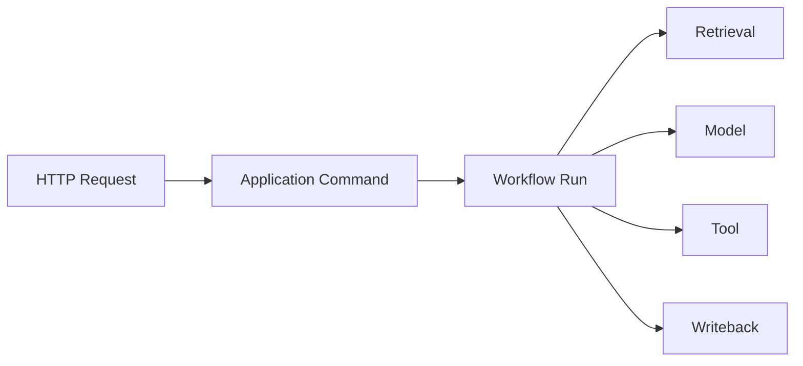

# 可观测性与审计架构

## 1. 目标

回答任务发生了什么、为什么失败、影响了什么、使用了什么模型/版本以及如何恢复。

## 2. 三支柱

- Logs：结构化事件。
- Traces：跨 API、Workflow、Model、Tool。
- Metrics：容量、延迟、错误和队列。

审计独立于普通日志，记录安全和业务决策。

## 3. Correlation

字段：

- request_id。
- trace_id。
- workspace_id。
- workflow_run_id。
- node_run_id。
- proposal_id。
- tool_call_id。
- document_id。
- attempt_no。
- dispatch_no。
- retry_no。
- river_job_id。

这些字段由 Context 合并并自动注入日志和 Trace。调用方传入空值不会清除父
Context 已有的关联字段。高基数 ID 不得进入 Metrics labels。

## 4. 日志

使用项目封装的 slog JSON Handler。Handler 在写出前 fail closed 脱敏，而不是
依赖每个调用方都记得清洗。

业务包优先依赖 `internal/observability` 稳定 facade；具体 slog、Metrics、Trace 与
Telemetry 实现仍由 `internal/platform/observability` 单一事实源持有。facade 不复制
Provider 或脱敏实现，只转发项目自有合同。

级别：

- DEBUG：开发诊断。
- INFO：状态变化。
- WARN：降级、重试、低置信度。
- ERROR：节点失败、依赖失败。

禁止：

- API Key。
- Authorization Header。
- 完整 Prompt/Source 默认记录。
- 用户回答全文无保留期限记录。
- Credential/Password/Token/Cookie/DSN/数据库 URL。
- 请求/响应正文、Git stderr、lock token 和绝对文件路径。
- 未知复合对象直接序列化；应改为稳定 code/kind/count/hash 等标量摘要。

敏感 key、内嵌凭据 URL、`key=value` Secret 以及常见绝对路径均替换为
`<redacted>`；`[]byte` 只输出长度。配置日志使用安全摘要，不输出数据库密码或
Telemetry endpoint。

Credential marker 优先于 `_id`、`_hash`、`_status` 等摘要后缀；例如
`token_hash`、`credential_id`、`session_status` 仍按敏感字段处理。只有不携带凭据
marker 的 `content_hash`、`prompt_version`、`source_count` 等受控摘要可保留。
未知 `error`/`fmt.Stringer` 默认整体替换为 `<redacted>`，调用方应另记稳定
`error_code`。文本检测覆盖 Session、CSRF、Set-Cookie、access/refresh token、JWT、
URL userinfo 和绝对路径。

## 5. Trace

Span 属性：

- operation。
- model。
- prompt_version。
- index_version。
- retry_attempt。
- degraded。

当前项目自有异步传播契约只允许 River metadata 中的 W3C `traceparent`。Producer 编码前
校验 trace/span ID，Consumer 使用严格 JSON 解析；除 River 自身保留且不会向
Application 暴露的 `river:*` recovery 字段外，拒绝额外字段、非法格式和多 JSON
值。不传播 baggage、正文、Credential、路径或任意项目 metadata。即使外部 exporter
disabled，显式 OTel SDK Provider 仍会创建可传播的 child/root trace context，合法
trace context 可继续跨 Approval、River Job、Runtime Node 与 Safe Writeback 传播。API
业务请求创建 `http.request` span；Runtime Worker 仅在严格 metadata 解码、成功 Claim 且
不是 stale delivery 后创建 `workflow.node.consume` child span。`/metrics`、`/livez`、
`/readyz` 不创建 request span。

## 6. Metrics

### 当前生产 Registry

- `river.queue.depth{queue}`。
- `river.workers.active{queue}`。
- `workflow.node.duration_ms{node_kind,result}`。
- `workflow.node.result_total{node_kind,result,error_code?}`。
- `workflow.retry_total{node_kind,error_code?}`。
- `workflow.manual_recovery_total{node_kind,error_code?}`。
- `workflow.lease_expiry_total{node_kind}`。
- `workflow.heartbeat_failure_total{node_kind,error_code?}`。
- `river.duplicate_delivery_total{node_kind}`。
- `worker.shutdown_total{shutdown_kind,result}`。

Metric 名称、kind、允许/必填 label 都由项目 registry 固定。Label value 限长并
拒绝 UUID、长十六进制、Secret 和未注册字段；`workspace_id`、`proposal_id`、
`workflow_run_id`、`node_run_id`、`river_job_id` 等只能进入日志或 Trace。

生产 Adapter 为每个 API/Worker 进程创建独立 Prometheus Registry，固定注册十个项目
collector 以及 Go/process collector，不使用全局 registry。对外名称统一使用 `zhixu_`
前缀；`workflow.node.duration_ms` 暴露为
`zhixu_workflow_node_duration_seconds` 并在记录时从毫秒转换为秒。optional label 仍是固定
Vec 维度，缺失时投影为空字符串，不允许运行时新增 label 或 collector。

API 在自身 listener 顶层暴露 `GET /metrics`，Worker 在既有 `:8081` 运维 listener 上与
`/livez`、`/readyz` 共存。直接抓取只得到当前进程快照：Gauge 是当前值，Counter 与
Histogram 是本次进程启动后的累计值；进程重启后重置，也不保存抓取历史。跨时间查询
需要外部 Prometheus Server 定期抓取，Grafana 仅是可选展示层。

M4-D 的生产发射语义固定如下：

- queue depth 只统计目标 queue 中 `state='available' AND scheduled_at<=数据库当前时间`
  的可立即领取 River Job；查询失败不发 0。
- active workers 使用当前进程 `RuntimeNodeWorker` 进入/退出的原子绝对值，不使用可能
  包含 SIGKILL stuck Job 的数据库 `running` 数量。
- Node duration/result、retry 和 manual recovery 只在 Workflow 结果事务已提交且不是
  幂等 replay 时发射；duration 使用持久 Attempt 的 `started_at/ended_at`。
- lease expiry 只在 Claim 事务已把旧 Attempt 归约为 `lease_lost` 并成功创建新 Attempt
  后发射；duplicate delivery 只使用 Claim 返回的可信 observation。
- heartbeat control 信号不计 failure；真实 heartbeat error 才发射 failure。
- metrics 记录失败只写稳定告警，不改变业务结果，也不触发 emergency shutdown。

### 后续候选

以下指标是产品级可观测目标，尚未注册到当前十个生产 collector，不能写成已有
`/metrics` 输出：

API：

- request_total。
- latency。
- error_code_total。
- active_sse。

Retrieval：

- query_latency。
- fts/vector/rerank latency。
- candidates。
- zero_result。
- degraded_total。

Model：

- calls。
- tokens。
- latency。
- errors。
- schema_repair。

Data：

- documents/chunks/relations。
- index_version。
- stale_projection。
- health_issues。

## 7. 审计事件

- Approval Decision。
- Tool Permission。
- File Write。
- Git Commit。
- Rollback。
- Memory Change。
- Settings Change。
- Security Block。

审计不可由普通清理任务删除。

### 7.1 Append-only Audit 合同

`internal/audit/domain` 定义 `audit-event/v1` 事件、Actor/Outcome 枚举、稳定错误码、
严格 JSON/canonical 编码和递归脱敏；`internal/audit/application.Recorder` 在调用
Repository 前再次执行统一清洗，并拒绝 Repository 返回的 Workspace 或完整事件
binding 漂移。

PostgreSQL Adapter 追加到 `ops.audit_event`，不提供 UPDATE/DELETE 路径。迁移中的
append-only trigger 使用 SQLSTATE `55000` 拒绝修改和删除。每个事件必须携带由业务
调用方稳定生成的 ID、`occurred_at` 和 `idempotency_key`；重试时相同完整 binding
返回既有事件，不制造第二条记录。同 key 不同 binding 返回稳定
`AUDIT_IDEMPOTENCY_CONFLICT`。

由于 PostgreSQL unique constraint 不会把 `NULL workspace_id` 视为冲突，Adapter 在
追加前按 Workspace+幂等键取得事务级 advisory lock，并使用
`IS NOT DISTINCT FROM` 查询，保证全局 Audit 的并发重放也只有一行。数据库读回若
发现未脱敏 Secret、非法 JSON 或保留字段损坏，按 `AUDIT_EVENT_CORRUPT` fail closed，
不把已污染载荷继续暴露给调用方。

查询默认只返回一个显式 Workspace；`workspace_id=nil` 仅表示全局事件，不代表跨
Workspace 管理查询。列表按 `occurred_at,id` 倒序并使用二元游标，避免同微秒事件在
翻页时丢失。跨 Workspace 运维读取需要未来单独的授权入口，不能复用默认 List。

## 8. 用户时间线

面向用户：

- 业务节点。
- 检索摘要。
- Tool 名称。
- Proposal。
- Approval。
- Commit。
- 错误和恢复。

不展示模型私有思维链。

## 9. Dashboard

本地默认不强依赖 Grafana。

应用内产品目标包括：

- Workflow。
- 模型 Token。
- 错误分类。
- Index Health。
- Knowledge Health。

OTLP Trace 仅在 `optional|required` 下推送到外部 Collector；Prometheus Metrics 在所有
模式下通过 `/metrics` 暴露，由外部 Prometheus Server 按需抓取。项目默认不部署这些
外部后端。

### 9.1 Telemetry mode

| 模式 | Endpoint | 初始化失败 | Runtime 行为 |
|---|---|---|---|
| `disabled` | 必须为空 | 不构造 exporter、零 OTLP 网络 | 无 exporter SDK Provider 继续传播 context；Prometheus 始终启用 |
| `optional` | 必填绝对 HTTP(S) base URL | 启动探针失败后逆序清理 | 改用无 exporter Provider、标记 degraded；Prometheus 始终启用 |
| `required` | 必填绝对 HTTP(S) base URL | 稳定 `TELEMETRY_EXPORTER_UNAVAILABLE` | API/Worker 在 listener/ready 前 fail-fast；Prometheus registry 随进程退出 |

环境变量为 `ZHIXU_TELEMETRY_MODE` 与项目配置唯一读取的
`OTEL_EXPORTER_OTLP_ENDPOINT`。Composition 将 API/Worker 分别标识为
`<app>-api`/`<app>-worker`，Resource 只导出 `service.name`、`service.version`、
`deployment.environment`。Adapter 使用 OpenTelemetry Go SDK、OTLP/HTTP protobuf、
有界 BatchSpanProcessor、短超时与有界 retry；base URL 保留原 path 后追加
`/v1/traces`。SDK 的 endpoint/header/compression/TLS/timeout/retry/sampler/span limit/
BSP 环境默认均由项目显式配置覆盖，Exporter 在生成 payload 时强制使用上述精确 Resource。

启动成功不是“构造 exporter 成功”：初始化会结束 `telemetry.startup` span 并执行有界
`ForceFlush`，只有 Collector 实际接受 protobuf 才标记 exporting。Shutdown 在业务
listener/Worker 停止、业务 span 结束后执行一次 ForceFlush/Shutdown，重复或并发调用共享
同一稳定结果；底层 endpoint、Header 和响应错误不会进入返回错误或日志。

默认 `disabled` 形态只运行结构化日志、health、进程内 Metrics 和 context 传播，不自动
启动 Collector、Prometheus Server、Grafana、Jaeger 或 Tempo。复杂问题排查时，可在项目外
临时启动 OTLP/HTTP Collector（需要查询/UI 时再接 Jaeger 或 Tempo），设置
`optional|required` 与 endpoint 后重启 API/Worker；结束后清空 endpoint、恢复 disabled 并
再次重启。Collector 单独运行只表示能接收/转发 Trace，不等于具备历史查询或 UI。

## 10. 告警

本地 UI 告警：

- DB 不可用。
- Git/DB 不一致。
- Index Stale。
- Manual Recovery。
- Worker 无心跳。
- 模型持续失败。

自托管可增加 Webhook/Email，但非 Must。

## 11. 保留

- Audit：长期。
- Workflow Summary：长期。
- Node Full Output：可配置。
- Debug Prompt：短期且默认关闭。
- Metrics：进程内不保留历史；外部 Prometheus Server 可按部署策略滚动保留。

## 12. 可观测性测试

- Correlation 完整。
- Secret Redaction。
- Error Code 可查询。
- Duplicate Retry 不重复审计副作用。
- 相同 Audit 幂等键精确重放只保留一行；相同 key 不同完整 binding 稳定冲突。
- `NULL workspace_id` 并发追加仍只有一行，Audit UPDATE/DELETE 由 SQLSTATE `55000`
  拒绝。
- Audit correlation/payload 入库前递归脱敏，数据库读回明文 Secret 时 fail closed。
- Trace 在异步边界连续。
- API 在 exporter disabled 时仍生成可传播 trace，合法入站 `traceparent` 保持同一 trace。
- 项目写入的 River metadata 只含 `traceparent`；River 自身保留的 `river:*` recovery
  字段可共存但会被忽略且不向 Application 暴露，其他额外字段 fail closed。
- Metrics 拒绝高基数/敏感/未知 labels。
- 持久结果 replay 不重复发射 node/retry/manual 指标；租约回收与 duplicate observation
  来自 PostgreSQL 事务事实，不通过 AttemptNo 猜测。
- Health payload 只含稳定 `status/code/version`。
- fake Collector 解析真实 OTLP protobuf，并验证 `/v1/traces`、Resource、Secret 环境污染、
  有界 retry/timeout、redirect 拒绝和关闭前 flush。
- API/Worker `/metrics` 可抓取，十个固定映射、单位、optional 空 label、并发记录和拒绝路径
  均有契约测试。
- `disabled/optional/required` 不伪造 exporter 成功，Provider 资源只关闭一次。

发布门禁还应对日志、Audit row、Metric snapshot、Trace snapshot、River metadata 和
Worker health response 做 Secret canary 扫描。Audit 单元门禁为
`go test ./internal/audit/...`；真实 PostgreSQL 门禁使用
`go test -tags integration ./internal/audit/adapter/postgres`，并要求指向已迁移的可丢弃
数据库。fake Collector 测试通过不等同于外部 Collector、真实 TLS 信任链或 Compose
网络已验证；数据库与容器烟测也必须单独记录结果。
