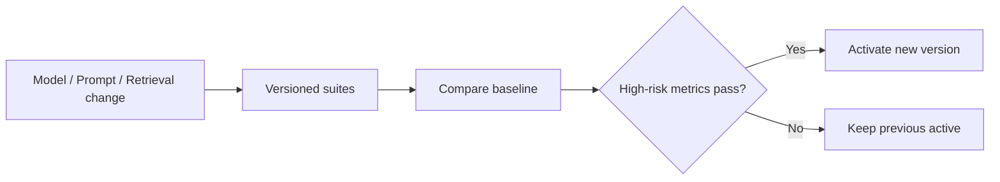

# 质量架构

本章统一安全、工具权限、可观测、审计、性能、测试和 AI 评测。它定义长期门禁，不记录某次里程碑的通过日期；具体运行命令与恢复操作见 [运行手册](../operations.md)，任务证据见 `.trellis/tasks/`。

## 1. 安全模型

### 1.1 资产与威胁

关键资产包括 Workspace 文件/附件、Git 历史、模型与认证 Secret、PostgreSQL 领域/运行数据、Approval/Write Authorization、审计、回答和 Memory。威胁来源包括恶意 Source/网页、Prompt Injection、不可靠模型、本地低权限进程、误操作和暴露的自托管入口。

| STRIDE 类别 | 示例 | 控制 |
|---|---|---|
| Spoofing | 自托管未授权访问 | Session/API Token、HTTPS、Origin/CSRF |
| Tampering | 审批后文件变化 | Proposal Revision、Change Hash、Target/Git CAS |
| Repudiation | 否认写回 | Approval、append-only Audit、Git Commit |
| Disclosure | Prompt/日志泄密 | Secret gate、最小上下文、fail-closed 脱敏 |
| DoS | 大 PDF、无界图或 Provider 滥用 | 大小、分页、timeout、budget、背压 |
| Elevation | Source/模型请求写工具 | 服务端 Capability、Workflow allowlist、一次性写授权 |

### 1.2 身份、Capability 与写授权

- 本地模式默认只绑定 loopback，但 loopback 不是身份。Web 使用 Cookie Session，并校验 CSRF Token 与 Origin；SameSite 不能替代 CSRF。
- 自托管必须使用 HTTPS、`AUTH_MODE=required`、Secure/HttpOnly/SameSite Cookie 和精确 Origin allowlist。
- 自动化使用可撤销、限 Scope、可过期 API Token，不复用 Session Cookie。Token 明文只在创建时返回一次，服务端保存不可逆摘要；不得放 URL。
- Session 在登录和敏感设置变化后轮换；登出、凭据变化和撤销立即失效。

授权分三层：

1. Session/API Token 证明身份。
2. Capability 允许发起 `READ_LOCAL`、`READ_EXTERNAL`、`WRITE_PROPOSAL`、`WRITE_KNOWLEDGE`、`GIT_WRITE`、`INDEX_MAINTENANCE`、`EVALUATION_RUN` 范围内的命令。
3. Approval Write Authorization 是短时、一次性/幂等消费的服务端凭据，绑定 Workspace、Workflow Run、Node、Proposal/Revision、Approval、Change Hash、Target Version、批准 Git HEAD 与 Expiry。

身份或高 Scope Token 不能直接获得知识/Git 写入；模型、Tool Request、Agent Framework 和客户端都不能构造、延长或扩大写授权。Atomic Begin 必须在同一 DB 事务校验并消费 `WRITE_KNOWLEDGE` 与 `GIT_WRITE`、running lease 和所有 binding；副作用点仍重新检查文件/Git CAS。

### 1.3 Secret

- Bootstrap Token 和 Review HMAC key 只进入 API；Worker/Migrate 不查询。多 API 实例的 HMAC key 必须显式一致；轮换使在途引用 fail closed。
- Managed model 主密钥只存在受保护 named volume；API/Worker/modelctl 只读，Migrate/Proxy/Web/Workspace 不可访问。
- 模型 API Key 只存在于请求瞬时明文、短生命周期 buffer 和数据库加密密文；AAD 绑定 revision、用途、schema、Provider 与规范 Endpoint。
- Secret、密文、长度、完整 Endpoint、Cookie、Authorization、DSN 和绝对 Secret path 不得进入响应、Problem、Audit、日志、Metric、Trace、URL、Browser Storage、镜像历史或配置摘要。
- UI 只显示掩码；Secret 不进入 DB 导出或发送给模型；disabled capability 对 gated 环境变量零查询。

### 1.4 文件与 Git

- 所有路径从 Stable ID 经 canonical Root、symlink/hardlink、device、owner 与 `Lstat/Open/Fstat` 检查解析；拒绝 NUL、特殊文件、Root 外目标和身份漂移。
- Safe Writeback 只处理 Workspace 内普通 Markdown；同 inode/路径别名用持久 lock + advisory lock 串行。
- temp/backup 在目标同目录随机 `O_EXCL|0600` 创建，只有当前 Execution 生成且 Hash/identity 未篡改的 locator 可以恢复或清理。
- 文件锁不能阻止恶意本地进程；rehash→rename 和断电不确定性通过最终复核、backup 与 Manual Recovery 处理，不宣称不存在。
- Git Runner 使用固定 executable、参数数组、固定 cwd、输出/timeout 上限、禁 Hook/GPG/editor/pager/external diff/textconv，清理继承 `GIT_*`。
- 允许受控 inspect/diff/raw object/tree/`commit-tree`/expected-old `update-ref`/exact trailer/revert；禁止 shell、任意 `git add/commit`、reset、checkout、switch、merge、rebase、cherry-pick、任意 push、submodule/LFS 和 history rewrite。

### 1.5 Prompt Injection、SSRF 与 Web

- System Policy 与 Source/Web/Tool Result 分角色；后者统一标记 untrusted data，不递归解释为 Tool Request。
- Tool Request 使用严格项目 Schema；Workspace、Capability、Approval、Credential、timeout、endpoint、path、command、Git args 均由服务端绑定，模型提供时拒绝或忽略。
- Web 仅允许 HTTP(S)，逐跳解析 URL/DNS/IP/redirect；阻止 loopback、private、link-local、multicast、unspecified、metadata 与保留地址。任一解析地址不公开则整跳拒绝。
- 使用本次验证的 IP snapshot，保留 Host/TLS ServerName，禁环境代理与验证后二次 DNS；限制 URL/header/body/text、重定向和总 deadline。
- 只有受控 Ollama preset 允许精确 loopback relay，不扩展成任意私网 allowlist。
- Web UI 覆盖 CSP、XSS/Markdown 清理、CSRF、Origin、上传 Content-Type 和下载 Content-Disposition。

### 1.6 数据库与模型数据

- 应用 DB 用户最小权限；所有 SQL 参数化并带 Workspace 约束；排序/operator 只能从持久 allowlist 选择固定 SQL。
- PostgreSQL 不暴露公网，备份加密。跨 Workspace/错绑 Span/不存在统一 NotFound。
- 发送给 Provider 的证据窗口最小；用户可禁止敏感 Topic 使用云模型。Full Prompt Debug 默认关闭。

### 1.7 安全失败模式

- 无法确认身份/权限/版本/外部结果 → 拒绝或人工恢复。
- Git/DB/文件不一致 → 只读；不得用 DB Chunk 覆盖用户文件。
- Citation 失效 → 不发布 Answer。
- Secret Store 不可用 → 相关模型功能 unavailable。
- Source 安全检查异常 → 隔离。
- Tool Contract/Executor/Workflow 任一不完整 → capability unavailable 或 readiness fail closed，不注册 Fake。

## 2. Tool 权限与副作用门禁

每个 Tool Contract 冻结 name/version、输入输出 Schema、Capability、side-effect、timeout、retry/idempotency、sensitive fields 和 allowed workflows。Worker 从持久 Definition/Run/Node/Attempt 解析 Workspace、allowed tools、lease owner/fence 和业务输入；Registry、Schema、binding、Capability、lease 全部通过后才调用 Executor。

### Tool Call 事实

- `workflow.tool_call` 保存稳定 owner/version、请求 Hash/bytes/脱敏摘要、状态、结果/副作用引用和错误；不保存 raw Prompt、参数/输出、正文、Credential、Cookie、绝对路径或 stderr。
- 状态为 `STARTED`、`SUCCEEDED`、`FAILED`、`REFUSED`、`UNKNOWN`。副作用前写 STARTED；可证明 checkpoint 后写 SUCCEEDED；不确定只能 UNKNOWN/Manual Recovery。
- Domain write/unknown side-effect 要求 idempotency key、执行前查询、成功后原子 receipt。重复调用返回既有结果；receipt 缺失不能重新发远程调用后冒充 replay。
- Safe Writeback 的 Apply/Git 只是固定逻辑 Tool Audit identity，不新增第二文件/Git Executor。发现外部结果但没有历史 STARTED 时禁止补造审计。

### Threat cases

| 场景 | 预期防护 |
|---|---|
| PDF 要求删除文件 | Source 不参与权限裁决 |
| 模型读取 `/etc/passwd` | Stable ID + exact Workspace Root |
| URL 指向 metadata/private IP | 逐跳 SSRF 拒绝 |
| 重复 Git Tool Call | Proposal/Execution/Commit mapping 幂等 |
| Approval 后目标变化 | Change Hash + Target/Git CAS |
| Tool Result 包含指令 | 作为 untrusted data，不提升消息角色 |
| 已登录/高 Scope Token 直接写 | 仍要求 Proposal/Approval/一次性写授权 |
| Agent Framework 伪造 Context | 服务端忽略并从持久 Run 重建 |

## 3. 可观测性与审计

### 3.1 Correlation

日志与 Trace Context 可包含 `request_id`、`trace_id`、`workspace_id`、`workflow_run_id`、`node_run_id`、`proposal_id`、`tool_call_id`、`document_id`、`attempt_no`、`dispatch_no`、`retry_no`、`river_job_id`。空的子 Context 不清除父值；高基数 ID 永不进入 Metric label。

### 3.2 Logs

- 使用项目封装的 slog JSON Handler，在写出前递归 fail-closed 脱敏；调用方记录稳定 code/kind/count/hash，不直接序列化未知对象或 raw error。
- DEBUG 用于开发诊断，INFO 用于状态变化，WARN 用于降级/重试/低置信，ERROR 用于节点/依赖失败。
- 禁止 API Key、Authorization、Cookie、Token、Password、DSN、数据库 URL、完整 Prompt/Source/Answer、Git stderr、lock token、绝对路径和不受控错误文本。
- Credential marker 优先于 `_id/_hash/_status` 后缀；`[]byte` 只输出长度。日志失败不能改变业务结果。

### 3.3 Trace

- API request → Application command → Workflow → Retrieval/Model/Tool/Writeback 使用 OTel span；属性只用稳定 operation、model、prompt/index version、retry、degraded。
- 异步只传播严格 W3C `traceparent`；不传播 baggage、正文、Credential、路径或任意 metadata。River 保留字段不暴露给 Application。
- 只有 metadata 合法、Claim 成功且非 stale delivery 后创建 Worker consume child span。`/metrics`、`/livez`、`/readyz` 不创建 request span。

### 3.4 Metrics 与 Telemetry

- API/Worker 各自使用独立 Prometheus Registry，不使用全局 registry；label 名和值来自固定项目 registry，拒绝 UUID、Secret、高基数字段和动态 collector。
- 当前运行时指标聚焦 River queue/worker、Workflow node duration/result/retry/manual recovery/lease/heartbeat、duplicate delivery 和 shutdown；业务事务提交且非 idempotent replay 后才发射。
- 产品级 API/Retrieval/Model/Data 指标是扩展目标；未注册的指标不能写成当前 `/metrics` 事实。
- `disabled`：零 OTLP exporter/network，但 SDK context 与 Prometheus 可用；`optional`：探针失败后 degraded；`required`：startup export/flush 失败在 listener/ready 前 fail fast。
- 外部 Prometheus/Grafana/Collector 可选；本项目 Metrics 不保存跨重启历史。
- Eino API/Worker 的 OTLP 证据必须与普通服务指标分开标识。六项 live gate 与 host-relay 外部 Chat/本地 Ollama
  Embedding 的浏览器终态已作为发布证据通过；容器直连外部 HTTPS 网络路径及真实连续 7 天、至少 100 个合格终态的
  稳定观察尚未完成，不能标记为 PASS。观察操作见 [Eino 稳定发布观察 Runbook](runbooks/eino-stable-observation.md)。

### 3.5 Append-only Audit

必须审计 Auth/Session/API Token、Approval、Tool Authorization、File/Git、Settings/Secret、Memory、Rollback 和 Security Block。

- 事件使用版本化 canonical JSON、递归脱敏、稳定 Actor/Outcome/error code、业务生成的 ID/occurred_at/idempotency key。
- Repository 只追加，不提供 Update/Delete。相同 key+binding replay 返回既有事件；同 key 不同 binding 返回冲突。
- 全局事件与 Workspace 事件的空值并发语义显式处理；默认查询只能读一个 Workspace，跨 Workspace 运维需要独立授权。
- 列表按 `(occurred_at,id)` keyset；读到 Secret、非法 JSON 或 binding 漂移时 fail closed，不把污染数据返回。
- `workflow.tool_call` 是受限执行事实，不等于通用 Audit；两者不能互相冒充。

用户时间线只显示业务节点、检索摘要、Tool 名称、Proposal、Approval、Commit、错误和恢复，不展示模型私有思维链。

## 4. 性能与容量

### 4.1 基线与预算

| 对象 | 目标规模 |
|---|---:|
| Document | 10,000 |
| Chunk | 500,000 |
| Claim | 100,000 |
| Relation | 500,000 |
| Review Card | 50,000 |
| 并发用户 | 1 |
| Worker | 1–4 |

| 操作 | P95 预算 |
|---|---:|
| 普通 API Query / Workflow 状态 | 500 ms |
| Proposal 列表 | 1 s |
| Hybrid Retrieval 本地阶段 | 2 s |
| 局部图谱一跳 | 1.5 s |
| Collection 首屏 | 2 s |

模型生成延迟单独统计，不用平均值掩盖本地检索或数据库回归。

### 4.2 设计约束

- API 与 Worker 使用独立 DB pool；模型/远程调用期间不持有 DB transaction；Worker 长任务分页并及时释放连接。
- Embedding、Index upsert、Relation Evidence、Health detector 和 Audit/Outbox 使用批量；禁止循环远程 Embedding、逐节点 Graph SQL、N+1 Evidence 和逐条写入。
- 队列按类型限制并发；Provider rate limit、批次大小、Health 低优先级和单一全量 Reindex 提供背压。
- Graph 是 canonical Relation 的直接只读投影，不双写 Graph 表。Neighborhood 批量 frontier，Path 有界双向 BFS，Evidence 按需分页；timeout 不返回伪 partial path。
- Cache 可以按 Content Hash 缓存 Embedding、Graph cluster/Collection count；不得缓存 Approval、Write Authorization 或文件 Version Token。
- 大文件流式 Hash/解析，Chunk 批量，Diff 分段，Artifact 分章。

### 4.3 可审计容量门禁

`make benchmark-capacity` 默认快速模式只生成确定性 manifest/run 产物，不写 50 万 fixture。完整模式必须使用 disposable PostgreSQL、显式 superuser DSN 和 `ZHIXU_CAPACITY_FULL=1`，验证：

- 混合 Graph profile：20,000 Topic、100,000 Claim、500,000 Relation/Evidence，有界 statement count、P95 与 EXPLAIN。
- Retrieval profile：500,000 canonical Chunk、FTS/Active Index、HNSW/IVFFlat recall、P95 与 EXPLAIN。
- 统一 seed、Go/OS/Arch、内存、DB 环境、P50/P95/Max、阈值和清理 marker；产物权限受控。

合成 `requestAnimationFrame` 数据只能诊断调度，不能替代真实 Graph render/layout/interaction FPS；每项容量门禁必须由对应的可审计产物证明。容量决策见 [ADR-0016](adr/0016-capacity-performance-baseline.md)。

### 4.4 扩容触发

- pgvector 经正确索引、过滤和查询调优仍无法满足基线，或向量规模/并发显著超出基线，才评估独立向量库。
- 多跳图成为核心且 PostgreSQL 计划/维护被证明确认瓶颈，才评估图数据库。
- DB queue/cache 被 profile 证明瓶颈且需要高频临时协调，才评估 Redis。
- 模块边界稳定并有独立扩缩/部署需求，才评估微服务。

## 5. 测试策略

### 5.1 测试金字塔与关键 seam

```text
Unit / domain state machine
  -> Adapter Contract
     -> PostgreSQL / Filesystem / Git integration
        -> Workflow fault injection
           -> HTTP/frontend integration
              -> deterministic E2E + AI evaluation + release drills
```

最高层验收围绕知识变更闭环、文章优化、RAG、Artifact、Graph/Health、Collection/Review/Interview（含 Export）组织；外围模块必须直接支撑这些 seam。

### 5.2 必测类别

- Domain：状态转移、Invariant、Idempotency、Version Conflict、Applicability、Relation 端点兼容和 Error classification。
- Adapter Contract：timeout/cancel、retryability、batch、resource cleanup、disabled/unavailable/degraded 和 Fake parity。
- PostgreSQL：migration、pgvector/FTS、约束、SKIP LOCKED/lease、Outbox、并发幂等、Evidence Workspace 隔离和 EXPLAIN。
- Filesystem/Git：atomic write、并发用户编辑、symlink/hardlink escape、dirty/detached、Commit response-loss、reverse commit 和 cleanup ownership。
- Workflow fault：Node commit 前后 crash、文件/Git checkpoint、duplicate delivery、lease expiry、Human double submit、cancel 各节点、compensation/manual recovery。
- API/SSE/frontend：strict decode、Problem、cursor、Workspace A/B、auth/CSRF/token、SSE reconnect/invalidation、Diff、Graph fallback、keyboard/a11y 和真实浏览器。
- Security：Path Traversal、SSRF redirect/rebinding、Prompt Injection corpus、XSS、CSRF、SQL injection、unauthorized write、Secret leak 和 Audit redaction。

E2E 使用固定 Fixture Workspace 与 Fake Model 保证确定性；真实模型质量在独立 Eval 中运行。两者不能互相替代。

## 6. AI 评测

### RAG

- 数据集保存 Question、Scope、Relevant Source Span、Conflict 和 Expected Refusal。
- 指标包含 Recall@K、MRR/NDCG、Citation Precision/Coverage、Faithfulness、Conflict Disclosure 和 Appropriate Refusal。
- Citation/Faithfulness 先由确定性安全测试 fail closed；Semantic Support 使用独立 Review Schema 与版本化 Gold Set。无真实 Provider 只能标记 SKIP。

### Relation、Article、Graph、Artifact 与 Review

- Relation：五分类 Precision/Recall/F1、Conflict→Duplicate 高风险错误、Evidence Support、Low Confidence；模型评测不能替代端点、对称去重、Provenance、Conflict 原子性与 Applicability 测试。
- Article：Meaning/Fact/Code/Protected Span 保持、Unsupported Addition、结构与语言改进。
- Graph/Semantic Link：Relation accuracy、Candidate Precision@K/Recall、ignored reappearance、Path correctness。
- Artifact：Coverage、Citation、Conflict、GAP、重复与大纲/章节一致性。
- Review/Interview：Answerability、Faithfulness、Difficulty、Duplicate Card、Score Agreement、Gap detection 与 coverage report。

每次 Eval Run 冻结 Model Adapter/Model、Prompt、Schema、Review Model、Index/Embedding/Rerank、Workflow Definition 与 Dataset version；运行中默认值变化不能改写历史。

### 回归门禁



生产反馈只有脱敏、人工标注后才能进入 Gold Set；测试数据不得含真实 Secret。

## 7. 发布 Definition of Done

- 主路径、异常、恢复和取消路径均有证据。
- Unit、Contract、受影响 Integration、Migration、Security negative、Fault Injection 和浏览器闭环通过。
- AI 行为变更有冻结版本的 Eval 与基线对比；高风险指标不退化。
- 容量变更有确定性数据集、重复采样、P95/EXPLAIN 与受控产物。
- 日志/Trace/Metrics/Audit 完成脱敏、关联和高基数审查。
- Backup/Restore、Consistency Recovery、Index switch 和 Worker crash 按风险执行演练。
- 文档与权威契约更新，无未说明的降级、Fake Success 或第二事实源。
