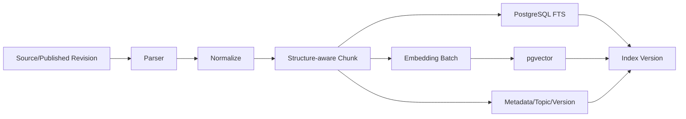
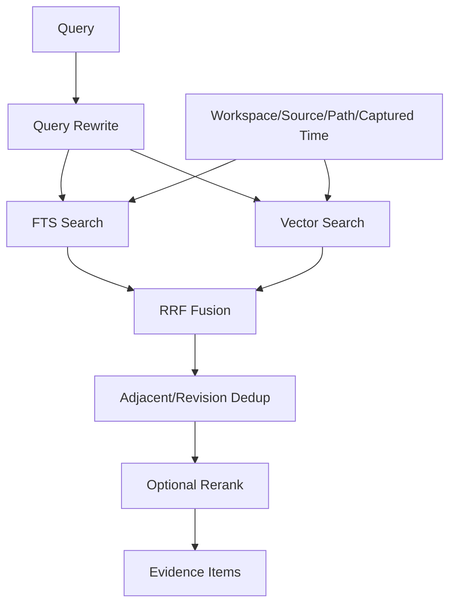
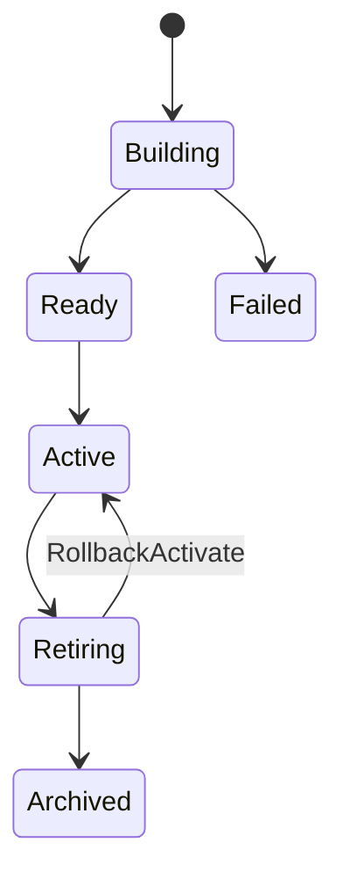

# 检索与索引架构

## 1. 目标

为搜索、RAG、关系分析、图谱候选、Artifact 和 Review 提供统一证据检索。

## 2. 检索原则

- 证据优先于生成。
- 默认只检索最新批准 Revision。
- 全文和向量互补。
- 过滤在检索阶段统一生效。
- 返回原始分数和处理阶段。
- 降级必须显式。

## 3. 索引流水线



## 4. 分块

优先级：

1. 标题层级。
2. 段落完整。
3. 代码块、表格、引用完整。
4. Token 上限。

Chunk 必须带：

- Parse Projection ID。
- Heading Path。
- Source Span ID。
- Content Hash。
- Parser/Chunk Strategy Version。
- Byte/Rune Count。
- Status。

这里的 Chunk 指 Ingestion 生成的 canonical Chunk。Retrieval 不重新定义正文、Source Span 或解析状态，只建立引用 `chunk_id` 的 FTS、Embedding 和 Index Version 投影。

如果单个代码块或表格超过结构策略软上限，结构完整性优先：保留一个 `atomic_oversized` Chunk 并产生 `ATOMIC_BLOCK_OVERSIZED` Warning。Canonical Chunk 只记录 byte/rune count；具体模型的 Token Count 在 Retrieval Projection 中由版本化 Tokenizer 计算。超过 Embedding 上下文时 FTS 继续建立，vector_status=`skipped_oversized`，Index Version 保持 `status=active` 并设置 `degraded_capabilities=["vector"]`，API 显式展示，禁止静默拆块或伪装 Embedding 成功。

禁止：

- 跨 Revision 合并 Chunk。
- 将代码块拆成无上下文碎片。
- 丢失引用位置。

## 5. Embedding

- 通过项目自有 `Embedder` Port 批量请求；正式 Adapter 为 OpenAI-Compatible `/v1/embeddings`
  与 Ollama `/api/embed`，不把供应商类型带入领域层。
- Contract 冻结 Provider、Adapter/Version、Model、Dimensions、Normalization、Distance、Endpoint
  identity、条数上限、单输入字节上限和单批累计字节上限；Config Hash 不包含 Credential。
- 对 Workspace + Embedding Version + Content Hash 去重缓存；缓存不保存正文，cache 写入和
  Projection 终态在同一事务中完成。
- 新模型建立新 Index Version。
- 新索引激活前旧索引继续服务。
- Provider 数量、顺序、维度、NaN/Inf、零范数或模型绑定不符时 fail closed，不生成伪向量。

## 6. 混合检索



## 7. Query Rewrite

输入：

- 用户问题。
- Conversation 上下文。
- Scope。

输出：

- 1..N 个单概念查询。
- 可选关键词。
- 时间条件。

限制：

- Rewrite 不扩大用户授权范围。
- 不把模型推断的文件名当作硬过滤。
- 结果必须保存到 Workflow Audit。

## 8. 全文检索

- 中文采用合适分词/配置；初期可结合 trigram 和可插拔 tokenizer。
- 标题、Heading Path、正文设置不同权重。
- 精确术语、代码符号和类名优先全文检索。

## 9. 向量检索

- 使用 cosine、inner product 或 euclidean，依据持久 Embedding Version 的白名单枚举选择固定 SQL operator。
- 过滤 workspace_id、status、revision。
- ANN 参数由压测确定。
- 低数据量允许 exact scan 作为基线。
- API wire 返回的是当前距离度量的原始 `distance`，不是跨模型可比较的 similarity；客户端必须保留
  `embedding_version_id` 与距离语义，不能只看一个无上下文的数值。

## 10. RRF 融合

使用排名而非直接混合不可比分数：

```text
score(d) = Σ 1 / (k + rank_i(d))
```

k 通过评测选择并版本化；v1 安全范围为 `1..500`，计算前提升到 `int64/float64`，禁止整数溢出。

## 11. 去重

- 同 Revision 相邻 Chunk 合并证据窗口。
- 同 Document 历史 Revision 只保留当前批准版本。
- 原始 Source 与正式 Document 默认不同时召回。
- 多个 Source 支持同一 Claim 时允许分别保留来源。

## 12. Rerank

输入：

- Query。
- Top N 候选。

输出：

- 重排分数。
- 模型版本。

失败：

- 返回 RRF 结果。
- 标记 degraded: rerank_unavailable。

## 13. 证据项

每个 Evidence Item：

- Chunk ID。
- Source、Source Version 和 Parse Projection。
- Source Span 行/字节范围与受控相对路径。
- Snippet。
- Content Hash、Heading Path、各阶段原始 rank/score。
- Rerank Score。
- Index Version。
- 稳定有界的多 Source provenance 与显式截断标志。

M6-C Evidence v1 只返回仓库当前真实存在的 Source/SourceVersion/Chunk/Span 字段；Document、
Revision、Topic、Conflict 等知识模型字段只能在对应领域模型落地后扩展，不能提前返回空壳字段。

## 14. 版本与切换



激活流程：

1. 构建新版本。
2. 完整性校验。
3. 运行检索评测。
4. 原子更新 active_index_version。
5. 保留旧版本观察窗口。

M6-A 已锁定以下实现契约：

- `embedding_version`、`index_version`、`index_manifest_chunk`、`chunk_projection`、
  `index_activation` 是 Retrieval 数据库事实；Canonical Chunk 正文仍只属于 Ingestion。
- Begin Index 在同一事务冻结 Manifest，Application 按稳定排序重新计算 SHA-256，数据库
  冻结 Hash、Count 与逐 Chunk 版本绑定。
- Lexical Builder 通过单条 `INSERT ... SELECT` 从 Manifest 生成 `simple` tsvector；向量批次
  只能更新既有 lexical-ready 行，不能接收或覆盖 `search_vector`。
- M6-A 的 `simple` Tokenizer 将 PostgreSQL `simple` tsvector 的 lexeme 数作为确定性
  `token_count` 基线；它不是外部 Embedding 模型的计费 Token。更换真实 Tokenizer 必须创建
  新 Tokenizer/Index Version，不能在旧 Projection 中改写计数。
- 正常激活和回滚激活都追加 Activation 记录，并在一个 PostgreSQL 事务中切换状态；通用
  Transition 不能进入 Active。
- 当前向量列使用可变维度 `vector`，每个 Embedding Version 校验固定维度。M6-A 不建立
  跨维度全局 ANN 索引；先保留 exact scan 基线，待真实模型和容量评测后按固定维度建立
  部分表达式 HNSW 索引。

M6-B 已锁定以下 Reindex 契约：

- `retrieval.revision.reindex_requested` 由事务型 Dispatcher 转为独立 `reindex_delivery` 与
  三字段 River Job；`published_at` 只表示派发成功，业务成功只由 Delivery `succeeded` 表示。
- Consumer 只读取 payload 指定 Git Commit 的 Blob；工作树后续漂移不参与捕获。不可变
  Content Artifact、SourceVersion、Ingestion Attempt 与 Parse Projection 都按稳定幂等键恢复。
- `index_manifest_source` 冻结 included/excluded Source；Snapshot 在 Workspace advisory lock
  与 repeatable-read 事务中分页计算 Hash/Count、分批物化 Source/Chunk Manifest。处理契约
  变化或 legacy Active 没有 Source Manifest 时执行有界全量重建。
- M6-B 只构建真实 FTS-only Index，并显式保存 `degraded_capabilities=["vector"]`；不写伪向量，
  不宣称 Hybrid Search 已完成。
- Capture、Ingestion、Snapshot、Regression checkpoint 与 Ready/Completion response-loss 均从
  PostgreSQL 事实恢复。确定性业务失败归约到 failed/manual_recovery；事务结果未知才交同一
  River dispatch 重投。
- `CompleteReindexTx` 以固定锁序在一个事务内追加 Activation、切换唯一 Active，并完成
  Delivery、Writeback Execution 与 Proposal。结构回归失败保留旧 Active 和 Git Commit，
  不自动反向 Commit。

M6-C 已锁定以下 Embedding 与 Hybrid Search 契约：

- `00016_embedding_hybrid_search.sql` 新增 Workspace-scoped immutable `embedding_cache`，扩展
  `SNAPSHOT_STRUCTURE_V2` Regression/Completion；有 cache、V2 Delivery 或 Hybrid Index 数据时
  Down 以 SQLSTATE `55000` 拒绝。
- Vector Builder 先批量读取 pending/cache metadata，再按 `MaxBatchInputBytes` 一次读取有界正文；
  cache miss 只触发一次 Provider batch。cache 使用单条 `INSERT ... SELECT FROM unnest(...)`，
  Projection 使用单条 `UPDATE ... FROM unnest(...)`，随后批量 readback 精确比较 float32。
- Hybrid Processor 执行 Lexical → bounded Vector batches → V2 Regression → Ready。skipped/failed
  从 Projection 终态推导 `degraded_capabilities=["vector"]`，V2 Regression 与 Ready 共用同一规则。
- Worker 配置变化后，历史 Hybrid 若已无 pending vector，可在不调用旧 Provider 的情况下完成
  Regression；仍有 pending 时必须恢复匹配的 Embedding Version 配置，并返回明确依赖不可用，
  不按当前默认配置改写历史任务。
- Search 只读 Workspace 当前 Active Index；Keyword 使用 `simple` FTS + trigram，Semantic 使用
  exact pgvector scan，Hybrid 并行双路后执行 strict RRF v1、相邻 Chunk 去重和可选 Rerank。
  trigram `%` 在短事务内固定 `pg_trgm.similarity_threshold=0.3`，不继承连接级可变 GUC。
  FTS-only Hybrid 显式退化为 Keyword；FTS-only Semantic 返回 capability unavailable；真实零命中
  返回空 items。
- 当前没有已批准的通用生产 Rerank 协议，只冻结 Port 与 exact output validator。nil 或 Retryable
  故障保留 RRF 顺序并显式 degraded；缺失、重复或额外输出 fail closed。
- 真实 River fault smoke 已覆盖 Vector commit response-loss、V2 Regression、唯一 Active/Completion
  和最小 Hybrid Search；Provider Key、正文、DSN 与完整 Endpoint 不进入 River payload、日志或错误。

M6-D 已锁定以下 Search API 与可打开 Evidence 契约：

- `POST /api/v1/search` 只接受 Workspace、Query、`keyword|semantic|hybrid`、Source/SourceVersion/
  path/captured-time 统一过滤、opaque cursor 与 `limit=1..100`；默认 Hybrid、默认页大小 20。
  Handler 只做严格 wire 解码/映射，Search/RRF/过滤规范化仍由 Domain/Application 拥有。
- Search 实际请求固定 top-100 有界窗口。Cursor v1 使用 API 进程内随机 HMAC-SHA256 密钥，绑定
  canonical request、页大小、Active Index Version、完整有序 SearchResult Hash 和下一 offset；
  篡改、跨请求或进程重启返回 invalid，索引/结果变化返回 stale，最后一页不返回伪 cursor。
- Response 保留 requested/effective mode、Index/Embedding Version、持久 Index degradation、单次 Query
  degradation、完整 Evidence stage；Vector stage wire 字段为 `distance`，不改写成 similarity。
- 两个 Workspace-scoped 只读资源打开 provenance：Source Version GET 返回受控公开元数据；Span GET
  验证 Source Version、Content Artifact、Parse Projection 与 Span 全绑定，从不可变 Artifact 复核全文
  Hash/大小和 excerpt Hash 后读取 `[start_byte,end_byte)`，最多返回 4 KiB UTF-8 excerpt。不得从当前
  工作树相对路径读取可能漂移的正文。
- API 与 Worker 通过同一 `NewConfiguredEmbedder(config.Config)` Factory 构造 Provider Adapter，避免
  Provider/Model/Dimensions/Config Hash 出现第二事实源。Embedding disabled 时 Keyword 仍可用，Hybrid
  显式退化到 Keyword，Semantic 返回 `RETRIEVAL_SEMANTIC_UNAVAILABLE`。
- M6-D 只提供 Workspace 数据隔离；正式 Auth/Session/Token/CSRF/Capability 归 M10，完成前部署保持
  loopback。exact vector scan 与生产 SQL `EXPLAIN` 只作为正确性基线，50 万容量 ANN/P95 归 M10。
- 真实 PostgreSQL HTTP、River Completion 后经 Router Search/Evidence、以及 disposable Workspace 的
  Compose API smoke 是归档门禁；M6-D 已通过一轮实际运行，后续发布仍需重跑，不能用单元 Fake 或
  readiness 替代，也不能据此推断最终全仓门禁已经完成。

## 15. 增量索引

触发：

- Revision Published。
- Document Archived/Deleted。
- Relation/Topic 变化。
- Parser/Embedding 变化。

原则：

- 内容变化只重建受影响 Chunk。
- Topic/Relation 变化更新元数据投影。
- 删除使用状态，不立即物理移除。

## 16. 搜索模式

- Hybrid：默认。
- Keyword：技术标识符和精确查找。
- Semantic：概念探索。
- Graph-assisted：先 Topic/Relation 再检索 Evidence。

## 17. 性能预算

- FTS 与 Vector 并行。
- 候选数有上限。
- Rerank 只处理融合 Top N。
- Evidence Context 有 Token Budget。
- 大 Collection 先过滤再向量检索。
- 当前 exact vector scan 只用于低数据量与查询计划基线；HNSW/IVFFlat、参数选择、500,000 Chunk
  容量数据和 P95 达标证据必须在 M10 压测后冻结，M6-D 不提前宣称完成。

## 18. 评测

- Recall@K。
- MRR。
- NDCG。
- Citation Coverage。
- Duplicate Rate。
- Filter Correctness。

## 19. 故障

- Embedding 不可用：Keyword 可用。
- FTS-only Active 的 Semantic 明确不可用；Hybrid 返回 Keyword 结果并标记 vector/rerank degraded。
- Rerank 不可用：Hybrid degraded。
- 新索引失败：旧 Active 继续。
- Reindex 结构回归失败：Git Commit 保留，Proposal/Execution 保持 verifying，按 Delivery
  错误分类重试或人工恢复；任何反向 Commit 必须经过新的 Proposal/Approval。
- Active 索引损坏：切回上一 Ready。
- Source Span 失效：证据不用于回答并创建 Health Issue。

## 20. 独立向量库触发条件

同时满足：

- pgvector 已通过索引和 SQL 调优。
- 容量或 QPS 超过目标。
- P95 无法满足。
- 专用向量库收益覆盖双写与运维成本。

迁移只影响 Retrieval 内部 Adapter。
