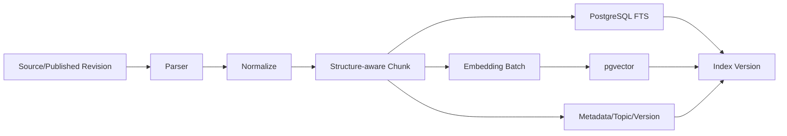
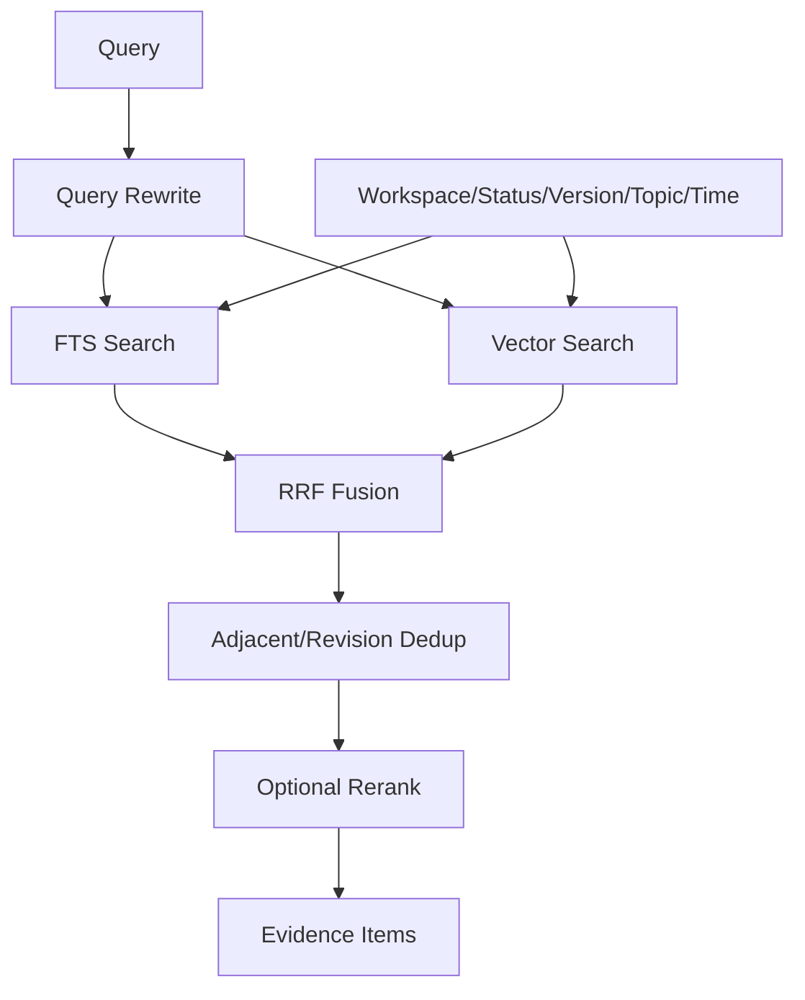
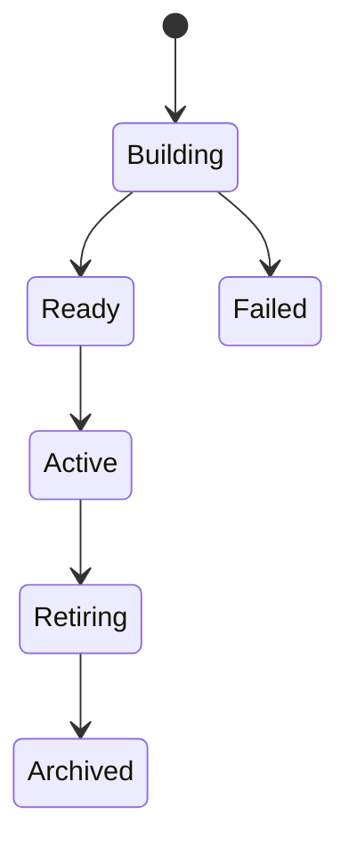

# 检索与索引架构

## 1. 目标

为搜索、RAG、关系分析、图谱候选、Artifact 和 Review 提供统一证据检索。

## 2. 检索原则

- 证据优先于生成。
- 默认只检索最新批准 Revision。
- 全文和向量互补。
- 过滤在检索阶段统一生效。
- 返回原始分数和处理阶段。
- 降级必须显式。

## 3. 索引流水线



## 4. 分块

优先级：

1. 标题层级。
2. 段落完整。
3. 代码块、表格、引用完整。
4. Token 上限。

Chunk 必须带：

- Revision ID。
- Heading Path。
- Source Span。
- Content Hash。
- Parser/Chunk Version。
- Status。

禁止：

- 跨 Revision 合并 Chunk。
- 将代码块拆成无上下文碎片。
- 丢失引用位置。

## 5. Embedding

- 批量请求。
- 记录 Model、Dimensions、Config Hash。
- 对 Content Hash 去重缓存。
- 新模型建立新 Index Version。
- 新索引激活前旧索引继续服务。

## 6. 混合检索



## 7. Query Rewrite

输入：

- 用户问题。
- Conversation 上下文。
- Scope。

输出：

- 1..N 个单概念查询。
- 可选关键词。
- 时间条件。

限制：

- Rewrite 不扩大用户授权范围。
- 不把模型推断的文件名当作硬过滤。
- 结果必须保存到 Workflow Audit。

## 8. 全文检索

- 中文采用合适分词/配置；初期可结合 trigram 和可插拔 tokenizer。
- 标题、Heading Path、正文设置不同权重。
- 精确术语、代码符号和类名优先全文检索。

## 9. 向量检索

- 使用 cosine 或 inner product，依据 Embedding 模型归一化约定。
- 过滤 workspace_id、status、revision。
- ANN 参数由压测确定。
- 低数据量允许 exact scan 作为基线。

## 10. RRF 融合

使用排名而非直接混合不可比分数：

```text
score(d) = Σ 1 / (k + rank_i(d))
```

k 通过评测选择并版本化。

## 11. 去重

- 同 Revision 相邻 Chunk 合并证据窗口。
- 同 Document 历史 Revision 只保留当前批准版本。
- 原始 Source 与正式 Document 默认不同时召回。
- 多个 Source 支持同一 Claim 时允许分别保留来源。

## 12. Rerank

输入：

- Query。
- Top N 候选。

输出：

- 重排分数。
- 模型版本。

失败：

- 返回 RRF 结果。
- 标记 degraded: rerank_unavailable。

## 13. 证据项

每个 Evidence Item：

- Chunk ID。
- Document/Revision。
- Source Span。
- Snippet。
- Retrieval Scores。
- Rerank Score。
- Status。
- Conflict Flags。
- Index Version。

## 14. 版本与切换



激活流程：

1. 构建新版本。
2. 完整性校验。
3. 运行检索评测。
4. 原子更新 active_index_version。
5. 保留旧版本观察窗口。

## 15. 增量索引

触发：

- Revision Published。
- Document Archived/Deleted。
- Relation/Topic 变化。
- Parser/Embedding 变化。

原则：

- 内容变化只重建受影响 Chunk。
- Topic/Relation 变化更新元数据投影。
- 删除使用状态，不立即物理移除。

## 16. 搜索模式

- Hybrid：默认。
- Keyword：技术标识符和精确查找。
- Semantic：概念探索。
- Graph-assisted：先 Topic/Relation 再检索 Evidence。

## 17. 性能预算

- FTS 与 Vector 并行。
- 候选数有上限。
- Rerank 只处理融合 Top N。
- Evidence Context 有 Token Budget。
- 大 Collection 先过滤再向量检索。

## 18. 评测

- Recall@K。
- MRR。
- NDCG。
- Citation Coverage。
- Duplicate Rate。
- Filter Correctness。

## 19. 故障

- Embedding 不可用：Keyword 可用。
- Rerank 不可用：Hybrid degraded。
- 新索引失败：旧 Active 继续。
- Active 索引损坏：切回上一 Ready。
- Source Span 失效：证据不用于回答并创建 Health Issue。

## 20. 独立向量库触发条件

同时满足：

- pgvector 已通过索引和 SQL 调优。
- 容量或 QPS 超过目标。
- P95 无法满足。
- 专用向量库收益覆盖双写与运维成本。

迁移只影响 Retrieval 内部 Adapter。

