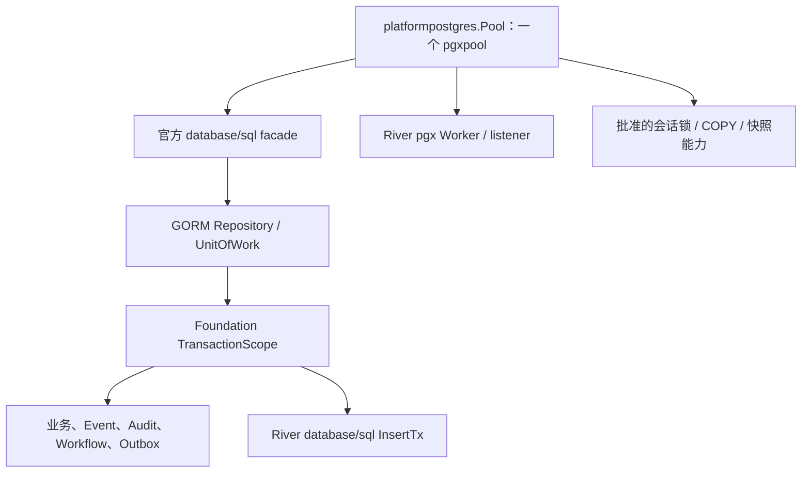

# GORM 持久化发布与回滚

## 当前代码与适用范围

API、Worker、Workspace CLI/Probe、Model CLI 和 Local Model Runtime 的业务 Repository 已统一为 GORM。
`cmd/migrate` 继续由 Atlas/River 管理 Schema，credential-init 保留经过独立安全审查的管理角色入口。
最终代码 [cb935655](https://github.com/CodeZen-Lizhi/zhixu/commit/cb93565561498674cda1dc1230fed587fba66075) 已提交并推送到 `origin/dev`，TODO 10 父任务和 30 个子任务均已完成并归档。
TODO 10 本身未修改 Atlas Schema、迁移 checksum 或业务协议。后续 M9 历史升级修复追加了 `00093` 兼容迁移，
需要使用包含该文件及兼容 runner 的版本；该兼容修复保持永久 Schema 与 `00001`–`00092` 原文及校验和不变。2026-09-09 已完成本机受控部署，原 Goose 81 数据库经正式入口升级至 Atlas 00099，原业务 ID、知识 Root 与密钥保留；实际镜像、HTTP/页面与模型配置限制见 [统一交付记录](../../../.trellis/tasks/07-16-product-delivery/research/final-integration-2026-09-09.md)。

构造和错误契约见 [GORM 持久化规范](../../../.trellis/spec/backend/gorm-persistence.md)。
完整 owner/入口/验收映射见 [TODO 10 收口记录](../../../.trellis/tasks/archive/2026-09/08-19-gorm-composition-pgx-convergence/research/final-acceptance.md)。

## 连接与原子性

- 所有 scoped 协作者由同一 Pool 构造；UoW 唯一拥有 commit/rollback。River 插入借用相同 `*sql.Tx`。
- managed 模式必须接 Model Settings fence；static 模式显式接 static fence。构造失败不能降级成无闸门。
- Pool 指标继续来自同一物理连接池；wrapper 不增加第二份物理连接预算。目标环境连接容量仍需按实际配置验证。
- 停机先停止接单与消费者，再取消并等待模型 controller/coordinator；controller 等 heartbeat 后关闭 Host，最后释放 Pool。
  清理复用同一关闭 deadline。超时必须报告失败，不能把仍使用数据库的后台工作当作已停止。
- HTTP/River/GitSync 未确认停止时保留模型后台、Workspace root anchor、Host 与 Pool，进程以失败退出。
  Worker 启动回滚显式返回消费者是否停止；普通 rollback 错误不能被当作清理成功。
  Workspace Lease 等待 heartbeat 也受 caller deadline 限制；持久 owner 释放失败时保留 root anchor。

## pgx 例外登记

精确可执行清单在 [persistencecheck](../../../cmd/persistencecheck/main.go)，新增例外必须同时补 owner、理由和既有验证入口。

| 边界 | 保留理由 | 验证依据 |
| --- | --- | --- |
| Platform postgres | 唯一物理池、vector 类型注册、GORM facade、驱动错误投影 | 平台单池、事务、取消、River 与关闭 integration |
| Platform migration / River migrator | Atlas 与 River Schema 各自持有 history | migration 测试；M9 带数据升级兼容与验证见下文 |
| Platform gitoperation | 绑定专用连接的 advisory lock | 原有获取、取消、释放和生命周期测试 |
| River client / queue metrics | 官方 pgx Worker/listener 与队列状态 | Workflow/Worker 真实 River 用例 |
| Retrieval 四个 native 文件 | Manifest COPY、快照物化和 Source Refresh 会话锁 | Manifest/Activation、刷新锁、快照、重放 integration |
| Platform testdb / Graph testfixture | 隔离测试库与显式容量种子 | 工厂/Graph 既有测试；不向业务仓储开放 pgx |
| credential-init | 单次受控管理员操作与最小角色检查 | credential 实库 + 独立 SQL/security review；PUBLIC ops ACL 纳入检查 |

## 发布顺序

以下为受控升级操作要求。2026-09-09 本机已执行备份、同版构建、前向迁移及最小部署核验；具体通过范围见上述交付记录，目标容量、故障矩阵和现场模型闭环未据此标为通过：

1. 固定审查通过的代码版本和完整依赖闭包，同批构建 API、Worker、CLI；禁止只提交某个 scoped 接口而遗漏调用方。
2. 核对目标 Atlas/River 版本、数据库备份与恢复能力。低于 82 的历史库使用包含 `00093` 和兼容 runner 的构建；
   已完成 82 的库正常记录 `00093`，不重新回填业务数据。
3. 停止新请求和旧 Worker 领取，等待现有业务在安全检查点排空。按现有生命周期关闭后台任务与连接。
4. 通过同一构建的 `cmd/migrate` / 镜像内 `zhixu-migrate` 执行 Atlas/River 升级。兼容回填持有表锁，需要停写窗口；
   advisory lock 只协调迁移入口，不代替排空业务写入。任何迁移失败时保持服务停止，按下节核对失败点后重试。
5. 以同一版本启用新 API/Worker/CLI，检查 readiness、队列一致性、同池指标和 Model Settings admission。
6. 在目标环境复核权限/Workspace 隔离、Proposal/审批、Workflow/River、检索、可恢复写回与取消。
   本地确定性 Commit response-loss 用例不替代真实网络故障或目标环境观察。

## 回滚边界

GORM 切换未改变 Schema、事件/API wire、持久状态或幂等键。M9 兼容修复保留原 `00082` 的永久 Schema 和历史回填结果。
代码回滚恢复对应已发布版本的 Adapter、Foundation/Scoped Port
及全部直接调用方；API、Worker、CLI 必须保持兼容版本组合。业务模块之间有 scoped 依赖时按依赖闭包恢复，
不能只恢复一个 `NewRepository` 调用，不能增加运行时双仓储 selector 或双写。

回退前同样停止接单并排空消费者。保留 Proposal/Revision/Receipt、Job、Audit/Event、Git 与用户文件，不执行 Down、
删除数据或改写历史迁移。若已提交的业务事实在旧版本缺少读取能力，应采用修复后的兼容版本，而不是删除事实。

已有事务 rollback、Commit response-loss replay 和真实 Worker 恢复用例提供局部恢复证据；
目标环境旧版本进程回退、备份恢复和容量观察本轮未执行，不计为已通过演练。

## M9 历史库升级兼容

TODO 10 验收期间，M9 历史回填测试在进入 GORM Repository 之前失败：
`TestM9BusinessContractHardeningMigrationBackfillConstraints` 升级到
[`00082_proposal_revision_three_way_merge.sql`](../../../atlas/migrations/00082_proposal_revision_three_way_merge.sql)
时，`UPDATE proposal SET current_revision_id=...` 被仍生效的 62 版 `validate_proposal_transition` 以
`23514 / proposal immutable field or version violation` 拒绝。该 guard 还要求合法 status 迁移，单加 version 递增不足以修复。

解除该 guard 冲突后，既有 `proposal_verify_reindex_completion` 延迟事件会阻止紧接着添加外键，
因此兼容处理还必须在回填期间实际执行该约束。

[`00093_proposal_revision_backfill_compatibility.sql`](../../../atlas/migrations/00093_proposal_revision_backfill_compatibility.sql)
由 runner 在执行原 `00082` 的同一事务内前置执行、后置检查。前置检查锁定已知旧 Schema / guard，
临时规则只允许本事务把 NULL pointer 指向同 Proposal 最新 Revision，其他字段全部不变；completion 约束切为
`IMMEDIATE`，仍完整检查。`00082` 完成后验证正式 guard 恢复、恢复 `DEFERRED`，再与 Atlas revision 一起提交。
`00093` 到正常版本顺序才记录 revision；已经升级的库执行它时没有业务写入。

失败处理：

- 未知 guard / Schema 以 `MIGRATION_PROPOSAL_REVISION_BACKFILL_UNEXPECTED_SCHEMA` 拒绝；核对实际历史来源，不能禁用约束强行升级。
- Proposal 没有 Revision 时，保留原 `00082` 的明确错误，不自动编造历史。
- `00082` 中途失败会一并回滚 pointer、DDL、临时 guard 和该版本 revision；此前成功的迁移保留。
- 修正失败原因后用同一受支持入口重试。不能改写 `00062/00082` 或 Atlas 历史校验和，也不能只用旧二进制追加末尾 SQL。

原失败用例已在隔离 PostgreSQL 16 复验通过；完整修复、回滚与审查结论见
[M9 修复记录](../../../.trellis/tasks/07-16-product-delivery/research/m9-legacy-upgrade-2026-09-08.md)。
TODO 10 原始 FAIL 是当时的事实，继续保留；本次新证据单独记录。目标环境升级、数据规模与停写窗口尚未验证。
