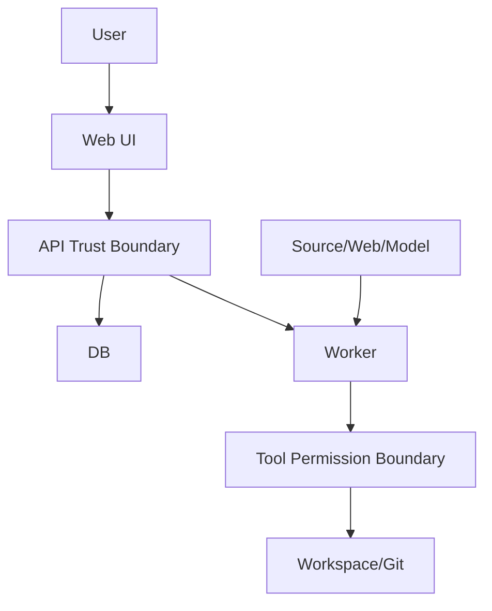

# 安全架构与威胁模型

## 1. 资产

- Markdown/PDF/附件。
- Git 历史。
- 模型 API Key。
- PostgreSQL 领域与运行数据。
- Approval 与审计。
- 用户回答和 Memory。

## 2. 威胁参与者

- 恶意 Source。
- 恶意网页。
- 不可靠模型输出。
- 本地低权限进程。
- 误操作用户。
- 暴露的自托管入口。

## 3. 信任边界

## 4. STRIDE 摘要

| 类别 | 例子 | 控制 |
|---|---|---|
| Spoofing | 自托管未授权访问 | 单用户认证、HTTPS |
| Tampering | 审批后文件变化 | Version Token、Change Hash |
| Repudiation | 否认写回 | Approval、Audit、Git Commit |
| Information Disclosure | Prompt 泄露密钥 | Secret 隔离、日志脱敏 |
| Denial of Service | 大 PDF/图谱查询 | 大小、超时、分页、配额 |
| Elevation | Source 请求写工具 | 服务端权限、Workflow Allowlist |

## 5. 身份

本地模式：

- 默认绑定 localhost。
- 回环地址只缩小暴露面，不等同于用户身份。
- Web UI 使用 Cookie Session，仍校验 Origin/CSRF。

自托管：

- 必须使用 HTTPS 和单用户认证。
- Web UI 使用 Secure、HttpOnly、SameSite Cookie Session。

自动化客户端：

- 使用可撤销、限 Scope、可过期的 API Token，不复用浏览器 Session Cookie。
- Token 明文只在创建时返回一次，服务端只保存不可逆摘要或等价安全表示。
- Token 禁止通过 URL Query 传递，必须支持轮换、撤销、最后使用时间和安全审计。

Session 要求：

- 登录后和敏感设置变化后轮换 Session ID。
- 登出、凭据变更和主动撤销立即使 Session 失效。
- Cookie Session 请求执行 CSRF Token 与 Origin 校验；SameSite 不能替代 CSRF 校验。

完整决策见 [ADR-0014](adr/0014-single-user-authentication.md)。

M6-D 的现实边界是：Search/Evidence 只实现持久数据的 Workspace 隔离，部署继续绑定 loopback。M10-02
已经接入 Auth、Session、API Token、CSRF/Origin 和 Capability Middleware：业务 API 默认要求有效
Session 或限 Scope API Token；回环来源、请求中的 `workspace_id` 和 HMAC Search Cursor 仍不能证明身份，
也不能作为授权通过依据。`ZHIXU_AUTH_MODE=disabled` 只允许 development 的 loopback HTTP；官方 Compose 让 API
进程监听 loopback，并使用受限 proxy 只接受 Docker bridge gateway 转发、拒绝其他 bridge peer。该部署边界不能用于
production、LAN 或公网暴露，其他环境必须使用 `required` 与 HTTPS Secure Cookie。
Compose 只把 Bootstrap Token 与可选 `ZHIXU_REVIEW_QUESTION_REF_KEY` 注入 API；Worker/Migrate 使用不消费
这些 Secret 的配置入口。Review `question_ref` 由 API 使用 HMAC 绑定 Review Session 与题目快照，不是身份或授权凭据；显式 key
必须至少 32 UTF-8 bytes、无首尾空白且不得为空。缺失时 `required` 从 Bootstrap Token 做域隔离派生，local
`disabled` 生成进程随机 key。多 API 实例必须共享显式 key；轮换只会使在途 `question_ref` fail closed，不能
重写已经持久化的 Answer/Schedule。官方 Compose 示例提供 development-only 显式 key，启动预检要求最终模型
中的 key 非空且满足上述边界；非开发部署必须替换。预检同时拒绝非法 Auth/Review Secret，避免静默忽略错误配置。

## 6. 授权

即使单用户，也按 Capability：

- Read Workspace。
- Read External。
- Create Proposal。
- Apply Knowledge。
- Git Write。
- Index Maintenance。
- Evaluation Run。

代码中的 canonical 值固定为 `READ_LOCAL`、`READ_EXTERNAL`、`WRITE_PROPOSAL`、
`WRITE_KNOWLEDGE`、`GIT_WRITE`、`INDEX_MAINTENANCE`、`EVALUATION_RUN`。旧
`ADMIN_MAINTENANCE` 不自动展开为两个权限；历史 Definition 无法唯一迁移时禁止启动新 Run。

写权限短时、单任务、单 Proposal。

必须区分两层授权：

1. **身份与 Capability Authorization**：Session 或 API Token 证明调用者身份和允许发起的能力范围。
2. **Approval Write Authorization**：用户批准 Proposal 后，由服务端签发的一次性、短时、绑定 Workflow Run、Proposal Revision、Approval、Change Hash 和 Target Version 的写授权。

登录成功或持有高 Scope API Token 都不能直接获得 Apply Knowledge/Git Write；模型、Eino 和 Tool Request 也不能生成或扩大 Write Authorization。

## 7. Secret

- 环境变量或 Secret File。
- Bootstrap Token 只进入 API 进程，不进入 Worker、Migrate 或 Compose 共享环境块。
- Review question-reference key 只进入 API 进程；不进入响应、日志、配置摘要、Worker 或 Migrate。
- managed 模型主密钥只存在 Compose named volume；Key init 只创建缺失文件，不覆盖既有 Key。API、Worker、
  modelctl 只读挂载，Migrate、Proxy、前端和应用 Workspace 均不可访问。
- 模型 API Key 只允许请求瞬时明文、短生命周期进程内 Secret buffer 和数据库 AES-256-GCM 密文；AAD 绑定
  revision、用途、schema、Provider 与规范化 Endpoint。响应、Problem、Audit、日志、metric、trace、URL、
  Browser Storage、镜像 history 和配置摘要均不得出现明文、密文、Key 长度或完整 Endpoint。
- UI 只显示掩码。
- 不进入 DB 导出。
- 不发送给模型。
- 轮换后旧 Client 释放。
- Search Cursor 只包含版本、请求/结果 Hash、Index ID 与 offset，并使用进程内随机 HMAC 密钥签名；
  不得写入 Provider Key、Query 正文、DSN、绝对路径或 Artifact locator。密钥不持久化，进程重启后
  旧 Cursor fail closed。

## 8. 文件

- Stable ID 解析路径。
- Canonical Root Check。
- Symlink Check。
- 临时文件权限。
- 文件大小限制。
- 禁止执行附件。
- Safe Writeback 目标必须是 Workspace 内现存普通 Markdown，父链与目标执行 `Lstat/Open/Fstat` 身份复核，并拒绝跨 device 和非当前 owner。
- 同一 inode 的协作写入者使用持久 lock file + advisory `flock` 串行；hardlink、大小写或 Unicode 路径别名不能绕过目标锁。
- temp/backup 使用目标同目录随机 `O_EXCL|0600` 文件；恢复和清理只接受当前执行生成、身份与 hash 未被篡改的 locator。
- 文件锁不能阻止恶意本地进程绕过协议；rehash 到 rename 的极小窗口和断电结果不确定性必须通过最终复核、备份与人工恢复处理，不宣称不存在。
- Evidence Span 读取不接受调用方文件路径，也不读取当前 Workspace 工作树。服务端必须从数据库绑定的
  Source Version/Content Artifact 身份解析 managed artifact，复核 Workspace、Artifact ID、全文 Hash、
  大小、Span byte range 与 excerpt Hash 后，最多返回 4 KiB UTF-8 excerpt；任何绑定损坏 fail closed。

## 9. Prompt Injection

- System Policy 与 Source 分角色。
- Source 标记不可信。
- 权限不由模型控制。
- Tool Request 重新校验。
- 敏感操作需要 Approval。
- Tool Request 只提供项目自有严格 Schema；Workspace、Capability、Approval、Credential、timeout、endpoint、path、command 和 Git args 均由服务端忽略或拒绝，不能成为授权来源。
- Tool Result、Source 和网页正文统一标记为 untrusted data，不递归解释为新的 Tool Request，也不进入 System Message。

## 10. SSRF

- 地址解析与重定向逐跳检查。
- 阻止私网/回环/元数据。
- DNS Rebinding 防护。
- 出站超时和大小。
- 公开域名 Allowlist 只能收窄访问范围，不能允许 loopback、private、link-local、multicast、unspecified、metadata 或其他保留地址。
- 每一跳固定使用本次校验后的 IP snapshot，保留 Host/TLS ServerName，禁止环境代理和校验后的二次 DNS。
- 模型正式调用与 Settings Test 复用同一专用 Transport：`Proxy=nil`、禁止 redirect、每次建立新连接重新解析
  全部 A/AAAA；任一地址不公开则整组拒绝，再按解析顺序尝试已验证地址。仅受控 Ollama preset 允许精确
  `http://127.0.0.1:11434` relay，不扩展为任意 loopback 或私网 allowlist。

## 11. Web

- CSRF。
- XSS/HTML 清理。
- CSP。
- Origin Check。
- 上传 Content-Type。
- 下载 Content-Disposition。

## 12. 数据库

- 独立应用用户。
- 最小权限。
- 参数化 SQL。
- 不将 DB 端口暴露公网。
- Backup Encryption。
- Search 与 Evidence 查询必须参数化并带 Workspace 约束；跨 Workspace、Source Version/Span 不关联与
  不存在使用相同 404，避免对象 ID 枚举。Distance operator 只能由持久白名单枚举选择固定 SQL 模板，
  不能接受用户输入 SQL operator 或排序表达式。

## 13. Git

- 固定命令 Allowlist。
- 不执行 Hook（或使用受控环境禁用）。
- Commit Message 不包含 Secret。
- 不允许任意 remote push。

## 14. 模型数据

- 发送最小证据窗口。
- Provider 数据保留配置可见。
- 本地敏感 Topic 可禁止云模型。
- Full Prompt Debug 默认关闭。

## 15. 审计

必须审计：

- Login/Auth。
- Session/API Token 创建、轮换、撤销和拒绝。
- Approval。
- Tool Authorization。
- File/Git。
- Settings/Secret 更新。
- Security Block。

M6-03 的 `workflow.tool_call` 是 Tool 执行事实和受限安全记录，不等同于 M10 的通用 append-only Audit：
它只保存版本化身份、状态、Hash、字节数、受控摘要和稳定引用，不保存 raw Prompt/参数/输出、正文、
Credential、Authorization、Cookie、绝对路径或 stderr。通用 Audit、留存和 UI 仍属于 M10-01，不能用
该受限记录冒充跨模块审计。

模型设置保存必须与 append-only Audit 在同一数据库事务提交。Audit 只记录 action、revision、Provider 和
`api_key_configured`，不记录 draft、Endpoint、Secret、密文或 runtime instance id；Audit 失败时 revision 保存回滚。

## 16. 安全失败模式

- 无法确认权限 → 拒绝。
- Git/DB 不一致 → 只读。
- 引用失效 → 不发布回答。
- Secret Store 不可用 → 模型功能不可用。
- 安全检查异常 → Source 隔离。

## 17. 安全测试

- Path Traversal。
- Symlink。
- SSRF。
- Prompt Injection Corpus。
- XSS Markdown。
- CSRF。
- Secret Leak。
- SQL Injection。
- Unauthorized Write。
- Session Fixation/Revocation。
- API Token Scope/Expiry。
- 已登录但无 Approval Write Authorization 的写入拒绝。
- Search Cursor 篡改、跨请求复用、进程重启失效和结果 stale；错误不得回显 Query、Key、DSN 或路径。
- Evidence 跨 Workspace、Source Version/Span 错绑、managed locator 越界、Hash/大小/byte range/excerpt
  不一致；均不得回退到工作树或泄漏其他 Workspace 元数据。
- Compose/API 仍只发布 loopback；认证负测必须覆盖 Bootstrap 泛化、Session 固定/撤销、CSRF/Origin、
  API Token Scope/Expiry/Revocation 和未获 Approval Write Authorization 的写入拒绝。Workspace 隔离测试
  不得冒充身份或 Capability 证据。

## 18. 依赖与镜像

- SBOM。
- CVE Scan。
- 非 root Container。
- 固定 Base Image。
- 依赖升级评测和回归。
