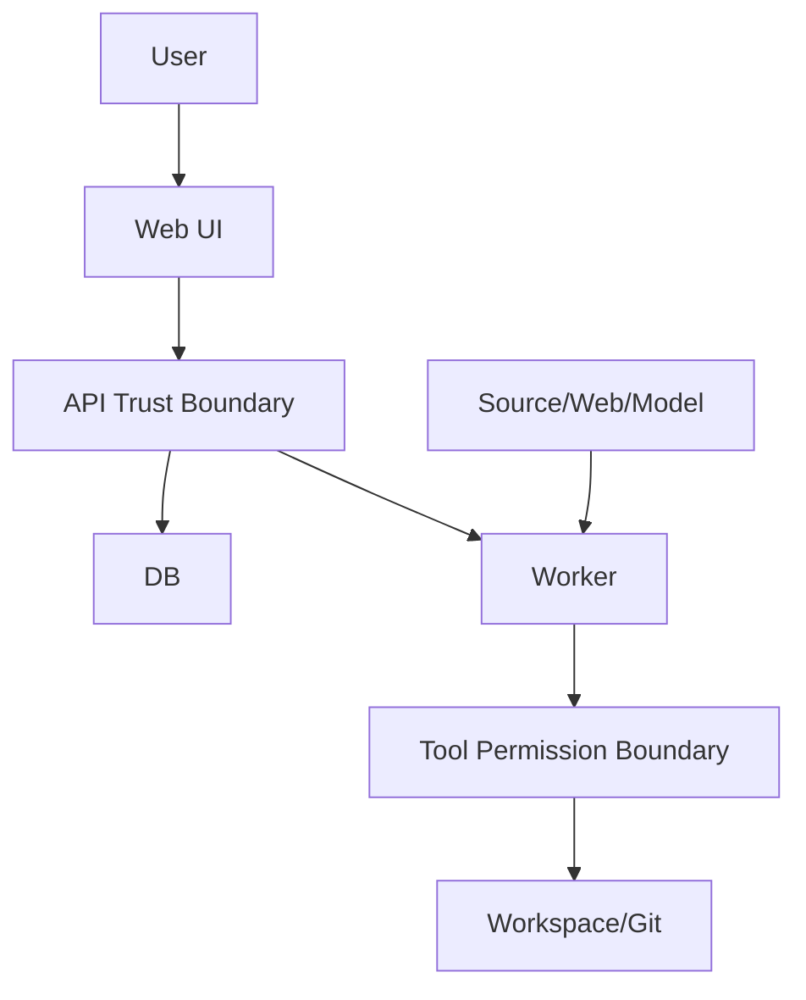

# 安全架构与威胁模型

## 1. 资产

- Markdown/PDF/附件。
- Git 历史。
- 模型 API Key。
- PostgreSQL 领域与运行数据。
- Approval 与审计。
- 用户回答和 Memory。

## 2. 威胁参与者

- 恶意 Source。
- 恶意网页。
- 不可靠模型输出。
- 本地低权限进程。
- 误操作用户。
- 暴露的自托管入口。

## 3. 信任边界

## 4. STRIDE 摘要

| 类别 | 例子 | 控制 |
|---|---|---|
| Spoofing | 自托管未授权访问 | 单用户认证、HTTPS |
| Tampering | 审批后文件变化 | Version Token、Change Hash |
| Repudiation | 否认写回 | Approval、Audit、Git Commit |
| Information Disclosure | Prompt 泄露密钥 | Secret 隔离、日志脱敏 |
| Denial of Service | 大 PDF/图谱查询 | 大小、超时、分页、配额 |
| Elevation | Source 请求写工具 | 服务端权限、Workflow Allowlist |

## 5. 身份

本地模式：

- 默认绑定 localhost。
- 可配置本地 Access Token。

自托管：

- 必须认证。
- Secure/HttpOnly/SameSite Cookie 或 Bearer Token。
- Session Rotation。

## 6. 授权

即使单用户，也按 Capability：

- Read Workspace。
- Read External。
- Create Proposal。
- Apply Knowledge。
- Git Write。
- Index Maintenance。

写权限短时、单任务、单 Proposal。

## 7. Secret

- 环境变量或 Secret File。
- UI 只显示掩码。
- 不进入 DB 导出。
- 不发送给模型。
- 轮换后旧 Client 释放。

## 8. 文件

- Stable ID 解析路径。
- Canonical Root Check。
- Symlink Check。
- 临时文件权限。
- 文件大小限制。
- 禁止执行附件。

## 9. Prompt Injection

- System Policy 与 Source 分角色。
- Source 标记不可信。
- 权限不由模型控制。
- Tool Request 重新校验。
- 敏感操作需要 Approval。

## 10. SSRF

- 地址解析与重定向逐跳检查。
- 阻止私网/回环/元数据。
- DNS Rebinding 防护。
- 出站超时和大小。

## 11. Web

- CSRF。
- XSS/HTML 清理。
- CSP。
- Origin Check。
- 上传 Content-Type。
- 下载 Content-Disposition。

## 12. 数据库

- 独立应用用户。
- 最小权限。
- 参数化 SQL。
- 不将 DB 端口暴露公网。
- Backup Encryption。

## 13. Git

- 固定命令 Allowlist。
- 不执行 Hook（或使用受控环境禁用）。
- Commit Message 不包含 Secret。
- 不允许任意 remote push。

## 14. 模型数据

- 发送最小证据窗口。
- Provider 数据保留配置可见。
- 本地敏感 Topic 可禁止云模型。
- Full Prompt Debug 默认关闭。

## 15. 审计

必须审计：

- Login/Auth。
- Approval。
- Tool Authorization。
- File/Git。
- Settings/Secret 更新。
- Security Block。

## 16. 安全失败模式

- 无法确认权限 → 拒绝。
- Git/DB 不一致 → 只读。
- 引用失效 → 不发布回答。
- Secret Store 不可用 → 模型功能不可用。
- 安全检查异常 → Source 隔离。

## 17. 安全测试

- Path Traversal。
- Symlink。
- SSRF。
- Prompt Injection Corpus。
- XSS Markdown。
- CSRF。
- Secret Leak。
- SQL Injection。
- Unauthorized Write。

## 18. 依赖与镜像

- SBOM。
- CVE Scan。
- 非 root Container。
- 固定 Base Image。
- 依赖升级评测和回归。

