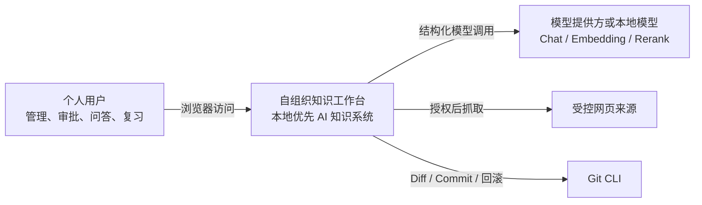
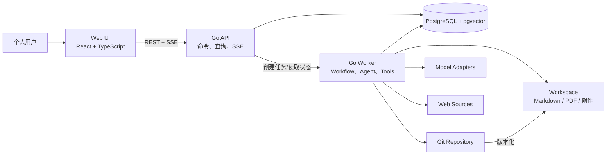
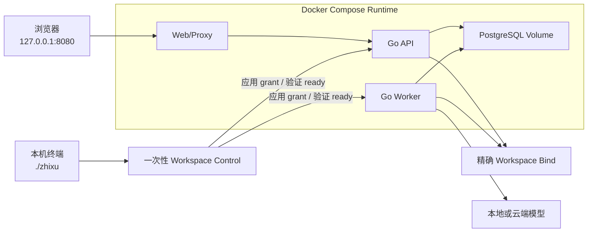
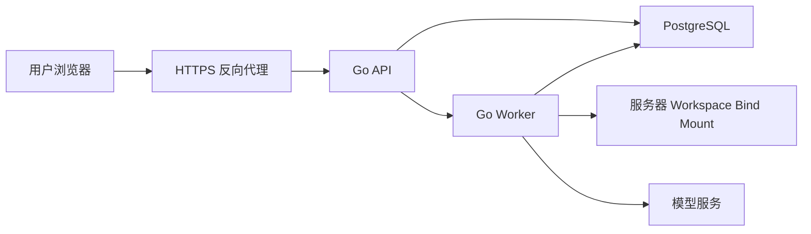
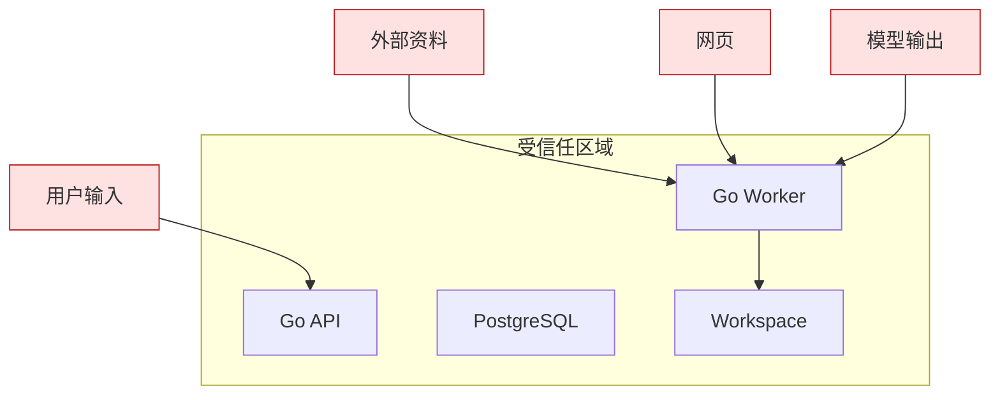

# 系统上下文与容器架构

## 1. 目标

定义系统边界、外部参与者、运行容器、信任关系和本地/自托管部署形态。

## 2. 系统上下文

## 3. 系统边界

系统内部：

- Web 前端。
- Go API。
- Go Worker。
- PostgreSQL + pgvector。
- 用户 Workspace 文件访问。
- Git Adapter。
- Workflow、Agent、Tool Registry、评测和审计。

系统外部：

- 云端或本地模型。
- 用户允许的网页。
- 操作系统文件系统和 Git 可执行程序。

不在系统范围：

- 多用户身份平台。
- 第三方云盘同步。
- 多租户 SaaS。
- 通用桌面编辑器。

## 4. 容器架构

## 5. 运行进程

### Web UI

职责：

- 用户交互。
- 查询和命令提交。
- SSE 任务进度。
- Diff、图谱和证据展示。

禁止：

- 直接访问 Workspace。
- 直接持有模型密钥。
- 在浏览器执行正式知识写入。

### Go API

职责：

- 输入校验。
- 查询编排。
- 同步领域命令。
- 创建 Workflow Run。
- SSE 事件。
- 错误和版本冲突映射。

禁止：

- 堆积长时间模型调用。
- 执行不可恢复的文件副作用。
- 绕过模块 Interface 直接拼 SQL。

### Go Worker

职责：

- 获取工作流租约。
- 执行节点。
- 调用 Agent 和工具。
- 处理重试、补偿、Human Node。
- 更新索引和评测。

### PostgreSQL

职责：

- 事务性领域状态。
- Workflow 和幂等。
- 全文与向量索引。
- Relation 查询投影。
- 审计、评测和调度。

### Workspace 与 Git

Workspace 保存：

- sources/ 原始资料。
- knowledge/ 正式 Markdown。
- artifacts/ 导出产物。
- attachments/ 附件。

Git 版本化正式知识和架构允许纳入版本的元数据，不版本化数据库运行状态。

## 6. 本地模式

特点：

- 用户文件位于本机。
- PostgreSQL 位于本机 Docker Volume。
- Docker Web/API 固定发布到 IPv4 loopback；浏览器只是业务客户端，不选择宿主机挂载。
- `./zhixu` 在首次启动或低频切换时调用一次性 Workspace Control，完成后不存在常驻宿主机网页进程。
- 只有 API 与 Worker 获得当前 canonical Root 的精确 bind；切换成功后浏览器通过 Active Workspace API 建立新作用域。
- 允许模型在本地或云端。

具体命令、状态保存和故障排查见 [Workspace 与 Docker 运行手册](runbooks/workspace-runtime.md)。

## 7. 自托管模式

自托管模式中文件位于用户控制的服务器挂载目录，不自动同步到客户端电脑。

## 8. 信任边界

规则：

- 用户输入、资料、网页和模型输出在系统边界校验。
- Model Output 不是可信命令。
- 写权限由 Workflow + Approval 授予。
- 外部网页受 SSRF 和大小限制。

## 9. 关键架构约束

- 单个活动 Workspace，但 Registry 和所有领域表保留稳定 `workspace_id`；切换 Root 不迁移或覆盖既有 Workspace 身份。
- 正式 v1.0 不要求公网部署。
- PostgreSQL 是必需依赖。
- Git 是正式写回的必需依赖。
- 模型故障不影响文件浏览和关键词搜索。
- 数据库故障时禁止写入。
- Git/数据库一致性异常时进入只读恢复模式。
