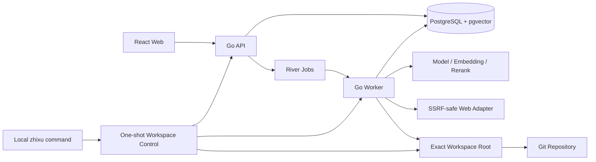
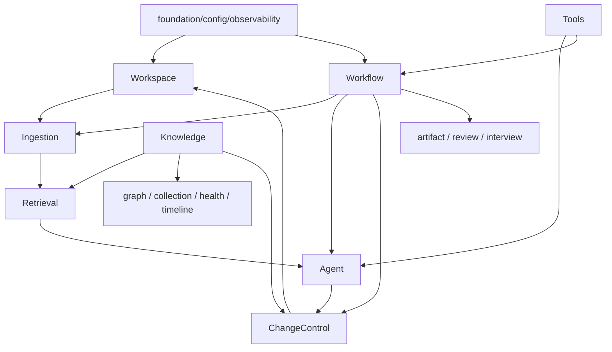
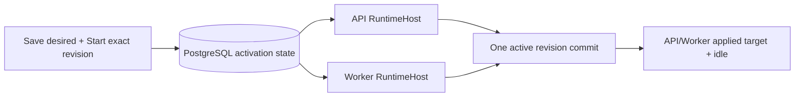

# 系统设计

## 1. 系统边界

知序是单用户、本地优先或自托管的知识工作台。系统负责 Workspace 内容摄取、查询投影、AI 辅助、变更审批、正式写回、Git 留痕和可恢复任务；不负责多人协作、多租户云盘、通用 IDE、任意命令执行或不受控外网代理。

外部参与者包括用户浏览器、本机文件系统与 Git、PostgreSQL、模型/Embedding/Rerank Provider、受控网页和操作系统/Docker。Source、网页和模型输出均不可信；只有用户身份、服务端持久授权和已批准变更可以跨越写入边界。



### 进程职责

| 进程/边界 | 负责 | 不得负责 |
|---|---|---|
| Web | 路由、Feature UI、严格 API 边界、Query cache、用户交互 | 选择宿主机目录、持有模型密钥、直接写文件/数据库、把 SSE 当事实源 |
| API | 认证授权、REST/SSE、同步查询、命令受理、Composition | 长模型任务、不可恢复副作用、绕模块 Interface 直接写他域 SQL |
| Worker | 持久 Job、模型/工具执行、lease、重试、补偿、检查点 | 对公网提供业务 API、接受模型自报权限、在日志保存正文或凭据 |
| PostgreSQL | 领域/运行事实、查询投影、River、Outbox、审计 | 成为正式 Markdown 唯一原件、把文件/Git 外部副作用伪装为同一事务 |
| Workspace/Git | 用户文件、附件、正式知识和版本历史 | 保存 Secret、Workflow lease、Embedding 或 Token 统计 |
| Workspace Control | 本机 Root 校验、稳定身份、精确 grant、切换与回滚 | 常驻 HTTP、处理知识业务、读取内容、暴露 Docker socket |

## 2. Workspace 运行边界

- 同时只有一个 Active Workspace，但 Registry 为每个规范化物理 Root 保存稳定 `workspace_id`。
- Registry 记录不授予文件访问；只有 Active Workspace 获得 `source == target == canonical root` 的单一精确 bind。
- Root 只能由本机 `zhixu` → `cmd/workspacectl` → `internal/workspacecontrol` 一次性控制链选择。浏览器、业务 API、SSE、localStorage 和请求 `workspace_id` 都不能改变 mount 或身份。
- Workspace Switch 替换 Active 身份和 Root Grant；同一 canonical path 的物理 identity replacement 只能由
  `workspace rebind --confirm REBIND` 显式恢复。rebind 保持 Workspace ID/业务数据，以不可变事务历史递增 persisted binding
  generation；fingerprint schema version 独立，普通 switch/restart 仍对 identity mismatch fail closed。
- rebind 先撤销旧 runtime/grant，旧 runtime 保留旧 binding 且被新 Registry fence；rebind 自身不增加 grant generation，
  后续普通 switch 增加 generation。只有 switch 返回相同新 binding 且 API/Worker ready 后才提交 selection；响应丢失可精确重放，
  但 control state 或全局 mutation gate 非空时仍拒绝。
- 切换先使旧 Workspace quiescent，再撤销旧 grant；失败恢复上次成功状态，无法证明恢复时保持零 Active。
- PostgreSQL 查询、文件路径、索引、Workflow、缓存和 SSE 都必须绑定 Workspace。跨 Workspace 与不存在对象使用相同 NotFound 语义，避免枚举。

Git 与 PostgreSQL 是正式运行的必需依赖。模型故障不得阻止文件浏览和 Keyword Search；数据库故障禁止新的正式写入；文件、Git 与 DB 不一致时进入 READ_ONLY_RECOVERY。

## 3. 模块化单体

系统采用 [ADR-0001](adr/0001-modular-monolith.md) 的模块化单体：API 与 Worker 是两个进程，但共享领域模块、Interface 和 Composition Root；一个 PostgreSQL 实例保存各模块事实。模块以高内聚能力和窄 Interface 隐藏存储与协议细节。



### 模块所有权

| 模块 | 唯一所有权 |
|---|---|
| Workspace | Root 身份、路径安全、文件扫描、受控文件/Git port |
| Ingestion | Source/Source Version、Content Artifact 捕获、解析与 canonical Chunk 输入 |
| Knowledge | Topic、Claim、canonical Relation、Conflict、Evidence Eligibility |
| Retrieval | Index Version、FTS/vector 投影、融合、Evidence 查询 |
| Change Control | Proposal、Approval、Write Authorization、Safe Writeback Execution |
| Workflow | Definition、Run、Node Run、Attempt、Human Task、lease/重试/补偿 |
| Agent | Model Run/Call、结构化决策、RAG 计划与回答门禁 |
| Model Settings | immutable revision、desired/active/applied、activation/participant、进程 generation lifecycle |
| Tools | Tool Contract Registry、服务端授权、Executor 与 receipt |
| Graph/Collection/Health/Timeline | 对 Knowledge/运行事实的有界查询投影和各自状态；不写 canonical Relation |
| Artifact/Review/Interview/Memory | 各自聚合、版本与学习状态；正式发布仍交给 Change Control |
| Observability/Audit | 跨模块 correlation、脱敏记录和 append-only 审计能力 |

Knowledge 是 Relation 的唯一写 owner。Graph、Collection、Agent、Semantic Candidate 和 Health 只能调用 typed command/Proposal；不得复制一套 Relation 表或绕过模块 SQL。River 只负责投递和领取可运行节点，不取代 Workflow 领域状态。

### 依赖规则

- Domain 不依赖 HTTP、pgx/GORM、River、模型 SDK、文件系统、Git 命令或前端类型。
- Application 通过领域 Interface 编排；Adapter 实现向内依赖，第三方类型在边界转换。
- API/Worker 只在 Composition Root 读取 Config、构造连接和选择 Adapter；模块不得自行读取环境或创建全局客户端。
- 一个事务只由拥有写入事实的模块开启。跨模块数据库原子操作通过显式 Unit of Work/事务 seam；跨文件/Git/DB 使用 Saga + Outbox。
- `tools/adapter → tools/application → tools/domain → capability/foundation`，不得反向依赖或新增第二条文件/Git 写路径。

## 4. Interface 与 Adapter

### 通用契约

- Interface 使用项目领域类型、`context.Context`、显式 timeout/cancel、批量方法、幂等身份和稳定错误分类。
- Provider SDK 对象、第三方 AST、HTTP payload、数据库 Row/Tx、绝对路径和原始命令参数不得泄露进 Domain。
- Adapter 不静默重试不可证明幂等的副作用，不静默换模型或扩大范围；降级必须回传 capability/degradation。
- `disabled` 能力返回明确 unavailable，不注入会产生假成功的 Fake。Fake 只用于测试，并运行同一 Contract Test。

### 关键端口不变量

| 端口 | 必须保证 |
|---|---|
| ChatModel | OpenAI-compatible 直接 Adapter；严格请求/响应预算、实际模型版本和错误分类；不拥有领域状态机 |
| Embedder/Reranker | 批量、版本/维度/距离绑定；Rerank 可显式 degraded，Embedding 不可用不伪装 Semantic 成功 |
| Parser | 输入不可变 SourceInput 字节而非任意路径；输出保留 Source Span；解析器失败不写 Source Version |
| WorkspaceStore | canonical root、no-follow、文件身份复核、目标 CAS、原子替换和恢复 locator；授权与路径由服务端提供 |
| GitRepository | 固定 allowlist、批准 HEAD/target CAS、受控 Commit/Trailer 查询；禁止 reset/checkout/任意 push 和历史重写 |
| Retrieval | 有界过滤/分页/版本化结果；实现替换不能扩大领域 Interface |
| Evidence Eligibility | 只能由 Knowledge 根据批准 Claim Source/Relation Evidence/Conflict 判断；Active Index、排名和模型置信度不能替代 |
| Workflow | 持久状态、租约、Attempt、幂等 completion、Human Task 与补偿；队列不是权威状态 |
| Model Runtime | `RuntimeAcquirer` 一次返回完整 immutable generation lease；current、Attempt binding 与 Embedding Contract 目标必须 fail closed，调用方在完整操作结束后 Release |
| Tool Registry | name+version 冻结、Schema/Capability/allowlist 校验；receipt 可以读或重算纯函数结果，不能重放副作用 |
| Review Scheduler | 同一 Answer 幂等，版本化评分/FSRS；无效 Claim 使 Card 失效 |

Safe Writeback 的 WorkspaceStore 与 GitRepository 不是通用文件/Git 工具。写入必须持有服务端签发、短时、绑定 Proposal Revision/Approval/Change Hash/Target Version 的授权，并在副作用点重新验证 CAS。

## 5. 当前技术基线

精确版本以 Manifest 和锁文件为准；下表描述当前已经采用的技术，不包含路线图候选。

| 能力 | 当前选择 | 边界 |
|---|---|---|
| 后端 | Go；Gin v1.12.0 + `net/http` 兼容边界 | Gin 负责 API、Middleware、REST 与 SSE；标准库 `http.Handler` 仅在框架边界适配，Domain/Application 不依赖 Gin |
| 数据访问 | GORM + 共享 PostgreSQL Pool / UoW | Repository 隔离 Persistence Model；跨模块使用 Foundation TransactionScope，复杂查询保留参数化 Raw/Exec；[持久化契约](../../.trellis/spec/backend/gorm-persistence.md) |
| Migration/Job | Atlas + River | Atlas 是唯一前向 Schema 事实源（无 Down，fix-forward）；同一物理池上使用官方 database/sql driver 原子入队、pgx driver 运行 Worker/listener；见 [ADR-0015](adr/0015-river-goose-runtime.md) 与 [ADR-0029](adr/0029-atlas-sole-schema-migration.md) |
| 数据 | PostgreSQL + pgvector + FTS | exact vector scan 为基线；固定维度容量证据后才使用部分 HNSW |
| 图谱 | canonical Relation + PostgreSQL 查询投影 | v1 不引入图数据库，见 [ADR-0005](adr/0005-no-graph-database-v1.md) |
| 内容 | goldmark、go-readability Adapter、pdftotext/Poppler Adapter、SHA-256 | 外部 Parser 只经 Adapter；HTML 安全文本使用标准 parser，不用正则清洗 |
| Git | Git CLI Adapter | 固定命令和受控环境，见 [ADR-0009](adr/0009-git-cli-adapter.md) |
| AI | OpenAI-Compatible Chat/Embedding；受管理的本地 Ollama；可选 Rerank | Chat、Embedding、Structured Scheduler 与 `/chat` RAG 的进程内运行时固定使用 Eino/eino-ext；项目继续拥有业务编排、持久状态、权限和最终发布。本地 Ollama 管理、模型热应用分别见 [ADR-0023](adr/0023-managed-local-ollama-runtime.md)、[ADR-0022](adr/0022-model-runtime-hot-activation.md)，Eino 采用见 [ADR-0027](adr/0027-eino-primary-ai-runtime.md) |
| 前端 | React + TypeScript + Vite、TanStack Query、React Router、Monaco | strict wire boundary；SSE 只触发回查 |
| 图形 UI | 当前 SVG/CSS + 有界列表 fallback | Cytoscape/Web Worker 仅在 50 万 Relation/FPS 证据后评估 |
| 配置 | Viper + validator + YAML v3 AST 预检 | 每次实例化加载、严格输入，详见 [应用契约](application-contracts.md) |
| 可观测 | slog、OpenTelemetry OTLP/HTTP、Prometheus client | 显式 Provider、独立 Registry、脱敏和有界 label |
| 部署 | Docker Compose | 稳定 namespace anchor、固定 Web 入口、精确 Workspace bind、PostgreSQL named volume |

### 选型原则

- 选择项目当前 Manifest 支持的稳定版本并锁定；依赖服务保持最少，核心领域不绑定框架。
- 通用能力优先使用标准库或成熟、可测试、生态自然的框架。候选满足全部强制功能、安全、数据一致性、部署和兼容约束，且覆盖至少 80% 加权需求时，默认复用而不重复自研。
- 已批准选型是硬约束。偏离现有选择、并行引入替代方案或确需自研，必须先取得用户确认，并用 ADR 记录候选覆盖、缺口、边界、维护成本、测试与退出路径。
- 该规则约束后续选型，不把尚未完成的框架迁移写成当前事实。完整门禁见 [ADR-0019](adr/0019-mature-framework-first.md)。

当前不引入 Kafka、Kubernetes、必需 Redis、Elasticsearch、独立向量库、图数据库、Temporal、微服务拆分或核心 Agent Framework。只有容量、故障、运维或兼容证据证明现有模块化单体/PostgreSQL 方案不足时，才记录新 ADR 评估。

## 6. 部署拓扑

### 模型运行时应用

模型配置应用属于现有 API/Worker 进程内的运行时变更，不属于 Compose deployment。浏览器保存 immutable
desired revision 后，以 exact revision 启动 PostgreSQL 持久 activation；API coordinator 与两个
role-local controller 共同收敛状态：



- `preparing` 时旧 generation 继续服务；`arming|activating` 只建立短暂 admission/Claim fence，不排空在途工作。
- commit 前失败保留 previous active；commit 后 `active=target` 是唯一恢复方向，不执行自动 rollback。
- Workflow Attempt 按持久 `(instance_id, revision)` 获取 exact generation；Retrieval 按 Active
  Index/Embedding Contract 获取兼容 generation，当前默认配置不能覆盖历史 provenance。
- retiring generation 等最后一个 lease 释放后关闭 owned Transport；外部注入 client 不归 Host 管理。
- 正常 Apply 不重启 API/Worker 容器；`./zhixu restart` 只保留为升级、进程故障和运维重建手段。

### 本地模式

```text
Compose project: zhixu-netns
browser -> 127.0.0.1:${ZHIXU_HTTP_PORT:-8080} -> app anchor -> app loopback
                                                    \-> app model relay
worker anchor -> worker loopback + worker model relay

Compose project: zhixu
steady: postgres + local-model-runtime -> zhixu-runtime external network
app/app relay -> container:zhixu-app-netns
worker/worker relay -> container:zhixu-worker-netns
host Workspace <== exact bind ==> app + worker only

temporary bootstrap model
key init -> migration -> credential/volume init -> modelctl recovery
all steps use run --rm --no-deps; no Workspace grant
```

- Web/API 只发布宿主机 IPv4 loopback；Worker 不发布宿主机端口；PostgreSQL 不暴露公网。
- `zhixu-netns` 的 app anchor 只负责容器 loopback ingress 转发和 peer firewall；静态 Web/API 仍由 app 提供。anchor 没有 Workspace、认证状态、模型 secret、数据库 credential 或 Docker socket。启动时以 `NET_ADMIN` 安装 firewall，仅以 `SETUID`/`SETGID` 切换到非 root，长期进程 capability 全零。
- app/worker 与两个 relay 是固定 anchor 的 namespace consumer；其 PID 1 在 PostgreSQL 暂不可用时保持 running，数据库可 ping 后再 `exec` 业务进程。主项目 Restart project 不会替换 anchor，避免 consumer 因短暂 owner 消失而永久漏启动。
- API/Worker 共享同一 canonical Root Grant；Migrate、anchor、数据库和模型密钥卷不能读取 Workspace。
- 主 `deploy/compose.yml` 恰好声明 PostgreSQL、managed local-model runtime、app、worker 与两个 relay；不声明 one-shot 服务，也不使用 `service_completed_successfully` 稳态依赖。`deploy/compose.bootstrap.yml` 只由 launcher/隔离 smoke 临时合并，不接收 Workspace grant。
- Docker UI 只支持观察和 Restart 已由 launcher 准备完成的主 `zhixu` 项目；Restart 不执行 bootstrap。首次启动、升级、migration、旧 one-shot orphan 清理与故障恢复必须使用 launcher。helper 或 daemon restart 不保证跨项目顺序，health/status 必须显示 degraded；launcher 使用 anchor-first 受控重建恢复。

### 自托管模式

- 入口必须经过受信反向代理、HTTPS、单用户认证和 Secure Cookie；数据库与 Worker 保持内部网络。
- `AUTH_MODE=disabled` 仅允许 development loopback，不能用于 LAN、公网或生产。
- 备份责任包括 Workspace/Git、PostgreSQL、模型密钥和非敏感配置；精确操作见 [运行手册](../operations.md)。

### 启动与健康

- launcher 启动依赖为 helper anchor firewall/health → PostgreSQL ready → key initialization → migration success → local-model credential/volume initialization → managed runtime ready → modelctl stale recovery → API/Worker composition ready → relay/Web ready。
- bootstrap 步骤由 launcher 逐个执行 `run --rm --no-deps`；任一步非零即阻止下一步和所有后续稳态服务。稳态 Compose 只保留 PostgreSQL health gate，以支持已准备项目的 Docker Desktop Restart。
- Compose 声明式依赖不单独承担 daemon restart 的收敛保证；API/Worker 启动入口按 profile 加载配置并等待 PostgreSQL，配置类错误 fail fast，瞬时连接失败可取消重试。主项目 restart 依赖持续运行的 helper anchor；helper/daemon 恢复失败只可降级，随后由 launcher 收敛。
- Migration 固定执行应用迁移、River migration 和 Validate；失败阻止 API/Worker 就绪。
- Liveness 只说明进程存在；Readiness 验证 DB、Definition/Executor、必要 Provider、Root Grant 和版本兼容。API health 不能替代 Worker `/readyz`。
- 运维状态以 `docker compose ps --all` 的关键服务集合为事实；关键进程非 running 或核心 health 非 healthy 时显式 degraded，状态查询不执行补偿动作。
- Telemetry `disabled/optional/required` 有不同 readiness 语义，但 Metrics 与稳定健康码不应依赖外部 Dashboard。

## 7. 失败与演进

- Provider 不可用：对应 AI capability unavailable/degraded；浏览和 Keyword Search 继续。
- 模型 activation 在 commit 前失败：保留旧 active 并恢复 admission；commit 后故障：保持 target active，修复 Provider/Secret 或进程后向前完成 applied/finalize。
- PostgreSQL 不可用：拒绝新命令和写入；Worker readiness 失败，不手工完成 Job。
- 文件/Git/DB 无法证明一致：进入 READ_ONLY_RECOVERY，保留 temp、backup、index 与 Commit 证据。
- Worker 崩溃：River rescue 与 Workflow lease reclaim 从持久 checkpoint 继续，不创建第二领域执行。
- Schema 采用向前 Expand → backfill → Contract；Atlas 不提供 Down，回滚使用 fix-forward 或升级前备份恢复。模型热应用 migration 必须保留 participant history，不支持旧/新 binary 混跑。
- 模块在证据支持时可拆进程，但必须保持当前 Interface、事务所有权、幂等和审计语义；拆服务不是产品里程碑。

运行命令、配置事实源、升级和恢复步骤见 [运行与恢复手册](../operations.md)。
