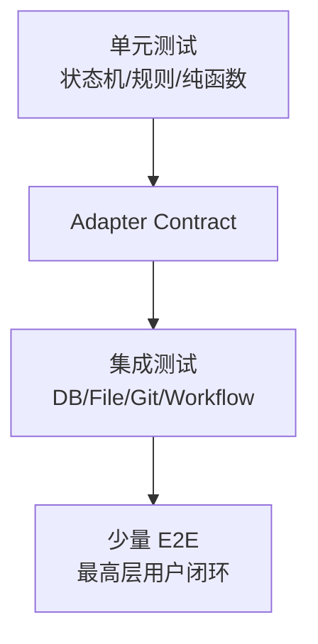
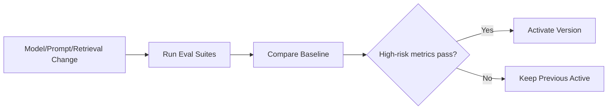

# 测试与 AI 评测架构

## 1. 目标

用可重复证据证明领域正确性、故障恢复、安全和 AI 质量。

## 2. 测试金字塔



## 3. 六个最高层 seam

1. Source → Proposal → Approval → Git → Index。
2. Article Optimization → Revision → Diff → Publish。
3. Query → Retrieval → Answer → Citation/Refusal。
4. Artifact Plan → Sections → Export/Proposal。
5. Graph → Candidate → Health → Relation Proposal。
6. Collection → Review → Score → Schedule。

## 4. 单元测试

- 状态机。
- Change Hash。
- Fingerprint。
- 路径校验。
- Query AST。
- RRF。
- Relation Applicability。
- 四类 Agent Schema 的 strict decoder 与领域校验。
- INITIAL/REPAIR/REDUCED 调用预算与稳定拒答。
- Scheduler 幂等。
- Error Mapping。

## 5. Adapter Contract

所有 Adapter 测试：

- Success。
- Timeout。
- Retryable/NonRetryable。
- Idempotency。
- Version Conflict。
- Resource Cleanup。

## 6. PostgreSQL 集成

Testcontainers：

- Migration。
- pgvector。
- FTS。
- SKIP LOCKED。
- Outbox。
- Unique Idempotency。
- Explain Plan。
- Model Run/Call 状态机、CAS、crash→UNKNOWN 与 guarded Down。
- Knowledge Evidence Eligibility 500 条单批查询与 Workspace 隔离。

## 7. Filesystem/Git

临时仓库：

- Atomic Write。
- User Concurrent Edit。
- Commit Failure。
- Reverse Commit。
- Symlink Escape。
- Dirty Workspace。

## 8. Workflow 故障注入

- Crash before/after Node Commit。
- Crash after File before Git。
- Duplicate Event。
- Lease Expire。
- Human Double Submit。
- Compensation Failure。
- Cancel at Each Node Type。

### 8.1 M5-04D Safe Writeback 专项

- Approval：服务端 strict clean/attached HEAD、dirty/detached/root mismatch、identity/filter/hidden-index/in-progress 拒绝；Rejected 不读取 Git，历史 `approved_git_head=NULL` 不可 Begin。
- Atomic Begin：双授权绑定、过期和 running lease 在同一事务内消费并创建/重放 Execution；中间失败全部回滚，Credential 不落库。
- 文件检查点：`file_prepared` rename 前后进程崩溃、temp/backup locator 篡改、目标/temp/backup 同内容同 mode 但不同 inode、用户后续编辑、ResumeTarget 和 Cleanup finalize retry。
- Git 检查点：`git_prepared` 后 Commit 成功但 checkpoint 前崩溃、exact Trailer lookup、明确 NotFound 才 Commit、unknown 结果进入人工恢复且不 Restore 文件。
- Publish：Mapping + Reindex Outbox 同事务、重复 delivery 只产生一个事件；Safe Writeback 提交后先为 `verifying/index_pending`，只有 M6-B Reindex Completion 事务通过全部 gate 才可 completed。
- Composition：`internal/changecontrol/application/writeback_smoke_integration_test.go` 与已纳入提交的 `writeback_fault_smoke_integration_test.go` 验证真实 PostgreSQL + LocalFS + Git 正常/故障恢复；`approval_dispatch_river_smoke_integration_test.go` 进一步验证 Approved HTTP → 原子 Run/Node/Job → 真实 River Claim → Bootstrap 双授权/Begin → Safe Writeback → Workflow Complete，并断言唯一 Mapping/Reindex Outbox、Runtime payload 无越界敏感字段，以及写回后 exact Approval HTTP replay 不访问变化后的文件/Git。`internal/changecontrol/adapter/approvaldispatchpostgres` 覆盖并发单绑定、UoW 回滚和 Commit response-loss replay。fault smoke 文件已经纳入仓库，但它不等同于真实 Worker 子进程 `SIGKILL` + River stuck rescue；后者必须由独立发布 smoke 给出进程退出、Job rescue、lease reclaim 和无重复副作用证据。
- M4-A migration gate：`internal/platform/migration` 的 integration tag 测试验证原始 legacy Goose 解析失败、只读 annotation FS、空库/重复 Up、旧 shell-runner history 接管、River `workflow` Schema、one-step Down→Up 与 Runtime identity guarded Down；`internal/workflow/adapter/postgres` 的 integration tag 测试验证 Start replay/conflict、双并发单 Run/Node/Outbox/Job、Job 插入失败回滚和 Commit response-loss 恢复。
- M4-B runtime gate：`internal/workflow/adapter/postgres/runtime_state_integration_test.go` 与 `runner_state_machine_integration_test.go` 验证 DB-time Claim/Heartbeat、Attempt append-only、lease reclaim/fencing、更高 River transport attempt 在 active lease 期间保持 Job retryable、业务 Retry/Exhaustion、Complete replay、Pause/Resume/Cancel、Human wait/submit、迁移 guarded Down 和事务型 River Job；旧 legacy Repository lease 测试标记为 `legacy_integration`，不再作为 M4-B Runtime 事实源。

### 8.2 M4-D Worker Operability 专项

已落地的自动测试契约：

- `internal/platform/config`：默认值、YAML/环境变量覆盖、非法 queue/timeout/
  lease/heartbeat/stop 组合、Telemetry mode/endpoint 和安全配置字符串。
- `internal/workflow/runtime`、`internal/workflow/httphealth`：并发 readiness snapshot、
  shutdown 不可逆、`/livez|readyz` 状态码、稳定错误白名单和无敏感 payload。
- `internal/workflow/adapter/river`：Producer/Consumer 同 queue、显式 Insert queue、
  Client started/stopped、graceful/emergency lifecycle，以及 metadata 只传播
  `traceparent`；River 保留的 `river:*` recovery metadata 可被 transport 使用但不会
  暴露给 Application；SIGKILL smoke 每次创建独立临时数据库并执行完整 Goose+River
  Up，避免与常驻 Worker 竞争同一 River maintenance leader。
- `cmd/worker`：启动失败、health server、readiness 更新、graceful `Stop` 与 fatal
  `StopAndCancel` 首事件互斥、hard deadline 和资源关闭；fatal channel 在生产
  Composition 中实际注入，只接受四个 Runtime 契约不变量错误码。
- `internal/platform/observability`：Context correlation、日志 fail-closed 脱敏、
  bounded metrics、高基数 label 拒绝、Trace metadata 严格解析、Telemetry
  `disabled/optional/required` 及 shutdown 幂等。
- `internal/app` 与 `RuntimeNodeWorker`：API 在 noop telemetry 下也生成 trace，
  Consumer 在 Claim 前解码 metadata，Claim 后注入 Run/Node/Attempt correlation；
  queue/active/node/retry/manual/lease/heartbeat/duplicate/shutdown 指标在真实事实点发射，
  幂等 transition replay 不重复计数。
- Workflow PostgreSQL/Change Control：用户 Cancel 与 forced cancel 只有在
  Writeback Execution 到达安全 checkpoint 后才允许 terminal cancelled；否则
  `WORKFLOW_CANCELLATION_DEFERRED` 并继续恢复，避免 terminal Workflow + 非终态
  Execution 孤儿状态。

M4-D 于 2026-07-17 已保存以下真实 PostgreSQL/River/容器证据：

1. Compose `up --wait` 同时等待 PostgreSQL、Migrate、API、Worker；容器内外
   readiness 均为 200，runtime UID 为 `10001`，三个二进制均存在。
2. Worker 容器 SIGTERM 退出码为 0，重启后重新 ready。
3. PostgreSQL 短断后 Worker `/readyz` 返回 503，数据库恢复后重新返回 200。
4. `TestRiverSIGKILLRescueSmoke` 启动真实 Worker 子进程、在 Job running 后发送
   SIGKILL，再由新 River Client 执行 stuck rescue 并完成下一 attempt。该测试使用
   独立数据库；常驻 Compose Worker 运行时也不会因 River maintenance leader 竞争失效。
5. Approval River smoke 使用两个 Worker 验证唯一 Execution/Commit/Mapping/Outbox；
   cancellation PostgreSQL smoke 验证 forced cancel 后 lease expiry/reclaim 不产生
   terminal Workflow + 非终态 Execution。
6. observability、health 和 River metadata 自动测试使用 Secret/路径/高基数 canary
   验证拒绝与脱敏。

发布候选仍需重复这些命令；正在执行真实 Safe Writeback 时的容器级 SIGTERM 是下一轮
发布演练的剩余组合场景，不能由空闲 Worker SIGTERM 单独替代。

### 8.3 M6-A Retrieval Index Foundation 专项

- Migration：真实 PostgreSQL 空库 Up、重复 Up、空数据 Down→Up；任意 Retrieval 业务数据
  存在时 Down 必须返回 SQLSTATE `55000`。迁移入口使用不注册扩展类型的专用 Pool，避免
  `CREATE EXTENSION vector` 前连接初始化失败。
- Domain/Application：Embedding/Index 精确绑定、Manifest 稳定 Hash、全部状态迁移、
  vector-only batch、NaN/Inf/零范数/维度、Ready degraded 推导、Activate/Rollback 期望版本。
- PostgreSQL：跨 Workspace FK、Manifest/Projection/Activation 不可变、批次全有或全无、
  Lexical `INSERT ... SELECT`、响应丢失精确重放、并发双激活最多一个 Active。
- 查询计划：保存 FTS GIN、Canonical Chunk `gin_trgm_ops`、Workspace/Index/Chunk 关键查询的
  `EXPLAIN` 证据。M6-A 不用未评测的全局 HNSW 伪装容量结论。
- 当前集成测试从 `ZHIXU_TEST_DATABASE_URL` 连接真实 PostgreSQL，并为每个测试创建独立临时
  Database；未配置该变量时必须明确失败或跳过，不能降级为内存假实现。

### 8.4 M6-B Reindex Consumer 专项

- Contract/Migration：11 字段 Outbox v1 严格 codec、三字段 River Args、00015 空库/重复 Up、
  空数据 Down→Up、已有 Source Manifest/Delivery 时 Down `55000`。
- PostgreSQL：Dispatcher rollback/response-loss/FIFO/并发，Delivery DB-time lease、Attempt append-only、
  checkpoint fence、Snapshot 分页/容量/增量、Regression closure 与 Completion 故障注入/历史 replay。
- Processor/Worker：Capture→Ingestion→Snapshot→Lexical→Regression→Ready 的全部持久 checkpoint
  恢复；确定性错误归约 failed/manual，事务结果未知才由同一 River dispatch 重投。
- 真实 smoke：`approval_dispatch_river_smoke_integration_test.go` 联合
  `reindex_river_fault_smoke_integration_test.go` 执行 HTTP Approval→Safe Writeback→Reindex Outbox→
  committed Source→Ingestion→Snapshot→Regression→Active→Completed；M6-B 首次落地时使用 FTS-only，
  M6-C 已将同一 smoke 升级为真实 HTTP Embedding + Hybrid V2。Commit 后工作树漂移不污染 committed
  artifact，四个 checkpoint、Ready 与 Completion response-loss 均恢复，两个真实 River Worker
  最终只产生一个 Activation/Active/Completion。
- M6-B 不包含生产 Embedding、Vector/RRF/Search API；这些能力未实现时不得用 fake 或 degraded
  空壳冒充 M6-C/D 验收。
- 全仓 integration 复用同一个 disposable 基准数据库时使用 `-p 1` 串行 Go package；历史测试
  包含全局“单 Active Workspace”约束，包级并行会让夹具互相污染。真实并发仍由各自创建
  独立临时数据库的 Dispatcher、Completion、Activation 和 River smoke 覆盖。

### 8.5 M6-C Embedding And Hybrid Search 专项

- Provider Contract：共享 httptest 覆盖 OpenAI-Compatible `/v1/embeddings` 与 Ollama `/api/embed` 的
  batch 顺序、模型/维度、L2、429/5xx/4xx、非法/超大响应、redirect、timeout/cancel 和 `errors.Is`
  取消链；错误、String/GoString 不包含 Key、正文或完整 Endpoint。
- Vector Build：Domain/Application 覆盖 cache hit/miss、同 hash fan-out、atomic oversized、普通契约
  mismatch、Provider 损坏和 response-loss replay。真实 PostgreSQL 覆盖 Workspace cache 隔离、
  set-based cache/Projection 写入、并发冲突回滚、总批次正文上限和 search_vector 不被覆盖。
- V2 Regression：完整 Hybrid 与 skipped/failed degraded Hybrid 均从 Projection 终态推导最终
  `degraded_capabilities`；测试不得预先把 `vector` degradation 写入 Building Index 来绕过真实顺序。
- Search：真实 PostgreSQL 覆盖 Active-only、Source/SourceVersion/path/time filter 等集、bounded 多来源
  provenance、FTS/trigram 索引、三种固定 distance operator 与 exact scan EXPLAIN；Application 覆盖
  Keyword/Semantic/Hybrid、RRF、相邻去重、Rerank exact validator、显式降级和真实空结果。
- 端到端 fault smoke 使用真实 River/PostgreSQL/LocalFS/Git 和 OpenAI-Compatible httptest Adapter，覆盖
  Vector commit response-loss 后的同 dispatch 重投、V2 Regression/Completion、唯一 Active、最小
  Hybrid Search，以及 Provider Key、正文、DSN、路径不进入 River payload、日志或错误。
- 当前 EXPLAIN 只证明索引/operator/过滤正确，不作为 50 万 Chunk 的 P95 或 ANN 参数结论；容量结论
  归 M10。

### 8.6 M6-D Search API And Integration 专项

M6-D 已用真实 PostgreSQL HTTP、River fault 与 Compose API smoke 形成一轮运行证据；以下完整清单仍是
归档和后续发布的可重复门禁，不能据此推断最终全仓质量检查已经全部通过：

- Handler/Domain：严格 JSON 与单值 EOF、UUID/UTF-8/时间/模式/过滤器/limit、默认 Hybrid/20、
  Keyword/Semantic/Hybrid、真实空结果、FTS-only 显式降级和稳定 Problem 映射。
- Cursor：top-100 窗口、canonical request + page limit + Active Index + 完整有序结果 Hash + offset
  绑定；正常翻页、篡改、跨请求、窗口越界、Active/结果变化 stale，以及使用新进程密钥模拟重启失效。
- Evidence：Source Version 与 Span href 必须经真实 Router 打开；PostgreSQL 查询证明 Workspace 隔离、
  Source Version/Content Artifact/Parse Projection/Span 全绑定与统一 404。Workspace Artifact Reader 必须
  复核 managed locator、全文 Hash、大小、byte range 与 excerpt Hash，并验证 4 KiB UTF-8 截断边界。
- Composition：API/Worker 都调用同一 Configured Embedder Factory；Embedding disabled 时 Keyword 可用、
  Hybrid effective mode 为 Keyword 且 vector/rerank degraded、Semantic 返回 503。Secret canary 不得进入
  Problem、Cursor、日志或测试失败输出。
- Frontend：`web/src/api/search.ts` 是严格 decoder/client 边界，测试覆盖未知 mode/capability、NaN/Inf、
  非法 UUID/RFC3339、缺失 href、错误 cursor/Problem 类型，以及请求字段 canonical 映射；页面不得重复解析。
- 真实 PostgreSQL HTTP：通过 `httptest.Server` 走生产 Router 与 PostgreSQL Adapter，覆盖三模式、过滤、
  Cursor、Workspace 隔离、Evidence GET；生产 Search SQL 保存 FTS GIN、trigram GIN、Active/Manifest B-tree
  与 cosine/inner-product/euclidean exact operator 的 `EXPLAIN (FORMAT JSON)` 基线。
- River fault smoke：唯一 Completion 后必须通过同一真实 Router Search 命中新正文并打开 Source Version/Span；
  Vector/Ready/Completion response-loss 和重复 Delivery 后仍只有一个 Activation、Active 与 Completion。
- Compose API smoke：每次使用唯一 Compose project、disposable Git Workspace 和清理 trap，经公开 API 完成
  Scan/Ingestion/Proposal/Approval，等待 Worker FTS-only Reindex，再执行 Hybrid→Keyword degraded Search
  与 Evidence GET；结束必须删除 volume 和临时目录。仅 `up --wait`、readiness 或 404 检查不构成验收。
- 性能边界：M6-D 只证明 exact scan/索引计划正确；ANN、500,000 Chunk 容量与 P95 归 M10，不得把
  小夹具 EXPLAIN 当作容量达标。

### 8.7 M6-02 Agent Structured Output And Citation 专项

- Schema/Domain：Relation Assessment、RAG Answer、Refusal、Faithfulness Review 四类 Schema 独立版本化；
  strict decoder 必须覆盖非法 UTF-8、重复 key、unknown field、尾随值、错误类型/枚举、字符串/数组/深度越界，
  并证明 JSON 合法后仍执行 Evidence、Workspace、Applicability 和动作权限校验。
- Repair Budget：精确断言一次 Structured Run 只有 `INITIAL -> REPAIR -> REDUCED` 三次响应上限；REPAIR 仅接收
  脱敏错误摘要，REDUCED 使用任务最小安全 Schema。耗尽返回 `VALIDATION_EXHAUSTED`，不得进入 regex、Markdown
  fence、默认对象、自由文本或 Fake fallback。
- Chat Contract：正式 OpenAI-Compatible httptest 覆盖成功、429/502/503/504、401/403/其他 4xx、timeout/cancel、
  redirect、Content-Type、超大/非法响应、模型与 usage 回显、版本快照和 Secret/error-body canary；Adapter 本身
  调用次数始终为一次，不隐藏 retry 或 Provider/Model 切换。Ollama 只测试 OpenAI-Compatible endpoint。
- Eligibility：真实 PostgreSQL 对最多 500 个 Provenance 做一次参数化批量查询，覆盖 Confirmed Claim/Relation、
  Disputed+Conflict、Suggested/Rejected/Deprecated、无正式绑定、多 Provenance、跨 Workspace 和稳定排序；SQL 调用
  计数证明无 N+1，Active Index Evidence 不能被当作 eligible。
- Citation/Faithfulness：依次覆盖 Identity、Openability、Eligibility、Semantic Support；具体 Citation 必须包含
  Workspace、Chunk、Source Version、Source Span。每个事实 Assertion 有 eligible Citation 或显式
  `model_inference`；前三层失败直接 Refusal，Review Schema 失败/不可用时高风险回答不可发布。
- Relation/Conflict：固定五分类样本验证 NEW/LOW_CONFIDENCE 不创建 Relation、CONFLICT 不映射为 Duplicate 或
  直接确认；非 NEW 判断含双侧 Evidence、canonical Applicability、reason、confidence factors 和 uncertainty。
  冲突回答分别披露观点、条件、来源和更新时间，不可条件化时返回稳定 Refusal。
- Existing Claim：模型调用前用 Knowledge `FormalClaimReader` 核对 Workspace、正文、Applicability、Sources 与
  Confirmed/Disputed 状态；Existing Evidence 必须同时命中 Claim Source 和 `CLAIM + owner_id` Eligibility。
  Disputed disclosure 的 claim/conflict/Applicability/UTC updated_at 遗漏、增加或漂移均应失败。
- Citation Batch：真实 PostgreSQL 覆盖多元素乱序输入、完整 tuple 任一字段损坏时整批失败、稳定 ordinality；
  Application 用计数 Reader 证明同一 Source Version 的 Artifact 只读取一次。
- Model Run/Call：真实 PostgreSQL 覆盖一个 Node Attempt 一个 Run、INITIAL/REPAIR/REDUCED/REVIEW 唯一 call_no、
  调用前 STARTED、CAS finalize、response loss/replay、crash→UNKNOWN、同 Workspace/FK、版本冻结、Knowledge
  `model_run_ref` 反查和有数据 Down `55000`。每条 Call 必须能直接查询实际 Adapter/Model/Profile/Prompt/Schema
  与 max_output_tokens，不能只依赖 request hash。断言数据库、日志、Trace 和错误不含完整 Prompt/Evidence/raw response、
  Credential 或绝对路径。
- Fake 与真实评测：Deterministic Fake 只证明 Pipeline/错误路径/E2E 确定性；真实 Provider 未配置时必须明确 SKIP，
  不能计为模型质量 PASS，也不能让生产 Factory 构造 Fake。

### 8.8 M6-03 Tool Registry And Security 专项

- Registry/Schema：11 个 Contract 的 `name/version`、Definition Hash 和 Decoder golden；duplicate/freeze/deep-copy/latest/unknown contract/executor；Tool Request 与输入输出覆盖 invalid UTF-8、duplicate、unknown、trailing、null、类型/枚举和全部 size/depth 上限。
- Persisted Policy：真实 PostgreSQL 覆盖 Workspace/Definition/Run/Node/Attempt/lease/fence、精确 `allowed_tools`、七项 Capability matrix、旧 `ADMIN_MAINTENANCE` 拒绝、跨 Workspace/Run/Node 拼接和数据库时间 lease。
- Tool Call：STARTED/REFUSED/version CAS terminal、幂等冲突、commit response-loss、双 Worker stale recovery、Heartbeat 并发、UNKNOWN 与稳定 Timeline；有数据 `00019` Down 必须返回 SQLSTATE `55000`。
- Output/Replay：Schema 失败前后均无部分结果；日志/Trace/DB/error canary 不含 Credential、Authorization、Cookie、raw Prompt/正文、绝对路径、URL userinfo 或 stderr。纯函数/不可变 receipt 可重放；Search 无权威 receipt 时必须稳定失败且 Embedder 调用数保持 0，不能返回空成功。
- SSRF/命令/路径：mixed IP、DNS rebinding、public→private redirect、TLS SNI、环境代理禁用、gzip/chunked/Content-Length 解压后上限、slow header/body、HTML script/style/prompt canary；固定 executable/argv/cwd/env、leading option/NUL、traversal/symlink/TOCTOU 和 stdout/stderr 上限。
- Safe Writeback Audit：真实 PostgreSQL + LocalFS + Git 与真实 River Approval smoke 断言 Apply/Git 两条逻辑 Call、同一 `writeback_execution` receipt、双授权只消费一次；response-loss 新 Attempt 必须通过 Definition/hash/Node/Attempt/lease，历史 Call 保留原 Attempt，缺 STARTED 禁止事后补造。
- Composition/Workflow：API Contract Registry 与 Worker Execution Registry 分离；Tool disabled 时 capability 明确 unavailable但进程可 ready，enabled 时 Executor/Workflow/依赖不完整或 Web Policy 缺失才 readiness fail closed；至少一条只读 Tool 必须由真实 River Node 执行 Agent Request→Registry→Tool Call→untrusted result，不能用直接调用 `ExecutionService` 的测试冒充。生产持久 Definition 只允许空参数/稳定 ID 工具；CalculateDiff River 测试只验证通用 Node Executor，不表示 raw Diff 内容已进入生产目录。
- 最终门禁：定向 count/race、安全 suite、M5 回归、全仓 `go test -race ./...`、`go vet ./...`、`make test`、`go mod tidy -diff`、真实 PostgreSQL/River/Filesystem/Git、Docker/Compose Tool smoke 与 `git diff --check`。

### 8.9 M6-04 RAG Conversation And SSE 专项

- Domain/PostgreSQL：Conversation/Question/Answer/Feedback 严格输入、canonical hash、Workspace 隔离、稳定
  cursor、最多 8 Turn/32 KiB 上下文、单 active Answer Workflow、幂等重放/冲突及 Answer/Model Run 原子终态。
- HTTP/OpenAPI：7 条 Conversation/Answer REST 与 `GET /api/v1/events`，覆盖严格 JSON、202/status URL、
  ETag、四态 Answer、Clarification、Citation href、retrieval summary、Problem/404 防枚举和 405。
- SSE：持久单调 ID、连接水位、heartbeat、取消释放、保留窗口内重放，以及 invalid/future 400、expired 409
  `action=refetch`；Payload 脱敏且只触发权威 Query 回查。
- Agent/Workflow：冻结上下文、PLAN、Retrieval/Eligibility/Topic、RAG v2、Citation/Faithfulness、阶段事件和
  terminal-first replay。正常 completed seam 精确断言 PLAN+ANSWER+REVIEW 三次 Model Call，Question 重放不再调用 Provider。
- Frontend：严格 API/SSE decoder、Infinite Query、latest Turn/current_stage 恢复、有界轮询、四态 Answer、
  Clarification/Conflict/Citation/summary/topic/follow-up/Feedback，以及桌面/移动无横向溢出和焦点恢复。
- `ZHIXU_TEST_DATABASE_URL=... make rag-integration` 走公共 HTTP→River→Retrieval→Knowledge→Model→Answer→
  SSE→Feedback；不能直接 seed Conversation/Question/Answer/Workflow 或绕过 Worker。
- `make compose-rag-smoke` 使用唯一 Compose project、随机端口/数据库密码/Chat canary、disposable Git Workspace
  和 volume；经公开 Scan/Ingestion/Approval/Reindex 后只补无公开 API 的正式 Knowledge 资格，再执行会话闭环与
  exact replay，结束 trap 必须清理。request-aware OpenAI-compatible fixture 按 Schema/请求生成，不按调用序号返回。
- 上述确定性 fixture 证明产品 seam 和失败安全，不是现实模型质量证据；真实 Provider Gold Set、阈值和全产品
  Playwright E2E 仍归 M11。

## 9. E2E

固定 Fixture Workspace，执行 PRD 最终演示场景。

E2E 使用 Fake Model 保证确定性；单独 AI Evaluation 使用真实模型。

## 10. RAG Evaluation

数据：

- Question。
- Scope。
- Relevant Source Spans。
- Conflict。
- Expected Refusal。

指标：

- Recall@K。
- MRR/NDCG。
- Citation Precision/Coverage。
- Faithfulness。
- Conflict Disclosure。
- Appropriate Refusal。

Citation/Faithfulness 的安全不变量先由确定性测试 fail closed；模型 Semantic Support 使用独立 Faithfulness Review
Schema 和版本化 Gold Set。Review Model 自评不能单独证明事实保持，真实 Provider 缺失只能标记 SKIP。

## 11. Relation Evaluation

- Relation Assessment 五分类 Precision/Recall/F1；它与正式 RelationType 分开统计。
- Conflict→Duplicate 高风险错误。
- Evidence Support。
- Low Confidence Appropriateness。

Knowledge Domain 还必须用确定性单元/数据库测试覆盖：NEW/LOW_CONFIDENCE 不落 Relation、端点兼容矩阵、
对称正反/并发去重、Confirmed Claim/Relation 的 Provenance、Conflict 2..N 原子性、Applicability EXACT/
REVIEWED_OVERLAP、乐观锁和幂等重放。模型评测通过不能替代这些不变量测试。

Agent 评测 Run 必须冻结实际 Model Adapter/Model、Prompt、四类 Schema、Review Model、Index/Embedding/Rerank、
Workflow Definition 和 Dataset 版本；运行中“最新默认”变化不得改写历史。M6-02 建立版本化 baseline schema 和报告，
最终质量阈值由 M11 锁定，不能凭小样本自行填数。

## 12. Article Evaluation

- Meaning Preservation。
- Fact Consistency。
- Protected Span。
- Code Preservation。
- Unsupported Additions。
- Structure/Language Improvement。

## 13. Graph Evaluation

- Relation Accuracy。
- Candidate Precision@K。
- Candidate Recall。
- Ignored Candidate Reappearance。
- Path Correctness。

### 13.1 M7-01 Graph Projection And Queries 专项

M7-01 只验收 Knowledge canonical facts 的只读查询投影：正式节点为 `TOPIC|CLAIM`，正式边来自同一
Workspace 的 canonical Relation；Graph API、Application 查询和页面不得创建、确认或修改 Relation。测试
fixture 只负责建立并清理隔离的 canonical Knowledge 事实，不得建立 Graph 第二事实源。Source、Document、
Conflict、Artifact 节点，以及 Candidate/Health 写流程不属于本专项。

- Domain/Application：覆盖 Topic/Claim 判别联合、正式/非正式 Relation 状态、对称端点与 traversal、
  Neighborhood 端点闭包、Path 连续性/确定性 tie-break、预算截断、无路径和 timeout/cancel 不返回伪造
  partial path。Global、depth-1 Neighborhood 和 Relation Evidence 的 cursor 必须绑定 Workspace、规范请求、
  页大小和结果 fingerprint；响应丢失重放保持结果身份，数据变化明确返回 stale。
- 真实 PostgreSQL 公共 HTTP integration：`make graph-integration` 通过生产 Router 和 PostgreSQL Adapter
  贯穿 Global 第一页/下一页、response-loss replay、Local、Path、followable Relation Evidence；同时验证
  跨 Workspace 与不存在统一 404、结果变化 cursor stale，以及极短查询预算稳定映射 timeout/cancel。
- 真实 API 进程 smoke：`make graph-smoke` 使用已提交的 canonical fixture，启动真实 `cmd/api` 进程，等待
  readiness 后经公共 HTTP 执行 Global -> Neighborhood -> Path -> Relation Evidence。清理必须幂等；成功删除
  临时状态，失败保留权限为 `0700` 的诊断目录并输出位置。HTTP 响应不得包含数据库 URL、绝对路径、
  managed storage 字段或未公开来源正文；API/fixture 日志还不得包含 Claim statement、Evidence reason
  或 provenance 正文 canary。公开契约要求的 Claim statement 和 Evidence reason 必须继续出现在对应响应。
- 容量基准：`make graph-benchmark` 确定性生成 20,000 个 Active Topic、100,000 条 Confirmed IMPACTS
  Relation 和 100,000 条 Relation Evidence；以单客户端、depth=1、page limit=100 的热中心查询执行 5 次预热
  和 30 次采样。每次样本必须固定为 6 条数据库语句以阻止逐节点/逐 Evidence N+1，并记录 p50、nearest-rank
  p95、max；p95 超过 1.5 秒时命令必须非零退出。
- 查询计划与产物：同一次容量门禁保存 Neighborhood、Path、Evidence 的
  `EXPLAIN (ANALYZE, BUFFERS, FORMAT JSON)`，必须命中 Relation source/target 与 Evidence owner 索引，并且
  在该容量夹具上 Relation/Evidence Seq Scan 均为 0。`summary.json`、`samples.jsonl` 和三份 EXPLAIN 产物
  使用 `0600` 权限，包含 fixture seed/version、PostgreSQL/Go/CPU/memory、工作负载、原始样本和阈值结果。
- 前端与浏览器：Graph client、query、URL、projection/layout 和组件测试必须覆盖 Global/Local/Path、
  cursor、Workspace query key、严格 decoder、列表 fallback、Evidence lazy load、错误/空/截断/无路径状态、
  Escape、焦点约束与恢复。浏览器门禁实际打开 `/graph`，至少检查 1440x900 桌面和 390x844 移动视口，
  验证 URL 恢复、固定布局、节点/关系详情、完整列表、无横向溢出且控制台无 warning/error；只启动服务不算通过。

`ZHIXU_TEST_DATABASE_URL` 是三个真实数据库门禁的必需输入。归档/发布候选必须执行：

```bash
go test -race -count=1 ./...
go vet ./...
go mod tidy -diff
make test
make graph-integration
make graph-smoke
make graph-benchmark
npm run lint --prefix web
npm run typecheck --prefix web
npm run test --prefix web
npm run build --prefix web
python3 ./.trellis/scripts/task.py validate 07-20-graph-projection-queries
git diff --check
```

本门禁证明 20k Active Topic/100k Confirmed IMPACTS Relation/100k Evidence 参考拓扑的一跳查询和有界
前端闭环；Mixed Topic/Claim 与 BELONGS_TO 正确性由 integration/smoke 覆盖。它不证明 claim-heavy/mixed、
500,000 Relation 的最终 P95、图谱 FPS/交互预算或正式 Auth/Session/API Token/CSRF/Capability。后三者仍由
M10 验收；在此之前 Workspace 隔离和 loopback 部署不得被描述为认证完成。

### 13.2 M7-02 Semantic Link Candidate 专项

- Gold Set 固定输出 Relation Type Accuracy、Evidence Support Rate、Candidate Precision@K、Candidate Recall、
  Ignored Candidate Reappearance Rate；确定性 Fake 只证明管线和阈值门禁，不冒充真实模型质量。
- `make semantic-link-integration` 贯穿 Candidate→独立 typed Proposal→Approval→一条 canonical Relation，并覆盖
  ignore/reopen、幂等和真实 River 成功路径；`make semantic-link-fault-smoke` 覆盖 retry exhaustion、cancel、
  completion response-loss、stale→needs_revision 和事务回滚。
- Topic scan 的执行层回归必须覆盖大于 201 Claim、跨页 pair、每 source 100 上限和生产 SQL EXPLAIN；
  PostgreSQL terminal timestamp 测试必须使用非整微秒输入，防止已提交成功被 Workflow 误判失败。
- Candidate page 的真实 PostgreSQL 回归必须证明 Topic scope 同时保留直接 Topic Candidate 和双方均为正式成员的
  Claim pair，排除仅一端属于该 Topic 的 pair；Claim scope 仍要求精确端点。
- 前端覆盖 strict Candidate/Scan/Proposal decoder、response-loss 同 key、刷新恢复、所有决策、焦点与移动端；
  浏览器必须证明 Candidate 不进入正式 canvas、system status 独立、无溢出和零 console warning/error。

```bash
ZHIXU_TEST_DATABASE_URL='postgres://...' make semantic-link-integration
ZHIXU_TEST_DATABASE_URL='postgres://...' make semantic-link-fault-smoke
make semantic-link-eval
ZHIXU_TEST_DATABASE_URL='postgres://...' make semantic-link-smoke
```

## 14. Review Evaluation

- Question Answerability。
- Answer Faithfulness。
- Difficulty。
- Duplicate Card。
- Score Agreement。
- Gap Detection。

## 15. Regression Gate



## 16. Test Data

- 不使用真实 Secret。
- 敏感资料脱敏。
- Fixture 可版本化。
- Production Feedback 需人工标注后进入 Gold Set。

## 17. UI

- Component。
- Route Integration。
- SSE Reconnect。
- Diff。
- Graph Accessibility。
- Virtualized Lists。
- E2E Browser。

## 18. Security

- Path Traversal。
- SSRF。
- Prompt Injection。
- XSS。
- CSRF。
- SQL Injection。
- Unauthorized Tool。
- Secret Redaction。

## 19. Performance

- Capacity Dataset。
- Cold/Warm。
- P50/P95/P99。
- DB Explain。
- Index Build。
- Graph Rendering。

## 20. CI

每个 PR：

- Unit。
- Lint/Static。
- Migration。
- Contract。
- Selected Integration。

主分支/发布：

- Full Integration。
- E2E。
- Security。
- Evaluation。
- Docker Smoke。

Search API 进入发布候选时，还必须运行真实 PostgreSQL HTTP、Retrieval/River fault 与 Compose API
smoke；三者分别证明查询边界、异步唯一性和部署黑盒闭环，不能互相替代。

Conversation/RAG 进入发布候选时还必须重复 `make rag-integration` 与 `make compose-rag-smoke`；前者证明
单进程公开契约到真实 PostgreSQL/River 的精确状态闭环，后者证明容器网络、配置、Worker 消费、SSE 和清理。
二者均不能替代 M10 Auth/容量/备份恢复或 M11 全量 E2E/真实模型评测。

## 21. Definition of Done

- 主路径和异常路径。
- 审计。
- 可观测。
- 自动测试。
- AI Eval。
- 文档更新。
- 无未说明降级。
