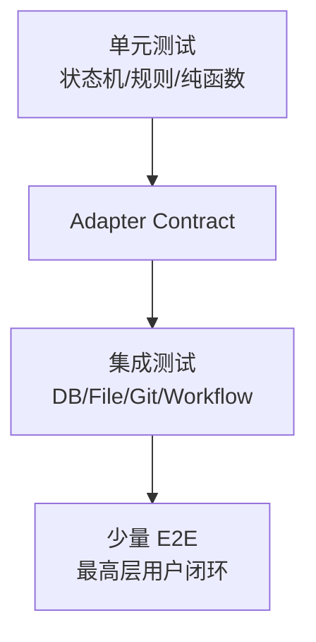
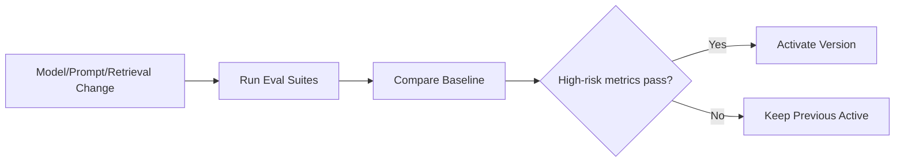

# 测试与 AI 评测架构

## 1. 目标

用可重复证据证明领域正确性、故障恢复、安全和 AI 质量。

## 2. 测试金字塔

## 3. 六个最高层 seam

1. Source → Proposal → Approval → Git → Index。
2. Article Optimization → Revision → Diff → Publish。
3. Query → Retrieval → Answer → Citation/Refusal。
4. Artifact Plan → Sections → Export/Proposal。
5. Graph → Candidate → Health → Relation Proposal。
6. Collection → Review → Score → Schedule。

## 4. 单元测试

- 状态机。
- Change Hash。
- Fingerprint。
- 路径校验。
- Query AST。
- RRF。
- Relation Applicability。
- Scheduler 幂等。
- Error Mapping。

## 5. Adapter Contract

所有 Adapter 测试：

- Success。
- Timeout。
- Retryable/NonRetryable。
- Idempotency。
- Version Conflict。
- Resource Cleanup。

## 6. PostgreSQL 集成

Testcontainers：

- Migration。
- pgvector。
- FTS。
- SKIP LOCKED。
- Outbox。
- Unique Idempotency。
- Explain Plan。

## 7. Filesystem/Git

临时仓库：

- Atomic Write。
- User Concurrent Edit。
- Commit Failure。
- Reverse Commit。
- Symlink Escape。
- Dirty Workspace。

## 8. Workflow 故障注入

- Crash before/after Node Commit。
- Crash after File before Git。
- Duplicate Event。
- Lease Expire。
- Human Double Submit。
- Compensation Failure。
- Cancel at Each Node Type。

### 8.1 M5-04D Safe Writeback 专项

- Approval：服务端 strict clean/attached HEAD、dirty/detached/root mismatch、identity/filter/hidden-index/in-progress 拒绝；Rejected 不读取 Git，历史 `approved_git_head=NULL` 不可 Begin。
- Atomic Begin：双授权绑定、过期和 running lease 在同一事务内消费并创建/重放 Execution；中间失败全部回滚，Credential 不落库。
- 文件检查点：`file_prepared` rename 前后进程崩溃、temp/backup locator 篡改、目标/temp/backup 同内容同 mode 但不同 inode、用户后续编辑、ResumeTarget 和 Cleanup finalize retry。
- Git 检查点：`git_prepared` 后 Commit 成功但 checkpoint 前崩溃、exact Trailer lookup、明确 NotFound 才 Commit、unknown 结果进入人工恢复且不 Restore 文件。
- Publish：Mapping + Reindex Outbox 同事务、重复 delivery 只产生一个事件，结果为 `verifying/index_pending`；M6 Retrieval 未完成前不得断言 completed。
- Composition：`internal/changecontrol/application/writeback_smoke_integration_test.go` 与已纳入提交的 `writeback_fault_smoke_integration_test.go` 验证真实 PostgreSQL + LocalFS + Git 正常/故障恢复；`approval_dispatch_river_smoke_integration_test.go` 进一步验证 Approved HTTP → 原子 Run/Node/Job → 真实 River Claim → Bootstrap 双授权/Begin → Safe Writeback → Workflow Complete，并断言唯一 Mapping/Reindex Outbox、Runtime payload 无越界敏感字段，以及写回后 exact Approval HTTP replay 不访问变化后的文件/Git。`internal/changecontrol/adapter/approvaldispatchpostgres` 覆盖并发单绑定、UoW 回滚和 Commit response-loss replay。fault smoke 文件已经纳入仓库，但它不等同于真实 Worker 子进程 `SIGKILL` + River stuck rescue；后者必须由独立发布 smoke 给出进程退出、Job rescue、lease reclaim 和无重复副作用证据。
- M4-A migration gate：`internal/platform/migration` 的 integration tag 测试验证原始 legacy Goose 解析失败、只读 annotation FS、空库/重复 Up、旧 shell-runner history 接管、River `workflow` Schema、one-step Down→Up 与 Runtime identity guarded Down；`internal/workflow/adapter/postgres` 的 integration tag 测试验证 Start replay/conflict、双并发单 Run/Node/Outbox/Job、Job 插入失败回滚和 Commit response-loss 恢复。
- M4-B runtime gate：`internal/workflow/adapter/postgres/runtime_state_integration_test.go` 与 `runner_state_machine_integration_test.go` 验证 DB-time Claim/Heartbeat、Attempt append-only、lease reclaim/fencing、更高 River transport attempt 在 active lease 期间保持 Job retryable、业务 Retry/Exhaustion、Complete replay、Pause/Resume/Cancel、Human wait/submit、迁移 guarded Down 和事务型 River Job；旧 legacy Repository lease 测试标记为 `legacy_integration`，不再作为 M4-B Runtime 事实源。

### 8.2 M4-D Worker Operability 专项

已落地的自动测试契约：

- `internal/platform/config`：默认值、YAML/环境变量覆盖、非法 queue/timeout/
  lease/heartbeat/stop 组合、Telemetry mode/endpoint 和安全配置字符串。
- `internal/workflow/runtime`、`internal/workflow/httphealth`：并发 readiness snapshot、
  shutdown 不可逆、`/livez|readyz` 状态码、稳定错误白名单和无敏感 payload。
- `internal/workflow/adapter/river`：Producer/Consumer 同 queue、显式 Insert queue、
  Client started/stopped、graceful/emergency lifecycle，以及 metadata 只传播
  `traceparent`；River 保留的 `river:*` recovery metadata 可被 transport 使用但不会
  暴露给 Application；SIGKILL smoke 每次创建独立临时数据库并执行完整 Goose+River
  Up，避免与常驻 Worker 竞争同一 River maintenance leader。
- `cmd/worker`：启动失败、health server、readiness 更新、graceful `Stop` 与 fatal
  `StopAndCancel` 首事件互斥、hard deadline 和资源关闭；fatal channel 在生产
  Composition 中实际注入，只接受四个 Runtime 契约不变量错误码。
- `internal/platform/observability`：Context correlation、日志 fail-closed 脱敏、
  bounded metrics、高基数 label 拒绝、Trace metadata 严格解析、Telemetry
  `disabled/optional/required` 及 shutdown 幂等。
- `internal/app` 与 `RuntimeNodeWorker`：API 在 noop telemetry 下也生成 trace，
  Consumer 在 Claim 前解码 metadata，Claim 后注入 Run/Node/Attempt correlation；
  queue/active/node/retry/manual/lease/heartbeat/duplicate/shutdown 指标在真实事实点发射，
  幂等 transition replay 不重复计数。
- Workflow PostgreSQL/Change Control：用户 Cancel 与 forced cancel 只有在
  Writeback Execution 到达安全 checkpoint 后才允许 terminal cancelled；否则
  `WORKFLOW_CANCELLATION_DEFERRED` 并继续恢复，避免 terminal Workflow + 非终态
  Execution 孤儿状态。

M4-D 于 2026-07-17 已保存以下真实 PostgreSQL/River/容器证据：

1. Compose `up --wait` 同时等待 PostgreSQL、Migrate、API、Worker；容器内外
   readiness 均为 200，runtime UID 为 `10001`，三个二进制均存在。
2. Worker 容器 SIGTERM 退出码为 0，重启后重新 ready。
3. PostgreSQL 短断后 Worker `/readyz` 返回 503，数据库恢复后重新返回 200。
4. `TestRiverSIGKILLRescueSmoke` 启动真实 Worker 子进程、在 Job running 后发送
   SIGKILL，再由新 River Client 执行 stuck rescue 并完成下一 attempt。该测试使用
   独立数据库；常驻 Compose Worker 运行时也不会因 River maintenance leader 竞争失效。
5. Approval River smoke 使用两个 Worker 验证唯一 Execution/Commit/Mapping/Outbox；
   cancellation PostgreSQL smoke 验证 forced cancel 后 lease expiry/reclaim 不产生
   terminal Workflow + 非终态 Execution。
6. observability、health 和 River metadata 自动测试使用 Secret/路径/高基数 canary
   验证拒绝与脱敏。

发布候选仍需重复这些命令；正在执行真实 Safe Writeback 时的容器级 SIGTERM 是下一轮
发布演练的剩余组合场景，不能由空闲 Worker SIGTERM 单独替代。

## 9. E2E

固定 Fixture Workspace，执行 PRD 最终演示场景。

E2E 使用 Fake Model 保证确定性；单独 AI Evaluation 使用真实模型。

## 10. RAG Evaluation

数据：

- Question。
- Scope。
- Relevant Source Spans。
- Conflict。
- Expected Refusal。

指标：

- Recall@K。
- MRR/NDCG。
- Citation Precision/Coverage。
- Faithfulness。
- Conflict Disclosure。
- Refusal。

## 11. Relation Evaluation

- 五分类 Precision/Recall/F1。
- Conflict→Duplicate 高风险错误。
- Evidence Support。
- Low Confidence Appropriateness。

## 12. Article Evaluation

- Meaning Preservation。
- Fact Consistency。
- Protected Span。
- Code Preservation。
- Unsupported Additions。
- Structure/Language Improvement。

## 13. Graph Evaluation

- Relation Accuracy。
- Candidate Precision@K。
- Candidate Recall。
- Ignored Candidate Reappearance。
- Path Correctness。

## 14. Review Evaluation

- Question Answerability。
- Answer Faithfulness。
- Difficulty。
- Duplicate Card。
- Score Agreement。
- Gap Detection。

## 15. Regression Gate

## 16. Test Data

- 不使用真实 Secret。
- 敏感资料脱敏。
- Fixture 可版本化。
- Production Feedback 需人工标注后进入 Gold Set。

## 17. UI

- Component。
- Route Integration。
- SSE Reconnect。
- Diff。
- Graph Accessibility。
- Virtualized Lists。
- E2E Browser。

## 18. Security

- Path Traversal。
- SSRF。
- Prompt Injection。
- XSS。
- CSRF。
- SQL Injection。
- Unauthorized Tool。
- Secret Redaction。

## 19. Performance

- Capacity Dataset。
- Cold/Warm。
- P50/P95/P99。
- DB Explain。
- Index Build。
- Graph Rendering。

## 20. CI

每个 PR：

- Unit。
- Lint/Static。
- Migration。
- Contract。
- Selected Integration。

主分支/发布：

- Full Integration。
- E2E。
- Security。
- Evaluation。
- Docker Smoke。

## 21. Definition of Done

- 主路径和异常路径。
- 审计。
- 可观测。
- 自动测试。
- AI Eval。
- 文档更新。
- 无未说明降级。
