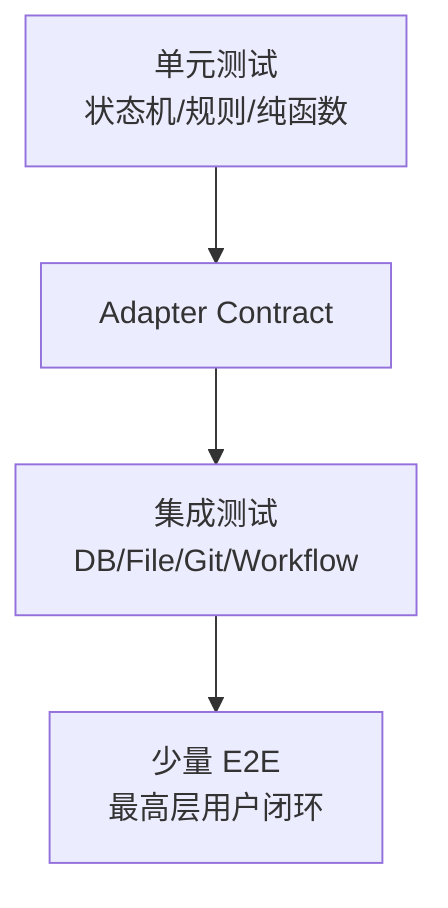
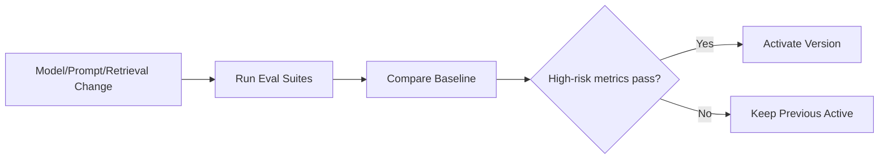

# 测试与 AI 评测架构

## 1. 目标

用可重复证据证明领域正确性、故障恢复、安全和 AI 质量。

## 2. 测试金字塔

## 3. 六个最高层 seam

1. Source → Proposal → Approval → Git → Index。
2. Article Optimization → Revision → Diff → Publish。
3. Query → Retrieval → Answer → Citation/Refusal。
4. Artifact Plan → Sections → Export/Proposal。
5. Graph → Candidate → Health → Relation Proposal。
6. Collection → Review → Score → Schedule。

## 4. 单元测试

- 状态机。
- Change Hash。
- Fingerprint。
- 路径校验。
- Query AST。
- RRF。
- Relation Applicability。
- Scheduler 幂等。
- Error Mapping。

## 5. Adapter Contract

所有 Adapter 测试：

- Success。
- Timeout。
- Retryable/NonRetryable。
- Idempotency。
- Version Conflict。
- Resource Cleanup。

## 6. PostgreSQL 集成

Testcontainers：

- Migration。
- pgvector。
- FTS。
- SKIP LOCKED。
- Outbox。
- Unique Idempotency。
- Explain Plan。

## 7. Filesystem/Git

临时仓库：

- Atomic Write。
- User Concurrent Edit。
- Commit Failure。
- Reverse Commit。
- Symlink Escape。
- Dirty Workspace。

## 8. Workflow 故障注入

- Crash before/after Node Commit。
- Crash after File before Git。
- Duplicate Event。
- Lease Expire。
- Human Double Submit。
- Compensation Failure。
- Cancel at Each Node Type。

### 8.1 M5-04D Safe Writeback 专项

- Approval：服务端 strict clean/attached HEAD、dirty/detached/root mismatch、identity/filter/hidden-index/in-progress 拒绝；Rejected 不读取 Git，历史 `approved_git_head=NULL` 不可 Begin。
- Atomic Begin：双授权绑定、过期和 running lease 在同一事务内消费并创建/重放 Execution；中间失败全部回滚，Credential 不落库。
- 文件检查点：`file_prepared` rename 前后进程崩溃、temp/backup locator 篡改、目标/temp/backup 同内容同 mode 但不同 inode、用户后续编辑、ResumeTarget 和 Cleanup finalize retry。
- Git 检查点：`git_prepared` 后 Commit 成功但 checkpoint 前崩溃、exact Trailer lookup、明确 NotFound 才 Commit、unknown 结果进入人工恢复且不 Restore 文件。
- Publish：Mapping + Reindex Outbox 同事务、重复 delivery 只产生一个事件，结果为 `verifying/index_pending`；M6 Retrieval 未完成前不得断言 completed。
- Composition：`internal/changecontrol/application/writeback_smoke_integration_test.go` 验证真实 PostgreSQL + LocalFS + Git 正常闭环；`writeback_fault_smoke_integration_test.go` 进一步注入 file/Git checkpoint、Publish 和 cleanup finalize response loss，销毁旧 Service/Writer 后从持久检查点重放，确认只保留一个 Commit/Mapping/Outbox。M4-A 的通用 River Registry/InsertTx/Deterministic Worker 与 Safe Writeback Node 仍是不同任务边界，M4-D 才负责生产 lifecycle 接线。
- M4-A migration gate：`internal/platform/migration` 的 integration tag 测试验证原始 legacy Goose 解析失败、只读 annotation FS、空库/重复 Up、旧 shell-runner history 接管、River `workflow` Schema、one-step Down→Up 与 Runtime identity guarded Down；`internal/workflow/adapter/postgres` 的 integration tag 测试验证 Start replay/conflict、双并发单 Run/Node/Outbox/Job、Job 插入失败回滚和 Commit response-loss 恢复。

## 9. E2E

固定 Fixture Workspace，执行 PRD 最终演示场景。

E2E 使用 Fake Model 保证确定性；单独 AI Evaluation 使用真实模型。

## 10. RAG Evaluation

数据：

- Question。
- Scope。
- Relevant Source Spans。
- Conflict。
- Expected Refusal。

指标：

- Recall@K。
- MRR/NDCG。
- Citation Precision/Coverage。
- Faithfulness。
- Conflict Disclosure。
- Refusal。

## 11. Relation Evaluation

- 五分类 Precision/Recall/F1。
- Conflict→Duplicate 高风险错误。
- Evidence Support。
- Low Confidence Appropriateness。

## 12. Article Evaluation

- Meaning Preservation。
- Fact Consistency。
- Protected Span。
- Code Preservation。
- Unsupported Additions。
- Structure/Language Improvement。

## 13. Graph Evaluation

- Relation Accuracy。
- Candidate Precision@K。
- Candidate Recall。
- Ignored Candidate Reappearance。
- Path Correctness。

## 14. Review Evaluation

- Question Answerability。
- Answer Faithfulness。
- Difficulty。
- Duplicate Card。
- Score Agreement。
- Gap Detection。

## 15. Regression Gate

## 16. Test Data

- 不使用真实 Secret。
- 敏感资料脱敏。
- Fixture 可版本化。
- Production Feedback 需人工标注后进入 Gold Set。

## 17. UI

- Component。
- Route Integration。
- SSE Reconnect。
- Diff。
- Graph Accessibility。
- Virtualized Lists。
- E2E Browser。

## 18. Security

- Path Traversal。
- SSRF。
- Prompt Injection。
- XSS。
- CSRF。
- SQL Injection。
- Unauthorized Tool。
- Secret Redaction。

## 19. Performance

- Capacity Dataset。
- Cold/Warm。
- P50/P95/P99。
- DB Explain。
- Index Build。
- Graph Rendering。

## 20. CI

每个 PR：

- Unit。
- Lint/Static。
- Migration。
- Contract。
- Selected Integration。

主分支/发布：

- Full Integration。
- E2E。
- Security。
- Evaluation。
- Docker Smoke。

## 21. Definition of Done

- 主路径和异常路径。
- 审计。
- 可观测。
- 自动测试。
- AI Eval。
- 文档更新。
- 无未说明降级。
