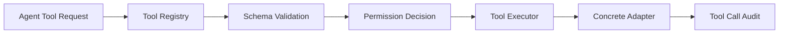

# Tool Calling 与工具安全

## 1. 目标

确保 Agent 只能通过注册、验证、授权和审计后的工具访问外部能力。

## 2. 架构

## 3. Tool Definition

- name。
- description。
- input_schema。
- output_schema。
- permissions。
- side_effect_level。
- timeout。
- retry_policy。
- idempotency_policy。
- sensitive_fields。
- allowed_workflows。

## 4. 权限

| 权限 | 能力 |
|---|---|
| READ_LOCAL | 读取 Workspace 内资料 |
| READ_EXTERNAL | 访问用户允许网页 |
| WRITE_PROPOSAL | 创建候选/Proposal |
| WRITE_KNOWLEDGE | 执行已批准文件写入 |
| GIT_WRITE | 创建批准 Commit |
| INDEX_MAINTENANCE | 索引构建/切换 |
| EVALUATION_RUN | 运行评测 |

## 5. 授权上下文

写权限要求：

- Workflow Run。
- Node ID。
- Proposal ID。
- Proposal Revision。
- Approval ID。
- Approved Change Hash。
- Target Version。
- Expiry。

授权令牌只在服务端存在，不发送给模型。

## 6. 核心工具

### SearchKnowledge

- 只读。
- 返回 Evidence Items。
- 不返回密钥和任意文件。

### ReadSource/ReadDocument

- 路径由稳定 ID 解析。
- 不允许模型传入任意绝对路径。

### FetchWebPage

- READ_EXTERNAL。
- SSRF 防护。
- 内容大小和类型限制。

### CalculateDiff

- 纯函数。
- 输入为已授权内容。

### ApplyApprovedPatch

- WRITE_KNOWLEDGE。
- 必须匹配 Change Hash。
- 幂等。

### CreateGitCommit

- GIT_WRITE。
- Commit 关联 Proposal。
- 不允许任意 Git 参数。

### RebuildIndex

- INDEX_MAINTENANCE。
- 需要范围和 Index Version。

## 7. Prompt Injection

防御：

- Source 标记 untrusted。
- Tool Result 标记 data。
- System Policy 不与 Source 拼接为同等角色。
- Tool Permission 由服务端 Workflow 决定。
- 模型不能请求未注册工具。

检测：

- 要求忽略系统规则。
- 要求读取 Secret。
- 要求访问 Workspace 外路径。
- 要求自动批准。

检测到可疑内容：

- 添加风险标记。
- 高风险 Source 可隔离。
- 记录安全审计。

## 8. 文件路径

- 只接受 Stable Object ID。
- Adapter 解析 canonical path。
- filepath.Clean/Abs 后检查根目录。
- 检查符号链接最终目标。
- 禁止 NUL、设备文件和特殊路径。

## 9. 命令执行

- 使用固定可执行文件。
- 参数数组，不拼 shell。
- 禁止用户输入成为命令名。
- 超时和输出大小限制。
- 工作目录固定。

Git 允许命令白名单：

- status。
- diff。
- add 指定文件。
- commit 固定参数。
- show。
- rev-parse。

## 10. SSRF

- 只允许 http/https。
- DNS 解析后检查地址。
- 阻止 loopback、private、link-local、multicast、metadata。
- 每次重定向重新检查。
- 限制重定向、时间、大小。
- 可选域名 Allowlist。

## 11. Tool Output

- 输出通过 Schema。
- 截断超大响应。
- Secret 脱敏。
- HTML 清理。
- 不直接作为下一条 System Message。

## 12. 幂等

有副作用工具必须：

- 要求 idempotency_key。
- 执行前查询已有结果。
- 成功后原子保存结果。
- 重复调用返回既有结果。

## 13. 超时与重试

- Read/Search 可安全重试。
- Web Fetch 可安全重试但受频率限制。
- File/Git 根据幂等记录重试。
- 非幂等未知结果进入人工恢复。

## 14. 审计

记录：

- 调用者。
- Workflow/Node。
- Tool。
- 权限。
- 参数摘要。
- 目标。
- Idempotency Key。
- 耗时。
- 结果/错误。

不记录：

- 完整 API Key。
- 未脱敏 Authorization。
- 不必要的全文。

## 15. 威胁场景

| 场景 | 防护 |
|---|---|
| PDF 指令要求删除文件 | Source 不影响权限 |
| 模型请求 /etc/passwd | Stable ID + Workspace Root |
| URL 指向 169.254.169.254 | SSRF 地址阻止 |
| 重复 Git Tool Call | Idempotency + Proposal Commit Mapping |
| Approval 后内容被修改 | Change Hash/Version 校验 |
| Tool 返回恶意 Prompt | Output 当作 untrusted data |

## 16. 测试

- 权限矩阵。
- Schema Fuzz。
- 路径穿越。
- Symlink Escape。
- SSRF Redirect。
- Command Injection。
- Duplicate Side Effect。
- Audit Redaction。

