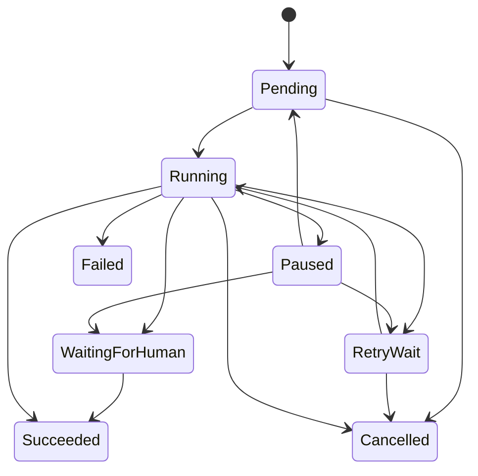
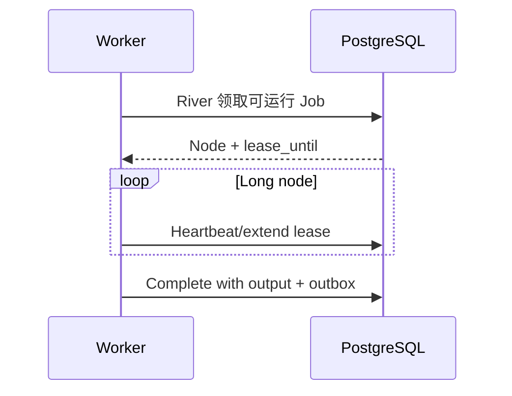
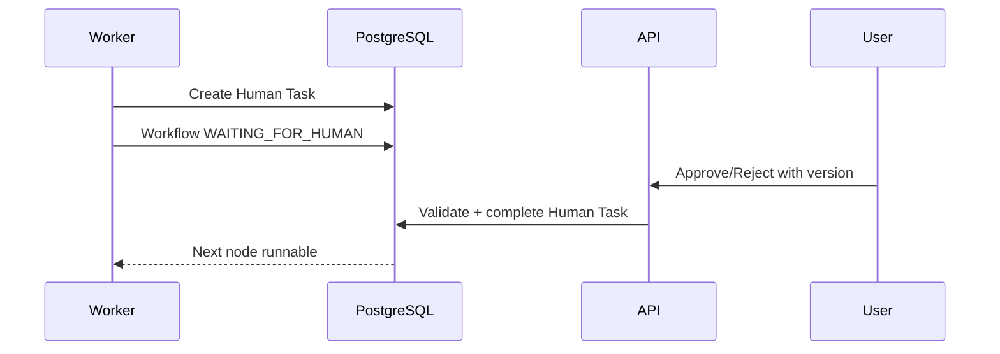
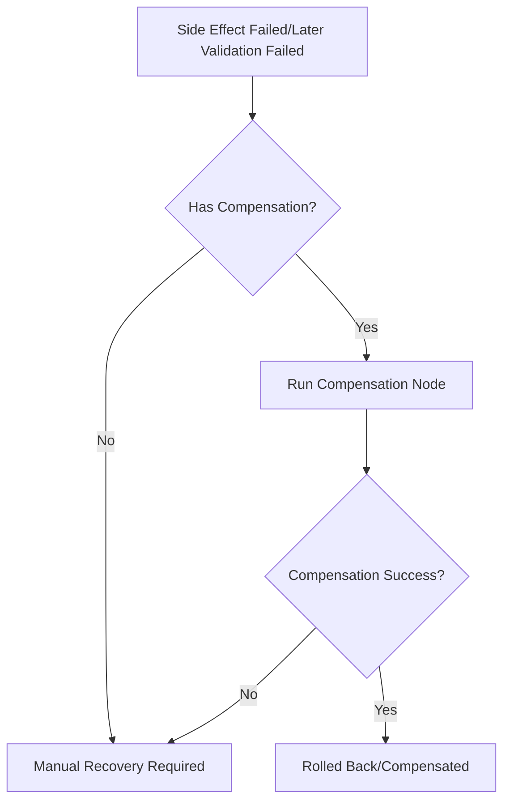

# 持久化工作流引擎设计

## 1. 目标

支持长任务、Agent 节点、Human-in-the-Loop、重试、暂停、恢复、幂等副作用和补偿。

## 2. 设计选择

使用 PostgreSQL 持久化领域工作流状态，River 负责可运行节点的任务投递与 Worker 获取；不在正式 v1.0 引入 Temporal。Workflow Definition、Node 状态和补偿语义仍由 Workflow Module 掌握，River 不是业务事实源。

实现边界：M4-A 已接入 River v0.40.0 的 schema-scoped Client、稳定 Node Job Args、tx-scoped InsertTx、Definition/Executor Registry 和 Deterministic Worker smoke。M4-B 已接入 PostgreSQL DB-time Claim/Heartbeat、append-only Attempt、Retry/Fail/Complete、DAG 后继、Human Task、Pause/Resume/Cancel。M4-C 已接入 Approval/Safe Writeback 原子 Dispatch、pre-Begin Bootstrap、Execution exact lookup 与真实 River Worker 闭环；每次 delivery 使用唯一 lease owner，持久 Args 严格拒绝额外字段。M4-D 已将生产 Worker 的 queue/concurrency/timeout/rescue/lease/heartbeat 配置、River migration Validate、独立 `/livez|readyz`、互斥停机控制器、脱敏 observability seam 和 Docker API/Worker/Migrate 交付入口接线。River 仍只负责投递/领取，Workflow PostgreSQL 表是业务事实源。

见 [ADR-0006](adr/0006-postgres-durable-workflow.md)。

## 3. 核心模型

- Workflow Definition：版本化 DAG。
- Workflow Run：一次执行。
- Node Run：节点尝试。
- Human Task：等待用户。
- Tool Call：工具执行。
- Compensation Record：补偿。
- Outbox Event：可靠事件。

## 4. 节点类型

| 类型 | 例子 | 副作用 |
|---|---|---|
| Deterministic | Hash、状态判断 | 无 |
| Model | Claim 提取 | 外部调用 |
| Retrieval | Hybrid Search | 查询 |
| Decision | 关系分支 | 无 |
| Human | Approval | 等待 |
| Tool | Web Fetch | 取决于工具 |
| SideEffect | Write/Git | 有 |
| Validation | Citation/Regression | 无或查询 |

## 5. 状态



## 6. Definition

每个节点定义：

- node_id。
- type。
- dependencies。
- input_schema_version。
- output_schema_version。
- timeout。
- retry_policy。
- idempotency_policy。
- required_permissions。
- compensation_node。

Definition 发布后不可原地修改；创建新版本。

## 7. Worker 租约



规则：

- lease_owner 唯一。
- 心跳失败时 Worker 停止执行新副作用。
- 过期租约可被其他 Worker 回收。
- Side Effect 执行前再次确认租约。
- Claim、Heartbeat、Complete、Retry、Fail 和控制命令的资格时间只取 PostgreSQL 时间；旧 owner 使用 owner + attempt + node version + 未过期 lease fence。
- 同一 River Job 的更高 transport attempt 若在旧 Workflow lease 到期前到达，返回 retryable `WORKFLOW_LEASE_HELD`，不得当作 benign stale 返回成功；否则 River 会完成唯一 Job，而 Node 在 lease 到期后失去 reclaim delivery。终态 Run、旧 dispatch 或同 attempt 的真实 duplicate 仍按 stale no-op 处理。
- Attempt 历史只允许 running 向一个终态前进；相同 delivery 重放不重复 Attempt，业务 retry 才递增 retry_no。

### 7.1 Worker 运行与健康契约

生产 Worker 启动顺序固定为：加载并校验配置 → 打开并 Ping PostgreSQL →
River migration `Validate` → 构造并冻结 Definition/Executor Registry 与依赖 →
启动独立 health server → 启动 River Client → 标记 ready。API `/readyz` 不能
代表 Worker 状态。

Worker `/livez` 在 health server 存活时返回 200。`/readyz` 只有在以下位全部
为 true 且进程未进入 shutdown 时返回 200：

- PostgreSQL 当前可用。
- River `workflow` Schema 通过 migration `Validate`。
- River Client 已启动。
- Definition Registry 已冻结。
- Executor Registry 已冻结。
- 启用 Definition 的运行依赖已注入。

健康响应只返回 `status/code/version` 白名单，不暴露 DSN、路径、异常 cause、
队列内容或领域正文。开始 shutdown 后 readiness 不可逆地变为 false。

### 7.2 Worker 配置不变量

| 配置 | 默认值 | 约束 |
|---|---:|---|
| `ZHIXU_WORKER_QUEUE` | `workflow` | Producer/Consumer 必须相同；队列名只允许小写字母、数字、`_`、`-` |
| `ZHIXU_WORKER_MAX_WORKERS` | `4` | 正整数 |
| `ZHIXU_WORKER_JOB_TIMEOUT` | `15m` | 小于 rescue interval |
| `ZHIXU_WORKER_RESCUE_STUCK_AFTER` | `30m` | 大于 job timeout |
| `ZHIXU_WORKFLOW_LEASE` | `2m` | 正时长 |
| `ZHIXU_WORKFLOW_HEARTBEAT` | `30s` | 小于 lease 的三分之一 |
| `ZHIXU_WORKER_SOFT_STOP_TIMEOUT` | `30s` | 小于 hard deadline |
| `ZHIXU_WORKER_HARD_STOP_TIMEOUT` | `60s` | 超时后进程失败退出 |
| `ZHIXU_WORKER_HEALTH_ADDR` | `0.0.0.0:8081` | 合法且非零的 `host:port` |

同一 queue 配置同时传给事务插入 Client 和消费 Client；Job 插入显式写入
River queue，禁止 Producer 落入 `default` 而 Worker 只消费 `workflow`。

### 7.3 停机与崩溃恢复

- River `Start` 使用独立进程 Context，不直接绑定 OS signal，避免 signal cancel
  隐式触发第二种停机路径。
- SIGINT/SIGTERM 选择 graceful `Stop`；River 在 `SoftStopTimeout` 后取消活动
  Job Context，但仍等待 Worker 返回。
- 稳定 fatal invariant 可选择 emergency `StopAndCancel`。生命周期控制器以
  首次状态转换决定模式，两条 API 互斥，后续 signal/fatal 事件只等待同一结果。
- 超过 `WorkerHardStopTimeout` 返回非零失败；这不表示文件、Git 或其他外部
  副作用已经回滚。
- 非优雅退出后由 River rescue、Workflow lease、Attempt fence 和领域 durable
  checkpoint 恢复。`worker_kill_smoke_integration_test.go` 已验证真实子进程
  SIGKILL → River rescue → 新 attempt；文件/Git/DB 副作用唯一性仍由独立
  Writeback fault smoke、Approval 双 Worker和 lease reclaim 测试共同证明，不能由
  restart policy 推断。

## 8. 节点完成事务

同一事务：

1. 校验 Node 状态和 River Job/租约。
2. 保存 Output。
3. 标记 Succeeded。
4. 计算可运行后继节点。
5. 写入 Outbox。
6. 更新 Workflow Checkpoint。

## 9. 重试

错误分类：

- Retryable：超时、限流、暂时网络、锁冲突。
- NonRetryable：Schema、权限、非法状态、证据缺失。
- Manual：一致性损坏、补偿失败。

退避：

- 指数退避。
- 随机抖动。
- 最大次数。
- Retry-After 优先。
- 达到 `max_retries` 后写入 `WORKFLOW_RETRY_EXHAUSTED`，不再创建 River Job。

## 10. 幂等

Idempotency Key：

```text
workflow_run_id + node_id + logical_operation + target_version
```

应用：

- Tool Call。
- File Write。
- Git Commit。
- Index Revision。
- Review Answer。
- Event Publish。

Safe Writeback 额外要求：Begin 在同一 PostgreSQL 事务内消费文件/Git 双授权、校验 running lease、创建或重放 Execution；文件 `file_prepared` 与 Git `git_prepared` 检查点必须先落库再开始对应副作用。Git Commit 重放先 exact Trailer lookup，明确 NotFound 才可提交；Safe Writeback Node 的 `Succeeded` 只表示 Publish 和 cleanup finalize 已到 `verifying/index_pending`，M6 Retrieval 完成前 Proposal 不能标记 `completed`。

## 11. Human Node



Human Task：

- expected_input_schema。
- target_version。
- expires_at optional。
- status。
- Submit 按 `expected_input_schema`、`target_version`、过期时间和 decision hash 校验；同一 decision 重放幂等，不同 decision 冲突。等待期间不占 Worker lease。

## 12. 暂停、取消与恢复

暂停：

- 阻止领取新 Node。
- 不强制中断正在执行的不可中断外部调用。
- 持久化 `pause_requested_at`；运行节点在安全 checkpoint 归约为 paused，旧 River delivery benign 结束，不产生新 Attempt、Job 或后继。

取消：

- 标记 Workflow Cancel Requested。
- 已开始 Side Effect 根据策略完成或补偿。
- 不假装撤销已提交 Git Commit。
- 持久化 `cancel_requested_at`；pending/retry/waiting 节点取消，运行节点在 checkpoint 归约 cancelled；数据库/transport 故障不能伪装成成功。
- 对 Safe Writeback 等已开始外部副作用的 Node，Runtime 在同一事务内查询领域
  cancellation safety：未创建 Execution，或 Execution 已到 `needs_revision`、
  `apply_failed`、`compensated`、`manual_recovery_required`、`verify_failed`、
  `rolled_back`、`completed`，或 `verifying` 且 cleanup 已完成时，才允许 Node/Run
  进入 terminal cancelled。
  否则返回 retryable `WORKFLOW_CANCELLATION_DEFERRED` 并保持可恢复执行，禁止
  留下 terminal Workflow + 非终态 Writeback Execution 的孤儿组合。

恢复：

- 过期租约回收。
- 检查幂等记录。
- 从持久化 Output 继续。
- Resume 只为满足依赖且无有效 generation 的节点入队；未投递节点使用 dispatch_no=1，已有 generation 才递增，retry_no 不变。

## 13. 补偿



示例：

- 文件替换后 Commit 失败 → 恢复旧文件。
- 内容验证失败 → 在严格 HEAD/clean 前提下创建反向 Commit。
- Commit 结果未知或已确认提交 → 保留文件，禁止 Restore，走 Trailer/Mapping reconcile。
- 索引失败 → 不回滚文件，保持 `verifying/index_pending`，由 Retrieval 任务重试。

## 14. Workflow 升级

- 运行中的 Run 继续使用启动版本。
- 新 Run 使用新版本。
- 只有安全的数据迁移才能升级运行中 Context。
- Node Schema 提供 Upcaster。

## 15. 任务优先级

- 用户交互写回。
- RAG。
- 手动导入。
- Review。
- 定时健康扫描。
- 全量索引维护。

低优先任务不得饿死；使用队列配额。

## 16. 并发

- 同一 Document 写入串行。
- 同一 Proposal Apply 串行。
- 解析不同 Source 可并行。
- Embedding 批处理。
- 健康扫描按范围分片。

## 17. 清理

- 完成 Node Output 按保留策略归档。
- 审计和 Approval 永久或长期保留。
- 租约和临时上下文可清理。

## 18. 可观测性

Metrics：

- 有界名称包括 queue depth、active workers、Node duration/result、retry、manual
  recovery、lease expiry、heartbeat failure、duplicate delivery 和 shutdown。
- Workspace/Proposal/Run/Node/Job ID 只能进入日志和 Trace，不得成为 metric label。
- queue depth 只统计 River `available` 且已到 `scheduled_at` 的可立即领取 Job；active
  workers 使用本进程 Work 进入/退出计数。
- Claim 结果以 `ObservedNodeKind/DuplicateDelivery/LeaseReclaimed` 暴露事务事实；
  结果事务以 `Replayed` 区分新提交与幂等重放，避免重复发射结果指标。

Trace：

- HTTP/Approval 到 River 异步边界只传播校验后的 W3C `traceparent`；River 保留的
  `river:*` recovery metadata 可被 transport 更新但不会进入 Application；其余
  metadata 一律拒绝，Job Args 仍只携带 Node identity。
- Workflow Run ID 等业务 ID 作为 correlation/trace attribute，不写入 metric label。
- emergency reporter 只接受 Claim/Heartbeat/Transition/Executor Result 四类契约不变量码；
  Manual Recovery、依赖错误、lease/control 和非法 Job 不升级为全进程强停。

## 19. 测试

- Crash after side effect before DB complete。
- Duplicate delivery。
- Lease expiry。
- Human double submit。
- Definition version mismatch。
- Compensation failure。
- Cancel during model/tool/write。
- 自定义短 rescue 周期的进程 smoke 必须使用独立数据库或独立 River Schema；只换 queue
  不能隔离同一 Schema 内的 maintenance leader。

## 20. 不采用

- 内存状态机。
- 大 switch 直接执行全部步骤。
- Handler 内同步执行长工作流。
- 捕获异常后标记成功。
