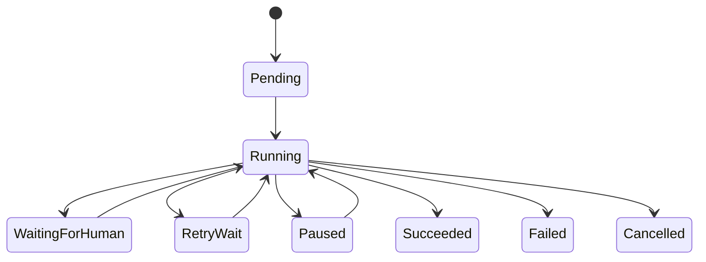
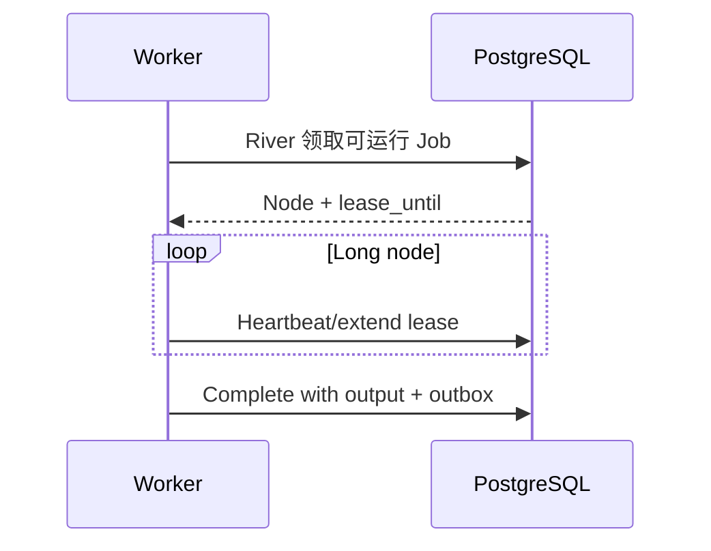
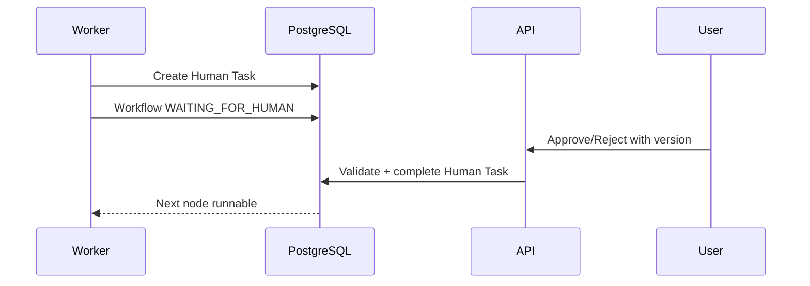
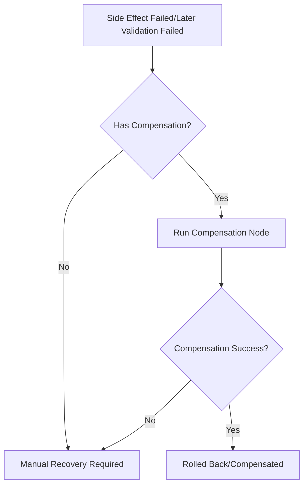

# 持久化工作流引擎设计

## 1. 目标

支持长任务、Agent 节点、Human-in-the-Loop、重试、暂停、恢复、幂等副作用和补偿。

## 2. 设计选择

使用 PostgreSQL 持久化领域工作流状态，River 负责可运行节点的任务投递与 Worker 获取；不在正式 v1.0 引入 Temporal。Workflow Definition、Node 状态和补偿语义仍由 Workflow Module 掌握，River 不是业务事实源。

见 [ADR-0006](adr/0006-postgres-durable-workflow.md)。

## 3. 核心模型

- Workflow Definition：版本化 DAG。
- Workflow Run：一次执行。
- Node Run：节点尝试。
- Human Task：等待用户。
- Tool Call：工具执行。
- Compensation Record：补偿。
- Outbox Event：可靠事件。

## 4. 节点类型

| 类型 | 例子 | 副作用 |
|---|---|---|
| Deterministic | Hash、状态判断 | 无 |
| Model | Claim 提取 | 外部调用 |
| Retrieval | Hybrid Search | 查询 |
| Decision | 关系分支 | 无 |
| Human | Approval | 等待 |
| Tool | Web Fetch | 取决于工具 |
| SideEffect | Write/Git | 有 |
| Validation | Citation/Regression | 无或查询 |

## 5. 状态



## 6. Definition

每个节点定义：

- node_id。
- type。
- dependencies。
- input_schema_version。
- output_schema_version。
- timeout。
- retry_policy。
- idempotency_policy。
- required_permissions。
- compensation_node。

Definition 发布后不可原地修改；创建新版本。

## 7. Worker 租约



规则：

- lease_owner 唯一。
- 心跳失败时 Worker 停止执行新副作用。
- 过期租约可被其他 Worker 回收。
- Side Effect 执行前再次确认租约。

## 8. 节点完成事务

同一事务：

1. 校验 Node 状态和 River Job/租约。
2. 保存 Output。
3. 标记 Succeeded。
4. 计算可运行后继节点。
5. 写入 Outbox。
6. 更新 Workflow Checkpoint。

## 9. 重试

错误分类：

- Retryable：超时、限流、暂时网络、锁冲突。
- NonRetryable：Schema、权限、非法状态、证据缺失。
- Manual：一致性损坏、补偿失败。

退避：

- 指数退避。
- 随机抖动。
- 最大次数。
- Retry-After 优先。

## 10. 幂等

Idempotency Key：

```text
workflow_run_id + node_id + logical_operation + target_version
```

应用：

- Tool Call。
- File Write。
- Git Commit。
- Index Revision。
- Review Answer。
- Event Publish。

## 11. Human Node



Human Task：

- expected_input_schema。
- target_version。
- expires_at optional。
- status。

## 12. 暂停、取消与恢复

暂停：

- 阻止领取新 Node。
- 不强制中断正在执行的不可中断外部调用。

取消：

- 标记 Workflow Cancel Requested。
- 已开始 Side Effect 根据策略完成或补偿。
- 不假装撤销已提交 Git Commit。

恢复：

- 过期租约回收。
- 检查幂等记录。
- 从持久化 Output 继续。

## 13. 补偿



示例：

- 文件替换后 Commit 失败 → 恢复旧文件。
- 内容验证失败 → 反向 Commit。
- 索引失败 → 不回滚文件，重试索引。

## 14. Workflow 升级

- 运行中的 Run 继续使用启动版本。
- 新 Run 使用新版本。
- 只有安全的数据迁移才能升级运行中 Context。
- Node Schema 提供 Upcaster。

## 15. 任务优先级

- 用户交互写回。
- RAG。
- 手动导入。
- Review。
- 定时健康扫描。
- 全量索引维护。

低优先任务不得饿死；使用队列配额。

## 16. 并发

- 同一 Document 写入串行。
- 同一 Proposal Apply 串行。
- 解析不同 Source 可并行。
- Embedding 批处理。
- 健康扫描按范围分片。

## 17. 清理

- 完成 Node Output 按保留策略归档。
- 审计和 Approval 永久或长期保留。
- 租约和临时上下文可清理。

## 18. 可观测性

Metrics：

- Run 数量/状态。
- Node 延迟。
- 重试次数。
- 租约过期。
- Human Wait。
- Compensation。

Trace：

- Workflow Run ID 作为根 Correlation。

## 19. 测试

- Crash after side effect before DB complete。
- Duplicate delivery。
- Lease expiry。
- Human double submit。
- Definition version mismatch。
- Compensation failure。
- Cancel during model/tool/write。

## 20. 不采用

- 内存状态机。
- 大 switch 直接执行全部步骤。
- Handler 内同步执行长工作流。
- 捕获异常后标记成功。
