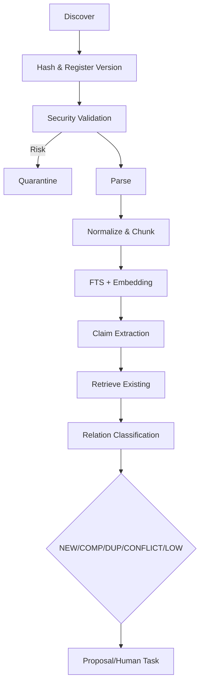

# 资料摄取与知识整理流程

## 1. 目标

将原始资料安全转换为可检索投影，抽取知识并生成可审批的整理建议。

## 2. 触发

- Inbox 文件发现。
- 上传文件。
- 粘贴文本。
- 网页 URL。
- Workspace 增量扫描。

## 3. 输入

- Workspace ID。
- Source Location/Content。
- Import Policy：archive/index/analyze/optimize。
- Web Permission。

## 4. 输出

- Source/Source Version。
- Parsed Document/Chunk。
- Index Projection。
- Claim/Relation Candidates。
- Proposal 或 Human Task。

## 5. 流程

## 6. Node

1. RegisterSourceVersion：幂等 content hash。
2. SecurityValidate：不可重试风险进入隔离。
3. Parse：Parser Adapter。
4. Chunk：确定性版本。
5. Index：批量。
6. ExtractClaims：Model。
7. RetrieveCandidates。
8. ClassifyRelations。
9. ReviewEvidence。
10. CreateProposal/HumanTask。

## 7. 分支

- 完全重复：复用现有投影，记录新 Provenance。
- 同路径内容变化：新 Source Version。
- Parser Failed：失败队列。
- 模型不可用：完成 Index，AI 节点等待。
- Low Confidence：受控检索或 Human Task。

## 8. 幂等

- source_id + content_hash。
- chunk content hash + strategy version。
- embedding hash + model version。
- relation candidate fingerprint。

## 9. 补偿

- Parse/Index 失败不删除 Source Version。
- 部分 Chunk 写入失败回滚该批次投影。
- AI 失败不影响已完成可检索状态。

## 10. 可观测

- 每阶段数量和耗时。
- Parser Warning。
- Embedding Batch。
- Candidate 数。
- 关系分类分布。

## 11. 安全

- MIME/扩展校验。
- 大小限制。
- Prompt Injection 标记。
- 网页 SSRF。
- 隔离内容不索引。

## 12. 验收

- 重复导入不重复索引。
- Source Span 可定位。
- 单文件失败不影响批次。
- 未批准候选不进入正式图谱。

