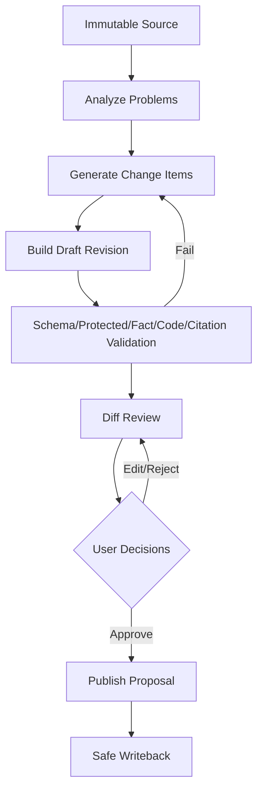

# 文章优化与版本入库流程

## 1. 目标

在保留原文和事实的前提下优化文章，逐项审批后发布正式 Revision。

## 2. 触发

- Inbox 选择优化。
- Document 创建新优化版本。
- 历史 Revision 再优化。

## 3. 输入

- Source/Revision。
- Mode：light/structure/deep。
- Audience/Tone/Length。
- Protected Spans/Terms。
- Knowledge/Web Permission。

## 4. 输出

- Article Revision Draft。
- Change Items。
- Diff。
- Validation Report。
- Publish Proposal。

## 5. 流程

## 6. Mode

Light：

- 语言、标点、格式。
- 不改结构和事实。

Structure：

- 标题、段落、去重、摘要。
- 删除信息显式展示。

Deep：

- 检索已有知识。
- 补充建议和内部冲突。
- 无来源新增不得直接进正文。

## 7. Change Item

- original_span。
- replacement。
- type。
- reason。
- semantic_risk。
- evidence_refs。
- user_decision。

## 8. 校验

- Protected Span Hash。
- Facts against Source。
- Code AST/Text Integrity（按语言能力）。
- Citation。
- Unsupported Addition。
- Removed Information。

## 9. 用户编辑

- 每次保存创建 Proposal Revision。
- 用户修改后局部重新校验。
- 原始 AI Draft 保留。

## 10. 并发

- 同一 Parent 可多个 Draft。
- 发布时校验目标 Document 当前 Revision。
- 版本变化进入三方合并。

## 11. 失败

- Schema 错误：有限修复重试。
- Fact Failed：禁止 Review。
- Model Down：保持 Draft/Workflow。
- Publish Failed：Safe Writeback 补偿。

## 12. 验收

- 原文不可变。
- 三种 Mode 边界明确。
- 可逐项接受/拒绝。
- 代码和禁止修改内容受保护。
- Published Revision 有 Git Commit。

