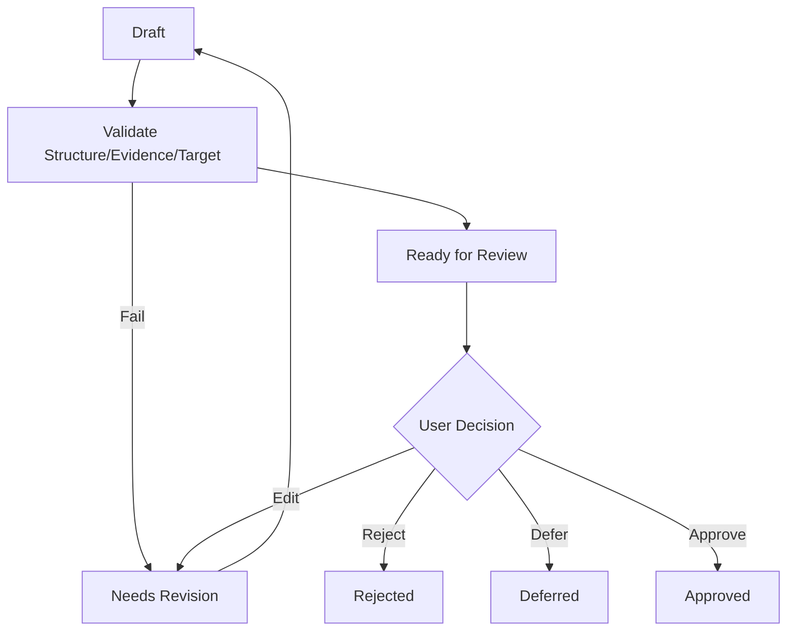

# Proposal、审批与安全写回流程

## 1. 目标

作为所有正式知识和关系变更的唯一写入流程，保证理解、授权、一致性、审计和回滚。

## 2. 输入

- Proposal Type。
- Target Refs/Base Versions。
- Change Set。
- Evidence。
- Risk。
- Rollback Plan。

## 3. Proposal 准备



## 4. 批准校验

- Proposal Revision。
- Change Hash。
- Target Version。
- Evidence Reachable。
- High Risk Confirmed。
- 服务端捕获 strict clean、attached Git HEAD（canonical root、identity、filter/hidden-index/in-progress 检查）；该 HEAD 写入 `approved_git_head`，客户端不得提交 expected HEAD。Rejected 决策不读取 Git；历史 `approved_git_head=NULL` 的 Approval 不得 Safe Writeback。

## 5. 写回

```mermaid
sequenceDiagram
    participant O as Trusted Orchestrator
    participant C as Change Control
    participant DB as PostgreSQL
    participant W as Workspace
    participant G as Git
    O->>C: Begin(identity, two credentials, idempotency)
    C->>DB: Atomic Begin: validate lease + consume both + create/replay Execution
    DB-->>C: prepared / Proposal=applying
    C->>W: lock + Prepare temp/backup + validate
    C->>DB: checkpoint file_prepared (durable intent)
    C->>W: final Base CAS + atomic replace
    C->>DB: checkpoint file_applied
    C->>G: Diff check
    C->>DB: checkpoint git_prepared (Diff/Blob/Mode)
    C->>G: exact lookup; only NotFound may Commit
    G-->>C: Commit ID or manual recovery
    C->>DB: checkpoint git_committed / Proposal=applied
    C->>DB: atomic Mapping + Reindex Outbox Publish
    DB-->>C: verifying/index_pending
    C->>W: cleanup temp/backup evidence
    C->>DB: cleanup finalize (retryable)
```

Begin 的两份授权、Proposal/Revision/Approval/Target/HEAD 均从持久化事实绑定；Credential 不进入 Node input、Execution、Outbox、日志或返回值。Safe Writeback Node 成功只表示 Publish 与 cleanup finalize 已到 `verifying/index_pending`，不表示 Retrieval/Regression completed。生产路径已接入 Approved HTTP → 原子 Run/Node/Outbox/River Job → Bootstrap 双授权/Begin → Safe Writeback → Workflow Complete；Producer/Consumer 使用同一显式 queue，River Job Args 只含 Node identity，项目 metadata 只写校验后的 `traceparent`，River 自有 `river:*` recovery 字段不会进入 Application。Workflow PostgreSQL 与 Change Control Execution 仍是事实源，River 仅负责投递和重试。

用户 Cancel 或 Worker forced cancel 不能越过写回恢复边界：未创建 Execution，或
Execution 已到 `needs_revision`、`apply_failed`、`compensated`、
`manual_recovery_required`、`verify_failed`、`rolled_back`、`completed`，或
`verifying` 且 cleanup 已完成时，Runtime 才允许 terminal cancelled；其他状态
返回 `WORKFLOW_CANCELLATION_DEFERRED`，继续从 durable checkpoint 恢复或进入
Manual Recovery，禁止 terminal Workflow + 非终态 Execution。

## 6. 三方合并

输入：

- Approved Base。
- Current File。
- Proposed Result。

输出：

- 自动无冲突合并。
- 冲突区块。
- 新 Proposal Revision。

必须重新审批。

M5-04D 当前不实现自动三方合并；任何 Base/HEAD 冲突只进入 Needs Revision，由后续 Proposal Revision 流程处理。

## 7. 失败矩阵

| 失败点 | 处理 |
|---|---|
| Begin 双授权/lease/绑定 | 整事务回滚，不消费半份授权，不创建孤立 Execution |
| Lock/Version/HEAD | `needs_revision`，无文件/Git/Mapping 副作用 |
| Temp Write | 删除临时文件；正式文件保持原状，`apply_failed` |
| `file_prepared` 恢复 | Base 继续 CAS；Result+完整 backup 识别已应用；未知/篡改进入人工恢复 |
| Atomic Replace | 保持原文件；结果不确定保留 intent/backup，禁止假成功 |
| Diff/Git preflight | Git 明确未提交时可 `compensating_file → compensated`；未知结果不 Restore |
| Commit lookup/Commit | 先 exact Trailer lookup；明确 NotFound 才 Commit；unknown/conflict 进入人工恢复且不重复 Commit |
| DB Publish | Commit 已存在时保留文件，重建 Mapping + Outbox；Read-only Recovery/Reconcile，禁止恢复文件 |
| Cleanup finalize | 保持 `verifying/index_pending`，保留恢复证据并可重试 |
| Index | M6 Retrieval 消费 Outbox，保持 `index_pending/stale`，不撤销 Commit |
| Regression | 严格 HEAD/clean 前提下创建反向 Commit，否则人工恢复；不得重写历史 |

## 8. 权限

Approval 生成短期 Write Authorization：

- Proposal/Revision。
- Change Hash。
- Targets。
- Expiry。

文件和 Git 必须各持一份独立授权，并在 Atomic Begin 同一事务内完成绑定、过期检查和消费；授权消费不是副作用完成证明。两份授权一旦消费，后续流程由 Durable Execution 的检查点恢复，不把明文 Credential 持久化。

## 9. 幂等

- Begin 使用 Workspace + Idempotency Key 与 Proposal Revision 唯一约束；完全相同请求重放既有 Execution，不同绑定返回冲突。
- `file_prepared`/`file_applied`/`git_prepared`/`git_committed` checkpoint 恢复不重复已完成副作用。
- Git Commit 先 exact Trailer lookup，明确 NotFound 才允许创建；Mapping + Reindex Outbox 在同一事务内幂等。

## 10. 审计

- Who/When。
- Evidence。
- Decision。
- Change Hash。
- File Diff。
- Commit。
- Compensation。

## 11. 验收

- 无 Approval 无写入。
- Approval 后目标变化阻止写入。
- Commit 与 Proposal 互查。
- 每类失败有验证测试。
