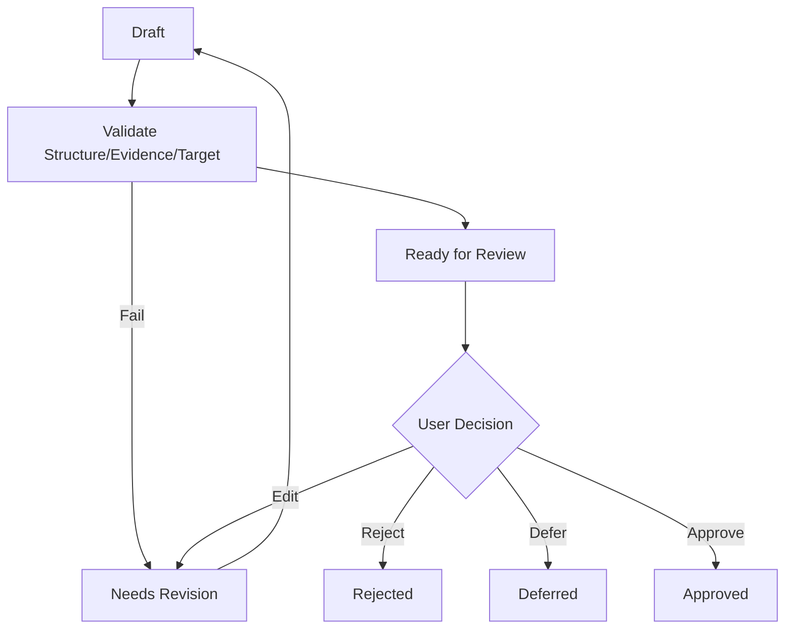
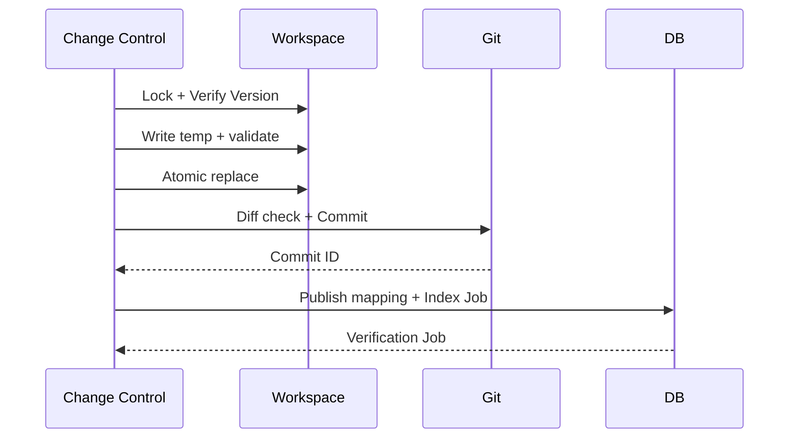

# Proposal、审批与安全写回流程

## 1. 目标

作为所有正式知识和关系变更的唯一写入流程，保证理解、授权、一致性、审计和回滚。

## 2. 输入

- Proposal Type。
- Target Refs/Base Versions。
- Change Set。
- Evidence。
- Risk。
- Rollback Plan。

## 3. Proposal 准备

## 4. 批准校验

- Proposal Revision。
- Change Hash。
- Target Version。
- Evidence Reachable。
- High Risk Confirmed。
- Git Status。

## 5. 写回

## 6. 三方合并

输入：

- Approved Base。
- Current File。
- Proposed Result。

输出：

- 自动无冲突合并。
- 冲突区块。
- 新 Proposal Revision。

必须重新审批。

## 7. 失败矩阵

| 失败点 | 处理 |
|---|---|
| Lock/Version | Needs Revision |
| Temp Write | 删除临时文件 |
| Atomic Replace | 保持原文件 |
| Commit | 恢复旧文件 |
| DB Publish | Read-only Recovery/Reconcile |
| Index | Index Stale + Retry |
| Regression | Reverse Commit 或局部修复 |

## 8. 权限

Approval 生成短期 Write Authorization：

- Proposal/Revision。
- Change Hash。
- Targets。
- Expiry。

## 9. 幂等

- Apply Proposal ID + Revision。
- Git Commit Mapping。
- Index Revision。

## 10. 审计

- Who/When。
- Evidence。
- Decision。
- Change Hash。
- File Diff。
- Commit。
- Compensation。

## 11. 验收

- 无 Approval 无写入。
- Approval 后目标变化阻止写入。
- Commit 与 Proposal 互查。
- 每类失败有验证测试。

