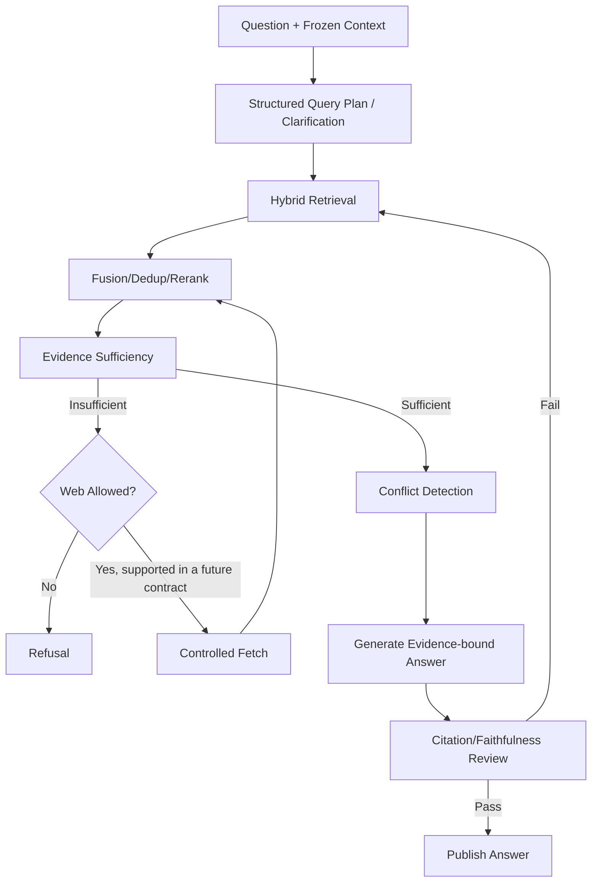

# RAG 问答流程

## 1. 目标

提供基于批准知识、带引用、展示冲突和能够拒答的回答。

## 2. 输入

- Question。
- Conversation。
- Scope/Filters。
- Web Permission。
- Answer Style。

## 3. 流程

## 4. Query Rewrite

- 拆成单概念查询。
- 使用 Conversation 消歧。
- 保持 Scope。
- 记录 Rewrite。
- 当前实现每次生成 1..3 个有界 Rewrite；无法从显式 Scope 与最多 8 个历史 Turn/32 KiB 上下文确定语义时，
  发布 Clarification，不猜测。

## 5. Evidence

- Retrieval 只返回 Ready/Active 可打开候选；发布前必须通过 Knowledge Evidence Eligibility，Active 不等于 Approved。
- Historical/Source 仅显式允许。
- Conflict 标记。
- Source Span 可打开。

## 6. Answer

- Direct Answer。
- Key Evidence。
- Citations。
- Conflict/Uncertainty。
- Model Inference。
- Follow-ups。
- Related Topics（服务端 Knowledge binding 验证）。
- Retrieval Summary（请求/有效模式、版本、候选/选中/冲突计数和显式降级）。

## 7. Refusal

条件：

- 无证据。
- 仅草稿。
- 引用失效。
- 外部实时事实未授权。
- 冲突不可条件化。

## 8. Conversation

- 短期上下文。
- 不自动变 Memory。
- 可将结论生成 Artifact/Proposal。
- Conversation、Question、Answer、Workflow/Event/Job 原子派发；同一 Conversation 同时最多一个非终态 Answer。
- Workflow Input 只保存稳定 ID、版本和 Hash；正文与历史只从 Conversation 事实源有界加载。
- Turn 按 `(ordinal,id)` 分页；Answer 的发布状态、当前阶段和检索摘要可在刷新后恢复。

## 9. Streaming 与恢复

- 当前 SSE 只发送真实阶段和终态摘要，不发送逐 token 草稿正文。
- 最终 Answer 只有 Citation/Faithfulness 与原子发布通过才标记 completed。
- 事件使用持久序号和 Last-Event-ID 重放；超出 24 小时保留窗口时客户端回查 Conversation/Answer 后重连。
- SSE 不是事实源；Answer/Workflow Query 是刷新、断线和重放后的最终依据。

## 10. 反馈

- Helpful。
- Incorrect。
- Irrelevant Citation。
- Broken Citation。
- Missing Source。

反馈进入 Evaluation，不直接改知识。

## 11. 失败

- Rerank Down：RRF degraded。
- Model Down：Workflow Retry。
- Citation Fail：重新检索/拒答。
- Web/Original Source 尚无可发布资格：请求显式返回不支持/不可用，本地证据不足则拒答。

## 12. 当前实现与边界

M6-04 已实现 retrieval-first 单节点持久 Workflow，不是通用模型 Tool Loop。生产正常路径依次持久化
PLAN、ANSWER、REVIEW Model Call，发布 completed/refused/clarification_required 四态之一，并提供
Conversation REST、SSE、Feedback 和 `/chat` 页面。正式 Auth、Web Search、全站业务页面、容量门禁与最终
发布验收仍分别归 M10、后续产品任务、M9/M10/M11。

## 13. 验收

- 事实回答有引用。
- 冲突不被隐藏。
- 草稿不默认检索。
- 拒答样本通过评测。
