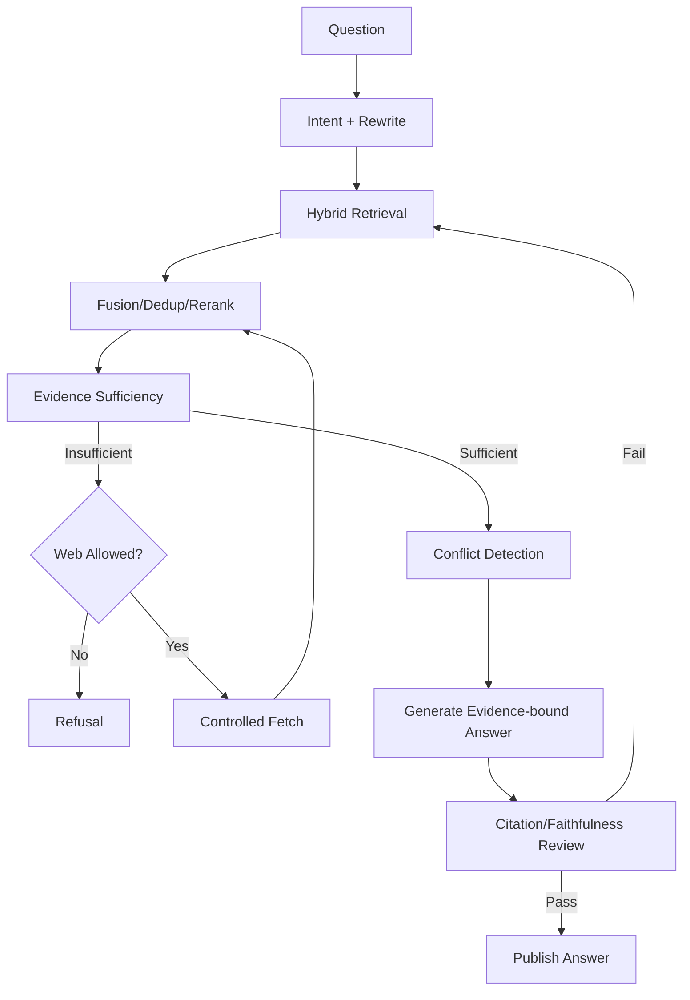

# RAG 问答流程

## 1. 目标

提供基于批准知识、带引用、展示冲突和能够拒答的回答。

## 2. 输入

- Question。
- Conversation。
- Scope/Filters。
- Web Permission。
- Answer Style。

## 3. 流程

## 4. Query Rewrite

- 拆成单概念查询。
- 使用 Conversation 消歧。
- 保持 Scope。
- 记录 Rewrite。

## 5. Evidence

- 只用 Ready + Approved。
- Historical/Source 仅显式允许。
- Conflict 标记。
- Source Span 可打开。

## 6. Answer

- Direct Answer。
- Key Evidence。
- Citations。
- Conflict/Uncertainty。
- Model Inference。
- Follow-ups。

## 7. Refusal

条件：

- 无证据。
- 仅草稿。
- 引用失效。
- 外部实时事实未授权。
- 冲突不可条件化。

## 8. Conversation

- 短期上下文。
- 不自动变 Memory。
- 可将结论生成 Artifact/Proposal。

## 9. Streaming

- 可流式显示生成文本。
- 最终 Answer 只有校验通过才标记 Complete。
- 校验失败时撤回草稿展示并说明。

## 10. 反馈

- Helpful。
- Incorrect。
- Irrelevant Citation。
- Broken Citation。
- Missing Source。

反馈进入 Evaluation，不直接改知识。

## 11. 失败

- Rerank Down：RRF degraded。
- Model Down：Workflow Retry。
- Citation Fail：重新检索/拒答。
- Web Fail：本地不足则拒答。

## 12. 验收

- 事实回答有引用。
- 冲突不被隐藏。
- 草稿不默认检索。
- 拒答样本通过评测。

