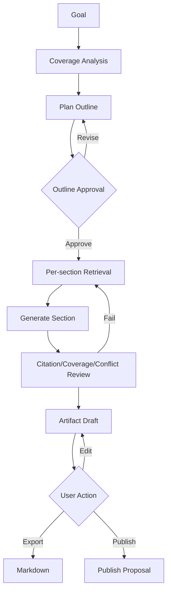

# Artifact 生成流程

## 1. 目标

基于批准知识生成大纲、面试文档和学习路径，不污染正式知识。

## 2. 输入

- Artifact Type。
- Topic/Collection Scope。
- Target Role。
- Difficulty/Length/Language。
- Template。

## 3. 流程

## 4. Coverage

- Covered Topic/Claim。
- Missing。
- Conflict。
- Stale。

缺失不得用模型常识静默补全。

## 5. Outline

- Section Goal。
- Expected Claims。
- Evidence Scope。
- Estimated Cost。

## 6. Section

- 独立 Workflow Node。
- 失败可单章重试。
- 保存 Citation。
- 检查重复和跨章冲突。

## 7. Revision

- Outline 改动创建新 Revision。
- 用户编辑保留。
- Draft 不参加默认 RAG。

## 8. Publish

- 创建 PUBLISH_ARTIFACT Proposal。
- 转为 Document。
- 保留 Artifact Provenance。

## 9. 验收

- 先大纲后正文。
- 每章来源。
- 缺失显式。
- Publish 经 Proposal。

