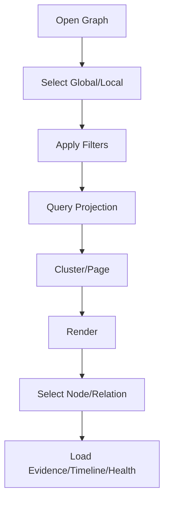
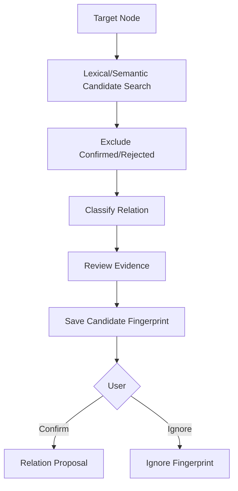

# 图谱与语义关联流程

## 1. 目标

可视化已确认关系，发现候选关联，并将操作转化为 Proposal。

## 2. 图谱查询

## 3. 候选关联

## 4. 全局图谱

- Topic 聚类。
- 重要节点优先。
- 分页。
- 不全量渲染。

## 5. 局部图谱

- 深度 1 默认。
- 深度 2/3 用户选择。
- Evidence 延迟加载。

## 6. 路径

- 最短路径。
- 关系过滤。
- 每边证据。
- 无路径不伪造。

## 7. 候选去重

Fingerprint：

- Node Versions。
- Relation Type。
- Evidence Hash。
- Model/Rule Version。

内容变化后才重新推荐。

## 8. 图谱操作

- 建立/修改关系。
- 合并重复。
- 打开 Conflict。
- 补来源。
- 创建 Collection/Artifact/Review。

修改类操作全部 Proposal。

## 9. 失败

- Query Timeout：缩小范围。
- Missing Evidence：Relation 标记 Stale。
- Layout Fail：保留列表模式。
- Candidate Model Down：已确认图谱仍可用。

## 10. 验收

- AI 候选和确认关系可区分。
- 关系可打开证据。
- 已忽略不重复。
- 图谱操作不直接写知识。

