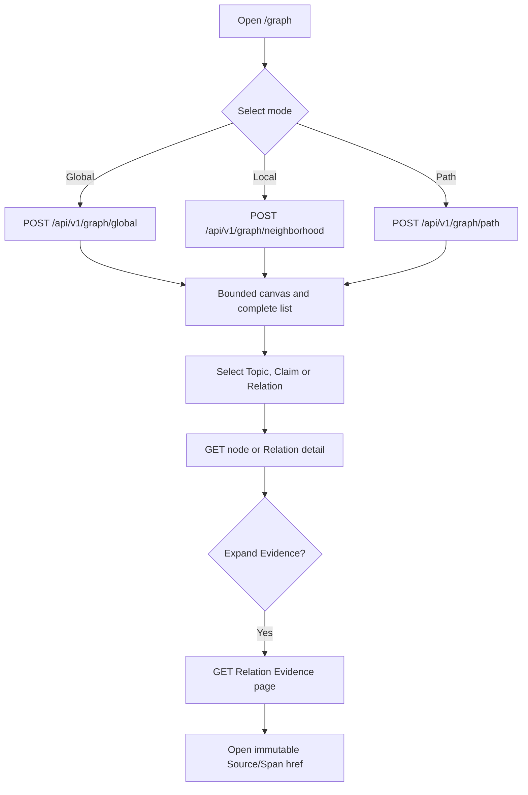
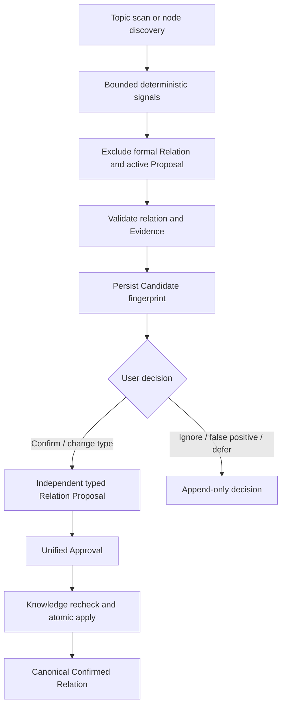

# 图谱与语义关联流程

## 1. 目标

Graph v1 把 Knowledge 中同一 Workspace 的 Topic、Claim 和 canonical Relation 投影为可探索、可验证的
只读图。Knowledge 仍是唯一事实源；Graph 查询和 `/graph` 页面不创建、确认、修改或删除 Relation。
M7-02 在独立边界交付 Semantic Link Candidate：候选可审阅、忽略、误报、稍后处理或确认，但确认只创建
typed Relation Proposal；只有统一 Approval 和 Knowledge apply 成功后才产生正式 Relation。

## 2. 图谱查询



`/graph` 使用当前 Workspace，支持 Global、Local、Path、服务端节点搜索、URL 恢复、图例、会话内节点
锁定/固定布局和可访问列表模式。Global/Local/Path 的边只返回 Evidence count/fingerprint/href；只有用户
打开 Relation 详情并展开 Evidence 时才发起 Evidence page 请求。布局失败或视觉容量超限时保留完整列表，
不会把空白画布当成成功。

## 3. v1 正式投影边界

- 节点只允许 Knowledge `NodeRef` 的 `TOPIC|CLAIM`；Source、Document、Conflict 和 Artifact 待各自
  Relation 端点契约落地后 additive 扩展。
- 默认只查询 `CONFIRMED` Relation；`STALE` 只能由显式过滤查看并带状态标记；Suggested、Rejected、
  Deprecated 不进入正式图。
- 对称 Relation 仍使用一个 canonical Relation ID；边另带相对查询的 `FORWARD|REVERSE` traversal，
  不复制反向事实。
- 所有查询绑定 Workspace。不存在、跨 Workspace 或不在正式投影中的节点/Relation 使用相同 Not Found，
  避免资源枚举。
- Graph 直接查询 PostgreSQL canonical facts，不新增 Graph 表、双写或独立图数据库。

## 4. 全局图谱

- Global 按 Active Topic 返回有界 cluster summary，包含直接 Claim 数、incident Relation 数、
  `cluster_score` 和更新时间。
- 默认 limit 25、最大 100；结果按稳定顺序分页，超过固定结果窗口时显式 `truncated` 并要求缩小过滤。
- 过滤包含节点/Relation 类型、Topic、Relation/Claim 状态、Claim/Relation 最低置信度和更新时间；聚合计数
  在过滤后重算。
- Cursor 是绑定 Workspace、规范请求、结果 fingerprint、limit/offset 的进程内 HMAC-SHA256 token。
  篡改、跨请求/Workspace 或进程重启返回 `GRAPH_CURSOR_INVALID`；结果变化返回
  `GRAPH_CURSOR_STALE`，客户端回到第一页恢复。

## 5. 局部图谱

- 中心节点是 Topic 或 Claim；默认 depth=1，允许 1..3，方向为 `BOTH|OUTBOUND|INBOUND`。
- depth=1 使用稳定 cursor 分页；depth=2/3 返回单个有界快照，不接受 cursor。
- node、edge、frontier 和时间预算逐层检查。超限时只返回上一完整层，并通过
  `completed_depth`、`layer_counts`、`meta.truncated/reason` 解释截断。
- 每条返回 edge 的端点都在 nodes 中或列入 boundary，查询同时考虑 canonical Relation 两端；按完整
  frontier 批量扩展，不逐节点查询，也不逐边加载 Evidence。

## 6. 路径

- 在两个 Topic/Claim 端点间查询无权最短路径；默认 `BOTH`，也可限制方向、Relation Type、最大深度和
  访问节点数。默认最大深度 6、硬上限 8，访问节点硬上限 500。
- 同 hop 候选按完整 node/relation path key 确定性选择；响应保留 canonical Relation ID 和实际 traversal。
- 完整预算内确实无路径时返回 200、`status=not_found` 和可选 `common_topic_suggestions`，后者不是路径边。
- 超时或访问预算耗尽不返回未经证明为最短的 partial path；分别返回
  `GRAPH_QUERY_TIMEOUT` 或 `GRAPH_QUERY_BUDGET_EXCEEDED`。

## 7. Relation 与 Evidence

- Relation detail 只返回 Relation 自有字段、确认/有效期，以及 Evidence count/fingerprint/href。
- Relation Evidence 独立 cursor 分页，默认 20、最大 100；每项保留自己的 reason、applicability、
  provenance、confirmation 和可打开的 immutable Source Version/Span href。
- Global、Local、Path 和 Relation detail 不携带 Evidence reason 或来源正文；Graph 日志也不得记录
  Claim statement、Evidence reason、数据库 URL 或绝对路径。
- Evidence 为空时通过 `evidence_count=0` 和空 Evidence page 呈现。读路径不会把 Relation 隐式改成
  `STALE`；任何状态变更仍必须走 Knowledge 的正式写入流程。

## 8. HTTP 失败与恢复

- 三个复杂查询使用严格 JSON `POST`，但仍是无副作用 Query；四个 detail/search/Evidence 端点使用
  `GET`，并要求唯一 `workspace_id` query 参数。精确端点和 Schema 以 OpenAPI 3.1 为准。
- 无效 JSON/UUID/enum/filter/cursor 返回 400，非 JSON POST 返回 415，stale cursor 或投影不一致返回
  409，Path 访问预算耗尽返回 422。
- Graph 依赖未组装、查询超时或取消返回 503；路由保持存在，不以 404 或空图伪装缺依赖。
- 空 Global、空 Evidence、no-path、预算截断、timeout 和 stale 是不同状态，页面分别显示并提供重试、
  返回第一页或缩小范围的恢复动作。

## 9. 语义候选关联（M7-02 已交付）



### 范围、发现与去重

- 首版只支持当前 Workspace 的 Topic/Claim；Document、目录和 Smart Collection 等待稳定对象契约后扩展。
- 标题/别名、术语、共同 Topic、同 Source 四类确定性信号有真实数据路径；Semantic/RAG 在当前未配置时
  显式 `unsupported`，不能静默标成已执行或返回假空结果。
- Topic scan 使用 Workflow/River，按 100 节点页持久化 checkpoint；每个 source 最多查询 100 个后续
  Topic Claim，SQL 在 LATERAL 内层提前 Limit，避免先展开全量 pair。
- Candidate fingerprint 绑定：

  - Node Versions。
  - Relation Type。
  - 排序后的 Evidence semantic hash。
  - 实际参与的 Model/Rule/Index/Embedding/Rerank/Prompt/Schema Version。

相同 fingerprint 并发只形成一个 Candidate；Ignore/False Positive 后不重复 Active。内容、Evidence 或生成版本
变化才创建新评估，并以 `CONTENT_CHANGED` 解释重开。

### 决策、Proposal 与正式写入

- Candidate 决策使用 `Idempotency-Key + expected_version`，历史 append-only；Confirm 和改类型 Confirm 为每项
  创建独立 `knowledge_change` Proposal，不把批量项合并为一个不可追踪变更。
- Approval 绑定唯一 Revision/change hash；Knowledge apply 重新校验端点版本、Evidence 和 Candidate 绑定，
  stale 进入 `needs_revision`，失败事务回滚，response-loss 重放不新增 Relation。
- `/graph` 的 Candidate 面板展示双方摘要、Evidence、建议关系、置信度、发现方式、版本和重开原因；Candidate
  不进入正式 canvas/list edge。Candidate 能力故障与 Graph readiness/status 分离。

当前 API 以 OpenAPI 3.1 为准，包括 Candidate page/detail/decision 和 Candidate Scan create/detail；正式 Graph
七个只读端点继续无副作用。

## 10. 验证、性能边界与回滚

```bash
ZHIXU_TEST_DATABASE_URL='postgres://...' make graph-integration
ZHIXU_TEST_DATABASE_URL='postgres://...' make graph-smoke
ZHIXU_TEST_DATABASE_URL='postgres://...' make graph-benchmark
ZHIXU_TEST_DATABASE_URL='postgres://...' make semantic-link-integration
ZHIXU_TEST_DATABASE_URL='postgres://...' make semantic-link-fault-smoke
make semantic-link-eval
make semantic-link-smoke
```

- `graph-integration` 用真实 PostgreSQL 和公共 HTTP 验证 Global→Local→Path→Evidence、response-loss
  replay、cursor stale、Workspace 隔离与 timeout。
- `graph-smoke` 启动真实 API 进程执行最小闭环；成功后幂等清理 fixture，失败时保留 0700 诊断目录。
  响应不得泄露数据库 URL、绝对路径、managed storage 字段或未公开来源正文；API/fixture 日志还不得记录
  Claim statement、Evidence reason 或 provenance 正文 canary。
- `graph-benchmark` 确定性生成 20,000 Active Topic、100,000 Confirmed IMPACTS Relation 和 100,000
  Evidence 作为 M7 参考拓扑，经过 5 次预热执行 30 次一跳采样，要求 p95 不超过 1.5 秒、每次固定 6 条
  数据库 statement，并保存 Neighborhood/Path/Evidence 的 EXPLAIN 证据。Mixed Topic/Claim 与
  BELONGS_TO 正确性由 integration/smoke 覆盖；M10 才在 claim-heavy/mixed 拓扑、500,000 Relation 和
  正式资源预算下执行最终 P95 与图 UI FPS 门禁，M7 结果不能宣称提前完成 M10 容量验收。
- Graph v1 没有新增 Graph 表或写入链路。发布回滚使用上一版 API binary 与 Web assets，停用 Graph
  route/UI 和只读 adapter 即可；必须保留 Knowledge Topic/Claim/Relation/Evidence 事实，不以删除事实
  数据作为回滚手段。
- M7-02 回滚停用 Candidate route/panel 和 Semantic Link Worker definition；保留 Candidate/Decision/Scan、typed
  Proposal 和已确认 Relation 数据，迁移只前进，不能通过 Down 删除业务事实。

## 11. 验收

- Global/Local/Path 只返回当前 Workspace 的 Topic/Claim 正式投影，状态、方向、闭包和截断语义明确。
- Relation 可打开按需分页的 Evidence 和 Source/Span href，列表/路径响应不提前加载正文。
- Cursor 篡改、跨查询和 stale 可区分；no-path、404、422、503 和布局 fallback 不互相伪装。
- Graph 查询无写副作用；Candidate 与正式 Relation 明确分离，所有确认都经 typed Proposal→Approval→Knowledge
  apply，Topic scan 可恢复且 Candidate 故障不拖垮正式 Graph。
