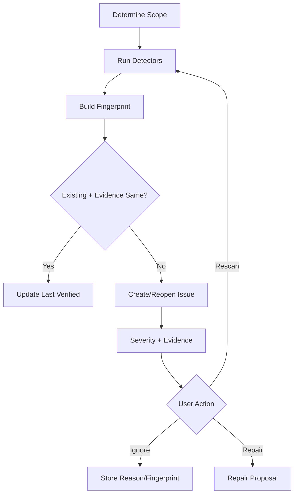

# 知识健康维护流程

## 1. 目标

持续发现、去重、解释和修复知识质量问题。

## 2. 触发

- 手动。
- 每日/每周/Cron。
- Revision Published。
- Relation/Conflict 变化。
- Index Validation。

## 3. 检测

- Orphan。
- Duplicate。
- Conflict。
- Stale。
- Missing Source。
- Low Confidence。
- Broken Reference。
- Index Error。
- Superseded Usage。
- Review Invalidated。

## 4. 流程

## 5. 定时

- 相同扫描不并发。
- 错过只补跑一次。
- 低优先级。
- 只创建 Issue/Proposal，不自动批准。

## 6. Fingerprint

- Type。
- Target。
- Evidence。
- Object Version。
- Detector Version。

## 7. Severity

- Critical：错误/不一致。
- High：RAG/引用。
- Medium：组织。
- Low：建议。

## 8. Repair

- Orphan → Topic/Relation。
- Duplicate → Merge。
- Conflict → Conflict Workflow。
- Missing Source → Provenance。
- Broken Ref → Link Update。
- Stale → Verify/New Revision。

## 9. 失败

- Detector 失败独立记录。
- 扫描部分成功不标记完整成功。
- 大范围分页恢复。

## 10. 验收

- Issue 不重复刷屏。
- 忽略直到证据变化。
- 每个 Issue 有证据。
- 修复经 Proposal。

