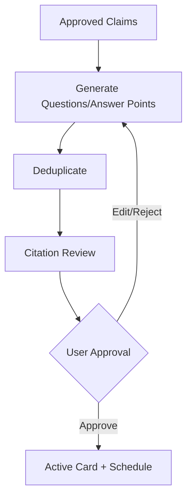
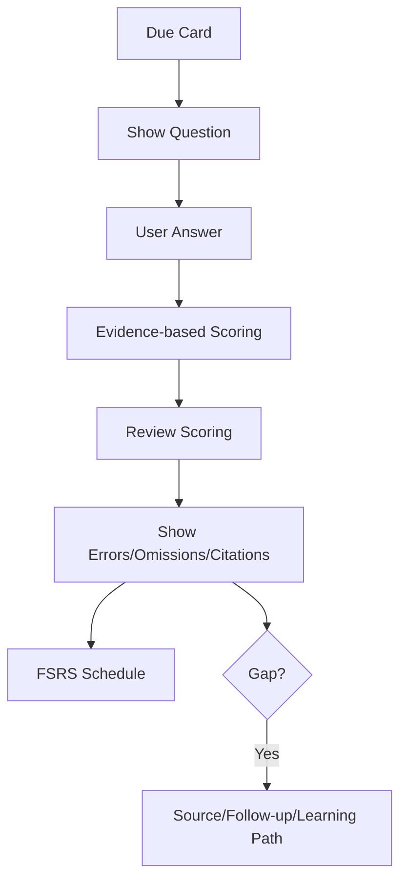
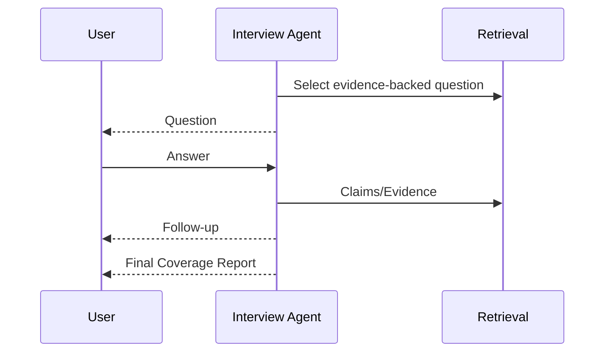

# 智能复习与面试模拟流程

## 1. 目标

将批准 Claim 转化为可评估的主动回忆与间隔重复。

## 2. Deck 创建

输入：

- Topic/Collection/Artifact/Role。
- Difficulty。
- Card Types。
- Daily Limit。

## 3. Card 生成

## 4. Review

## 5. Scoring

- Correctness。
- Coverage。
- Boundaries。
- Clarity。
- Confidence。
- Errors/Omissions。

## 6. 调度

- Answer + Schedule 同事务。
- Idempotency Key。
- Scheduler Version。
- Pause/Reset。

## 7. 面试模拟

## 8. 失效

Claim Superseded/Disputed/Source Broken：

- Card Invalidated。
- 从 Due 移除。
- 创建 Health Issue。

## 9. 知识缺口

- 推荐 Source。
- 追问题。
- 学习路径。
- Proposal Candidate。

不自动改知识。

## 10. 验收

- 卡片绑定证据。
- 评分解释。
- 重复提交幂等。
- Claim 失效卡片停止。
- 面试报告有行动建议。

