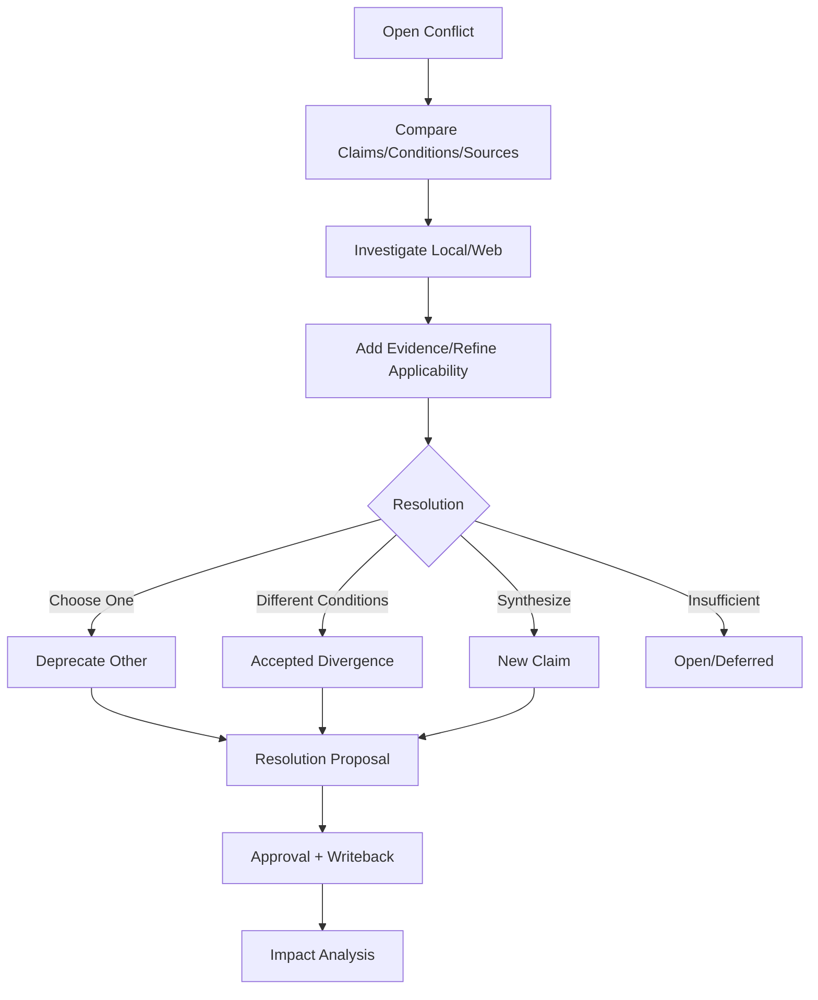

# Conflict 调查与解决流程

## 1. 目标

持续跟踪相互矛盾的 Claim，保留来源和条件，并安全更新下游对象。

## 2. 创建来源

- Relation Analysis。
- RAG。
- User Mark。
- Health Scan。

## 3. 输入

- 2..N Claims。
- Source Spans。
- Applicability。
- Severity。
- Affected Objects。

## 4. 流程

## 5. 调查记录

- Query。
- Tool Calls。
- New Evidence。
- Analyst Note。
- Model Version。

不覆盖旧记录。

## 6. 解决

### Choose One

- Valid Claim Confirmed。
- Other Deprecated。

### Accepted Divergence

- 补齐不同 Applicability。
- Relation 不再标记同条件冲突。

### Synthesize

- 新 Claim。
- 旧 Claim Superseded。
- 保留来源。

## 7. 下游

- Graph。
- RAG Eval。
- Artifact。
- Review Card。
- Health。

只生成影响报告/Proposal。

## 8. 失败

- Evidence Missing：不能 Resolution Ready。
- Target Version Changed：重新调查。
- Web Failure：保持 Investigating。

## 9. 验收

- 冲突不被普通覆盖消失。
- 条件差异可表达。
- 解决有 Proposal。
- 下游影响可追踪。

