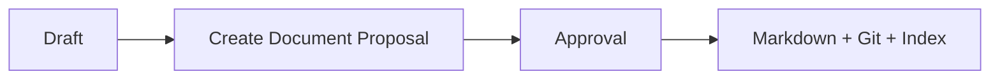
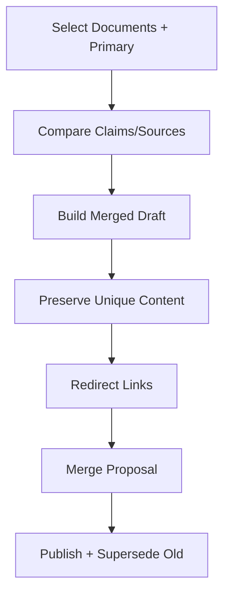

# 知识对象生命周期流程

## 1. 目标

统一处理 Document 和 Topic 的新建、重命名、移动、拆分、合并、归档和删除。

## 2. 新建

## 3. 重命名/移动

1. 选择目标名/路径。
2. 检查冲突。
3. 计算链接影响。
4. 生成文件与链接 Diff。
5. Approval。
6. Git Rename/Write。
7. Reindex。

## 4. 拆分

- 用户选 Span/Heading。
- 创建多个 Document Draft。
- 建立 Provenance。
- 原文保留摘要/链接或 Superseded。
- 同一事务组 Proposal。

## 5. 合并

## 6. 归档

- 默认检索排除。
- 文件可移动 archive。
- 仍可显式搜索。
- 可恢复。

## 7. 删除

- High Risk。
- 影响分析。
- Approval。
- 文件移除 + Commit。
- DB Soft Delete。
- Reverse Commit 恢复。

## 8. Topic

- Create。
- Alias。
- Merge。
- Parent/Prerequisite。
- Delete 前重新归类。

## 9. 并发

- 校验所有目标 Revision。
- 任一变化使事务组 Needs Revision。
- 不部分执行拆分/合并事务组。

## 10. 验收

- 移动更新链接。
- 合并保留来源。
- 删除展示影响。
- 所有变化可 Git/Timeline 追溯。

