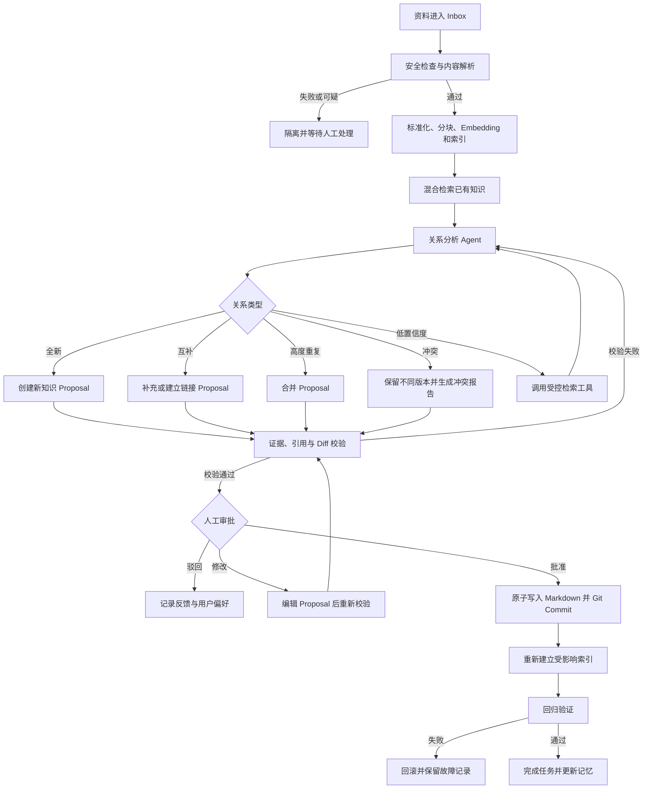
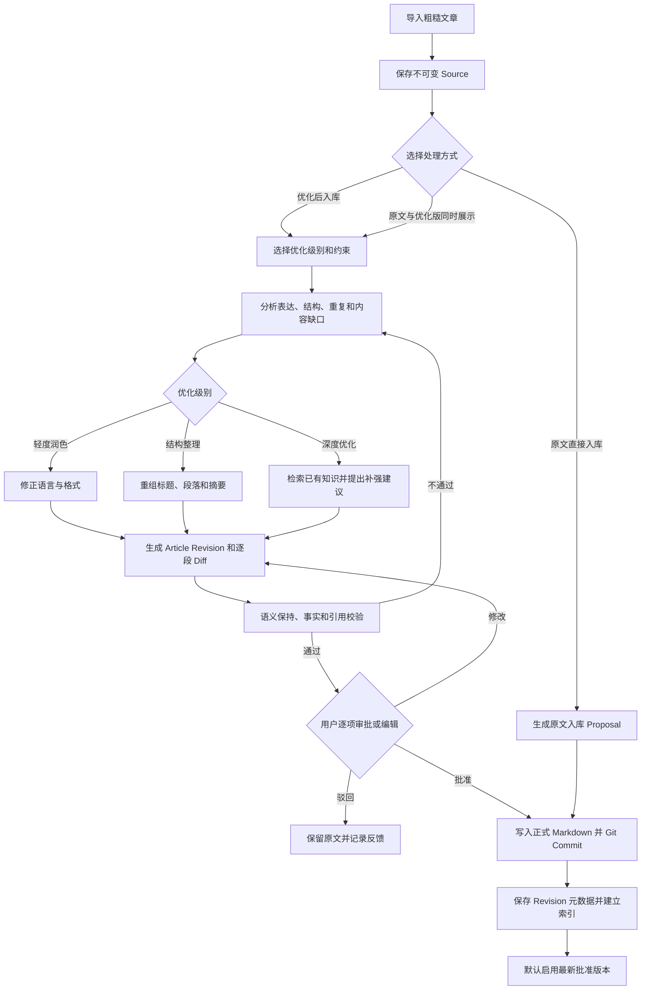
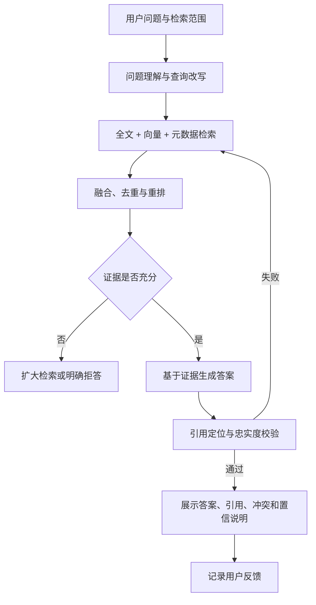
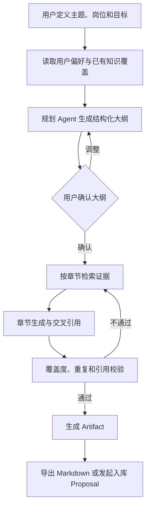
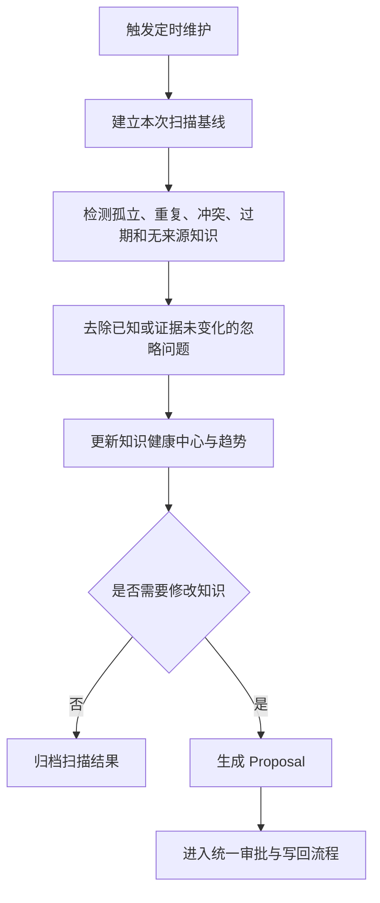
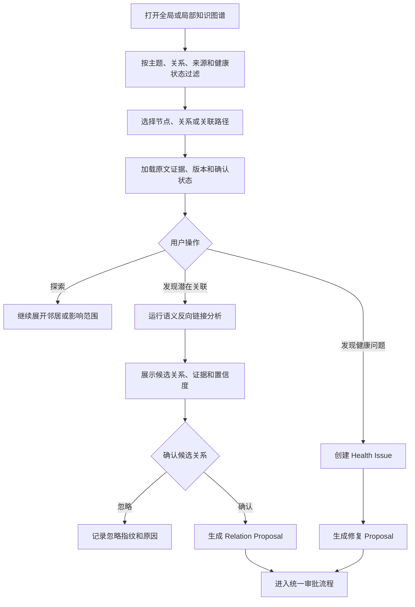
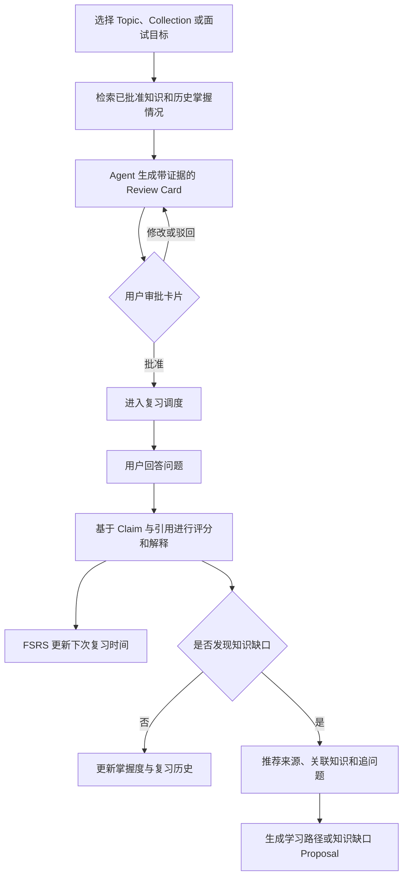

# Go 自组织知识工作台 PRD 大纲 v0.1

> 文档状态：需求大纲，待确认后扩写为正式 PRD  
> 产品形态：个人使用、本地优先、工业级可靠性  
> 暂定技术方向：Go 模块化单体、PostgreSQL + pgvector、Markdown + Git

## 1. Problem Statement

个人知识通常分散在 Markdown、PDF、网页摘录和临时笔记中。传统笔记软件能够保存和搜索内容，但不能持续判断新旧知识之间是全新、互补、重复还是冲突，也不能安全地提出合并和重组方案。

通用 AI 聊天工具可以总结或问答，但通常缺少稳定知识源、来源追溯、长期工作流、人工审批、版本控制和失败恢复。用户无法确认 AI 为什么修改知识，也难以撤销错误操作。

本项目需要解决的核心问题是：让 AI 在不破坏用户原始知识的前提下，持续完成知识摄取、关系分析、检索问答、整理建议、安全写回、知识图谱构建、知识健康维护和主动复习，并保证全过程可解释、可审批、可恢复、可审计和可回滚。

## 2. Solution

构建一个本地优先的个人知识工作台。Markdown 文件是用户拥有的知识源，Git 保存版本历史，PostgreSQL + pgvector 保存索引、知识关系、工作流状态、记忆和审计记录。

系统接收 Markdown、TXT、PDF和网页内容，完成安全检查、解析、分块、Embedding 与混合索引。对于粗糙文章，用户可以选择原文直接入库、优化后入库，或同时保留原文与优化版本；优化结果必须通过 Diff 审批后才能成为正式知识。关系分析 Agent 检索已有知识，将新内容判定为全新、互补、重复、冲突或低置信度，并生成结构化知识变更方案。

任何创建、合并、移动、覆盖或删除操作都必须先展示依据、引用、Diff 和影响范围，经用户批准后才能原子写入 Markdown 并提交 Git。系统随后重新索引并执行回归验证，失败时自动恢复到写入前状态。

在知识整理之外，系统提供带引用的 RAG 问答，并能从已有知识生成面试复习文档、专题大纲和学习路径。系统同时把 Source、Document、Topic、Claim、Conflict 和 Artifact 组织为可操作知识图谱，支持语义反向链接、智能集合、知识演进时间线、知识健康修复以及基于间隔重复的智能复习。所有 Agent、工具调用和工作流都采用结构化输入输出，支持持久化、暂停、恢复、重试、审计和评测。

## 3. 产品目标

1. 将零散资料转化为可追溯、有关联、可维护的个人知识体系。
2. 对新旧知识进行可靠的重复、互补和冲突分析，而不只是生成摘要。
3. 提供有来源、有置信度、能够拒答的 RAG 问答。
4. 让 AI 通过 Proposal、Diff、审批和 Git 完成安全写回。
5. 使用持久化 Agent 工作流处理长任务、工具调用、人工介入和故障恢复。
6. 基于知识库生成真正可使用的面试文档、大纲和学习路径。
7. 形成一个能够展示 AI Agent 应用工程能力的完整开源项目。
8. 将粗糙文章安全地润色、重组和补强，同时保持原意、原文和版本可追溯。
9. 将知识关系转化为可查询、可验证、可修复的知识图谱，而不是仅提供装饰性可视化。
10. 通过知识健康分析和智能复习，让知识真正被维护、理解和掌握。

## 4. 产品原则

1. **原始资料不可变**：导入内容保留原文和内容哈希，不静默覆盖。
2. **来源优先**：派生知识必须记录来源、引用位置、生成时间和版本。
3. **先建议后执行**：Agent 只能生成 Proposal，不能绕过审批直接修改知识库。
4. **Markdown 是事实源**：数据库是索引和运行状态，不成为用户知识的唯一持有者。
5. **所有变更可回滚**：知识写入与 Git 提交组成可恢复操作。
6. **工作流可恢复**：进程重启后能够从持久化检查点继续运行。
7. **不确定性必须暴露**：低置信度、证据不足和模型分歧不能包装成确定结论。
8. **个人使用不等于玩具实现**：不做多人协作，但保留可靠性、安全性、审计和评测。
9. **图谱关系必须有证据**：AI 推测关系与用户确认关系必须区分，关系能够反查来源和生成依据。
10. **可视化必须能够行动**：从图谱、健康问题和复习结果能够直接发起 Proposal 或学习工作流。

## 5. 目标用户与核心场景

### 5.1 目标用户

- 长期使用 Markdown 或 Obsidian 记录技术知识的个人用户。
- 需要整理学习资料、项目经验和面试知识的程序员。
- 希望本地掌控知识文件，同时使用云端或本地模型的知识工作者。

### 5.2 核心场景

1. 将新笔记、PDF 或网页资料放入 Inbox，由系统完成解析和知识整理建议。
2. 导入一篇表达粗糙的文章，选择轻度润色、结构整理或深度优化，审批 Diff 后保存优化版本。
3. 发现两篇笔记内容高度重复，生成保留来源和差异的合并方案。
4. 发现新资料与旧知识结论冲突，保留双方版本并生成冲突报告。
5. 对知识库提问，获得带段落级引用和置信度说明的回答。
6. 根据 Java、Go 或 AI Agent 相关知识生成专题大纲和面试复习文档。
7. 定期发现孤立、重复、过期、无来源和长期未处理的知识。
8. 查看一次 Agent 运行的检索、推理、工具调用、审批和写入全过程。
9. 在知识图谱中查看某个 Topic 的来源、支持、补充、冲突和版本演进路径。
10. 发现两篇没有显式链接但语义相关的文章，并将候选关系转化为正式链接 Proposal。
11. 使用智能集合查看“Java 并发”“待解决冲突”“低置信度知识”等动态知识视图。
12. 根据面试目标生成闪卡和追问题，完成复习后自动调整下次复习时间。

## 6. 核心功能范围

### 6.1 Workspace 与 Inbox

- 创建和配置一个本地知识 Workspace。
- 监控或手动扫描 Inbox 中新增、修改和删除的资料。
- 支持 Markdown、TXT、PDF 和指定网页内容。
- 为每个 Source 生成稳定 ID、内容哈希、版本和导入状态。
- 识别重复导入并保证摄取幂等。
- 原文件解析失败时进入隔离区，不污染正式索引。

### 6.2 内容解析与标准化

- 提取标题、正文、层级、代码块、表格、链接和基础元数据。
- 保存原始文本与标准化文本之间的位置映射，用于精确引用。
- 根据标题、语义和长度进行结构感知分块。
- 支持解析器版本记录和按需重新解析。
- 检测空内容、异常编码、提示词注入和可疑指令。

### 6.3 文章优化与版本管理

- 用户导入粗糙文章后，可以选择原文直接入库、优化后入库，或在知识库中同时展示原文与优化版本。
- 无论用户选择哪种方式，系统都必须保留不可变 Source；优化不得覆盖或丢失原始内容。
- 提供轻度润色、结构整理和深度优化三种模式。
- 轻度润色处理错别字、病句、标点、格式和表达清晰度，原则上不改变文章结构和事实含义。
- 结构整理处理标题层级、段落顺序、重复内容、术语一致性、摘要和可读性。
- 深度优化可以检索已有知识，提出内容缺口、补充建议、内部冲突和关联知识，但模型新增内容必须标记为建议并附来源或“不具备外部来源”的说明。
- 用户可以指定文章目的、目标读者、语气、篇幅、格式规范和禁止修改项。
- 优化结果以 Article Revision 和 Proposal 保存，展示逐段 Diff、修改理由、来源和可能的语义变化风险。
- 用户能够逐项接受、拒绝或手动编辑修改，不要求整篇一次性批准。
- 审批通过后，正式版本写入 Markdown 并创建 Git Commit；数据库保存 Revision、状态、内容哈希、来源关系、索引和审计信息。
- RAG 默认检索最新批准版本；原始 Source 和历史 Revision 仍可单独查看和检索，但不得与正式版本重复参与默认召回。
- 重新优化必须基于用户指定的 Revision，形成新的版本分支，禁止静默覆盖既有版本。

### 6.4 索引与混合检索

- 建立全文索引、向量索引和元数据过滤索引。
- 支持关键词检索、语义检索、过滤、融合和重排。
- 支持按来源、主题、时间、标签和文件路径过滤。
- 返回检索证据、原文位置、相关度和重排分数。
- Embedding 模型或分块策略变化后支持可控重建索引。

### 6.5 知识抽取与关系分析 Agent

- 从资料中提取 Claim、Topic、术语、关系和关键结论。
- 将新知识与已有知识判断为：全新、互补、高度重复、内容冲突或低置信度。
- 每个判断必须包含引用证据、理由、置信度和候选影响范围。
- 证据不足时允许调用受控工具继续检索本地资料或指定网页。
- 无法可靠判断时进入人工处理队列，禁止自动猜测。

### 6.6 可操作知识图谱

- 图谱节点至少支持 Source、Document、Topic、Claim、Conflict 和 Artifact，并允许后续扩展新的节点类型。
- 图谱关系至少支持引用、来源于、属于、支持、补充、重复、冲突、前置知识、派生自和版本更新。
- 每条 AI 生成关系必须保存证据、置信度、模型版本、生成时间和确认状态。
- 区分用户确认关系、规则生成关系和 AI 推测关系，并使用不同视觉状态展示。
- 提供 Workspace 全局图谱、当前节点局部图谱和两个节点之间的最短关联路径。
- 支持按节点类型、关系类型、主题、来源、时间、置信度、确认状态和知识健康状态过滤。
- 节点和关系支持展开原文证据、历史版本、关联 Proposal 和 Workflow Run。
- 高亮孤立、重复、冲突、低置信度、缺少来源和疑似过期节点。
- 用户可以从图谱直接发起建立链接、合并重复、解决冲突、补充来源和生成学习路径的 Proposal。
- 图谱布局和显示状态属于视图数据，不得改变知识事实；知识关系变更仍经过统一审批流程。
- 大规模图谱默认采用聚类和按需展开，避免将所有节点同时渲染为不可使用的“毛线球”。

### 6.7 语义反向链接与潜在关联

- 展示当前 Document、Topic 或 Claim 的显式正向链接和反向链接。
- 通过标题、别名、关键词和语义检索发现尚未建立的潜在关联。
- 候选关联必须展示双方相关段落、关系类型建议、理由和置信度。
- 支持将候选关系标记为确认、忽略、稍后处理或误报。
- 用户确认后生成 Relation Proposal，不允许搜索结果直接修改正式知识关系。
- 已忽略候选保存匹配指纹和原因，避免相同建议反复出现。
- 当文档内容或 Embedding 版本发生重要变化时，候选关系可以重新评估。

### 6.8 智能集合与动态视图

- 用户可以基于节点类型、属性、标签、关系、时间、来源、置信度和健康状态创建 Smart Collection。
- Smart Collection 是保存的查询和展示配置，不复制知识内容、不创建第二事实源。
- 支持列表、表格和紧凑卡片三种核心视图，不建设通用低代码数据库设计器。
- 支持排序、过滤、分组、列选择和保存视图。
- 系统提供内置集合：最近新增、待审批、未解决冲突、低置信度、缺少来源、孤立知识、待复习和目标岗位知识。
- Collection 中的对象可以批量发起非破坏性分析工作流；任何写入仍需逐个或批量审批。

### 6.9 知识变更 Proposal

- 支持创建新知识、补充已有主题、建立关联、合并重复内容和登记冲突。
- Proposal 包含变更原因、来源、目标文件、Markdown Diff、影响对象和风险提示。
- 合并时保留有效差异、来源和原始版本，不做简单摘要替换。
- 冲突时默认保留不同观点，不自动选择“正确答案”。
- Proposal 能被批准、驳回、修改后批准或暂缓。

### 6.10 人工审批与安全写回

- 在审批界面展示证据、引用、关系判断、目标文件和 Git Diff。
- 用户批准前，Agent 不得产生正式文件写操作。
- 批准后以原子方式写入 Markdown，并创建包含 Proposal ID 的 Git Commit。
- 写入前检查文件版本，防止覆盖用户审批期间产生的新修改。
- 驳回时记录原因，并作为后续 Agent 决策的反馈记忆。
- 写入或提交失败时恢复文件状态，禁止出现“文件已改但状态显示失败”的半完成结果。

### 6.11 RAG 问答

- 支持基于整个 Workspace 或指定范围提问。
- 回答必须附带来源文件、段落位置和可打开的引用。
- 区分“资料直接支持的事实”和“模型推断”。
- 证据不足、来源冲突或超出知识库范围时明确说明并允许拒答。
- 支持追问，并在会话上下文和长期记忆之间明确区分。
- 展示检索过程摘要，允许用户反馈引用无关或回答错误。

### 6.12 知识产物生成

- 根据主题生成面试复习文档、专题大纲和学习路径。
- 用户可以指定目标岗位、难度、篇幅、已有掌握程度和输出模板。
- 生成前先形成结构化大纲，再按章节检索和写作。
- 每个章节保留知识来源和覆盖情况。
- 生成结果作为 Artifact 保存，不直接混入原始知识。
- Artifact 可导出为 Markdown，并可由用户选择是否纳入知识库。

### 6.13 智能复习与闪卡

- 用户可以从指定 Topic、Smart Collection、Artifact 或面试目标创建 Review Deck。
- Agent 基于已批准知识生成问答题、填空题、概念对比题、代码题和追问题。
- 每张 Review Card 必须绑定 Claim 或引用证据，禁止生成无法追溯的标准答案。
- 用户可以在生成后编辑、批准或删除卡片，只有批准卡片进入复习计划。
- 复习时支持先展示问题、记录用户回答，再基于证据进行评分和解释。
- 评分维度包括事实正确性、关键点覆盖、表达清晰度和置信程度；评分结果不得只输出单一数字。
- 使用 FSRS 或等价的可替换调度 Adapter 计算下次复习时间，并保存调度参数和历史记录。
- 回答错误时定位对应知识缺口，推荐阅读来源、关联知识和下一道追问题。
- 多次失败可以生成“补充学习路径”或“知识缺口 Proposal”，但不得自动改写正式知识。
- 支持面试模拟 Session，按岗位和难度连续提问，并在结束后生成能力覆盖报告。

### 6.14 知识演进时间线与影响分析

- 为 Source、Document、Topic、Claim 和 Conflict 展示创建、补充、冲突、审批、版本替换和废弃事件。
- 时间线中的每个事件可以反查 Proposal、Approval、Git Commit、来源证据和 Workflow Run。
- 支持比较任意两个批准 Revision 的内容、Claim 和关系差异。
- 当 Claim 被修改、废弃或出现冲突时，识别可能受影响的 Document、Artifact、Review Card 和 RAG 评测样本。
- 影响分析只生成报告和 Proposal，不自动级联修改下游知识。
- 支持按某个时间点查看知识快照，用于解释“当时系统为什么得出这个结论”。

### 6.15 记忆与反馈学习

- 保存用户明确表达的组织偏好、术语偏好和审批反馈。
- 保存近期任务所需的情景记忆，并配置过期策略。
- 记忆必须显示来源、更新时间和适用范围。
- 用户能够查看、修改和删除记忆。
- 不允许模型将一次性推断静默写入长期记忆。

### 6.16 工作流编排

- 工作流由明确的节点、状态、输入输出和转移条件组成。
- 支持分支、重试、超时、暂停、恢复、取消和人工审批。
- 每个节点输入输出采用版本化结构，不依赖自由文本隐式传递状态。
- 支持进程重启后恢复未完成任务。
- 支持失败节点重跑，并防止已经成功的写操作被重复执行。
- 正式 v1.0 使用内置工作流定义，不建设通用拖拽编排器。

### 6.17 Tool Calling

- Agent 只能调用注册、授权和参数校验后的工具。
- 核心工具包括：本地检索、文件读取、网页抓取、Git Diff、Git Commit、索引重建和引用校验。
- 工具调用必须记录调用者、参数摘要、耗时、结果、错误和关联 Workflow Run。
- 读取工具与写入工具采用不同权限等级。
- 来自资料正文的提示词不能直接触发工具调用。

### 6.18 知识健康中心与定时维护

- 提供统一知识健康中心，展示孤立知识、疑似重复、未解决冲突、过期内容、缺失来源、低置信度关系、失效引用和索引异常。
- 每个 Health Issue 必须包含问题类型、证据、严重程度、首次发现时间、最近确认时间和处理状态。
- 为问题生成维护报告和 Proposal，不自动执行破坏性修改。
- 支持按主题或目录配置扫描范围。
- 保存每次扫描基线，避免反复生成相同问题。
- 支持确认、忽略、暂缓、重新扫描和发起修复 Proposal。
- 已忽略问题在证据或内容发生显著变化前不重复提醒。
- 健康中心展示趋势：新增问题、已解决问题、未解决问题和知识覆盖变化。

### 6.19 可观测性与审计

- 记录 Workflow Run、节点状态、模型请求、检索结果、Tool Call、审批和写入结果。
- 对敏感正文和密钥进行日志脱敏。
- 展示单次任务的完整时间线、Token 消耗、耗时和失败原因。
- 支持按任务、文件、Proposal 和时间检索审计记录。
- 模型不可用、限流或超时时必须展示真实状态，不提供假成功结果。

### 6.20 评测体系

- 建立固定的 RAG 问答评测集，评估检索命中、引用正确性和回答忠实度。
- 建立关系分类评测集，覆盖全新、互补、重复、冲突和低置信度。
- 建立文章优化评测集，评估原意保持、事实一致性、结构改善、语言质量和新增内容可追溯性。
- 建立知识图谱评测集，评估关系类型准确率、证据支持率、候选关联命中率和误报率。
- 建立智能复习评测集，评估题目可回答性、答案忠实度、难度匹配和知识覆盖。
- 建立 Proposal 快照与回归测试，检查升级后是否产生破坏性 Diff。
- 保存 Prompt、模型、Embedding、分块和重排版本，支持结果复现与对比。
- 新模型或新 Prompt 上线前必须运行离线评测。

## 7. 核心工作流

### 7.1 知识摄取、分析与安全写回

### 7.2 文章优化与版本入库

### 7.3 带引用的 RAG 问答

### 7.4 面试文档与专题大纲生成

### 7.5 定时知识维护

### 7.6 图谱探索与语义关联确认

### 7.7 智能复习与知识缺口修复

## 8. 核心领域对象

| 对象 | 职责 |
|---|---|
| Workspace | 一个本地知识空间及其配置 |
| Source | 不可静默覆盖的原始资料及版本 |
| Document | 解析和标准化后的文档 |
| ArticleRevision | 一篇文章的原文、优化草稿和批准版本之间的版本关系 |
| Chunk | 可检索、可引用的内容片段 |
| Claim | 带来源的最小知识主张 |
| Topic | 知识主题或概念 |
| Relation | Claim、Topic、Source 之间的关系 |
| RelationEvidence | 支撑某条图谱关系的原文证据、置信度和确认状态 |
| Conflict | 两个或多个主张之间未解决的冲突 |
| Provenance | 来源文件、位置、版本和生成链路 |
| SmartCollection | 保存的知识查询、过滤、分组和展示配置 |
| Proposal | Agent 提出的知识变更方案 |
| Approval | 用户对 Proposal 的审批决策 |
| WorkflowDefinition | 版本化工作流定义 |
| WorkflowRun | 一次可恢复的工作流实例 |
| ToolCall | 一次可审计的受控工具调用 |
| Memory | 用户确认的长期偏好或任务情景记忆 |
| Artifact | 面试文档、大纲、学习路径等派生产物 |
| ReviewDeck | 面向某个主题或目标的复习卡片集合 |
| ReviewCard | 与已批准 Claim 和证据绑定的复习题 |
| ReviewSession | 一次复习或面试模拟的回答、评分和调度结果 |
| HealthIssue | 知识重复、孤立、冲突、过期、缺少来源等健康问题 |
| KnowledgeEvent | 知识创建、修改、冲突、批准、替换和废弃事件 |

## 9. User Stories（大纲版）

1. 作为个人用户，我希望导入 Markdown、TXT、PDF 和网页内容，以便统一管理分散资料。
2. 作为个人用户，我希望重复导入相同内容不会产生重复知识，以便保持知识库整洁。
3. 作为个人用户，我希望解析失败或可疑资料被隔离，以便错误内容不会污染知识库。
4. 作为个人用户，我希望看到资料解析、分块和索引状态，以便知道系统是否真正完成处理。
5. 作为个人用户，我希望系统识别新内容与已有知识的关系，以便发现补充、重复和冲突。
6. 作为个人用户，我希望每个关系判断都展示证据和置信度，以便判断 Agent 是否可靠。
7. 作为个人用户，我希望低置信度结果进入人工队列，以便系统不会强行给出错误结论。
8. 作为个人用户，我希望系统生成知识变更 Proposal，而不是直接修改文件，以便控制知识演进。
9. 作为个人用户，我希望在审批前查看 Markdown Diff、来源和影响范围，以便安全决策。
10. 作为个人用户，我希望能够批准、驳回或编辑 Proposal，以便保留最终控制权。
11. 作为个人用户，我希望每次批准的变更都生成 Git Commit，以便追踪和回滚。
12. 作为个人用户，我希望审批期间的文件变化能够被检测，以便避免覆盖自己的新编辑。
13. 作为个人用户，我希望写入失败时自动恢复，以便知识库不会处于半完成状态。
14. 作为个人用户，我希望针对整个知识库或指定范围提问，以便获得上下文准确的回答。
15. 作为个人用户，我希望答案附带段落级引用，以便验证结论。
16. 作为个人用户，我希望系统区分资料事实和模型推断，以便理解答案可信程度。
17. 作为个人用户，我希望资料冲突时同时看到不同观点，以便自行判断。
18. 作为个人用户，我希望证据不足时系统能够拒答，以便减少幻觉。
19. 作为个人用户，我希望根据知识库生成岗位面试文档，以便复习真正积累过的内容。
20. 作为个人用户，我希望先确认生成大纲再生成长文，以便控制文档结构和成本。
21. 作为个人用户，我希望生成文档保留章节来源，以便继续回到原始笔记学习。
22. 作为个人用户，我希望系统记录我明确确认的偏好，以便后续建议更符合我的习惯。
23. 作为个人用户，我希望查看和删除记忆，以便避免错误偏好长期影响结果。
24. 作为个人用户，我希望长工作流在服务重启后继续执行，以便不丢失任务进度。
25. 作为个人用户，我希望失败节点可以安全重试，以便不重复写入或生成重复提交。
26. 作为个人用户，我希望查看 Agent 的检索、推理摘要和工具调用，以便定位错误原因。
27. 作为个人用户，我希望系统定期发现孤立、重复、冲突和过期知识，以便持续维护知识质量。
28. 作为个人用户，我希望定时维护只生成建议而不自动破坏文件，以便保持安全控制。
29. 作为开源项目使用者，我希望能够替换模型、Embedding 和存储 Adapter，以便适配不同环境。
30. 作为开发者，我希望有固定评测集和回归报告，以便验证 Prompt 或模型升级没有降低质量。
31. 作为个人用户，我希望导入粗糙文章后选择直接入库或先优化再入库，以便控制处理成本和结果。
32. 作为个人用户，我希望选择轻度润色、结构整理或深度优化，以便匹配不同文章的修改需求。
33. 作为个人用户，我希望指定目标读者、语气、篇幅和禁止修改项，以便优化结果符合写作目的。
34. 作为个人用户，我希望优化前的原文永远可追溯，以便 AI 修改错误时能够恢复。
35. 作为个人用户，我希望看到逐段 Diff 和修改理由，以便判断文章是否仍然表达我的原意。
36. 作为个人用户，我希望逐项接受、拒绝或编辑修改，以便避免只能整篇接受 AI 输出。
37. 作为个人用户，我希望 AI 补充的新知识明确标记来源或无来源状态，以便避免把幻觉写入正式文章。
38. 作为个人用户，我希望 RAG 默认只检索最新批准版本，以便原文和多个草稿不会造成重复或冲突召回。
39. 作为个人用户，我希望从任意历史 Revision 再次发起优化，以便尝试不同表达而不破坏已有版本。
40. 作为个人用户，我希望查看整个 Workspace 的知识图谱，以便理解知识主题的整体分布。
41. 作为个人用户，我希望查看当前知识的局部图谱，以便专注分析直接相关内容。
42. 作为个人用户，我希望按节点、关系、来源、时间和置信度过滤图谱，以便减少无关信息。
43. 作为个人用户，我希望图谱关系能够打开对应原文证据，以便验证关系不是模型臆测。
44. 作为个人用户，我希望区分用户确认关系和 AI 推测关系，以便判断图谱可信程度。
45. 作为个人用户，我希望查看两个知识节点之间的关联路径，以便理解间接知识联系。
46. 作为个人用户，我希望从图谱直接发起合并、链接或冲突修复 Proposal，以便让可视化产生实际行动。
47. 作为个人用户，我希望系统发现没有显式链接但语义相关的知识，以便补全潜在关联。
48. 作为个人用户，我希望候选关联展示双方段落、关系理由和置信度，以便决定是否建立正式关系。
49. 作为个人用户，我希望忽略错误候选后不会反复收到相同建议，以便减少噪声。
50. 作为个人用户，我希望创建基于属性和关系的动态知识集合，以便从不同角度组织相同知识。
51. 作为个人用户，我希望保存“未解决冲突”“低置信度”“待复习”等视图，以便快速回到重点工作。
52. 作为个人用户，我希望动态集合不复制知识文件，以便避免产生第二事实源。
53. 作为个人用户，我希望在知识健康中心集中查看重复、孤立、冲突、过期和缺少来源的问题，以便持续维护知识质量。
54. 作为个人用户，我希望查看知识健康问题的证据、严重程度和历史状态，以便确定处理顺序。
55. 作为个人用户，我希望忽略某个健康问题直到证据变化，以便系统不会重复打扰。
56. 作为个人用户，我希望从已有知识生成带引用的复习卡片，以便准备技术面试。
57. 作为个人用户，我希望完成回答后获得基于知识证据的评分和解释，以便发现具体薄弱点。
58. 作为个人用户，我希望系统根据复习表现安排下次复习时间，以便提高长期记忆效率。
59. 作为个人用户，我希望回答错误后得到相关来源、追问题和学习路径，以便修复知识缺口。
60. 作为个人用户，我希望进行按目标岗位和难度配置的面试模拟，以便检验真实表达能力。
61. 作为个人用户，我希望查看某个知识结论从创建到更新、冲突和替换的完整时间线，以便理解知识演进。
62. 作为个人用户，我希望比较任意两个批准版本的内容和关系差异，以便确认变化影响。
63. 作为个人用户，我希望知识变化时看到受影响的文章、面试文档、闪卡和评测样本，以便决定是否同步更新。
64. 作为个人用户，我希望查看过去某个时间点的知识快照，以便理解系统当时的回答依据。

## 10. Implementation Decisions

1. 使用 Go 构建模块化单体，单独运行 API 与 Worker 进程，但共享领域模块和数据库。
2. 不采用微服务，不通过分布式复杂度体现“工业级”。
3. Markdown + Git 是用户知识的事实源；数据库保存索引、关系、工作流、记忆和审计信息。
4. PostgreSQL + pgvector 同时承担关系数据、全文检索、向量检索和持久化状态，正式 v1.0 不引入独立向量数据库。
5. Workspace、Ingestion、Retrieval、Knowledge、Graph、Collection、Review、Health、Workflow、Agent、Tools、Memory、Artifact 为主要深模块。
6. 模型、Embedding、Parser、Workspace、Git 和 Tool Executor 在真实变化点设置 Adapter。
7. Agent 不直接访问文件系统、数据库或 Git，只能返回结构化决策或调用授权工具。
8. 写操作统一通过 Proposal/Approval seam，避免出现多条知识写入路径。
9. 工作流状态、节点输出和副作用幂等键必须持久化，确保恢复和安全重试。
10. Prompt、结构化输出 Schema、模型和评测数据均需版本化。
11. 暂不实现通用 Agent Swarm；分析、整理和审查是逻辑角色，可以由同一模型在不同节点承担。
12. 暂不实现可视化拖拽编排；工作流以代码或声明式定义注册，并通过 UI 查看运行状态。
13. 文章优化作为独立产品入口，但复用 Ingestion、Agent、Proposal、Approval、Workspace、Git 和 Retrieval 模块，不建设第二套写入链路。
14. Source 始终保留原文；Article Revision 表达版本谱系；只有批准版本进入默认 RAG 检索范围。
15. 数据库保存 Article Revision 的状态、哈希、来源关系、结构化 Diff、工作流和审计数据；Markdown + Git 继续作为正式文章的用户可拥有事实源。
16. 知识图谱建立在现有 Topic、Claim、Relation、Conflict 和 Provenance 领域数据之上，不额外引入只为可视化服务的第二套图数据。
17. PostgreSQL 保存图谱节点投影、Relation、Relation Evidence 和查询索引；正式 v1.0 不引入独立图数据库，只有出现可验证的查询瓶颈后才评估 Graph Adapter。
18. 图谱关系的唯一正式写入路径仍为 Proposal/Approval；图谱 UI、语义关联和健康扫描只能创建候选关系或 Proposal。
19. Smart Collection 是版本化的查询定义与视图配置，执行结果实时或缓存计算，不复制领域对象。
20. 智能复习模块只使用已批准 Claim 和可定位证据生成标准答案；调度算法通过 Review Scheduler Adapter 接入。
21. Knowledge Event 由 Proposal、Approval、Git Commit、Relation 和版本状态变化产生，时间线是事件投影而不是另一套可写历史。
22. 知识健康问题使用稳定指纹去重，并记录证据版本；内容或证据未变化时不重复创建相同问题。
23. 全局图谱采用聚类、分页和按需展开；局部图谱是主要交互入口，避免一次加载整个知识库。

## 11. 非功能需求

### 11.1 可靠性

- 导入、索引和写回操作必须幂等。
- 服务重启后未完成工作流必须能够恢复。
- 文件写入、Git Commit 和索引刷新必须具备补偿或回滚机制。
- 禁止吞异常、静默降级和伪造成功状态。

### 11.2 安全性

- API Key 仅通过环境变量或 Secret 配置，不写入知识库和日志。
- 外部内容默认视为不可信数据，不能作为系统指令执行。
- 写入工具默认禁用，只有审批通过的 Workflow Run 才能获得一次性写权限。
- 文件操作限制在 Workspace 根目录内，防止路径穿越。

### 11.3 可解释性与审计

- 所有知识关系、回答和 Proposal 都能追溯到 Source 和具体位置。
- 所有工具调用、审批和文件变更均有审计记录。
- 用户可以从 Git Commit 反查 Proposal、Workflow Run 和来源。

### 11.4 性能与容量基线（待压测校准）

- 面向个人知识库设计，目标支持约 10,000 个文档或 500,000 个 Chunk。
- 普通检索在本地索引层面的 P95 目标不高于 2 秒，不包含模型生成时间。
- 长文档解析和批量重建索引必须异步执行并展示进度。
- 查询和定时任务不得阻塞文件审批与写回操作。

### 11.5 可维护性

- 核心模块通过稳定 interface 协作，外部 SDK 不扩散到领域逻辑。
- 数据库迁移、工作流定义和结构化输出均需要显式版本。
- 关键行为有集成测试、故障恢复测试和离线 AI 评测。

## 12. Testing Decisions 与验收 Seam

测试以模块对外行为为准，不测试 Prompt 内部措辞或私有实现细节。优先在最高层 seam 验证完整用户结果。

### 12.1 主验收 Seam：Workspace 知识变更闭环

给定一个包含已有知识的 Workspace 和一份新 Source，执行一次知识整理工作流，验证系统能够生成带引用的 Proposal；批准后产生正确 Markdown Diff 和 Git Commit；重建索引后，新知识能够被检索；任一步骤失败都不会留下不一致状态。

### 12.2 文章优化验收 Seam

给定一篇表达粗糙但事实明确的文章和一组优化约束，验证系统能够保留不可变原文，生成符合所选优化级别的 Article Revision、逐段 Diff 和修改理由；批准后形成正式 Markdown、Git Commit 和可检索索引；原文、草稿和历史版本不会重复进入默认 RAG 召回。

### 12.3 问答验收 Seam

给定固定知识库和问题集，验证回答引用正确、冲突可见、证据不足时能够拒答，并且模型或重排变化能够通过离线评测对比。

### 12.4 Artifact 验收 Seam

给定主题、岗位要求和固定知识库，验证系统先产生可审批大纲，再生成带章节来源的面试文档，且不会修改原始知识。

### 12.5 图谱、关联与知识健康验收 Seam

给定一个包含显式关系、潜在语义关系、冲突、孤立节点和历史版本的 Workspace，验证系统能够生成可过滤的全局与局部图谱；每条关系可以追溯证据和确认状态；用户确认候选关联后通过统一 Proposal 写入；知识健康中心能够稳定去重问题；时间线能够反查版本、审批与 Git Commit。

### 12.6 智能集合与复习验收 Seam

给定一个目标岗位、固定 Smart Collection 和已批准知识，验证系统能够生成不复制数据的动态视图和带引用 Review Card；用户完成回答后获得可解释评分、知识缺口和后续复习时间；错误回答不会直接修改正式知识，只能生成学习路径或 Proposal。

### 12.7 必测故障场景

- 相同 Source 重复提交。
- 解析器、模型、Embedding 或网页工具超时。
- Workflow Worker 在任意节点重启。
- 文章优化返回不符合结构化 Schema 的结果。
- 优化结果改变关键事实、代码语义或用户声明的禁止修改内容。
- 同一原文并行产生多个 Revision，用户只批准其中一个。
- 用户审批前手动修改目标 Markdown。
- Markdown 写入成功但 Git Commit 失败。
- Git Commit 成功但索引刷新失败。
- Prompt Injection 试图触发写文件或泄露配置。
- Tool Call 重试导致重复副作用。
- 图谱关系缺少证据或证据对应的 Revision 已失效。
- 全局图谱数据量过大导致布局或查询超时。
- 语义关联扫描反复产生已忽略的相同候选。
- Smart Collection 查询包含无效字段、循环引用或超大结果集。
- Review Card 引用未批准、已废弃或发生冲突的 Claim。
- 复习调度重复执行导致下次复习时间被多次推进。
- 知识时间线事件重复、乱序或无法反查 Git Commit。

## 13. 正式版本验收标准

1. 完成 Markdown、TXT、PDF 和网页资料的可靠摄取闭环。
2. 对全新、互补、重复、冲突和低置信度五类关系提供可评测结果。
3. 所有知识变更均经过 Proposal、证据校验、人工审批和 Git Commit。
4. RAG 回答包含可定位引用，资料不足时能够明确拒答。
5. 工作流支持持久化、暂停恢复、失败重试和副作用幂等。
6. 支持至少一种面试文档或专题大纲的完整生成流程。
7. 提供任务时间线、模型与工具调用审计、Token 和耗时统计。
8. 提供固定离线评测集和可重复执行的回归报告。
9. 关键写入失败场景验证不会造成知识库或数据库不一致。
10. 项目能够通过 Docker Compose 在本地完成部署和演示。
11. 支持原文直接入库、优化后入库和原文与优化版同时展示三种文章处理方式。
12. 文章优化支持轻度润色、结构整理和深度优化，并提供逐段 Diff、修改理由、语义保持校验和版本回滚。
13. 原始 Source、历史 Revision 和最新批准版本之间关系可追溯，默认 RAG 不会重复召回多个版本。
14. 提供可过滤的全局与局部知识图谱，并支持证据展开、关系路径和确认状态展示。
15. 知识图谱中的正式关系必须具有来源证据，并通过 Proposal/Approval 完成新增、修改或删除。
16. 支持语义反向链接，能够将候选关联转化为 Relation Proposal，并避免重复推荐已忽略候选。
17. 支持不复制知识内容的 Smart Collection，以及至少列表、表格和卡片三种视图。
18. 知识健康中心能够稳定发现和跟踪孤立、重复、冲突、过期、缺少来源、低置信度和失效引用问题。
19. 支持基于已批准知识生成闪卡、证据评分、面试模拟、知识缺口分析和间隔重复调度。
20. 提供知识演进时间线、批准版本比较和下游影响分析，并能反查 Proposal、Git Commit 和来源。
21. 知识图谱、语义关联、健康扫描、Smart Collection 和智能复习均有固定数据集和回归测试。

## 14. Out of Scope

- 多用户、团队空间、组织管理、邀请和 RBAC。
- SaaS 计费、套餐、运营后台和公网商业化能力。
- 移动端 App、浏览器插件和桌面原生客户端。
- 邮箱、微信、飞书、Notion 等大量第三方连接器。
- 通用无代码/拖拽工作流设计器。
- 多 Agent Swarm、Agent 自主创建 Agent。
- 自动向互联网发布内容或未经审批修改外部系统。
- 微服务、Kubernetes 和多区域高可用部署。
- 通用知识图谱可视化编辑器。
- 通用 Canvas、Whiteboard 或无限画布编辑器。
- 训练或微调基础大模型。

## 15. Further Notes

### 15.1 工业级的定义

本项目的工业级不体现在用户数量或外部集成数量，而体现在：稳定数据模型、清晰模块 seam、持久化工作流、结构化 Agent 输出、受控 Tool Calling、人工审批、来源追溯、幂等与恢复、审计、评测和安全防护。

### 15.2 后续正式 PRD 需要补全的内容

- 每个功能的详细交互、前置条件、异常路径和验收规则。
- Proposal、Workflow Run、Article Revision、Relation、Review Card、Health Issue、Claim、Conflict、Memory 等对象的状态机。
- 页面信息架构和关键界面原型。
- 模型、Embedding、重排和解析器选型 ADR。
- 数据模型、接口契约和错误码。
- 评测数据集构造方式与指标阈值。
- 迭代任务拆解、依赖关系和每阶段验收点。

### 15.3 当前需要确认的需求基线

正式 PRD 将以六个最高层验收 seam 为核心：知识变更闭环、文章优化与版本入库、带引用 RAG 问答、知识产物生成、图谱与知识健康、智能集合与复习。其余模块必须直接支撑这些结果，不增加与核心价值无关的外围功能。

### 15.4 参考产品与取舍

- 参考 Obsidian 的 Graph、Local Graph、Backlinks、Unlinked Mentions、Canvas 和 Bases，但图谱关系增加证据、置信度、审批和工作流能力。
- 参考思源笔记的块级引用、关系图、数据库和间隔重复，但正式知识仍采用 Markdown + Git，不引入专有块文件作为唯一事实源。
- 参考 Khoj 的语义搜索、知识问答、Agent 和自动化，但本项目重点放在知识整理、质量维护、安全写回和学习闭环。
- 不建设完整 Canvas、通用低代码数据库或通用任务管理系统，以控制范围并保持 AI Agent 项目的核心辨识度。
