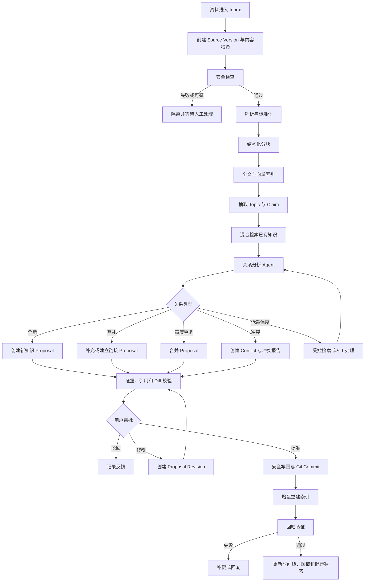
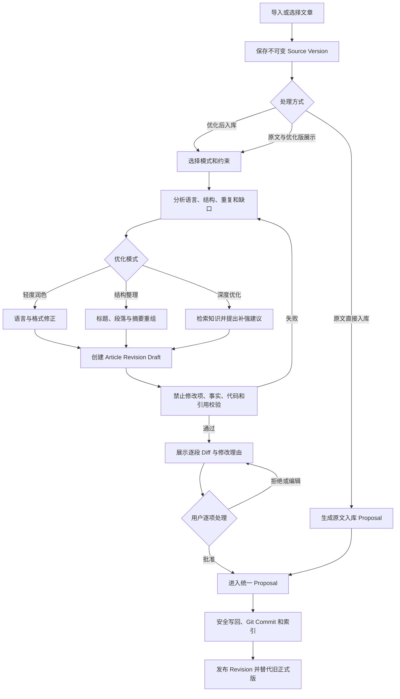
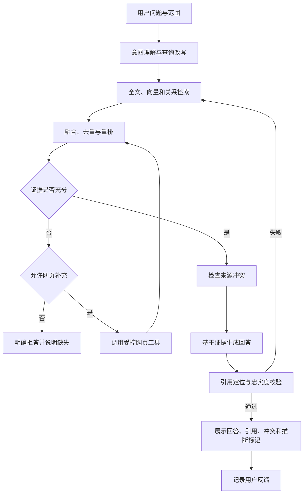
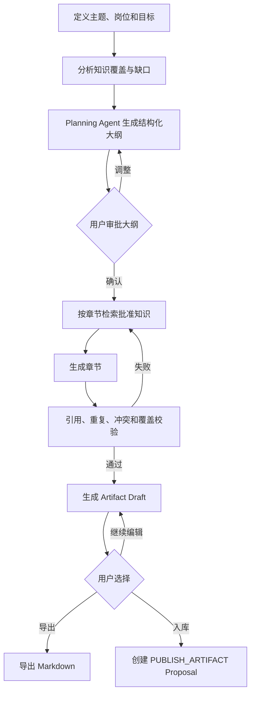
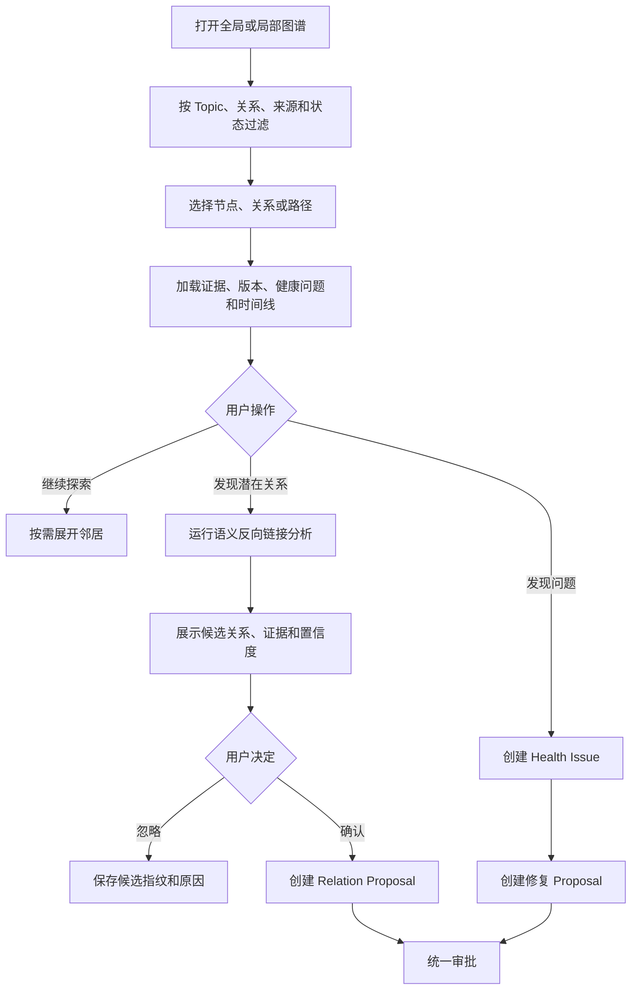
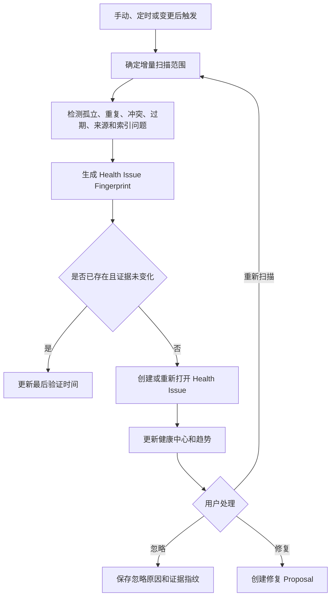
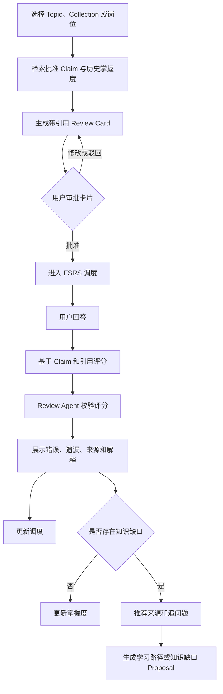
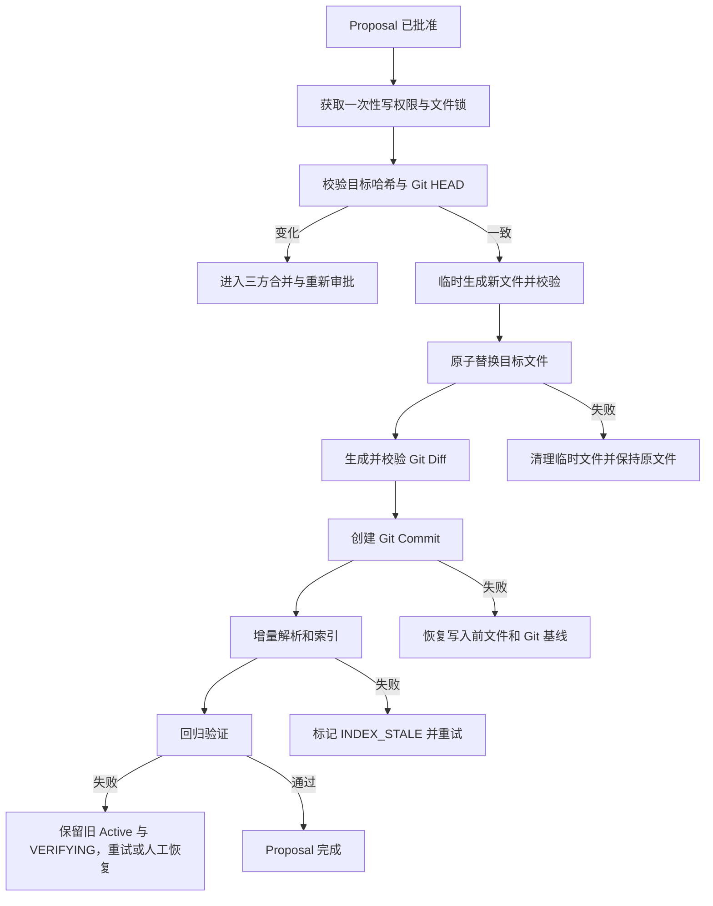

# Go 自组织知识工作台产品需求文档（PRD）

> 文档版本：v1.0-draft  
> 文档状态：正式需求稿  
> 产品形态：个人使用、本地优先、工业级 AI Agent 应用  
> 目标实现：Go 模块化单体、PostgreSQL + pgvector、Markdown + Git  
> 需求范围：正式 v1.0，不以简化 MVP 为目标  
> 文档日期：2026-07-15

---

## 目录

- 0. 文档说明
- 1. Problem Statement
- 2. Solution
- 3. 产品愿景、定位与目标
- 4. 用户与使用环境
- 5. 核心产品原则与不变量
- 6. 信息架构与导航
- 7. 核心领域语言
- 8. 全局状态模型
- 9. 全局交互与错误规则
- 10. 详细功能需求
- 11. 核心工作流
- 12. Agent 行为与 AI 输出要求
- 13. 逻辑数据模型
- 14. 产品接口与模块交互契约
- 15. 非功能需求
- 16. 安全与隐私
- 17. AI 评测体系
- 18. Testing Decisions
- 19. User Stories
- 20. Implementation Decisions
- 21. 页面级需求
- 22. 正式 v1.0 验收矩阵
- 23. 实现依赖与交付顺序
- 24. 风险与缓解
- 25. Out of Scope
- 26. Further Notes

---

## 0. 文档说明

### 0.1 文档目的

本文档定义自组织知识工作台正式 v1.0 的完整产品需求，作为后续产品原型、领域建模、架构设计、接口设计、研发拆解、测试计划和验收的共同依据。

本文档重点回答：

1. 产品要解决什么问题。
2. 用户能够完成哪些完整任务。
3. 每个功能的入口、前置条件、操作流程、分支逻辑、状态变化和页面效果。
4. AI Agent 可以做什么、不能做什么。
5. 数据如何保存、追溯、审批、恢复和回滚。
6. 系统如何证明 RAG、关系判断、文章优化和复习结果是可靠的。

### 0.2 需求优先级

- Must：正式 v1.0 必须交付，缺失则产品不满足验收。
- Should：正式 v1.0 应交付；只有出现明确技术阻塞时才允许降级，并需要记录 ADR。
- Could：可作为正式 v1.0 的增强项，不影响核心闭环验收。

本文档第 10 章所列核心功能默认均为 Must，除非条目明确标记为 Should 或 Could。

### 0.3 “工业级”的产品定义

本项目的工业级不等于多用户、微服务或 Kubernetes，而是：

- 数据模型稳定且有版本。
- 所有 AI 结论可以追溯证据。
- 所有写操作经过 Proposal 和 Approval。
- 工作流持久化、可恢复、可重试。
- 副作用幂等，失败不会留下半完成状态。
- 模型、Prompt、Embedding、分块和评测数据均可版本化。
- 关键行为可观测、可审计、可评测、可回滚。
- 异常明确暴露，不用静默降级制造假成功。

### 0.4 事实来源层级

系统中的事实来源按以下优先级定义：

1. 用户拥有的 Markdown 与附件原文件。
2. Git 中的批准版本和提交历史。
3. PostgreSQL 中的版本、关系、工作流、审计和索引记录。
4. AI 生成但尚未批准的 Proposal、候选关系和草稿。

数据库不得成为用户正式知识的唯一持有者；AI 草稿不得被当作正式知识参与默认检索。

---

## 1. Problem Statement

### 1.1 用户问题

个人技术知识通常散落在 Markdown、PDF、网页摘录、临时笔记和面试资料中。随着资料增长，用户会面临：

- 不知道某个主题已经记录过什么。
- 新文章与旧知识是否重复、互补或冲突难以判断。
- 笔记有很多，但缺少稳定的关联和知识结构。
- 搜索只能匹配关键词，无法回答跨文档问题。
- AI 可以润色或总结，却经常丢失来源、修改原意或产生幻觉。
- 知识更新后，不知道哪些文章、面试资料和闪卡已经过期。
- 笔记“存进去了”，但没有形成可复习、可验证、可持续维护的知识体系。

### 1.2 现有工具不足

传统笔记软件擅长编辑、文件管理、双向链接和展示关系，但通常不能自动完成：

- Claim 级知识抽取。
- 重复、互补和冲突判断。
- 有证据的语义关系建议。
- 带审批的知识合并和写回。
- 知识变化的影响分析。
- 持久化 Agent 工作流和受控 Tool Calling。
- 面向学习结果的复习、评分和知识缺口修复。

通用 AI 聊天工具可以生成内容，但缺少稳定知识源、版本控制、状态恢复、操作审计和长期评测，无法安全地持续管理个人知识。

### 1.3 核心问题

用户需要的不是“能和笔记聊天”的工具，而是一个能够持续完成以下闭环的个人知识管理员：

资料进入 → 理解内容 → 检索旧知识 → 判断关系 → 提出变更 → 展示证据和 Diff → 用户审批 → 安全写回 → 重新索引 → 回归验证 → 维护图谱、健康状态与复习计划。

---

## 2. Solution

构建一个本地优先的自组织知识工作台：

- 使用 Markdown 保存正式知识。
- 使用 Git 保存批准后的版本历史。
- 使用 PostgreSQL + pgvector 保存索引、知识关系、工作流状态、记忆、评测和审计数据。
- 使用持久化 Agent Workflow 执行摄取、分析、问答、优化、写回、维护和复习任务。
- 使用 Proposal/Approval 作为所有正式知识变更的唯一写入路径。
- 使用可操作知识图谱呈现来源、支持、补充、重复、冲突和版本关系。
- 使用 RAG 提供带引用、可拒答、可展示冲突的知识问答。
- 使用智能复习与 FSRS 调度将知识转化为长期掌握结果。

---

## 3. 产品愿景、定位与目标

### 3.1 产品愿景

让个人知识库从“被动存放资料的文件夹”变成“能够持续整理、验证、连接、解释和促进学习的知识系统”。

### 3.2 产品定位

自组织知识工作台不是：

- 通用笔记编辑器。
- 普通向量数据库聊天界面。
- 全自动替用户改文件的 Agent。
- 多人 Wiki 或团队协作平台。
- 通用无代码工作流平台。

它是：

- 面向个人技术知识的 AI 管理工作台。
- 本地文件优先、AI 受控执行的知识 Agent。
- 以来源、版本、审批和评测为基础的 RAG 应用。
- 连接知识整理、知识问答、知识图谱和主动学习的完整闭环。

### 3.3 产品目标

1. 将零散资料转化为可追溯、可关联、可维护的知识体系。
2. 对全新、互补、重复、冲突和低置信度知识提供可评测判断。
3. 让粗糙文章可以被安全优化，并保留原文、Diff 和版本。
4. 提供有来源、有冲突说明、能够拒答的 RAG 问答。
5. 让 AI 只能通过 Proposal、Approval 和受控工具影响正式知识。
6. 提供工作流恢复、幂等、补偿和 Git 回滚。
7. 提供能够实际触发整理行为的知识图谱。
8. 提供知识健康中心和知识演进影响分析。
9. 将批准知识转化为面试材料、学习路径和间隔重复复习。
10. 形成一个能够体现 AI Agent 应用工程完整能力的开源项目。

### 3.4 非目标

- 不支持多用户、组织、团队空间和 RBAC。
- 不支持 SaaS 计费和商业运营后台。
- 不建设完整 WYSIWYG 编辑器。
- 不建设 Canvas、Whiteboard 或无限画布编辑器。
- 不建设通用低代码数据库。
- 不建设通用任务管理、日历或日记系统。
- 不建设多 Agent Swarm。
- 不训练或微调基础模型。

### 3.5 成功指标

#### 产品结果指标

- 用户能够从导入资料到批准写回完成完整闭环。
- 用户能够在任意正式结论上找到来源、版本和生成链路。
- 用户能够通过知识图谱或健康中心发现并处理真实知识问题。
- 用户能够完成一次带证据评分的复习或面试模拟。

#### 质量指标

- 正式知识静默覆盖次数为 0。
- 无来源 AI 补充内容进入正式知识的次数为 0。
- 所有批准写入均可关联 Proposal、Approval 和 Git Commit。
- 所有事实型 RAG 回答包含引用，或明确标记为模型推断。
- 工作流重启恢复后不得重复执行已完成副作用。

#### 体验指标

- 普通检索本地处理 P95 不高于 2 秒，不含模型生成时间。
- 用户从 Proposal 页面能够在不查看日志的情况下理解修改原因、证据和风险。
- 默认全局图谱不会一次渲染所有节点导致不可交互。
- 复习结果必须说明错误点和对应来源，而不是只显示分数。

---

## 4. 用户与使用环境

### 4.1 主要用户

#### 用户 A：技术知识积累者

- 使用 Markdown 或 Obsidian。
- 长期记录 Java、Go、数据库、分布式系统和 AI Agent 知识。
- 笔记数量多，但主题分散、重复和过期内容难以维护。

#### 用户 B：求职与面试准备者

- 希望根据自己真正记录过的知识生成面试材料。
- 需要知道薄弱知识，而不仅是获得一份 AI 生成答案。
- 希望通过模拟面试和间隔重复提高表达和记忆。

#### 用户 C：本地优先知识工作者

- 重视数据控制权和可迁移性。
- 可以接受调用云端模型，但不接受知识只能保存在云端产品。
- 希望模型、Embedding 和工具可替换。

### 4.2 使用环境

- 单用户。
- 桌面浏览器访问本地或自托管 Web 应用。
- Workspace 位于本地磁盘或用户控制的服务器目录。
- PostgreSQL 和 Worker 可通过 Docker Compose 启动。
- Git 仓库由系统初始化或绑定已有仓库。
- 模型可以是云端 API 或本地模型 Adapter。

### 4.3 用户能力假设

- 用户理解文件、目录和 Markdown 基础概念。
- 用户不需要理解向量数据库、Embedding、Rerank 或 Agent 内部实现。
- 系统必须用“来源、关联、修改建议、审批、版本”等产品语言解释行为。

---

## 5. 核心产品原则与不变量

### 5.1 原始资料不可变

- 每次导入都创建或关联 Source Version。
- Source Version 由内容哈希唯一标识。
- 后续优化、拆分和合并只能产生 Revision 或 Proposal。
- 系统不得用优化结果覆盖原始 Source。

### 5.2 派生知识必须有来源

- Claim 必须至少绑定一个 Source Span 或已批准 Claim。
- AI 补充但无外部来源的内容只能标记为“模型建议”。
- 无来源内容默认不得成为 RAG 的事实证据。

### 5.3 先建议后执行

- Agent 可以读取、检索、分析和生成 Proposal。
- Agent 不得直接执行创建、覆盖、移动、删除正式知识文件。
- Approval 是获得一次性写权限的前置条件。

### 5.4 单一正式写入路径

所有正式知识写入必须经过：

Proposal → Evidence Validation → User Approval（服务端捕获 strict clean Git HEAD）→ Version Check → Atomic Begin（同事务消费文件/Git 双授权并创建 Durable Execution）→ `file_prepared`/`file_applied` → `git_prepared`/`git_committed` → Publish Mapping + Reindex Outbox → `verifying/index_pending` → Retrieval/Regression → `completed`。

任何模块不得绕过该路径直接修改 Markdown。

### 5.5 数据与视图分离

- Smart Collection、图谱布局和过滤条件是视图。
- Relation、Claim、Conflict 和 Provenance 是知识事实或候选事实。
- 视图变化不得修改知识事实。

### 5.6 不确定性可见

- 所有 AI 判断包含置信度和证据。
- 低置信度进入人工处理，不允许自动提升为正式关系。
- 冲突默认保留双方观点，不强行选择一个正确答案。

### 5.7 工作流可恢复

- 每个节点完成后写入持久化检查点。
- 节点输出使用版本化结构。
- 副作用节点必须使用幂等键。
- 服务重启后从最后一个有效检查点继续。

---

## 6. 信息架构与导航

### 6.1 一级导航

1. 首页
2. Inbox
3. 知识库
4. 搜索与问答
5. 知识图谱
6. 智能集合
7. 知识健康
8. 产物
9. 复习
10. 工作流
11. 审批中心
12. 设置

### 6.2 首页

首页展示：

- 今日待处理 Proposal 数量。
- Inbox 待处理、解析失败和隔离数量。
- 进行中、等待人工和失败工作流。
- 今日待复习卡片数量。
- 知识健康问题概览。
- 最近新增知识和最近 Git Commit。
- 快捷入口：导入资料、优化文章、开始问答、生成面试文档、开始复习。

页面效果：

- 用户打开系统后能够立即知道“今天需要处理什么”。
- 异常状态优先于统计数字展示。
- 所有数字均可点击进入带相同筛选条件的目标页面。

### 6.3 Inbox

Inbox 页面分为：

- 待处理
- 处理中
- 等待审批
- 已完成
- 失败
- 已隔离

列表显示文件名、类型、大小、导入时间、内容哈希状态、解析状态、工作流状态和风险标记。

### 6.4 知识库

知识库提供：

- 目录树。
- Document 列表。
- 文章详情。
- Claim、Topic、来源、版本、关系和时间线侧栏。
- 原文、正式版、历史 Revision 切换。

### 6.5 搜索与问答

同一入口提供：

- 关键词和语义搜索。
- 检索范围选择。
- RAG 对话。
- 引用查看。
- 检索调试信息的折叠面板。

### 6.6 知识图谱

提供：

- 全局图谱。
- 当前节点局部图谱。
- 关系路径查询。
- 过滤器。
- 节点详情抽屉。
- 候选关系和健康问题操作入口。

阶段交付边界：M7-01 已交付只读的 Topic/Claim 正式图谱，包括 Global、Local、Path、服务端节点搜索、
节点/关系详情和 Relation Evidence 按需查看。候选关系、Health、Timeline、写操作以及 Source、Document、
Conflict、Artifact 正式端点仍属于后续切片；这些最终产品需求不因首版查询边界而删除。

### 6.7 审批中心

统一处理：

- 文章优化 Proposal。
- 新建知识 Proposal。
- 合并 Proposal。
- 冲突登记 Proposal。
- Relation Proposal。
- 健康修复 Proposal。
- Artifact 入库 Proposal。

### 6.8 工作流中心

展示：

- Workflow Run 状态。
- 节点时间线。
- 等待人工节点。
- Tool Call。
- Token、耗时和错误。
- 重试、取消和恢复操作。

---

## 7. 核心领域语言

| 术语 | 定义 |
|---|---|
| Workspace | 用户控制的一个知识空间、文件根目录和配置集合 |
| Source | 用户导入的原始资料逻辑对象 |
| Source Version | 某次导入时不可变的原始内容版本 |
| Content Artifact | 按 Workspace + 内容哈希 create-only 保存的不可变原始字节，位于 `.knowledge/sources/<sha256>`，普通扫描排除并通过 Git 本地 exclude 避免默认跟踪 |
| Parse Projection | 按 Content Artifact + Parser/Schema 版本共享的结构化解析结果 |
| Document | 已解析并可被组织、显示和索引的文档 |
| Article Revision | 文章原文、优化草稿和批准版本之间的版本节点 |
| Chunk | 可检索、可引用的结构化内容片段 |
| Source Span | 原始内容中的精确引用位置 |
| Topic | 主题、领域或概念 |
| Claim | 能够判断真伪或关系的最小知识主张 |
| Relation | 节点之间带类型的关系 |
| Relation Evidence | 支撑关系的原文、理由、置信度和确认状态 |
| Conflict | 两个或多个 Claim 之间未解决的矛盾 |
| Provenance | 来源、版本、处理链路和生成依据 |
| Proposal | 对正式知识或关系的结构化变更建议 |
| Approval | 用户对 Proposal 的批准、驳回、修改或暂缓决定 |
| Artifact | 面试文档、大纲和学习路径等派生产物 |
| Smart Collection | 保存的查询、过滤、分组和视图配置 |
| Review Deck | 围绕一个主题或目标组织的复习集合 |
| Review Card | 与正式 Claim 和来源绑定的复习题 |
| Review Session | 一次复习或面试模拟过程 |
| Health Issue | 知识重复、孤立、冲突、过期等可处理问题 |
| Knowledge Event | 知识创建、修改、审批、冲突、替换和废弃事件 |
| Workflow Definition | 版本化的工作流定义 |
| Workflow Run | 一次持久化工作流实例 |
| Tool Call | 一次结构化、受控、可审计的工具调用 |
| Memory | 用户明确确认的偏好或有生命周期的情景记忆 |

---

## 8. 全局状态模型

### 8.1 资料处理组合状态

```text
DISCOVERED
→ VALIDATING
→ PARSING
→ PARSED
→ CHUNKING
→ CHUNKED
→ INDEXING
→ READY
```

异常分支：

- VALIDATING → QUARANTINED
- PARSING → PARSE_FAILED
- CHUNKING → PARSE_FAILED
- INDEXING → INDEX_FAILED
- 任意处理中状态 → CANCELLED

规则：

- 该序列是 UI 组合视图，不是单表状态机：Source Version 保存不可变输入，Ingestion Attempt 保存安全/解析/分块状态，Workflow 保存重试，Retrieval 保存索引状态。
- CHUNKED 只表示确定性解析投影完成，不表示已经索引。
- READY 只表示资料可检索，不表示已经写入正式知识。
- QUARANTINED 的内容不得进入默认索引和 Agent 上下文。
- 失败状态必须保存错误类型、可重试性和最后一次失败节点。
- 解除隔离必须创建新的 Validation Attempt，不得直接把旧记录改为 PARSED 或 READY。

### 8.2 Proposal 状态

```text
DRAFT
→ VALIDATING
→ READY_FOR_REVIEW
→ APPROVED
→ APPLYING
→ APPLIED
→ VERIFYING
→ COMPLETED
```

其他状态：

- READY_FOR_REVIEW → REJECTED
- READY_FOR_REVIEW → NEEDS_REVISION → VALIDATING
- READY_FOR_REVIEW → DEFERRED
- APPLYING → APPLY_FAILED
- VERIFYING → VERIFY_FAILED → ROLLED_BACK
- 任意未执行状态 → CANCELLED

规则：

- APPROVED 不等于已写入。
- `verifying/index_pending` 表示文件和 Git Commit 已发布、索引请求已落库，但 Retrieval 尚未完成；M5 阶段不得把它返回为 completed。
- COMPLETED 必须同时满足写入、Git Commit、索引和回归验证成功，由 M6 Retrieval 及后续验证流程推进。
- REJECTED Proposal 不得再次直接执行，只能克隆为新版本。

### 8.3 Workflow Run 状态

```text
PENDING → RUNNING → WAITING_FOR_HUMAN → RUNNING → SUCCEEDED
```

其他状态：

- RUNNING → RETRY_WAIT → RUNNING
- RUNNING → PAUSED
- RUNNING → FAILED
- PAUSED → RUNNING
- 任意未结束状态 → CANCELLED

规则：

- WAITING_FOR_HUMAN 不占用 Worker 执行资源。
- FAILED 必须标明可重试节点和已完成副作用。
- SUCCEEDED 只在所有终态校验通过后产生。

### 8.4 Article Revision 状态

```text
SOURCE → DRAFT → VALIDATED → APPROVED → PUBLISHED
```

其他状态：

- DRAFT → DISCARDED
- VALIDATED → NEEDS_REVISION
- APPROVED → PUBLISH_FAILED
- PUBLISHED → SUPERSEDED

### 8.5 Relation 状态

- SUGGESTED：AI 或规则发现的候选关系。
- CONFIRMED：用户批准或来自明确 Markdown 链接的正式关系。
- REJECTED：用户确认误报。
- STALE：证据 Revision 已变化，需要重新验证。
- DEPRECATED：关系曾经成立但已被新版本替代。

### 8.6 Health Issue 状态

- OPEN
- ACKNOWLEDGED
- PROPOSAL_CREATED
- RESOLVED
- IGNORED
- REOPENED

IGNORED 必须保存证据指纹；只有证据变化时才能自动 REOPENED。

### 8.7 Review Card 状态

- GENERATED
- READY_FOR_REVIEW
- ACTIVE
- SUSPENDED
- RETIRED
- INVALIDATED

当绑定 Claim 被废弃或发生高严重度冲突时，卡片进入 INVALIDATED，不再参与调度。

### 8.8 Document 状态

- DRAFT：尚未成为正式知识。
- PUBLISHED：当前正式版本。
- ARCHIVED：不再默认展示和检索，但仍保留。
- SUPERSEDED：已被新 Document 或合并结果替代。
- DELETION_PROPOSED：存在待审批删除 Proposal。
- DELETED：通过批准后从正式目录移除，但 Git 和审计历史保留。

### 8.9 Claim 状态

- SUGGESTED：AI 抽取候选。
- CONFIRMED：来自批准知识且证据有效。
- DISPUTED：参与未解决 Conflict。
- SUPERSEDED：被更准确 Claim 替代。
- DEPRECATED：不再适用但保留历史。
- INVALID：证据失效或确认错误。

### 8.10 Conflict 状态

- OPEN。
- INVESTIGATING。
- RESOLUTION_PROPOSED。
- RESOLVED。
- ACCEPTED_DIVERGENCE：确认双方在不同条件下成立。
- DEFERRED。

### 8.11 Artifact 状态

- PLANNING。
- OUTLINE_REVIEW。
- GENERATING。
- DRAFT。
- APPROVED。
- EXPORTED。
- PUBLISH_PROPOSED。
- PUBLISHED。
- ARCHIVED。

### 8.12 Memory 状态

- CANDIDATE。
- ACTIVE。
- PAUSED。
- EXPIRED。
- DELETED。

---

## 9. 全局交互与错误规则

### 9.1 异步任务

- 预计超过 3 秒的任务进入异步 Workflow Run。
- 创建任务后立即返回任务编号和初始状态。
- 页面通过事件推送或轮询更新进度。
- 用户离开页面不影响任务执行。
- 用户再次进入时显示当前节点、已完成节点和剩余步骤。

### 9.2 危险操作

以下操作必须二次确认：

- 删除正式知识。
- 覆盖目标文件。
- 批量批准 Proposal。
- 回滚 Git Commit。
- 重建全部索引。
- 删除长期记忆。

确认框必须说明影响对象、是否可恢复和预计耗时。

### 9.3 空状态

空状态不得只显示“暂无数据”，必须提供下一步入口。例如：

- Inbox 为空：显示“导入资料”。
- 图谱为空：显示“先完成资料解析和知识关系确认”。
- 复习为空：显示“从 Topic 或 Collection 创建复习计划”。

### 9.4 错误展示

错误信息包含：

- 用户可理解的错误说明。
- 发生阶段。
- 是否可以重试。
- 已完成和未完成的影响。
- 推荐操作。
- 技术错误编号，供日志检索。

### 9.5 一致性冲突

当用户在审批期间修改目标 Markdown：

- 系统检测文件哈希或 Git HEAD 变化。
- Proposal 进入 NEEDS_REVISION。
- 展示原目标版本、当前版本和 Proposal 三方差异。
- 用户必须选择重新生成、手动合并或取消。
- 系统不得覆盖当前文件。

---

## 10. 详细功能需求

### 10.1 Workspace 创建与配置

#### 10.1.1 功能目标

创建一个能够被系统安全读取、写入、索引和 Git 管理的本地知识空间。

#### 10.1.2 入口

- 首次启动引导。
- 设置 → Workspace。
- 首页“创建 Workspace”。

#### 10.1.3 输入项

- Workspace 名称。
- 根目录。
- Inbox 子目录。
- 正式知识目录。
- 附件目录。
- 是否初始化 Git。
- 模型配置。
- Embedding 配置。
- 默认语言和时区。

#### 10.1.4 主流程

1. 用户选择根目录。
2. 系统检查目录存在性、读写权限和符号链接。
3. 系统检查目标目录是否位于允许范围。
4. 检测 Git 仓库：
   - 已存在：读取当前分支、HEAD 和工作区状态。
   - 不存在且用户允许：初始化仓库并创建初始提交。
   - 不存在且用户拒绝：阻止创建，因为正式 v1.0 强制要求 Git。
5. 检查数据库连接和 pgvector 扩展。
6. 检查模型与 Embedding Adapter 可用性。
7. 保存 Workspace 配置。
8. 创建默认目录和内置 Smart Collection。
9. 执行初始扫描。

#### 10.1.5 页面效果

- 使用步骤式引导展示检查结果。
- 每项检查显示成功、警告或失败。
- 失败项提供修复说明和重新检查按钮。
- 创建成功后进入首页，并显示初始扫描进度。

#### 10.1.6 业务规则

- 正式 v1.0 只允许一个活动 Workspace，但数据模型保留 workspace_id。
- Workspace 根目录不能相互嵌套。
- Git 工作区存在未提交修改时允许创建，但必须显示警告并建立基线。
- 模型暂时不可用时允许保存配置，但 AI 功能显示不可用，不得假装成功。

#### 10.1.7 异常处理

- 目录不可写：阻止创建。
- Git 命令不可用：阻止创建并提供安装提示。
- 数据库不可用：阻止完成，但保留未完成配置草稿。
- Embedding 未配置或暂时不可用：允许建立 FTS-only Active Index，Keyword 正常可用；Hybrid
  显式退化为 Keyword 并展示 vector/rerank degraded，Semantic 返回能力不可用。不得用
  `WAITING_DEPENDENCY` 阻断已经具备的全文检索，也不得以空结果冒充语义检索成功。

#### 10.1.8 验收标准

- 能够创建、重新打开和删除 Workspace 配置。
- 删除配置不得删除用户文件或 Git 历史。
- 路径穿越和 Workspace 外写入必须被拒绝。
- 初始扫描可以中断并恢复。

### 10.2 Inbox 与资料导入

#### 10.2.1 功能目标

让用户以可追踪、幂等和安全的方式导入资料。

#### 10.2.2 导入方式

- 拖拽文件。
- 文件选择器。
- 将文件复制到 Inbox 后自动发现。
- 输入网页 URL。
- 粘贴纯文本并命名。

#### 10.2.3 支持类型

- Markdown。
- TXT。
- PDF。
- HTML 网页正文。

不支持类型必须在导入前明确提示，不进入工作流。

#### 10.2.4 主流程

1. 系统发现或接收资料。
2. 计算文件元数据和内容哈希。
3. 查找相同哈希：
   - 完全重复：关联现有 Source Version，并提示重复，不重复解析。
   - 同路径新内容：创建新的 Source Version。
   - 同名不同内容：创建独立 Source，并提示名称冲突。
4. 执行安全检查。
5. 通过后创建 Ingestion Workflow Run。
6. 页面展示解析、分块、Embedding、索引和关系分析进度。
7. 完成后进入“等待整理”或用户选择的后续流程。

#### 10.2.5 导入选项

- 仅存档并索引。
- 导入后分析知识关系。
- 导入后进入文章优化。
- 导入后生成摘要，但摘要只作为草稿。

#### 10.2.6 页面效果

- 每条资料显示独立进度。
- 批量导入时显示总进度和单项失败。
- 失败不会阻止其他资料继续处理。
- 用户可以查看原文件、标准化文本和解析日志摘要。

#### 10.2.7 安全检查

- 文件大小限制。
- MIME 与扩展名一致性。
- 编码检查。
- PDF 加密或损坏检查。
- HTML 脚本和危险标签剥离。
- Prompt Injection 可疑指令标记。
- 路径穿越和符号链接越界检查。

#### 10.2.8 异常处理

- 可重试网络错误：进入 RETRY_WAIT。
- 不可解析内容：进入 PARSE_FAILED。
- 可疑内容：进入 QUARANTINED。
- 模型不可用：完成解析和索引，关系分析等待恢复。

#### 10.2.9 验收标准

- 相同资料重复导入不产生重复 Chunk。
- 单个失败不影响批次其他资料。
- 隔离资料不进入默认检索。
- 所有 Source Version 可反查导入时间、路径和哈希。

### 10.3 内容解析、标准化与分块

#### 10.3.1 功能目标

将不同格式资料转换为保留结构和引用位置的统一 Document。

#### 10.3.2 Markdown/TXT 解析

- 识别标题层级、段落、列表、代码块、表格、引用、链接和 Frontmatter。
- 保留原始行号。
- 代码块不得被语言润色或拆散到不同 Chunk。
- Frontmatter 解析失败时保留原文并产生警告。

#### 10.3.3 PDF 解析

- 提取页码和文本。
- 保留页级位置映射。
- 识别扫描 PDF；正式 v1.0 可标记 OCR_REQUIRED，但 OCR 为 Should。
- 页眉页脚重复内容应被识别并降低索引权重。

#### 10.3.4 网页解析

- 保存 URL、抓取时间、标题、作者和正文。
- 去除导航、广告、脚本和评论区噪声。
- 保存网页内容哈希。
- 网页后续变化不覆盖历史抓取版本。

#### 10.3.5 分块策略

优先级：

1. 标题和语义结构。
2. 段落完整性。
3. 代码块和表格完整性。
4. Token 长度上限。

每个 Chunk 保存：

- 所属 Document 和 Revision。
- 标题路径。
- 原文位置。
- 内容哈希。
- Token 数。
- 分块策略版本。

#### 10.3.6 重建规则

- Parser 或 Chunk Strategy 版本变化时，不自动全量重建。
- 系统生成受影响范围和预计成本。
- 用户可选择增量重建或全量重建。
- 新索引完成前保留旧索引服务查询。

#### 10.3.7 验收标准

- 引用可以定位到 Markdown 行、PDF 页或网页段落。
- 分块不能破坏代码块。
- 相同 Parser 版本和输入产生稳定结果。
- 解析版本可追溯。

### 10.4 索引与混合检索

#### 10.4.1 功能目标

为搜索、RAG、关系分析、图谱和复习提供统一检索能力。

#### 10.4.2 索引类型

- PostgreSQL 全文索引。
- pgvector 向量索引。
- 元数据过滤索引。
- Topic、Claim、Relation 关系索引。

#### 10.4.3 检索流程

1. 接收查询文本和范围。
2. 判断是否需要查询改写。
3. 生成一个或多个独立查询。
4. 并行执行全文和向量检索。
5. 应用 Workspace、状态、版本、来源、Topic 和时间过滤。
6. 使用融合算法合并结果。
7. 去除同一 Document 相邻重复 Chunk。
8. 可选执行 Rerank。
9. 返回证据、位置、来源状态和评分。

#### 10.4.4 默认检索规则

- 只检索 READY 且批准的正式版本。
- 排除 QUARANTINED、DRAFT、REJECTED 和 SUPERSEDED 内容。
- 冲突 Claim 可以被检索，但必须返回冲突标记。
- 原始 Source 默认只用于来源追溯，不与正式 Revision 重复召回。

#### 10.4.5 查询范围

- 整个 Workspace。
- 指定目录。
- 指定 Smart Collection。
- 指定 Topic。
- 指定时间范围。
- 指定 Source 类型。

#### 10.4.6 页面效果

- 搜索结果显示标题、命中片段、路径、来源类型、版本和匹配原因。
- 用户可以切换综合、关键词、语义三种排序解释。
- 高级面板显示全文分数、向量距离和重排分数。

M6-D 的 API wire 对向量阶段明确返回 `distance`，它是当前 Embedding Version 固定距离度量的
原始距离，不得标记为跨模型可比较的 similarity。页面若需要“相似度”文案，必须先根据
Embedding Version 的距离度量做受控解释，不能直接把 `distance` 改名。

#### 10.4.7 异常与降级

- Rerank 不可用：允许返回融合结果，但明确标记“未重排”。
- Embedding 服务不可用：关键词检索仍可用，语义检索显示不可用。
- 索引重建中：查询使用最后一个完整索引版本。
- 不允许将空结果包装为模型回答。

#### 10.4.8 验收标准

- 默认检索不重复返回原文和多个历史 Revision。
- 过滤条件对全文和向量结果一致生效。
- 每个结果可以打开到原文位置。
- 检索失败类型对用户可见。

#### 10.4.9 M6-D Search 与可打开引用契约

- `POST /api/v1/search` 是无业务副作用的复杂 Query。请求必须包含 `workspace_id` 和 `query`，
  可选 `retrieval_mode=keyword|semantic|hybrid`、统一过滤器、opaque `cursor` 与 `limit=1..100`；
  默认模式为 Hybrid、默认页大小为 20。
- Search 只读取请求 Workspace 当前 Active Index。过滤器当前只包含 Source ID、Source Version ID、
  受控相对路径前缀和 `[captured_at_from,captured_at_before)`；Document、Topic、Claim、Relation、
  Conflict 等模型落地前不得返回空壳过滤字段。
- 分页窗口固定为同一规范请求的 top-100。Cursor v1 由 API 进程内随机 HMAC-SHA256 密钥签名，
  绑定规范请求、页大小、Active Index、完整有序结果指纹和下一 offset；结果或索引变化返回 stale，
  API 重启或切换实例后旧 Cursor 失效，客户端从第一页重新请求。
- 每个 Evidence provenance 必须返回可请求的 Source Version/Span URL：
  `GET /api/v1/workspaces/{workspace_id}/source-versions/{source_version_id}` 与
  `GET /api/v1/workspaces/{workspace_id}/source-versions/{source_version_id}/spans/{source_span_id}`。
- Span 必须从 Source Version 绑定的不可变 Content Artifact 读取并复核 Hash/大小/字节范围，
  返回最多 4 KiB 的 UTF-8 excerpt；不得从写回后可能变化的 Workspace 工作树路径读取引用正文。
- Embedding disabled 时 Keyword 仍可用，Hybrid 显式退化为 Keyword 并标记 vector/rerank degraded，
  Semantic 返回 503 capability unavailable；真实零命中返回 200 与空 items。
- 当前只完成 Workspace 数据隔离。正式 Auth、Session、API Token、CSRF/Origin 与 Capability
  Authorization 属于 M10；这些门禁完成前，API 交付范围保持 loopback，不得把 Cursor 当作授权凭据。

### 10.5 文章优化与版本管理

#### 10.5.1 功能目标

将表达粗糙、结构混乱或内容不完整的文章优化为可发布知识，同时保留原文、版本谱系、修改证据和用户最终控制权。

#### 10.5.2 入口

- 首页“优化文章”。
- Inbox 资料操作菜单。
- Document 详情“创建优化版本”。
- 任意历史 Revision 的“基于此版本重新优化”。

#### 10.5.3 处理方式

用户必须选择一种方式：

1. 原文直接入库。
2. 优化后入库。
3. 原文和优化版均在版本界面展示，但默认仅批准的优化版参与 RAG。

无论选择哪种方式，Source Version 都必须保存。

#### 10.5.4 优化模式

##### 轻度润色

允许：

- 修正错别字、病句、标点和格式。
- 提升表达清晰度。
- 统一同一文章中的术语写法。

禁止：

- 改变标题结构。
- 删除事实性内容。
- 增加未经用户要求的新观点。

##### 结构整理

允许：

- 调整标题层级。
- 重排段落。
- 合并重复表达。
- 生成摘要和结论。
- 将混杂内容拆成清晰小节。

要求：

- 所有移动、合并和删除都能在结构 Diff 中查看。
- 被删除的有效信息必须在“可能丢失内容”区域展示。

##### 深度优化

在结构整理基础上允许：

- 检索已有知识补充上下文。
- 提示概念缺口。
- 发现文章内部冲突。
- 建议关联已有 Topic 或 Claim。
- 提供需要外部核验的补充点。

限制：

- 外部补充必须有来源。
- 没有来源的模型内容只能进入“建议”区，不得直接进入正文。
- 代码示例变化必须单独标记并进行语义风险提示。

#### 10.5.5 用户约束

用户可配置：

- 文章用途。
- 目标读者。
- 语气。
- 期望篇幅。
- 输出语言。
- 标题格式。
- 是否允许调整结构。
- 是否允许删除重复内容。
- 是否允许检索知识库补充。
- 是否允许调用网页检索。
- 禁止修改的段落、代码块、术语和事实。

#### 10.5.6 主流程

1. 保存不可变 Source Version。
2. 用户选择处理方式、优化模式和约束。
3. 系统解析文章并识别结构。
4. Agent 生成文章问题清单：
   - 语言问题。
   - 结构问题。
   - 重复内容。
   - 术语不一致。
   - 事实风险。
   - 内容缺口。
5. 用户可在生成前取消某类优化。
6. Agent 生成 Article Revision Draft。
7. 系统执行：
   - 结构化 Schema 校验。
   - 禁止修改项校验。
   - 事实保持校验。
   - 代码块完整性校验。
   - 引用校验。
8. 生成逐段 Diff 和修改理由。
9. 用户逐项接受、拒绝或编辑。
10. 用户提交审批。
11. 通过统一 Proposal 写回。

#### 10.5.7 Diff 页面

页面分为：

- 左侧原文。
- 右侧优化稿。
- 中间或行内差异标记。
- 修改项列表。
- 风险和来源面板。

每个修改项显示：

- 修改类型。
- 原内容。
- 新内容。
- 修改理由。
- 是否改变语义。
- 是否来自知识库或网页来源。
- 置信度。

用户操作：

- 接受单项。
- 拒绝单项。
- 接受同类全部。
- 手动编辑。
- 恢复到原文。
- 重新生成选中段落。

#### 10.5.8 版本规则

- 每次生成创建新的 Article Revision。
- Revision 包含 parent_revision_id。
- 同一个 Parent 可以产生多个分支。
- 批准一个分支不会自动删除其他草稿。
- 新批准版本使旧正式版本进入 SUPERSEDED，但旧版本仍可查看。
- 默认 RAG 只检索最新 PUBLISHED 版本。

#### 10.5.9 异常处理

- 模型输出不符合 Schema：自动重试有限次数，仍失败则显示结构化错误。
- 事实保持校验失败：禁止进入 READY_FOR_REVIEW。
- 代码块被意外改写：将对应修改标记为高风险并默认拒绝。
- 用户编辑导致引用失效：重新运行局部引用校验。
- 目标文件已变化：进入三方合并流程。

#### 10.5.10 页面效果

- 用户能明确看到“AI 修改了什么”和“为什么修改”。
- 原文始终可以一键打开。
- 高风险修改默认折叠接受按钮并要求二次确认。
- 页面顶部显示总体变化：新增、删除、移动和高风险修改数量。

#### 10.5.11 验收标准

- 三种优化模式行为边界可验证。
- 禁止修改项不会出现在最终 Diff 中。
- 原文、草稿和批准版本均可追溯。
- 无来源补充不得进入正式正文。
- 用户可以逐项审批而不是只能整篇接受。

### 10.6 知识抽取与关系分析 Agent

#### 10.6.1 功能目标

从新资料中抽取可管理知识，并判断其与已有知识的关系。

#### 10.6.2 输入

- Source Version。
- 标准化 Document。
- Chunk。
- 当前 Workspace Topic、Claim 和 Relation。
- 用户设置的分析范围。

#### 10.6.3 抽取结果

- Topic 候选。
- Claim 候选。
- 术语和别名。
- 前置知识。
- 文档摘要。
- 关键代码或示例说明。
- 来源位置。

#### 10.6.4 关系类型

##### 全新 NEW

定义：没有检索到语义等价或直接相关的现有 Claim。

处理：

- 创建新知识 Proposal。
- 推荐 Topic、文件路径和链接。

##### 互补 COMPLEMENTARY

定义：与已有知识讨论同一主题，但增加了新的条件、示例、解释或适用范围。

处理：

- 生成补充现有知识或建立链接 Proposal。
- 不自动合并。

##### 高度重复 DUPLICATE

定义：核心 Claim、适用条件和结论基本一致，差异不足以独立保存。

处理：

- 生成合并 Proposal。
- 保留所有有效来源和独特细节。

##### 冲突 CONFLICT

定义：在相同或相近适用条件下，Claim 结论无法同时成立。

处理：

- 创建 Conflict。
- 保留双方 Claim。
- 生成冲突报告。
- 不自动选择正确结论。

##### 低置信度 LOW_CONFIDENCE

定义：检索证据不足、上下文缺失、多个关系类型分数接近或来源质量不足。

处理：

- 调用允许的检索工具。
- 仍无法确认则进入人工处理。

#### 10.6.5 判断流程

1. 抽取 Claim。
2. 为每个 Claim 生成多角度查询。
3. 混合检索候选知识。
4. 对候选进行 Rerank。
5. Agent 比较：
   - 主题是否相同。
   - 适用条件是否相同。
   - 结论是否相同。
   - 证据和时间是否不同。
   - 是否只是表达方式不同。
6. 输出关系类型、理由、引用和置信度。
7. Review Agent 检查证据是否支撑关系。
8. 校验通过后创建 Proposal 或人工任务。

#### 10.6.6 置信度规则

置信度不是单纯展示模型自报分数，必须综合：

- 检索相关性。
- 证据数量。
- 来源质量。
- Claim 抽取完整度。
- 分析 Agent 与 Review Agent 是否一致。
- 是否存在明确适用条件。

阈值可配置，但阈值变化需要版本记录。

#### 10.6.7 页面效果

关系分析结果按 Claim 展示：

- 新 Claim。
- 最相关旧 Claim。
- 关系类型。
- 双方引用。
- 相同点。
- 差异点。
- 适用条件。
- 置信度和不确定原因。
- 建议操作。

#### 10.6.8 异常处理

- 检索无结果：允许 NEW，但必须说明检索范围。
- Source 引用无法定位：禁止创建 Proposal。
- Claim 太长或包含多个结论：拆分后重新分析。
- 分析与审查结论不一致：进入 LOW_CONFIDENCE。

#### 10.6.9 验收标准

- 五种关系类型均有固定评测样本。
- 每个判断都有双方证据。
- 冲突不会被误处理为覆盖或合并。
- 低置信度不会自动进入正式知识。

### 10.7 Proposal 生成与管理

#### 10.7.1 功能目标

将所有可能影响正式知识的行为转化为可理解、可编辑和可审批的结构化变更。

#### 10.7.2 Proposal 类型

- CREATE_DOCUMENT。
- UPDATE_DOCUMENT。
- MERGE_DOCUMENTS。
- SPLIT_DOCUMENT。
- CREATE_RELATION。
- UPDATE_RELATION。
- DEPRECATE_RELATION。
- REGISTER_CONFLICT。
- RESOLVE_CONFLICT。
- PUBLISH_ARTIFACT。
- HEALTH_REPAIR。
- DELETE_DOCUMENT。

#### 10.7.3 必填内容

- Proposal ID 和版本。
- 类型。
- 创建来源。
- 关联 Workflow Run。
- 目标对象和目标版本。
- 变更原因。
- 证据引用。
- Markdown Diff 或关系 Diff。
- 影响对象。
- 风险等级。
- 回滚方式。
- 生成模型、Prompt 和 Schema 版本。

#### 10.7.4 创建规则

- 同一目标和同一基线版本允许多个 Proposal，但只能顺序应用。
- Proposal 创建后目标版本变化时标记 STALE。
- 缺少证据、目标或 Diff 的 Proposal 不得进入 READY_FOR_REVIEW。
- 删除类 Proposal 风险等级固定为 HIGH。

#### 10.7.5 Proposal 列表

支持筛选：

- 类型。
- 状态。
- 风险。
- 来源。
- 创建时间。
- 目标文件。
- Workflow Run。

列表显示：

- 标题。
- 变更摘要。
- 风险。
- 证据数量。
- 目标数量。
- 创建时间。
- 当前状态。

#### 10.7.6 Proposal 详情

页面区域：

1. 变更摘要。
2. 证据和来源。
3. Diff。
4. 关系与影响范围。
5. 风险和回滚。
6. Agent 判断过程摘要。
7. 审批操作。

#### 10.7.7 编辑规则

- 用户可以编辑最终内容。
- 用户编辑后创建新的 Proposal Revision。
- 原 AI 版本保留。
- 编辑后必须重新运行结构、引用和冲突校验。

#### 10.7.8 批量 Proposal

Should：

- 允许批量选择同类低风险 Proposal。
- 页面必须展示批量影响对象。
- 每个 Proposal 独立保存执行结果。
- 单个失败不自动回滚其他已完成 Proposal，除非它们属于同一事务组。

#### 10.7.9 验收标准

- 所有正式写入均可反查 Proposal。
- Proposal 目标基线变化时不能直接应用。
- 用户编辑后保留完整版本历史。
- 删除和覆盖类操作显示高风险。

### 10.8 人工审批

#### 10.8.1 功能目标

确保用户在理解证据、修改内容和影响范围后决定是否执行。

#### 10.8.2 审批动作

- 批准。
- 驳回。
- 编辑后批准。
- 暂缓。
- 请求重新分析。

#### 10.8.3 批准前检查

1. Proposal 状态为 READY_FOR_REVIEW。
2. 目标版本未变化。
3. 证据仍然有效。
4. 必要引用可打开。
5. 高风险项已逐项确认。
6. Git 工作区满足写入条件。

#### 10.8.4 驳回

用户可选择或填写原因：

- 关系判断错误。
- 修改破坏原意。
- 来源不足。
- 不希望合并。
- 当前不需要。
- 其他。

驳回原因可用于用户偏好记忆，但只有用户明确勾选“用于改进后续建议”时才写入长期记忆。

#### 10.8.5 暂缓

- Proposal 进入 DEFERRED。
- 用户可设置重新提醒时间。
- 暂缓期间目标变化会标记 STALE。

#### 10.8.6 页面效果

- 批准按钮旁显示将产生的文件数、关系数和 Git Commit 数。
- 高风险 Proposal 使用醒目标识。
- 证据不可访问时批准按钮禁用。
- 用户不需要查看技术日志即可完成审批。

#### 10.8.7 验收标准

- 未批准 Proposal 无法获得写工具权限。
- 驳回不会产生文件或关系副作用。
- 审批期间目标变化会阻止写入。
- 审批决定可审计。

### 10.9 安全写回、Git 与回滚

#### 10.9.1 功能目标

将批准变更以一致、可恢复方式应用到 Markdown 和索引。

#### 10.9.2 写回流程

1. 审批时由服务端捕获 Workspace 的 strict clean、attached Git HEAD，并写入 `approved_git_head`；客户端不得提交 expected HEAD。
2. Begin 在同一个 PostgreSQL 事务内校验 Proposal/Revision/Approval、running Node lease 和两份独立一次性授权，消费 `WRITE_KNOWLEDGE` 与 `GIT_WRITE`，创建或重放 Durable Execution，并推进 Proposal `APPROVED → APPLYING`。
3. 对目标文件加 Workspace 内部写锁，准备同目录 temp/backup，校验 Markdown、编码、大小、权限和 Change Hash；持久化 `file_prepared`（locator、byte size、mode、lock binding）。
4. 最终重新校验 Base Hash 后原子替换并复核 Result Hash，持久化 `file_applied`；进程重启时通过 `ResumeTarget` 从 durable intent 继续或识别已应用结果。
5. 校验批准 HEAD、工作区/index clean 以及仅目标路径 Diff；持久化 `git_prepared`（Diff Hash、Base/Result Blob、Mode）。
6. 先按完整 Writeback Trailer 和不可变绑定查找 Commit；只有明确 NotFound 且 HEAD/index 仍安全时才创建 Commit。确认 Commit 后持久化 `git_committed` 并推进 Proposal `APPLYING → APPLIED`；结果未知、漂移或绑定冲突进入 `MANUAL_RECOVERY_REQUIRED`，不得盲目重复或恢复文件。
7. 在同一数据库事务中写入 Commit Mapping、`retrieval.revision.reindex_requested` Outbox，并将 Proposal/Execution 推进到 `VERIFYING`；对外状态为 `verifying/index_pending`。
8. Publish 成功后清理 temp/backup 恢复证据；清理失败保留 `VERIFYING` 并可重试 finalize，不得伪装成完成。
9. M6 Retrieval 消费 Outbox 完成解析、索引和回归后，才允许推进 `COMPLETED`。

M4-C 已实现 Approved Proposal 的自动异步写回：Approval、Proposal→Run binding、固定 Safe Writeback Definition/Node、Workflow Outbox 与唯一 River Job 在同一 PostgreSQL 事务提交；Worker Claim 后 exact lookup Durable Execution，缺失时瞬时签发双授权并 Atomic Begin，再调用现有 Safe Writeback Node，最终由 M4-B 原子完成 Node/Run。完整绑定重放直接返回原 Run/Job，不读取已被写回改变的文件或 Git；Rejected 不创建 Workflow。M6-B 已消费 Reindex Outbox，从指定 Commit 捕获不可变 SourceVersion，完成真实 FTS-only Workspace Snapshot、结构回归与原子 Activation，并在同一数据库事务将 Delivery、Execution、Proposal 推进到 completed；M6-C 已实现配置化 Embedding、可恢复向量构建和 Active-only Keyword/Semantic/Hybrid Search。M6-D 已建立 `POST /api/v1/search`、两个 Workspace-scoped Source Version/Span 只读资源、top-100 HMAC Cursor、API/Worker 共用 Configured Embedder Factory 和严格 Web Decoder；真实 PostgreSQL HTTP/River fault、disposable Compose API smoke、Go race/count/integration/vet、Web lint/typecheck/test/build、OpenAPI、Docker 与独立审查均已通过，Search/Evidence 和唯一 Completion 闭环已完成 M6-01 收口。

#### 10.9.3 Git Commit 规则

Commit Message 包含：

- 固定 Safe Writeback 操作主题。
- 操作类型和 Proposal/Revision/Approval/Workflow/Writeback/Target/Hash Trailer。

为保证可验证和不可注入，调用方不能提供自由 Commit Message 或“简短变更摘要”；产品界面可在 Proposal/Timeline 展示摘要，但不把它拼进 Git 命令。

Commit 由受控 Adapter 通过 raw blob、immutable tree、`commit-tree` 和 `update-ref expected-old` 创建；不执行普通 `git add`/`git commit`，不接受调用方 Git 参数。固定 Trailer 必须包含 Proposal、Approval、Workflow 和 Writeback ID，以支持未知结果恢复。

Commit Metadata 关联：

- Workflow Run。
- Approval。
- Source Version。
- 受影响对象。

M5-04D 的真实 Writeback 模型目前只具备 Proposal/Revision/Approval/Workflow/Writeback 的不可变绑定，因此 Commit Trailer 只写入这些已验证事实；Source Version 绑定仍是产品目标，必须在领域模型提供真实 Source Version 关系后实现，禁止填充占位值。

#### 10.9.4 失败补偿

##### 写文件失败

- 删除临时文件。
- 正式文件保持原状。
- Proposal 进入 APPLY_FAILED。

##### `file_prepared` 或 `git_prepared` 检查点恢复

- 进程重启后先读取持久化 intent 并重新获取目标锁。
- `file_prepared` 仅在 Base 仍匹配时继续 CAS，或在 Result + 完整 backup 时识别已应用；locator 篡改、内容未知或用户后续编辑进入 MANUAL_RECOVERY_REQUIRED。
- `git_prepared` 必须先做 exact Trailer lookup；明确 NotFound 才可创建 Commit。unknown/conflict 不得 Restore 文件。

##### 文件成功但 Commit 失败

- 恢复写入前文件。
- 检查 Git 工作区是否回到基线。
- 若恢复失败，进入 MANUAL_RECOVERY_REQUIRED 并阻止后续写入。

##### Commit 成功但索引失败

- 不撤销 Git Commit。
- Proposal/Execution 保持 VERIFYING，Index Request 为 PENDING（或后续 STALE）。
- 由 M6 Retrieval 消费 Outbox 并重试索引；默认 RAG 继续使用上一完整索引，并提示版本落后。

##### 回归验证失败

- M6-B 的 `SNAPSHOT_STRUCTURE_V1` 失败不自动创建反向 Git Commit，也不污染旧 Active Index。
- Proposal/Execution 保持 VERIFYING；可确定的索引失败进入 failed，可重试依赖进入 retry_wait，绑定或结果未知进入 manual_recovery。
- 内容语义需要回滚时必须创建新的回滚 Proposal，由用户重新审批后生成反向 Commit；本期不允许 Reindex Worker 绕过 Approval 自动改写 Git。

#### 10.9.5 用户手动回滚

- 用户从时间线选择批准 Commit。
- 系统展示回滚影响。
- 回滚本身创建新的 Proposal。
- 批准后创建反向 Commit，不重写 Git 历史。

#### 10.9.6 验收标准

- 不出现数据库成功但文件未知、或文件成功但状态假失败的不可解释状态。
- Git Commit 可反查 Proposal。
- 失败补偿路径有自动化测试。
- 回滚不使用破坏性 Git 历史重写。

### 10.10 RAG 问答

#### 10.10.1 功能目标

基于批准知识提供带引用、可展示冲突、能够拒答的多轮问答。

#### 10.10.2 入口

- 一级导航“搜索与问答”。
- Topic 页面“询问此主题”。
- Smart Collection 页面“在此范围问答”。
- Document 页面“基于本文问答”。

#### 10.10.3 查询配置

- 检索范围。
- 时间范围。
- 是否允许使用原始 Source。
- 是否允许网页补充。
- 回答深度。
- 输出格式。

默认只使用批准知识，不使用网页。

#### 10.10.4 问答流程

1. 识别问题意图。
2. 判断是否需要澄清；只有范围无法合理推断时才询问。
3. 根据会话上下文生成多个检索查询。
4. 执行混合检索。
5. 对结果去重和重排。
6. 检查证据充分度。
7. 检测来源冲突。
8. 生成基于证据的回答。
9. 执行引用定位和忠实度校验。
10. 校验通过后展示。

#### 10.10.5 回答结构

回答页面包含：

- 直接答案。
- 关键依据。
- 引用标记。
- 冲突或不确定说明。
- 模型推断标记。
- 相关 Topic 和后续问题。

#### 10.10.6 引用规则

- 引用必须指向具体 Chunk 或 Source Span。
- 引用打开后定位到对应 Markdown 行、PDF 页或网页段落。
- 一个引用不能支撑多个明显无关的结论。
- 引用失效时回答不得显示为已校验。

#### 10.10.7 冲突处理

当检索到冲突 Claim：

- 回答明确说明存在冲突。
- 分别展示各观点和适用条件。
- 展示来源和更新时间。
- 不在证据不足时替用户裁决。

#### 10.10.8 拒答条件

- 无相关证据。
- 证据只来自未批准草稿。
- 引用无法定位。
- 问题要求超出允许工具范围的实时事实，且用户未允许网页。
- 冲突严重且无法形成条件化回答。

#### 10.10.9 多轮会话

- 短期会话上下文只在当前 Conversation 中有效。
- 查询改写可以使用之前问题和答案。
- Conversation 不自动写入长期 Memory。
- 用户可手动将有价值结论生成 Artifact 或 Proposal。

#### 10.10.10 用户反馈

支持：

- 回答有帮助。
- 回答错误。
- 引用无关。
- 引用失效。
- 遗漏重要资料。

反馈用于评测和改进，不直接修改正式知识。

#### 10.10.11 页面效果

- 引用以可点击编号显示。
- 右侧证据面板展示原文和来源状态。
- “为什么这样回答”折叠面板展示检索范围、查询改写和冲突数量，不展示模型私有思维链。
- 回答生成中显示当前阶段：检索、重排、生成、校验。

#### 10.10.12 验收标准

- 事实型回答包含可打开引用。
- 证据不足时能够拒答。
- 冲突知识不会被静默合并。
- 未批准草稿不参与默认问答。
- 用户反馈可进入评测数据。

### 10.11 知识产物生成

#### 10.11.1 功能目标

基于用户已批准知识生成可使用、可追溯、可迭代的面试文档、专题大纲和学习路径。

#### 10.11.2 Artifact 类型

- 面试复习文档。
- 专题知识大纲。
- 学习路径。
- 知识总结报告。
- 面试模拟结果报告。

#### 10.11.3 创建入口

- 产物中心“新建”。
- Topic、Smart Collection 或图谱选中节点“生成产物”。
- RAG 会话“保存为产物”。
- 知识健康或复习结果“生成学习路径”。

#### 10.11.4 输入配置

- 主题。
- 目标岗位。
- 难度。
- 目标读者。
- 期望篇幅。
- 输出语言。
- 知识范围。
- 是否包含代码示例。
- 是否包含面试追问。
- 模板。

#### 10.11.5 生成流程

1. 系统分析目标和知识覆盖范围。
2. 识别已覆盖、薄弱和缺失主题。
3. Planning Agent 生成结构化大纲。
4. 用户审批或调整大纲。
5. 系统按章节分别检索证据。
6. Writing Agent 生成章节。
7. Review Agent 检查：
   - 引用。
   - 重复。
   - 章节覆盖。
   - 前后矛盾。
   - 难度是否符合。
8. 生成 Artifact Draft。
9. 用户编辑和批准。
10. 用户选择：
   - 保持为 Artifact。
   - 导出 Markdown。
   - 发起入库 Proposal。

#### 10.11.6 大纲审批

- 大纲包含章节目标、知识来源范围和预计覆盖 Claim。
- 用户可以拖动排序、删除章节、增加要求。
- 大纲变化后只重新生成受影响章节计划。
- 未确认大纲不得直接生成完整长文。

#### 10.11.7 章节生成规则

- 每章独立保存生成状态。
- 章节必须绑定引用。
- 缺少知识时显示“知识库未覆盖”，不得用模型常识静默填充。
- 如果允许网页补充，外部内容单独标识。

#### 10.11.8 Artifact 版本

- 每次大纲变化或正文再生成创建 Artifact Revision。
- 用户手动编辑需要保留编辑版本。
- Artifact 默认不参与正式知识 RAG。
- 只有通过 PUBLISH_ARTIFACT Proposal 入库后才成为正式 Document。

#### 10.11.9 页面效果

- 左侧大纲。
- 中间正文编辑和预览。
- 右侧章节来源、覆盖率和风险。
- 顶部显示生成进度和 Token 成本。
- 缺失知识使用醒目标识，不自动隐藏。

#### 10.11.10 验收标准

- 能够先审批大纲再生成正文。
- 每章有来源覆盖信息。
- Artifact 不会自动污染正式知识。
- 入库必须经过 Proposal。

### 10.12 可操作知识图谱

#### 10.12.1 功能目标

以可探索、可验证、可行动的方式展示知识关系，而不是只生成装饰性网络图。

#### 10.12.2 节点类型

- Source。
- Document。
- Topic。
- Claim。
- Conflict。
- Artifact。

节点视觉必须区分类型，不能仅依靠颜色；同时使用形状、图标或标签。

M7-01 阶段只把 Knowledge 当前已注册为 Relation 端点的 Topic、Claim 纳入正式图。Source、Document、
Conflict、Artifact 仍是正式 v1.0 的最终节点类型，须在各自领域事实与 Relation 端点契约落地后以兼容扩展
加入，不得用虚构节点或绕过端点约束的方式提前交付。

#### 10.12.3 关系类型

- CITES：引用。
- DERIVED_FROM：来源于。
- BELONGS_TO：属于主题。
- SUPPORTS：支持。
- COMPLEMENTS：补充。
- DUPLICATES：重复。
- CONFLICTS_WITH：冲突。
- PREREQUISITE_OF：前置知识。
- VERSION_OF：版本关系。
- IMPACTS：影响。

#### 10.12.4 关系属性

- 来源。
- 证据。
- 置信度。
- 生成方式。
- 确认状态。
- 创建时间。
- 最后验证时间。
- 适用条件。

#### 10.12.5 全局图谱

默认行为：

- 先按 Topic 聚类。
- 默认只显示重要 Topic、Document 和高权重关系。
- 用户放大或点击后按需展开 Claim。
- 节点数量超过阈值时禁止一次性全部展开，并说明原因。

过滤条件：

- 节点类型。
- 关系类型。
- Topic。
- 来源。
- 时间。
- 确认状态。
- 置信度。
- 健康状态。

M7-01 的 Global 视图按 Topic 返回有界聚类摘要，使用服务端 cursor 分页；当前可按节点类型、Relation
类型、Topic、Claim/Relation 状态、Claim/Relation 最低置信度和更新时间过滤。Source 与健康状态过滤
保留为最终产品要求，待对应领域投影落地后加入。结果窗口超限时必须明确显示截断原因，不能一次加载整个
Workspace 或把截断伪装为空结果。

#### 10.12.6 局部图谱

- 以当前节点为中心。
- 默认深度 1。
- 用户可调整到深度 2 或 3。
- 每次展开显示新增节点数量。
- 支持锁定节点和固定布局。

M7-01 支持围绕 Topic/Claim 的 1 至 3 跳查询；一跳使用服务端 cursor，多跳返回有节点、关系和 frontier
预算的单次快照。中心节点通过 Workspace 范围的服务端搜索选择，不是只过滤当前已加载页面。节点锁定和
固定当前布局只属于本次页面会话，切换查询或刷新后不恢复。

#### 10.12.7 路径查询

用户选择起点和终点后：

- 查找最短路径。
- 可限制关系类型。
- 展示每条边的证据。
- 路径不存在时推荐共同 Topic 或相似节点，但不得伪造正式路径。

M7-01 查询 Topic/Claim 之间经过正式 Relation 的确定性无权最短路径，默认双向探索并保留每条有向边的
实际遍历方向；可收紧方向和 Relation 类型。无路径时明确返回 `not_found`，当前只提供共同 Topic 建议；
相似节点建议属于 M7-02。超时或预算耗尽必须显示错误，不得返回未经证明的部分路径。

#### 10.12.8 节点详情抽屉

包含：

- 标题和类型。
- 摘要。
- 来源。
- 正式版本。
- 直接关系。
- 冲突。
- 健康问题。
- 时间线。
- 可执行操作。

M7-01 节点详情只展示 Topic/Claim 自身已有的标题或主张摘要、状态、版本、置信度/适用条件、更新时间和
当前结果内关系数；来源、Conflict、Health、Timeline 与可执行操作仍是后续最终详情能力。

#### 10.12.9 关系详情

包含：

- 关系两端。
- 关系类型。
- 证据段落。
- 判断理由。
- 置信度组成。
- 用户确认状态。
- 关联 Proposal 和 Workflow Run。

M7-01 关系详情展示 Relation 自身的端点、类型、状态、方向、置信度、版本、确认方式和 Evidence 计数；
Reason、Applicability 与不可变 Source Version/Span 定位由用户展开 Evidence 后独立分页加载。Global、
Local 和 Path 首屏不得预取 Evidence 正文；关联 Proposal、Workflow Run 与更完整的置信度解释保留后续。

#### 10.12.10 可执行操作

- 建立链接。
- 修改关系类型。
- 驳回候选关系。
- 合并重复知识。
- 打开冲突处理。
- 补充来源。
- 生成 Smart Collection。
- 生成学习路径。

所有修改类操作创建 Proposal。

#### 10.12.11 布局保存

- 用户可保存过滤器和视觉布局。
- 布局属于个人视图配置。
- 删除布局不影响知识关系。

跨刷新布局保存是最终产品需求，不属于 M7-01。当前锁定坐标和固定布局只在页面会话内保存，不能被描述为
已持久化的个人视图。

#### 10.12.12 性能规则

- 查询和布局分离。
- 服务端返回限定数量的节点和边。
- 前端按需请求邻居。
- 聚类结果可缓存。
- 图谱查询超时不得阻塞其他功能。

M7-01 前端使用有界 SVG/CSS 画布：超过 60 个可视节点、100 条可视边或布局失败时，明确切换到包含完整
当前结果的键盘可访问列表；服务端查询仍执行独立的节点、边和遍历预算。Cytoscape、Web Worker 和最终大图
交互只有在后续容量与交互证据证明必要时才引入，不是本阶段既定依赖。

#### 10.12.13 验收标准

- 正式关系可打开证据。
- AI 候选与正式关系视觉上可区分。
- 全局图谱在容量基线下保持可交互。
- 图谱操作不会绕过 Proposal。

M7-01 阶段验收还要求：`/graph` 支持 Global/Local/Path、服务端节点搜索、URL 查询状态恢复、会话内锁定/
固定布局、画布/列表切换和 Evidence lazy drawer；loading、empty、truncated、no-path、stale cursor、STALE
Relation 与 timeout 均有可区分状态。桌面和移动端须无横向溢出，节点、关系、drawer 及关闭后的焦点恢复
可通过键盘操作。

### 10.13 语义反向链接与潜在关联

#### 10.13.1 功能目标

发现没有显式链接、但语义上具有明确关系的知识，并由用户决定是否固化。

#### 10.13.2 显式链接

- 解析 Markdown 链接、Wiki Link 和已确认 Relation。
- 展示正向链接和反向链接。
- 链接失效时创建 Health Issue。

#### 10.13.3 潜在关联来源

- 标题和别名匹配。
- 术语匹配。
- Claim 语义相似。
- 共同 Topic。
- 引用同一 Source。
- 经常在 RAG 中共同召回。

#### 10.13.4 候选生成

1. 为当前节点检索候选。
2. 排除已有正式关系。
3. 排除已拒绝且证据未变化的候选。
4. Agent 判断关系类型和适用条件。
5. 保存 Candidate Fingerprint。
6. 展示候选列表。

#### 10.13.5 候选卡片

显示：

- 候选对象。
- 双方摘要。
- 对应段落。
- 建议关系。
- 理由。
- 置信度。
- 发现方式。

操作：

- 确认。
- 修改关系类型后确认。
- 忽略。
- 标记误报。
- 稍后处理。

#### 10.13.6 忽略逻辑

- 保存候选双方版本、模型版本、证据哈希和忽略原因。
- 内容或证据未变化时不重复推荐。
- 重要版本变化后候选可以重新打开，并说明“因内容变化重新评估”。

#### 10.13.7 批量扫描

- 用户可以对目录、Topic 或 Smart Collection 发起扫描。
- 扫描异步执行。
- 结果按置信度和关系类型分组。
- 批量确认仍生成独立 Relation Proposal。

#### 10.13.8 验收标准

- 无显式关键词但语义相关的样本可以被发现。
- 候选确认前不进入正式图谱。
- 已忽略候选不会反复出现。
- 误报率有离线评测。

### 10.14 智能集合与动态视图

#### 10.14.1 功能目标

使用保存查询从多个角度组织同一知识，而不复制文件或关系。

#### 10.14.2 内置集合

- 最近新增。
- 最近更新。
- 待审批。
- 未解决冲突。
- 低置信度知识。
- 缺少来源。
- 孤立知识。
- 待复习。
- 目标岗位知识。
- 索引异常。

#### 10.14.3 自定义条件

支持：

- 对象类型。
- Topic。
- 标签。
- 文件路径。
- 来源类型。
- 时间。
- 置信度。
- Relation 类型。
- Health Issue 类型。
- Review 状态。
- 文本搜索。

#### 10.14.4 条件组合

- 同组条件支持 AND/OR。
- 不支持无限嵌套；正式 v1.0 最大 3 层。
- 页面实时显示条件对应结果数量。
- 无效字段或已删除属性显示错误，不静默忽略。

#### 10.14.5 视图

##### 列表

适合快速浏览标题和摘要。

##### 表格

支持选择列、排序、分组和固定列。

##### 紧凑卡片

显示摘要、状态、Topic、关系和快捷操作。

不建设自由布局、公式字段或通用数据库关联编辑器。

#### 10.14.6 保存规则

Smart Collection 保存：

- 名称。
- 描述。
- 查询定义版本。
- 视图类型。
- 列配置。
- 排序和分组。
- 创建时间和更新时间。

执行结果不持久化为知识对象；可保存缓存和生成时间。

#### 10.14.7 批量操作

允许：

- 发起关系分析。
- 发起健康扫描。
- 创建 Review Deck。
- 生成 Artifact。

写入类批量操作必须进入 Proposal。

#### 10.14.8 验收标准

- 集合结果随知识变化自动更新。
- 删除集合不删除知识。
- 无效查询明确报错。
- 三种视图使用同一查询结果。

### 10.15 知识健康中心

#### 10.15.1 功能目标

集中发现、解释和处理知识库的结构与质量问题。

#### 10.15.2 Health Issue 类型

- ORPHAN：孤立知识。
- DUPLICATE：疑似重复。
- CONFLICT：未解决冲突。
- STALE：疑似过期。
- MISSING_SOURCE：缺少来源。
- LOW_CONFIDENCE：低置信度关系或 Claim。
- BROKEN_REFERENCE：失效引用。
- INDEX_ERROR：索引异常。
- SUPERSEDED_USAGE：仍引用已替代版本。
- REVIEW_INVALIDATED：复习卡片引用失效。

#### 10.15.3 严重度

- CRITICAL：可能导致正式知识错误或数据不一致。
- HIGH：影响 RAG、引用或知识判断。
- MEDIUM：影响组织和维护质量。
- LOW：建议优化但不影响正确性。

严重度由规则确定，Agent 可以提出建议但不能任意降低 CRITICAL。

#### 10.15.4 健康扫描

触发方式：

- 手动全量。
- 对 Topic、目录或 Collection 扫描。
- 定时增量扫描。
- 知识写回后的受影响范围扫描。

#### 10.15.5 去重规则

Health Issue Fingerprint 包含：

- 问题类型。
- 目标对象。
- 关键证据。
- 对象版本。

相同 Fingerprint 不重复创建。

#### 10.15.6 健康中心页面

顶部：

- 开放问题数量。
- 按严重度分布。
- 最近新增和已解决趋势。
- 上次扫描时间。

列表：

- 类型。
- 严重度。
- 目标。
- 证据。
- 首次发现。
- 最近验证。
- 状态。

#### 10.15.7 处理动作

- 查看证据。
- 确认问题。
- 生成修复 Proposal。
- 忽略。
- 暂缓。
- 重新扫描。
- 标记误报。

#### 10.15.8 忽略与重新打开

- 忽略必须选择原因。
- 保存证据指纹。
- 证据未变化不再提醒。
- 目标内容或规则版本变化后可 REOPENED。

#### 10.15.9 修复

修复建议示例：

- 孤立知识：建立 Topic 或 Relation。
- 重复：合并 Proposal。
- 冲突：创建或补充 Conflict。
- 缺少来源：补充 Provenance。
- 失效引用：更新引用 Proposal。
- 过期：标记待核验或创建新版本。

#### 10.15.10 验收标准

- 同一问题不会重复刷屏。
- 每个问题有证据和修复入口。
- 忽略状态在证据变化前保持。
- 修复必须通过 Proposal。

#### 10.15.11 定时维护配置

- 默认关闭，由用户主动开启。
- 支持每日、每周和自定义 Cron。
- 配置执行时间、扫描范围和最大处理数量。
- 错过执行时间后在下次启动补跑一次，不累计多次。
- 上一次任务仍运行时不并发启动相同扫描。
- 定时扫描只创建 Health Issue 和 Proposal，不自动批准。

### 10.16 知识演进时间线与影响分析

#### 10.16.1 功能目标

让用户理解一个知识对象如何形成、变化、发生冲突和影响下游内容。

#### 10.16.2 时间线事件

- Source 导入。
- Claim 创建。
- Relation 创建或确认。
- Proposal 创建、批准、驳回。
- Git Commit。
- Revision 发布或替代。
- Conflict 创建或解决。
- Health Issue 创建或解决。
- Artifact 生成。
- Review Card 失效。

#### 10.16.3 时间线展示

- 按时间排序。
- 支持按事件类型过滤。
- 每个事件显示操作者、来源、摘要和关联对象。
- 点击事件打开 Proposal、Commit、证据或 Workflow Run。

#### 10.16.4 版本比较

用户选择两个批准 Revision 后展示：

- Markdown Diff。
- Claim 新增、删除和修改。
- Relation 变化。
- Topic 变化。
- 引用变化。
- 受影响对象。

#### 10.16.5 影响分析

当 Claim 或 Relation 变化时查找：

- 引用它的 Document。
- 基于它生成的 Artifact。
- 绑定它的 Review Card。
- 使用它的 RAG 评测样本。
- 与它关联的 Conflict。

#### 10.16.6 影响处理

- 影响分析只创建报告。
- 用户可选择下游对象生成更新 Proposal。
- 不自动级联重写。
- 已确认“不受影响”的结果保存基线，避免重复提醒。

#### 10.16.7 时间点快照

Should：

- 用户选择时间点。
- 系统根据批准 Revision 和事件投影重建可查询快照。
- 快照只读。
- 用于解释历史回答和知识状态。

#### 10.16.8 验收标准

- Git Commit、Proposal 和知识事件可以互相反查。
- 版本比较不仅显示文本，还显示 Claim 和 Relation 变化。
- 影响报告覆盖 Document、Artifact、Review Card 和评测样本。
- 影响分析不会自动修改下游对象。

### 10.17 记忆与反馈学习

#### 10.17.1 功能目标

保存用户明确确认、能够长期改善建议质量的信息，同时避免把模型推断或一次性上下文错误地固化。

#### 10.17.2 记忆类型

##### 偏好记忆

- 文件命名方式。
- Topic 组织习惯。
- 常用术语。
- 文章语气。
- 审批偏好。

##### 情景记忆

- 当前面试目标。
- 当前学习计划。
- 某次长工作流的临时上下文。

##### 反馈记忆

- 用户明确授权复用的驳回原因。
- 用户确认的关系判断偏好。

#### 10.17.3 写入规则

- 用户主动创建。
- 用户在审批或反馈时明确勾选“记住此偏好”。
- Agent 只能提出 Memory Candidate，不能直接写长期记忆。
- 情景记忆必须有过期时间。

#### 10.17.4 记忆内容

- 类型。
- 内容。
- 来源。
- 适用范围。
- 创建方式。
- 生效时间。
- 过期时间。
- 最后使用时间。
- 状态。

#### 10.17.5 记忆管理页面

- 按类型和状态筛选。
- 查看来源和最近使用。
- 编辑。
- 暂停。
- 删除。
- 将情景记忆转为长期偏好。

#### 10.17.6 使用规则

- Agent 调用前只加载与当前任务相关的记忆。
- Prompt 中标明记忆是用户偏好，不是知识事实。
- 记忆不能作为 RAG 事实引用。
- 删除后不再进入新任务上下文。

#### 10.17.7 验收标准

- 未明确授权的推断不会进入长期记忆。
- 用户可以查看、修改和删除所有记忆。
- 过期情景记忆不再使用。
- 记忆不会被显示为知识来源。

### 10.18 智能复习、闪卡与面试模拟

#### 10.18.1 功能目标

把批准知识转化为主动回忆、证据评分、间隔重复和知识缺口修复闭环。

#### 10.18.2 Review Deck 创建

来源：

- Topic。
- Smart Collection。
- Artifact。
- 面试目标。
- 用户手动选择的 Document 或 Claim。

配置：

- Deck 名称。
- 目标岗位。
- 难度。
- 每日数量。
- 题型。
- 是否包含代码题。
- 是否启用追问。
- 调度策略。

#### 10.18.3 题型

- 简答题。
- 填空题。
- 概念对比题。
- 场景分析题。
- 代码阅读题。
- 代码设计题。
- 面试追问题。

#### 10.18.4 Review Card 生成

每张卡片包含：

- 问题。
- 标准答案要点。
- 绑定 Claim。
- 引用。
- 难度。
- 题型。
- 生成模型版本。
- 审批状态。

生成规则：

- 只能使用批准 Claim。
- 冲突 Claim 必须在题目中说明条件，或暂不生成。
- 过长答案拆分为多个卡片。
- 重复卡片需要去重。

#### 10.18.5 卡片审批

- 用户预览卡片。
- 可编辑问题、答案要点和难度。
- 可批准、驳回或批量批准低风险卡片。
- 修改答案要点后重新校验引用。

#### 10.18.6 普通复习流程

1. 显示问题。
2. 用户输入或口述回答；正式 v1.0 Must 支持文本，语音为 Could。
3. 用户提交。
4. 系统检索绑定 Claim 和相关证据。
5. Scoring Agent 生成结构化评分。
6. Review Agent 检查评分是否由证据支撑。
7. 展示结果。
8. 用户进行自我难度反馈。
9. Scheduler 更新下次复习时间。

#### 10.18.7 评分结构

- 事实正确性。
- 关键点覆盖。
- 条件与边界。
- 表达清晰度。
- 置信程度。
- 遗漏点。
- 错误点。
- 对应来源。

系统展示等级和解释，不只展示总分。

#### 10.18.8 知识缺口

触发条件：

- 关键事实错误。
- 多次遗漏同一 Claim。
- 无法解释适用条件。
- 多次将冲突观点混为一谈。

处理：

- 推荐原始来源。
- 推荐相关 Topic。
- 生成追问题。
- 调整卡片难度。
- 生成学习路径。
- 必要时创建知识缺口 Proposal。

#### 10.18.9 FSRS 调度

- 默认使用 FSRS Adapter。
- 保存复习时间、评分、间隔、难度和调度参数版本。
- 同一次 Session 的重复提交必须幂等。
- 算法升级不静默改写历史记录。
- 用户可以暂停和重置某个 Deck 的调度。

#### 10.18.10 面试模拟

配置：

- 岗位。
- 主题范围。
- 难度。
- 时长。
- 题目数量。
- 是否启用连续追问。

流程：

1. Interview Agent 选择首题。
2. 用户回答。
3. Agent 基于证据评分。
4. 根据回答选择追问或切换主题。
5. Session 结束后生成报告。

报告包含：

- 主题覆盖。
- 正确点。
- 薄弱点。
- 表达问题。
- 推荐知识。
- 后续复习计划。

#### 10.18.11 卡片失效

当绑定 Claim：

- 被 SUPERSEDED。
- 被 DEPRECATED。
- 出现高严重度 Conflict。
- 来源失效。

Review Card 进入 INVALIDATED，并从调度移除，直到重新审核。

#### 10.18.12 页面效果

- 今日复习显示数量、预计时间和连续学习记录。
- 回答前隐藏答案和引用。
- 回答后并排展示用户回答、答案要点和来源。
- 知识缺口可一键进入 Topic、RAG 或学习路径。

#### 10.18.13 验收标准

- Review Card 均绑定正式知识和来源。
- 评分解释可以定位到具体遗漏和错误。
- 调度重复提交不会推进两次。
- Claim 失效后卡片不再继续复习。
- 面试报告能够生成后续学习动作。

### 10.19 工作流编排与任务中心

#### 10.19.1 功能目标

承载长任务、Agent 决策、Tool Calling、人工审批、失败恢复和副作用补偿。

#### 10.19.2 内置工作流

- Ingestion Workflow。
- Article Optimization Workflow。
- Knowledge Organization Workflow。
- RAG Answer Workflow。
- Artifact Generation Workflow。
- Graph Relation Discovery Workflow。
- Knowledge Health Workflow。
- Review Card Generation Workflow。
- Interview Simulation Workflow。
- Safe Writeback Workflow。

#### 10.19.3 节点类型

- Deterministic：纯规则或代码节点。
- Model：模型调用节点。
- Retrieval：检索节点。
- Tool：工具调用节点。
- Decision：条件分支节点。
- Human：等待用户输入或审批。
- Side Effect：文件、Git 或索引写入节点。
- Validation：证据、Schema、回归校验节点。

#### 10.19.4 节点契约

每个节点定义：

- 节点 ID。
- 输入 Schema 版本。
- 输出 Schema 版本。
- 超时。
- 重试策略。
- 幂等策略。
- 可补偿动作。
- 敏感数据规则。

#### 10.19.5 执行规则

- 只有依赖节点成功后才能运行。
- Human 节点进入 WAITING_FOR_HUMAN。
- 可重试错误使用指数退避和最大次数。
- 不可重试错误立即 FAILED。
- Side Effect 节点执行前检查幂等记录。
- 取消任务不撤销已完成且合法的副作用；需要补偿时明确执行补偿。

#### 10.19.6 暂停与恢复

- 用户可以暂停非 Side Effect 节点。
- 服务关闭时 RUNNING 节点保存租约。
- Worker 重启后回收过期租约。
- 已完成节点不重复执行。

#### 10.19.7 重试

- 用户可以从失败节点重试。
- 系统显示将重用和重新执行的节点。
- 输入或配置变化时创建新的 Workflow Run Version，不覆盖原运行。

#### 10.19.8 任务中心页面

列表显示：

- 名称。
- 类型。
- 状态。
- 当前节点。
- 进度。
- 创建时间。
- 耗时。
- Token。
- 是否等待用户。

详情显示：

- 节点时间线。
- 每个节点输入输出摘要。
- Tool Call。
- 错误。
- 重试历史。
- Proposal 和 Git Commit。

#### 10.19.9 验收标准

- 服务重启后任务可恢复。
- Human 节点不占用 Worker。
- Side Effect 重试不重复写文件或提交。
- 失败节点和错误类型可见。

### 10.20 Tool Calling 与工具权限

#### 10.20.1 功能目标

允许 Agent 通过结构化、最小权限和可审计方式使用外部能力。

#### 10.20.2 核心工具

- SearchKnowledge。
- ReadSource。
- ReadDocument。
- FetchWebPage。
- ValidateCitation。
- CalculateDiff。
- ReadGitStatus。
- ApplyApprovedPatch。
- CreateGitCommit。
- RebuildIndex。
- RunRegressionEvaluation。

#### 10.20.3 工具注册信息

- 工具名称。
- 描述。
- 输入 Schema。
- 输出 Schema。
- 权限等级。
- 超时。
- 是否有副作用。
- 幂等键规则。
- 日志脱敏规则。

#### 10.20.4 权限等级

- READ_LOCAL：读取 Workspace。
- READ_EXTERNAL：访问指定网页。
- WRITE_PROPOSAL：创建候选和 Proposal。
- WRITE_KNOWLEDGE：批准后的一次性写权限。
- GIT_WRITE：批准后的 Git 提交权限。
- INDEX_MAINTENANCE：索引构建、切换等维护权限。
- EVALUATION_RUN：运行版本化评测；不能替代索引维护权限。

#### 10.20.5 调用规则

- Agent 只能调用当前 Workflow Definition 允许的工具。
- 工具参数先通过 Schema 和业务校验。
- 来自资料正文的指令不能改变工具权限。
- WRITE_KNOWLEDGE 和 GIT_WRITE 必须绑定 Approval 和 Proposal。
- 工具返回内容视为数据，不作为系统指令。

#### 10.20.6 网页工具

- 默认关闭。
- 用户可在单次任务或 Workspace 中允许。
- 仅访问 HTTP/HTTPS。
- 阻止 localhost、内网、保留地址和云元数据地址；公开域名 Allowlist 只能进一步收窄，不能绕过地址类别阻断。
- 保存 URL、抓取时间和内容哈希。

#### 10.20.7 审计

每次 Tool Call 保存：

- Workflow Run。
- 节点。
- 工具。
- 参数摘要。
- 权限。
- 开始和结束时间。
- 结果摘要。
- 错误。
- 幂等键。

不保存 raw Prompt、完整参数/输出、网页或 Source 正文、Credential、Authorization、Cookie、绝对路径和命令 stderr；只保存受控摘要、Hash、字节数和稳定结果/副作用引用。

#### 10.20.8 M6-03 运行边界

- Tool Contract Registry 由服务端拥有并冻结 `name + version`；API 只注册 Contract，Worker 只注册具备真实 Adapter 和安全闭环的 Executor。
- Workflow Node 的精确 `allowed_tools`、Capability、Workspace、Run、Node、Attempt、lease/fence 均来自持久事实，Tool Request 不能携带或扩大这些权限。
- Agent Tool Request v1 只包含 `schema_version`、`tool_name`、`arguments` 和 `reason`；Provider 原生 `tool_calls` 仍然拒绝。
- `ApplyApprovedPatch` 与 `CreateGitCommit` 仅作为 Safe Writeback 内两个固定逻辑审计身份，不进入普通 Agent 目录，也不创建第二条文件/Git 写入路径。
- `FetchWebPage` 默认关闭；持久 Workspace/Workflow Web Policy 尚未接线时即使配置启用也必须 readiness fail closed。
- `RebuildIndex` 与 `RunRegressionEvaluation` v1 仅保留 Contract；缺少版本化 Application seam、持久 receipt 或 Workflow 时不注册 Executor，不返回 Fake 或空成功。
- M6-03 先把 strict Agent Tool Request 转换为不含模型自由文本 `reason` 的持久 invocation，并只开放空参数或稳定 ID tuple 的 `ReadSource`、`ValidateCitation`、`ReadGitStatus`。`SearchKnowledge` 和 `CalculateDiff` typed Adapter 已建立，但 query/before/after 属于内容型参数；M6-04 在提供不复制 raw 内容的 request receipt 或同一 Agent Attempt 内执行 seam 前，不得把它们加入持久模型目录。
- 不提供公共 `/tools/{name}:execute` API；M6-04 才负责 Conversation、RAG HTTP API、SSE、反馈与前端，M10 才负责 Session/API Token、CSRF/Origin、公共 Capability Middleware 和通用 Audit UI。

#### 10.20.9 验收标准

- 未审批任务无法调用写工具。
- Prompt Injection 无法提升工具权限。
- 参数校验失败不会执行工具。
- 所有 Tool Call 可审计。

### 10.21 可观测性、审计与成本

#### 10.21.1 功能目标

让用户和开发者能够理解任务发生了什么、为什么失败、消耗多少，以及结果使用了哪些版本。

#### 10.21.2 任务时间线

展示：

- 节点开始和结束。
- 模型调用。
- 检索。
- Tool Call。
- Human 节点。
- Proposal。
- Git Commit。
- 回滚。

#### 10.21.3 模型记录

保存：

- Model Adapter。
- 模型标识。
- Prompt Template 版本。
- Structured Output Schema 版本。
- 输入 Token。
- 输出 Token。
- 延迟。
- 错误类型。

不保存：

- API Key。
- 未脱敏 Secret。
- 不必要的完整用户正文日志。

#### 10.21.4 成本

- 配置模型单价时显示估算成本。
- 无单价时只显示 Token。
- 按任务、工作流类型、模型和时间汇总。
- 成本统计不得阻止核心任务执行。

#### 10.21.5 审计查询

支持按：

- Workflow Run。
- Proposal。
- Git Commit。
- Document。
- Tool。
- 时间。
- 状态。

#### 10.21.6 错误分类

- VALIDATION_ERROR。
- DEPENDENCY_UNAVAILABLE。
- MODEL_ERROR。
- TOOL_ERROR。
- PERMISSION_DENIED。
- CONSISTENCY_CONFLICT。
- INDEX_ERROR。
- WRITE_ERROR。
- REGRESSION_FAILED。
- MANUAL_RECOVERY_REQUIRED。

#### 10.21.7 页面效果

- 普通用户默认看到业务时间线和简化错误。
- 展开“技术详情”后看到错误编号和节点数据摘要。
- 敏感字段使用遮罩。

#### 10.21.8 验收标准

- 任意批准写入可从 Git Commit 追溯完整链路。
- 模型、Prompt、Schema 和索引版本可见。
- 错误不会只显示“系统异常”。
- 敏感配置不进入日志。

### 10.22 设置与维护

#### 10.22.1 设置范围

- Workspace。
- 模型。
- Embedding。
- Rerank。
- 网页访问。
- Git。
- 索引。
- 工作流重试。
- 记忆。
- 复习。
- 数据保留。

#### 10.22.2 模型设置

- 配置一个默认 Chat Model。
- 配置一个 Embedding Model。
- 可选配置一个 Review Model。
- 测试连接。
- 显示支持的能力和限制。

#### 10.22.3 索引维护

- 查看索引版本。
- 查看待索引和失败数量。
- 增量重建。
- 全量重建。
- 切换到上一完整索引。

#### 10.22.4 Git 维护

- 查看当前分支和 HEAD。
- 查看未提交文件。
- 验证仓库状态。
- 重新关联仓库。
- 不提供 reset --hard 等破坏性操作。

#### 10.22.5 数据导出

- 导出 Markdown 和附件。
- 导出领域元数据 JSON。
- 导出评测结果。
- 导出审计摘要。
- 导出任务必须记录字段、查询版本、权限、文件哈希、状态、过期时间和下载审计。
- 正式 v1.0 不提供 Excel/CSV 模板导入、字段映射或公式字段；Smart Collection 的“表格”仅指 Web 表格视图。

#### 10.22.6 数据清理

- 清理过期情景记忆。
- 清理失败任务的临时文件。
- 清理旧模型响应缓存。
- 不自动删除 Source Version、Git Commit 和批准知识。

#### 10.22.7 验收标准

- 配置测试不会修改正式知识。
- 索引重建期间仍可使用上一完整索引。
- 数据导出不依赖专有客户端。
- 清理操作显示影响范围并可审计。

### 10.23 知识对象生命周期管理

#### 10.23.1 功能目标

统一管理 Document、Topic 和 Claim 的新建、重命名、移动、拆分、合并、归档、替代和删除。

#### 10.23.2 手动新建知识

- 用户可以通过粘贴文本或创建 Markdown Draft 新建。
- 新建内容先保存为 Draft。
- 用户选择“发布到知识库”后创建 CREATE_DOCUMENT Proposal。
- 正式发布后才进入默认 RAG。

#### 10.23.3 重命名

- Document 重命名同时检查目标文件名冲突。
- Topic 重命名检查别名和同名 Topic。
- 重命名影响 Markdown 链接时生成链接更新 Diff。
- 重命名必须通过 Proposal。

#### 10.23.4 移动

- 用户选择新目录。
- 系统计算受影响相对链接。
- 生成文件移动和链接更新 Proposal。
- Git 中以删除旧路径、创建新路径或可识别 rename 的 Diff 表达。

#### 10.23.5 拆分

- 用户选择标题或段落范围。
- 系统生成多个目标 Document。
- 原文保留来源映射。
- 原 Document 可保留摘要和链接，或进入 SUPERSEDED。
- 所有新文件和链接在同一事务组审批。

#### 10.23.6 合并

- 用户选择主 Document。
- 系统识别重复和独有内容。
- 生成合并稿、来源合并、链接重定向和旧文档状态方案。
- 默认旧 Document 进入 SUPERSEDED，不物理删除。

#### 10.23.7 归档

- ARCHIVED 内容不参与默认 RAG。
- 可以通过显式过滤检索。
- 归档不删除文件，可移动到归档目录。
- 归档创建 Proposal。

#### 10.23.8 删除

- 删除为高风险 Proposal。
- 页面展示反向链接、Artifact、Review Card 和关系影响。
- 批准后从正式目录移除并创建 Git Commit。
- 数据库对象标记 DELETED，不物理删除审计历史。
- 用户可通过回滚 Proposal 恢复。

#### 10.23.9 Topic 管理

- 手动新建 Topic。
- 合并同义 Topic。
- 设置别名。
- 设置父子或前置关系。
- 删除 Topic 时不得删除其 Document 和 Claim，必须先重新归类或确认变为无 Topic。

#### 10.23.10 验收标准

- 重命名和移动能更新受影响链接。
- 合并保留全部来源。
- 删除前展示完整影响。
- 所有生命周期变化可从时间线和 Git 追溯。

### 10.24 Conflict 管理与解决

#### 10.24.1 功能目标

将冲突从一次性提示转化为可持续跟踪、调查、解释和解决的知识对象。

#### 10.24.2 Conflict 创建

来源：

- 关系分析 Agent。
- RAG 冲突检测。
- 用户手动标记。
- 健康扫描。

创建时必须包含：

- 冲突 Claim。
- 各自来源。
- 适用条件。
- 冲突摘要。
- 严重度。
- 影响范围。

#### 10.24.3 冲突页面

并排展示：

- Claim A 与 Claim B。
- 来源与时间。
- 适用条件。
- 支持证据。
- 差异点。
- 影响对象。
- 调查记录。

#### 10.24.4 调查

用户可以：

- 检索本地知识。
- 允许网页调查。
- 添加新来源。
- 修改适用条件。
- 邀请 Review Agent 重新分析。

每次调查形成记录，不覆盖之前结论。

#### 10.24.5 解决方式

- 选择一个 Claim 为当前有效，另一个 DEPRECATED。
- 确认双方在不同适用条件下成立，状态为 ACCEPTED_DIVERGENCE。
- 创建综合 Claim 替代双方。
- 证据不足，保持 OPEN 或 DEFERRED。

#### 10.24.6 解决 Proposal

包含：

- 最终结论。
- 证据。
- Claim 状态变化。
- Document 修改。
- Relation 修改。
- 下游影响。
- 回滚方式。

#### 10.24.7 下游处理

解决后：

- 更新图谱状态。
- 重新评估相关 RAG 回答样本。
- 使不再有效的 Review Card 失效。
- 为受影响 Artifact 生成更新建议。
- 运行局部健康扫描。

#### 10.24.8 验收标准

- 冲突不会通过普通文章覆盖静默消失。
- 解决过程保留调查和历史。
- ACCEPTED_DIVERGENCE 能表达条件差异。
- 冲突解决能够触发下游影响分析。

---

## 11. 核心工作流

### 11.1 资料摄取与知识整理



### 11.2 文章优化与入库



### 11.3 RAG 问答



### 11.4 Artifact 生成



### 11.5 图谱与语义关联



### 11.6 知识健康维护



### 11.7 智能复习与面试模拟



### 11.8 安全写回与失败补偿



---

## 12. Agent 行为与 AI 输出要求

### 12.1 逻辑角色

正式 v1.0 使用三个逻辑角色，不要求三个独立模型：

- Analysis Agent：理解问题、抽取 Claim、判断关系、规划检索。
- Organization Agent：生成文章、Proposal、Artifact 和关系建议。
- Review Agent：检查证据、结构化输出、引用、事实保持和风险。

### 12.2 Agent 通用输入

- 当前任务目标。
- Workspace 范围。
- 正式知识检索结果。
- Source Span。
- 用户约束。
- 允许工具。
- 用户确认 Memory。
- 输出 Schema 版本。

### 12.3 Agent 通用输出

输出必须是结构化对象，至少包含：

- result_type。
- conclusion。
- evidence。
- confidence。
- uncertainty_reasons。
- proposed_actions。
- tool_requests。
- schema_version。

### 12.4 禁止行为

- 直接写文件。
- 直接执行 Git Commit。
- 将正文中的指令视为系统指令。
- 伪造引用。
- 在证据不足时输出确定事实。
- 将未批准草稿视为正式知识。
- 暴露密钥或完整敏感配置。
- 将模型私有思维链展示给用户。

### 12.5 结构化输出失败

1. 首次失败：使用原响应和 Schema 错误进行修复重试。
2. 第二次失败：缩小任务或减少输出字段后重试。
3. 达到最大次数：节点失败，保存原始错误摘要。
4. 禁止使用自由文本解析作为静默兜底。

### 12.6 模型选择

- 每类节点声明所需能力。
- 默认模型不可用时可以使用配置的兼容 Adapter。
- 模型切换必须记录。
- 不同模型结果需要通过相同 Review 和评测标准。

### 12.7 Prompt 版本

- Prompt Template 有稳定 ID 和版本。
- 变更需要变更说明。
- 上线前运行对应评测集。
- Workflow Run 保存实际使用版本。

### 12.8 置信度展示

用户界面显示：

- 高、中、低等级。
- 主要影响因素。
- 不确定原因。

不得只显示看似精确但无法解释的百分比。

---

## 13. 逻辑数据模型

### 13.1 Workspace

关键字段：

- id。
- name。
- root_path。
- inbox_path。
- knowledge_path。
- git_repository。
- active_index_version。
- timezone。
- status。

### 13.2 Source 与 Source Version

Source：

- id。
- workspace_id。
- type。
- logical_name。
- original_location。

Source Version：

- id。
- source_id。
- content_artifact_id。
- content_hash。
- size。
- mime_type。
- captured_at。
- original_content_location。
- security_status。
- parser_version。

说明：`original_content_location` 是 Provenance，不是历史版本的唯一内容存储。Source Version 必须关联按内容哈希 create-only 保存的不可变 Content Artifact。`security_status` 和 `parser_version` 仅兼容早期字段，不作为后置处理状态事实源；安全、解析和分块状态记录在 Ingestion Attempt。

### 13.3 Document、Revision 与 Chunk

Document：

- id。
- workspace_id。
- canonical_path。
- title。
- current_published_revision_id。
- lifecycle_status。

Article Revision：

- id。
- document_id。
- source_version_id。
- parent_revision_id。
- content_hash。
- status。
- optimization_mode。
- created_by。
- git_commit。

Chunk：

- id。
- parse_projection_id。
- heading_path。
- sequence。
- content。
- content_hash。
- source_span_id。
- byte_count。
- rune_count。
- parser_version。
- chunk_strategy_version。
- schema_version。
- status。

Source Span：

- id、content_artifact_id、parse_projection_id。
- span_type、start_line、end_line、start_byte、end_byte、selector、excerpt_hash。
- Span 不可变；Claim Source 和 Relation Evidence 额外保存 source_version_id 选择具体导入 Provenance。

Source Span 是稳定实体，Chunk 通过 `source_span_id` 引用；行号采用 1-based 闭区间，byte offset 采用不可变 Content Artifact 原始字节中的 0-based 半开区间。Canonical Chunk 属于 Ingestion 投影，不伪造与具体模型相关的 Token 数；Embedding、Token Count、FTS 和 Index Version 属于 Retrieval 投影。

### 13.4 Topic、Claim 与 Relation

Topic：

- id。
- name。
- aliases。
- description。
- status。

Claim：

- id。
- statement。
- normalized_statement。
- applicability。
- status。
- confidence。

Claim Source：

- claim_id。
- source_span_id。
- source_version_id（选择具体导入 Provenance）。
- support_type。

Relation：

- id。
- source_node_type。
- source_node_id。
- target_node_type。
- target_node_id。
- relation_type。
- status。
- confidence。
- valid_from。
- valid_to。

Relation Evidence：

- relation_id。
- source_span_id。
- source_version_id（选择具体导入 Provenance）。
- reason。
- evidence_hash。
- model_version。
- confirmed_by。

### 13.5 Conflict

- id。
- topic_id。
- status。
- severity。
- summary。
- resolution。
- created_at。
- resolved_at。

Conflict Member：

- conflict_id。
- claim_id。
- applicability。
- position_summary。

### 13.6 Proposal 与 Approval

Proposal：

- id。
- type。
- status。
- base_version。
- target_refs。
- change_set。
- evidence_refs。
- risk_level。
- rollback_plan。
- workflow_run_id。
- proposal_version。

Approval：

- id。
- proposal_id。
- action。
- comment。
- approved_change_hash。
- created_at。

### 13.7 Workflow 与 Tool Call

Workflow Run：

- id。
- definition_id。
- definition_version。
- status。
- input。
- current_node。
- started_at。
- ended_at。

Workflow Node Run：

- id。
- workflow_run_id。
- node_id。
- attempt。
- status。
- input_version。
- output_version。
- idempotency_key。
- error_code。

Tool Call：

- id。
- node_run_id。
- tool_name。
- permission。
- request_summary。
- response_summary。
- idempotency_key。
- status。

### 13.8 Smart Collection

- id。
- name。
- description。
- query_definition。
- query_version。
- view_type。
- view_config。
- cached_result_version。

### 13.9 Health Issue

- id。
- type。
- severity。
- target_ref。
- evidence。
- fingerprint。
- status。
- first_detected_at。
- last_verified_at。
- ignored_reason。

### 13.10 Artifact

- id。
- type。
- title。
- status。
- scope_definition。
- current_revision_id。
- source_coverage。

Artifact Revision：

- id。
- artifact_id。
- outline。
- content。
- citations。
- status。

### 13.11 Review

Review Deck：

- id。
- name。
- source_scope。
- target_role。
- scheduler_config。
- status。

Review Card：

- id。
- deck_id。
- question。
- answer_points。
- claim_refs。
- citation_refs。
- type。
- difficulty。
- status。

Review Schedule：

- card_id。
- due_at。
- interval。
- stability。
- difficulty。
- scheduler_version。

Review Session：

- id。
- deck_id。
- mode。
- started_at。
- ended_at。
- summary。

Review Answer：

- session_id。
- card_id。
- answer。
- score_dimensions。
- feedback。
- idempotency_key。

### 13.12 Memory 与 Knowledge Event

Memory：

- id。
- type。
- content。
- source。
- scope。
- expires_at。
- status。

Knowledge Event：

- id。
- event_type。
- object_ref。
- source_ref。
- occurred_at。
- event_version。
- summary。

### 13.13 数据约束

- 所有核心对象包含 workspace_id 或能够通过父对象确定 Workspace。
- 所有可变对象包含版本或乐观锁。
- 所有外部引用使用稳定 ID，不以文件路径作为唯一标识。
- 所有时间使用 UTC 保存，按 Workspace 时区展示。
- 所有 JSON 结构包含 schema_version。
- 正式对象禁止物理删除，使用生命周期状态；临时缓存除外。

---

## 14. 产品接口与模块交互契约

### 14.1 接口原则

- 接口返回业务状态，不用 HTTP 成功掩盖业务失败。
- 异步操作返回 Workflow Run ID。
- 写操作要求 idempotency_key。
- 修改操作要求目标版本。
- 列表接口统一使用 cursor + limit 分页；页面可以将 cursor 映射为页码表现，但公共 API 不使用 offset/page 作为第二套分页契约。
- 错误返回稳定 error_code、message、retryable 和 details。

### 14.2 Workspace 接口能力

- 创建 Workspace。
- 校验 Workspace 配置。
- 获取当前状态。
- 执行扫描。
- 获取 Git 与索引健康状态。

### 14.3 Source 与 Ingestion 接口能力

- 上传或注册 Source。
- 创建网页抓取任务。
- 查询导入进度。
- 查看 Source Version。
- 重试失败节点。
- 隔离、解除隔离或删除未处理资料。

### 14.4 Search 接口能力

请求包含：

- workspace_id（必填）。
- query。
- filters：source_ids、source_version_ids、path_prefixes、captured_at_from、captured_at_before。
- retrieval_mode：keyword、semantic 或 hybrid；默认 hybrid。
- cursor（可选）。
- limit（默认 20，范围 1..100）。

响应包含：

- result items。
- 可打开的 Source Version/Source Span href。
- lexical score、vector distance、fusion score 和可选 rerank score。
- index_version_id 和可选 embedding_version_id。
- requested/effective mode、Index degraded capabilities 与单次 Query degradations。
- top-100 窗口内的可选 next_cursor。

当前公开 Search API 为 `POST /api/v1/search`。Cursor 是当前 API 进程内签名的结果一致性凭据，
不是 Session 或权限凭据；重启后失效。Source Version/Span GET 必须同时校验 Workspace 归属，
跨 Workspace 与绑定不存在统一返回 Not Found，避免对象身份枚举。

### 14.5 RAG 接口能力

- 创建 Conversation。
- 提交问题。
- 查询 Answer Workflow。
- 获取流式回答状态。
- 提交回答反馈。
- 将回答生成 Artifact 或 Proposal。

### 14.6 Proposal 与 Approval 接口能力

- 创建 Proposal。
- 获取 Proposal Revision。
- 校验 Proposal。
- 编辑并创建新 Revision。
- 批准、驳回、暂缓。
- 查询应用状态。
- 创建回滚 Proposal。

规则：

- Approval 请求必须带 approved_change_hash。
- 服务端重新计算当前 Change Hash；不一致则拒绝。

### 14.7 Graph 接口能力

- 查询全局聚类。
- 查询局部邻居。
- 查询节点详情。
- 查询关系详情。
- 查询两个节点路径。
- 查询候选关系。
- 创建 Relation Proposal。
- 保存布局和过滤视图。

M7-01 已交付的接口是只读 Query：全局 Topic 聚类、Topic/Claim 服务端搜索与详情、1 至 3 跳局部邻居、
确定性最短路径、Relation 详情和 Relation Evidence cursor 分页。候选关系、Relation Proposal、布局/
过滤视图持久化仍是最终产品接口范围，不得由当前查询接口伪装实现；Graph cursor 是结果窗口状态，不是授权
凭据或持久会话。

### 14.8 Collection 接口能力

- 校验查询定义。
- 预览结果数量。
- 保存 Collection。
- 执行分页查询。
- 创建基于 Collection 的工作流。

### 14.9 Health 接口能力

- 触发扫描。
- 查询 Health Issue。
- 确认、忽略、暂缓、重新扫描。
- 创建修复 Proposal。
- 获取趋势。

### 14.10 Artifact 接口能力

- 创建生成任务。
- 编辑和审批大纲。
- 查询章节状态。
- 编辑 Artifact Revision。
- 导出。
- 创建入库 Proposal。

### 14.11 Review 接口能力

- 创建 Deck。
- 生成卡片。
- 审批卡片。
- 获取今日待复习。
- 创建 Review Session。
- 提交 Answer。
- 获取评分和下次调度。
- 创建面试模拟。

### 14.12 Workflow 接口能力

- 查询 Run。
- 获取节点时间线。
- 暂停、恢复、取消。
- 从失败节点重试。
- 提交 Human Node 输入。

### 14.13 事件通知

通过 SSE 推送：

- Workflow 状态变化。
- Human Node 等待。
- Proposal 可审批。
- 索引完成。
- Health Scan 完成。
- Review 评分完成。

断线重连后客户端通过 Last-Event-ID 请求保留窗口内事件；超出保留窗口时重新查询资源状态。SSE 只做通知，不是事实源。

---

## 15. 非功能需求

### 15.1 容量基线

正式 v1.0 目标：

- 10,000 个 Document。
- 500,000 个 Chunk。
- 100,000 个 Claim。
- 500,000 条 Relation。
- 50,000 张 Review Card。
- 单个 Markdown 文件建议不超过 10 MB。
- 单个 PDF 默认上限 100 MB，可配置。

容量是验收压测基线，不代表硬编码限制。

### 15.2 性能

- 普通混合检索本地阶段 P95 ≤ 2 秒。
- 局部图谱一跳查询 P95 ≤ 1.5 秒。
- Collection 首屏 P95 ≤ 2 秒。
- Proposal 列表 P95 ≤ 1 秒。
- 工作流状态查询 P95 ≤ 500 毫秒。
- 长任务必须异步，不阻塞请求线程。

模型耗时单独统计，不纳入本地处理指标。

M6-D 的向量查询只保留 exact pgvector scan 与 `EXPLAIN (FORMAT JSON)` 基线，用于证明固定距离
operator、过滤和查询计划正确；它不证明 500,000 Chunk 下的 ANN 参数或 P95。HNSW/IVFFlat、
容量数据集与最终 P95 锁定属于 M10 性能交付。

M7-01 Graph 使用确定性的 20,000 Topic、100,000 Relation、100,000 Evidence fixture，对一跳查询执行
5 次预热和 30 次采样，并验证固定查询数及代表性索引计划。该阶段证明查询可在 100,000 Relation 规模下
满足 1.5 秒目标，但不代表 AC-31 已完成：500,000 Relation、正式资源预算和前端交互 FPS 仍由 M10 最终
容量门禁验收。

### 15.3 可用性

- 单个模型或 Rerank Adapter 不可用时，系统其他非依赖功能可用。
- PostgreSQL 不可用时禁止写入并明确展示。
- Git 不可用时禁止批准写回。
- 上一完整索引可在新索引构建期间继续服务。

### 15.4 一致性

- 文件和 Git 是正式知识的一致性基线。
- 数据库保存 Commit 与 Revision 映射。
- 启动时检查数据库已发布 Revision 与 Git HEAD 的一致性。
- 不一致时系统进入 READ_ONLY_RECOVERY，禁止新写入。

### 15.5 可恢复性

- Workflow Node 完成后持久化。
- 临时文件带 Run ID 并可识别清理。
- Side Effect 有补偿记录。
- MANUAL_RECOVERY_REQUIRED 状态阻止后续相关写入。

### 15.6 可扩展性

- Model、Embedding、Rerank、Parser、Workspace、Git、Review Scheduler 和未来 Graph Store 通过 Adapter 接入。
- 只有存在第二个真实实现或可验证变化需求时才新增 seam。
- Adapter 错误映射为统一领域错误。

### 15.7 可维护性

- 模块通过小 interface 协作。
- HTTP Handler 不包含领域业务规则。
- 外部 SDK 类型不进入核心领域接口。
- 数据库迁移可向前执行，并记录版本。
- Workflow Definition、Prompt 和 Schema 均有兼容策略。

### 15.8 可迁移性

- 用户可以独立打开和编辑 Markdown。
- Git 仓库不依赖应用私有历史格式。
- 领域元数据支持 JSON 导出。
- Embedding 可以重建，不作为不可替代数据。

### 15.9 可访问性

Should：

- 关键操作支持键盘。
- 状态不能只用颜色表达。
- 图谱节点类型有图标或形状。
- Diff 对屏幕阅读器提供文本描述。

---

## 16. 安全与隐私

### 16.1 密钥

- API Key 通过环境变量或 Secret Store。
- 前端不返回完整密钥。
- 日志只显示掩码。
- 导出配置不包含 Secret。

### 16.2 文件安全

- 所有文件操作解析为规范化绝对路径。
- 写入目标必须位于 Workspace 根目录。
- 符号链接目标必须再次校验。
- 禁止执行资料中包含的脚本。

### 16.3 Prompt Injection 防御

- 外部资料在 Prompt 中标记为 untrusted content。
- 工具权限由 Workflow Definition 决定，不由模型文本决定。
- 模型要求泄露 Secret 或修改系统规则时视为恶意内容。
- 可疑 Source 创建安全标记。
- 高风险内容可进入 QUARANTINED。

### 16.4 SSRF 防御

网页抓取：

- 默认阻止 localhost。
- 阻止私网、链路本地和云元数据地址。
- 限制重定向次数。
- 校验重定向目标。
- 设置响应大小和超时。

### 16.5 日志隐私

- 正文默认只保存摘要和哈希到操作日志。
- 调试模式保存正文需要用户显式开启。
- 调试数据有过期时间。
- 密钥、认证头和敏感查询参数强制脱敏。

### 16.6 权限模型

虽然是单用户，仍区分能力权限：

- 读取知识。
- 读取外部网页。
- 创建 Proposal。
- 执行批准写入。
- Git 写入。
- 维护索引。

权限由当前任务和审批上下文授予，不以“单用户”理由全部常开。

### 16.7 供应链

Should：

- 固定关键依赖版本。
- 生成依赖清单。
- CI 执行漏洞扫描。
- Docker 镜像使用非 root 用户。

---

## 17. AI 评测体系

### 17.1 评测原则

- AI 功能不能只依赖人工“看起来不错”。
- 评测数据与生产知识分离。
- 每次模型、Prompt、Embedding、Chunk Strategy 或 Rerank 变化运行对应评测。
- 评测结果保存版本和对比基线。

### 17.2 RAG 检索评测

指标：

- Recall@K。
- MRR。
- NDCG。
- 来源覆盖率。
- 重复结果率。

数据：

- 问题。
- 相关 Source Span。
- 必须包含和必须排除的文档。
- 时间和范围过滤条件。

### 17.3 RAG 回答评测

指标：

- Citation Precision。
- Citation Coverage。
- Faithfulness。
- Conflict Disclosure Rate。
- Appropriate Refusal Rate。

失败示例：

- 答案正确但引用不支撑。
- 使用未批准草稿。
- 忽略冲突。
- 无证据仍回答。

### 17.4 关系分类评测

分类：

- NEW。
- COMPLEMENTARY。
- DUPLICATE。
- CONFLICT。
- LOW_CONFIDENCE。

指标：

- 每类 Precision、Recall、F1。
- 高风险误判率。
- 证据支持率。

冲突误判为重复属于高风险错误，单独统计。

### 17.5 文章优化评测

指标：

- 原意保持。
- 事实一致。
- 禁止修改项遵守率。
- 结构改善。
- 语言质量。
- 无来源新增率。
- 代码块保持率。

评测包含：

- 技术文章。
- 含代码文章。
- 结构混乱文章。
- 有意设置的事实陷阱。

### 17.6 图谱与语义关联评测

指标：

- Relation Type Accuracy。
- Evidence Support Rate。
- Candidate Precision@K。
- Candidate Recall。
- Ignored Candidate Reappearance Rate。

### 17.7 Artifact 评测

指标：

- 大纲覆盖率。
- 章节引用覆盖率。
- 重复率。
- 冲突一致性。
- 缺失知识暴露率。

### 17.8 Review 评测

指标：

- 题目可回答性。
- 答案忠实度。
- 难度匹配。
- 重复卡片率。
- 评分与人工评分一致性。
- 知识缺口定位准确率。

### 17.9 回归门禁

- 高风险指标不得下降。
- 指标下降超过阈值时阻止默认版本切换。
- 可以保留实验版本，但不能设为默认。
- 门禁阈值在评测 ADR 中定义。

### 17.10 人工抽检

- 每类 AI 功能维护抽检队列。
- 抽检记录问题类型。
- 抽检结果可以转为评测样本。
- 生产用户反馈未经清理不得直接成为金标准答案。

---

## 18. Testing Decisions

### 18.1 测试原则

- 测试对外行为，不测试 Prompt 具体措辞和私有实现。
- 优先在最高层 seam 验证完整结果。
- 外部模型在确定性测试中使用 Fake Adapter。
- AI 质量通过固定评测集验证。
- 文件、Git、数据库和索引一致性必须做故障注入。

### 18.2 最高层验收 Seam

#### Seam A：知识变更闭环

输入一个 Workspace 和 Source，验证：

- 关系分析。
- Proposal。
- Approval。
- Markdown。
- Git Commit。
- 索引。
- 回归。
- 失败回滚。

#### Seam B：文章优化

输入粗糙文章和约束，验证：

- 原文不可变。
- Article Revision。
- Diff。
- 事实保持。
- 逐项审批。
- 默认检索版本。

#### Seam C：RAG

输入固定知识库和问题，验证：

- 检索。
- 引用。
- 冲突。
- 拒答。
- 反馈。

#### Seam D：Artifact

输入目标和知识范围，验证：

- 大纲审批。
- 分章节检索。
- 引用。
- Artifact 隔离。
- 入库 Proposal。

#### Seam E：图谱与健康

输入关系、冲突、孤立和历史版本，验证：

- 全局和局部图谱。
- 证据。
- 候选关联。
- Health Issue 去重。
- 时间线。

#### Seam F：集合与复习

输入 Smart Collection 和岗位目标，验证：

- 动态结果。
- Review Card。
- 评分。
- FSRS 幂等。
- 知识缺口。

### 18.3 单元测试

覆盖：

- 状态机转移。
- Fingerprint。
- Query Definition 校验。
- 路径安全。
- Diff 校验。
- 置信度组合。
- 错误映射。
- Scheduler 幂等。

### 18.4 集成测试

覆盖：

- PostgreSQL + pgvector。
- 文件系统。
- Git。
- 索引版本切换。
- Workflow 恢复。
- Tool Permission。

### 18.5 故障注入

必须覆盖：

- 模型超时。
- Embedding 超时。
- Worker 在节点执行中退出。
- 数据库短暂中断。
- 写文件失败。
- Git Commit 失败。
- 索引失败。
- 回归失败。
- 重复消息和重复请求。
- 文件审批期间被用户修改。

### 18.6 安全测试

- 路径穿越。
- 符号链接越界。
- Prompt Injection。
- SSRF。
- Secret 日志泄漏。
- 未审批写工具调用。
- 非法 Schema。

### 18.7 性能测试

- 10,000 Document 检索。
- 500,000 Chunk 混合检索。
- 500,000 Relation 局部图谱。
- 大 Smart Collection。
- 批量导入。
- 全量索引重建期间查询。

### 18.8 UI 验收

- 桌面端常用分辨率。
- 窄屏不出现关键操作溢出。
- Diff 可读。
- 图谱状态不只靠颜色。
- 异步进度可恢复。
- 空状态有下一步操作。

### 18.9 Definition of Done

一个功能完成需要：

- 功能主路径通过。
- 异常路径通过。
- 状态可观测。
- 审计记录存在。
- 对应自动化测试通过。
- AI 功能评测通过。
- 文档和验收项同步。

---

## 19. User Stories

1. 作为个人用户，我希望导入 Markdown、TXT、PDF 和网页内容，以便统一管理分散资料。
2. 作为个人用户，我希望重复导入相同内容不会产生重复知识，以便保持知识库整洁。
3. 作为个人用户，我希望解析失败或可疑资料被隔离，以便错误内容不会污染知识库。
4. 作为个人用户，我希望看到资料解析、分块和索引状态，以便知道系统是否真正完成处理。
5. 作为个人用户，我希望选择仅索引、关系分析或文章优化，以便控制资料进入后的处理方式。
6. 作为个人用户，我希望系统识别新内容与已有知识的关系，以便发现补充、重复和冲突。
7. 作为个人用户，我希望每个关系判断展示证据和不确定原因，以便判断 Agent 是否可靠。
8. 作为个人用户，我希望低置信度结果进入人工队列，以便系统不会强行给出错误结论。
9. 作为个人用户，我希望冲突知识被同时保留，以便自行判断不同观点和适用条件。
10. 作为个人用户，我希望所有知识修改先生成 Proposal，以便控制知识演进。
11. 作为个人用户，我希望在审批前查看 Markdown Diff、来源和影响范围，以便安全决策。
12. 作为个人用户，我希望能够批准、驳回、暂缓或编辑 Proposal，以便保留最终控制权。
13. 作为个人用户，我希望每次批准变更生成 Git Commit，以便追踪和回滚。
14. 作为个人用户，我希望审批期间的文件变化被检测，以便避免覆盖自己的新编辑。
15. 作为个人用户，我希望写入失败时自动恢复，以便知识库不会处于半完成状态。
16. 作为个人用户，我希望能够通过反向 Commit 回滚知识变更，以便保留完整历史。
17. 作为个人用户，我希望导入粗糙文章后选择直接入库或先优化再入库，以便控制结果。
18. 作为个人用户，我希望选择轻度润色、结构整理或深度优化，以便匹配不同文章。
19. 作为个人用户，我希望指定目标读者、语气、篇幅和禁止修改项，以便优化符合写作目的。
20. 作为个人用户，我希望优化前原文永远可追溯，以便 AI 修改错误时能够恢复。
21. 作为个人用户，我希望看到逐段 Diff 和修改理由，以便判断是否保持原意。
22. 作为个人用户，我希望逐项接受、拒绝或编辑修改，以便避免只能整篇接受。
23. 作为个人用户，我希望 AI 补充内容标明来源或无来源状态，以便避免幻觉入库。
24. 作为个人用户，我希望代码块被单独保护和校验，以便优化文章时不破坏代码。
25. 作为个人用户，我希望从历史 Revision 再次发起优化，以便尝试不同表达。
26. 作为个人用户，我希望默认 RAG 只检索最新批准版本，以便多个版本不会重复召回。
27. 作为个人用户，我希望针对整个 Workspace 或指定范围提问，以便获得准确上下文。
28. 作为个人用户，我希望答案附带可打开的段落级引用，以便验证结论。
29. 作为个人用户，我希望系统区分资料事实和模型推断，以便理解可信程度。
30. 作为个人用户，我希望资料冲突时同时看到不同观点，以便自行判断。
31. 作为个人用户，我希望证据不足时系统能够拒答，以便减少幻觉。
32. 作为个人用户，我希望查看检索范围和引用来源，以便理解回答依据。
33. 作为个人用户，我希望反馈引用无关或回答错误，以便形成评测样本。
34. 作为个人用户，我希望根据知识库生成岗位面试文档，以便复习真实积累的内容。
35. 作为个人用户，我希望先确认大纲再生成长文，以便控制结构和成本。
36. 作为个人用户，我希望生成文档保留章节来源，以便回到原始笔记学习。
37. 作为个人用户，我希望知识库未覆盖的内容被明确标出，以便发现学习缺口。
38. 作为个人用户，我希望 Artifact 不自动进入正式知识，以便避免草稿污染检索。
39. 作为个人用户，我希望查看 Workspace 全局知识图谱，以便理解主题分布。
40. 作为个人用户，我希望查看当前知识的局部图谱，以便专注直接关系。
41. 作为个人用户，我希望按节点、关系、来源、时间和置信度过滤图谱，以便减少噪声。
42. 作为个人用户，我希望图谱关系能够打开原文证据，以便验证不是模型臆测。
43. 作为个人用户，我希望区分用户确认关系和 AI 推测关系，以便判断可信程度。
44. 作为个人用户，我希望查看两个知识节点之间的关联路径，以便理解间接联系。
45. 作为个人用户，我希望从图谱发起合并、链接或冲突修复 Proposal，以便可视化产生行动。
46. 作为个人用户，我希望系统发现没有显式链接但语义相关的知识，以便补全潜在关联。
47. 作为个人用户，我希望候选关联展示双方段落、理由和置信度，以便决定是否确认。
48. 作为个人用户，我希望忽略错误候选后不会反复收到相同建议，以便减少干扰。
49. 作为个人用户，我希望创建基于属性、关系和状态的动态集合，以便灵活组织知识。
50. 作为个人用户，我希望保存“未解决冲突”“低置信度”“待复习”等视图，以便快速工作。
51. 作为个人用户，我希望动态集合不复制知识文件，以便避免第二事实源。
52. 作为个人用户，我希望从集合批量发起分析、健康扫描或复习计划，以便提高效率。
53. 作为个人用户，我希望在知识健康中心查看重复、孤立、冲突、过期和缺少来源的问题。
54. 作为个人用户，我希望查看健康问题的证据、严重度和历史状态，以便确定优先级。
55. 作为个人用户，我希望忽略问题直到证据变化，以便系统不会重复打扰。
56. 作为个人用户，我希望从健康问题直接创建修复 Proposal，以便完成闭环。
57. 作为个人用户，我希望查看某个结论从创建到更新、冲突和替换的时间线，以便理解演进。
58. 作为个人用户，我希望比较两个批准版本的文本、Claim 和关系差异，以便确认变化。
59. 作为个人用户，我希望知识变化时看到受影响的文章、Artifact、闪卡和评测样本。
60. 作为个人用户，我希望影响分析只提供报告而不自动改写下游内容，以便保持控制。
61. 作为个人用户，我希望从已有知识生成带引用的复习卡片，以便准备技术面试。
62. 作为个人用户，我希望先审核卡片再进入复习，以便避免错误题目。
63. 作为个人用户，我希望回答后获得基于证据的评分和解释，以便发现具体薄弱点。
64. 作为个人用户，我希望系统根据复习表现安排下次复习时间，以便提高长期记忆。
65. 作为个人用户，我希望回答错误后获得来源、追问题和学习路径，以便修复知识缺口。
66. 作为个人用户，我希望进行按岗位和难度配置的面试模拟，以便检验表达能力。
67. 作为个人用户，我希望面试结束后获得能力覆盖报告，以便安排后续学习。
68. 作为个人用户，我希望 Claim 失效后相关卡片自动暂停，以便不复习错误知识。
69. 作为个人用户，我希望系统只记录我明确确认的长期偏好，以便避免错误记忆。
70. 作为个人用户，我希望查看、编辑和删除 Memory，以便控制 Agent 个性化。
71. 作为个人用户，我希望长工作流在服务重启后继续，以便不丢失任务进度。
72. 作为个人用户，我希望失败节点可以安全重试，以便不重复执行写操作。
73. 作为个人用户，我希望查看 Agent 的检索、工具、审批和写入时间线，以便定位问题。
74. 作为个人用户，我希望看到模型 Token、耗时和错误类型，以便控制成本。
75. 作为个人用户，我希望模型不可用时系统显示真实状态，以便不被假成功误导。
76. 作为个人用户，我希望网页访问默认关闭，以便保护隐私和网络安全。
77. 作为个人用户，我希望可以导出 Markdown、附件和元数据，以便不被应用锁定。
78. 作为开源项目使用者，我希望替换模型、Embedding、Rerank 和调度 Adapter，以便适配环境。
79. 作为开发者，我希望有固定评测集和回归报告，以便验证升级没有降低质量。
80. 作为开发者，我希望故障注入能够验证文件、Git、数据库和索引一致性，以便证明可靠性。
81. 作为个人用户，我希望能够新建、重命名、移动和归档知识，以便维护文件结构。
82. 作为个人用户，我希望拆分和合并文章时保留来源与链接，以便不破坏知识关系。
83. 作为个人用户，我希望删除知识前看到全部下游影响，以便避免误删。
84. 作为个人用户，我希望合并同义 Topic 并保留别名，以便减少主题重复。
85. 作为个人用户，我希望冲突作为独立对象持续跟踪，以便不会被一次修改掩盖。
86. 作为个人用户，我希望冲突页面并排展示观点、来源和条件，以便开展调查。
87. 作为个人用户，我希望确认不同观点在不同条件下同时成立，以便表达真实复杂性。
88. 作为个人用户，我希望冲突解决后重新评估 RAG、Artifact 和 Review Card，以便修复下游影响。

---

## 20. Implementation Decisions

1. 使用 Go 构建模块化单体，API 与 Worker 可作为独立进程运行，但共享领域模块和数据库。
2. 不采用微服务，不通过部署复杂度体现工业级。
3. Markdown + Git 是正式知识的用户可拥有事实源。
4. PostgreSQL + pgvector 保存关系数据、全文索引、向量索引、工作流、记忆、评测和审计。
5. 正式 v1.0 不引入独立向量数据库。
6. 正式 v1.0 不引入独立图数据库；图谱建立在 Relation 模型和 PostgreSQL 查询投影上。
7. Workspace、Ingestion、Retrieval、Knowledge、Graph、Collection、Review、Health、Workflow、Agent、Tools、Memory 和 Artifact 是主要深模块。
8. Model、Embedding、Rerank、Parser、Workspace、Git、Review Scheduler 在真实变化点设置 Adapter。
9. Agent 不直接访问文件系统、数据库和 Git，只能生成结构化结果或调用授权工具。
10. Proposal/Approval 是所有正式知识和关系写入的唯一 seam。
11. 工作流状态、节点输出、租约和幂等键持久化。
12. Prompt、Structured Output Schema、Model、Embedding、Chunk Strategy、Rerank 和评测集全部版本化。
13. 不实现通用 Agent Swarm；Analysis、Organization、Review 是逻辑角色。
14. 不实现拖拽工作流设计器；内置工作流以代码或声明式定义注册。
15. Source 始终保留原文；Article Revision 表达优化版本谱系。
16. 默认 RAG 只检索最新批准正式版本。
17. Smart Collection 是查询定义，不复制领域数据。
18. 图谱布局是视图，不是知识关系。
19. 正式 Relation 必须有证据并经过确认。
20. Health Issue 使用稳定 Fingerprint 去重。
21. Review Card 只绑定批准 Claim 和引用。
22. FSRS 通过 Review Scheduler Adapter 接入。
23. Knowledge Event 是正式状态变化的投影，不是独立可写历史。
24. Git 回滚通过反向 Commit，不重写历史。
25. 全局图谱采用聚类和按需展开，局部图谱是主要交互入口。
26. 异步任务通过持久化 Workflow Run 承载。
27. 写工具权限与 Approval、Proposal 和单次 Workflow Run 绑定。
28. 网页访问默认关闭，并启用 SSRF 防护。
29. UI 不展示模型私有思维链，只展示证据、操作摘要和可解释决策因素。
30. 正式 v1.0 是完整核心版本，不将可靠性、评测、审批或恢复延后到后续版本。

---

## 21. 页面级需求

### 21.1 首页 Dashboard

#### 页面区域

- 顶部 Workspace 状态。
- 待办卡片。
- 最近活动。
- 快捷操作。
- 健康趋势。
- 今日复习。

#### 必须状态

- 正常。
- 模型不可用。
- 数据库不可用。
- Git 异常。
- 索引落后。
- 有 MANUAL_RECOVERY_REQUIRED 任务。

严重异常展示在页面顶部，不能被统计卡片遮盖。

### 21.2 Inbox 页面

#### 列表字段

- 文件名。
- Source 类型。
- 大小。
- 导入时间。
- 安全状态。
- 解析状态。
- 索引状态。
- 当前工作流。

#### 详情抽屉

- 原文件信息。
- Source Version。
- 内容哈希。
- 处理日志摘要。
- 标准化预览。
- 后续操作。

### 21.3 Document 详情

#### 主区域

- Markdown 渲染。
- 编辑入口。
- 版本切换。
- 原文与正式版本切换。

#### 右侧栏

- Topic。
- Claim。
- 来源。
- 正向与反向链接。
- Health Issue。
- 时间线。

#### 操作

- 优化文章。
- 发起关系分析。
- 询问本文。
- 创建 Artifact。
- 创建 Review Deck。

### 21.4 文章优化页面

#### 顶部

- 优化模式。
- 用户约束。
- 版本来源。
- 总体风险。

#### 主体

- 原文与优化稿 Diff。
- 修改项列表。
- 来源与建议。

#### 底部

- 保存草稿。
- 重新生成选中项。
- 提交审批。

### 21.5 搜索页面

- 搜索框。
- 范围和过滤器。
- 结果列表。
- 匹配解释。
- 原文预览。
- 保存为 Smart Collection。

### 21.6 RAG 对话页面

- Conversation 列表。
- 问题输入。
- 范围设置。
- 回答。
- 引用面板。
- 冲突提示。
- 检索摘要。
- 反馈按钮。

### 21.7 Proposal 列表

- 状态筛选。
- 类型筛选。
- 风险筛选。
- 批量选择。
- 等待时间。
- 目标对象。

### 21.8 Proposal 详情

- 摘要。
- 证据。
- Diff。
- 关系变化。
- 影响分析。
- 回滚计划。
- 审批历史。
- 操作区。

高风险项需要单独确认。

### 21.9 知识图谱页面

- 图谱画布。
- 全局/局部切换。
- 过滤器。
- 搜索节点。
- 路径查询。
- 节点详情。
- 关系详情。
- 图例。

图谱加载中使用骨架或进度，不显示空白画布。

M7-01 已交付的 `/graph` 首屏支持 Topic/Claim 的 Global、Local、Path 三种模式、服务端节点搜索、过滤器、
图例、URL 恢复、会话内节点锁定/固定布局、节点/关系详情及 Evidence 延迟加载。画布有明确的 60 节点/
100 边视觉上限并保留完整列表；empty、truncated、no-path、STALE、cursor stale、timeout 等状态不能互相
替代。Source/Document/Conflict/Artifact 节点、候选关系、Health/Timeline、跨刷新布局和 Graph 写操作
仍按最终页面需求在后续切片加入。

### 21.10 Smart Collection 页面

- Collection 列表。
- 查询构建器。
- 结果计数。
- 列表/表格/卡片切换。
- 排序和分组。
- 批量动作。

### 21.11 知识健康页面

- 健康总览。
- 严重度分布。
- 趋势图。
- Issue 列表。
- 证据详情。
- 修复动作。

### 21.12 Artifact 编辑页面

- 大纲树。
- 章节正文。
- 章节状态。
- 来源覆盖。
- 知识缺口。
- 版本历史。
- 导出和入库。

### 21.13 Review 页面

#### 今日复习

- 待复习数量。
- 预计时间。
- Deck 进度。

#### 回答页面

- 问题。
- 回答输入。
- 提交。
- 评分。
- 来源。
- 下一步。

#### 面试模拟

- 当前题目。
- 剩余时间。
- 主题进度。
- Session 报告。

### 21.14 工作流页面

- Run 列表。
- 节点时间线。
- 当前状态。
- 错误。
- Tool Call。
- Token。
- 重试和取消。

### 21.15 设置页面

- 分组导航。
- 配置表单。
- 连接测试。
- 维护操作。
- 数据导出。
- 危险操作确认。

### 21.16 全局视觉与交互要求

- 状态必须同时使用文字和视觉标识。
- 证据、引用和版本使用一致图标。
- 所有异步操作可查看进度。
- 页面刷新不丢失任务状态。
- 高风险操作使用统一危险样式。
- 所有表格支持分页和空状态。
- 长文本和路径支持复制。
- 用户可从错误编号跳转到对应 Workflow Run。

### 21.17 Conflict 页面

- 冲突摘要。
- 双方或多方 Claim 对比。
- 来源、时间和适用条件。
- 调查记录。
- 影响对象。
- 解决方式。
- Resolution Proposal 入口。

---

## 22. 正式 v1.0 验收矩阵

| 编号 | 能力 | 验收结果 |
|---|---|---|
| AC-01 | Workspace | 能完成路径、Git、数据库、模型和索引检查并创建 Workspace |
| AC-02 | 导入 | Markdown、TXT、PDF、网页和粘贴文本可进入可追踪工作流 |
| AC-03 | 幂等 | 相同 Source 重复导入不产生重复 Chunk 和默认检索结果 |
| AC-04 | 隔离 | 可疑或解析失败内容不进入默认索引 |
| AC-05 | 引用 | Markdown 行、PDF 页和网页段落可以精确打开 |
| AC-06 | 混合检索 | 全文、向量、过滤、融合和 Rerank 可独立观测 |
| AC-07 | 版本检索 | 默认只检索最新批准正式版本 |
| AC-08 | 文章优化 | 三种优化模式、用户约束和逐项 Diff 审批可用 |
| AC-09 | 事实保持 | 禁止修改项、事实、代码块和无来源新增有校验 |
| AC-10 | 关系分析 | NEW、COMPLEMENTARY、DUPLICATE、CONFLICT、LOW_CONFIDENCE 均可评测 |
| AC-11 | Proposal | 所有正式写入都存在完整 Proposal、证据、风险和回滚计划 |
| AC-12 | Approval | 未批准任务无法调用写工具 |
| AC-13 | 一致性 | 审批期间文件变化会阻止覆盖并进入三方合并 |
| AC-14 | Git | 所有批准写入创建可反查 Proposal 的 Commit |
| AC-15 | 补偿 | 写文件、Commit、索引和回归失败均有明确补偿路径 |
| AC-16 | RAG | 回答有引用、冲突说明、推断标记和拒答能力 |
| AC-17 | Artifact | 支持大纲审批、分章生成、来源覆盖和入库 Proposal |
| AC-18 | Graph | 全局和局部图谱、路径查询、证据和确认状态可用 |
| AC-19 | Semantic Link | 候选关系可确认、忽略、去重和重新评估 |
| AC-20 | Collection | 动态集合不复制知识，支持三种视图 |
| AC-21 | Health | 健康问题有 Fingerprint、严重度、证据、状态和修复 Proposal |
| AC-22 | Timeline | 版本、Proposal、Commit、Conflict 和影响可以互相反查 |
| AC-23 | Review | 卡片有正式知识引用，评分可解释，FSRS 调度幂等 |
| AC-24 | Interview | 面试模拟按岗位和难度提问并生成覆盖报告 |
| AC-25 | Memory | 只有用户确认内容进入长期记忆，且可编辑删除 |
| AC-26 | Workflow | 支持持久化、等待人工、暂停、恢复、重试和取消 |
| AC-27 | Tool | 工具权限、Schema、超时、幂等和审计完整 |
| AC-28 | Observability | 任意任务可查看节点、模型、工具、Token、耗时和错误 |
| AC-29 | Evaluation | 每类 AI 功能有固定数据集、指标和回归对比 |
| AC-30 | Security | 路径穿越、Prompt Injection、SSRF 和 Secret 泄漏测试通过 |
| AC-31 | Capacity | 在容量基线下检索和局部图谱达到性能目标 |
| AC-32 | Deployment | Docker Compose 可启动 API、Worker、PostgreSQL 和依赖服务 |
| AC-33 | Export | Markdown、附件和领域元数据可以导出 |
| AC-34 | Recovery | 数据库、Git 和文件状态不一致时进入只读恢复状态 |
| AC-35 | Lifecycle | Document 和 Topic 的重命名、移动、拆分、合并、归档和删除均通过 Proposal |
| AC-36 | Conflict | 冲突可调查、条件化解决、保留历史并触发下游影响分析 |

### 22.1 最终演示场景

验收演示必须完整完成以下场景：

1. 导入一份新的技术资料。
2. 系统判断它与旧知识存在互补和冲突。
3. 生成两个 Proposal。
4. 用户审批其中一个、驳回另一个。
5. 系统安全写回 Markdown、创建 Git Commit 和重新索引。
6. 在知识图谱中看到新关系和冲突状态。
7. 使用 RAG 提问并看到新引用与冲突说明。
8. 生成一份面试大纲。
9. 从相关 Topic 生成 Review Card。
10. 回答错误后获得知识缺口和复习计划。
11. 模拟一次索引失败并证明任务可恢复。

---

## 23. 实现依赖与交付顺序

正式 v1.0 范围不拆成低质量 MVP，但研发仍必须按依赖顺序交付可验证垂直切片。

### 23.1 基础不变量

- Workspace。
- Source Version。
- Markdown + Git。
- PostgreSQL。
- Workflow。
- Proposal/Approval。
- Audit。

### 23.2 第一条垂直闭环

导入 Markdown → 解析 → 索引 → 关系分析 → Proposal → 审批 → Git 写回 → 重建索引。

### 23.3 第二条垂直闭环

文章优化 → Article Revision → Diff → 审批 → 发布版本。

### 23.4 第三条垂直闭环

混合检索 → RAG → 引用校验 → 冲突与拒答。

### 23.5 第四条垂直闭环

Topic/Claim/Relation → 图谱 → 语义候选 → Relation Proposal → Health Issue。

### 23.6 第五条垂直闭环

Artifact → Smart Collection → Review Card → 评分 → FSRS → 知识缺口。

### 23.7 横向质量能力

在每条闭环中同步建设：

- 评测。
- 可观测性。
- 安全。
- 故障恢复。
- 性能基线。

不允许在功能全部完成后才补审批、测试和评测。

---

## 24. 风险与缓解

### 24.1 范围过大

风险：个人业余项目同时包含 RAG、图谱、工作流、版本、评测和复习。

缓解：

- 模块化单体。
- 不做多用户、微服务、Canvas 和通用低代码能力。
- 以五条垂直闭环推进。
- 复用统一 Workflow、Proposal 和 Retrieval。

### 24.2 AI 判断不稳定

风险：关系分类和文章优化结果受模型影响。

缓解：

- 结构化输出。
- Review Agent。
- 固定评测集。
- Prompt 和模型版本。
- 低置信度人工处理。

### 24.3 数据双重事实源

风险：Markdown 和数据库内容不一致。

缓解：

- Markdown + Git 是正式事实源。
- 数据库保存 Revision 和 Commit 映射。
- 启动一致性检查。
- 不一致时只读恢复。

### 24.4 图谱不可用

风险：节点过多形成“毛线球”。

缓解：

- Topic 聚类。
- 局部图谱优先。
- 按需展开。
- 服务端限制。
- 保存过滤视图。

### 24.5 RAG 引用看似存在但不支撑答案

缓解：

- Citation Validation。
- Faithfulness 评测。
- Source Span 精确定位。
- Review Agent。

### 24.6 Git 写回失败

缓解：

- 临时文件。
- 原子替换。
- 基线校验。
- 失败补偿。
- MANUAL_RECOVERY_REQUIRED。

### 24.7 Prompt Injection

缓解：

- 外部内容标记不可信。
- 权限不由 Prompt 决定。
- 写工具与 Approval 绑定。
- 工具输出再次当作数据处理。

### 24.8 成本不可控

缓解：

- Token 和成本统计。
- 缓存稳定结果。
- 局部增量分析。
- 用户可关闭网页和深度分析。
- 大任务生成预计成本。

### 24.9 复习评分主观

缓解：

- 基于 Answer Points 和 Claim 评分。
- 多维度解释。
- Review Agent。
- 人工评分对照评测集。

### 24.10 技术选型提前锁死

缓解：

- 在真实变化点使用 Adapter。
- 不过早引入独立向量库和图数据库。
- 保留数据导出和索引重建能力。

---

## 25. Out of Scope

- 多用户和团队空间。
- 组织管理、邀请和 RBAC。
- SaaS 计费、套餐和运营后台。
- 移动端原生 App。
- 浏览器插件。
- 邮箱、微信、飞书、Notion 等大量连接器。
- 完整 WYSIWYG 笔记编辑器。
- 通用 Canvas、Whiteboard 或无限画布。
- 通用知识图谱手工建模平台。
- 通用低代码数据库。
- 通用任务管理和日历。
- 多 Agent Swarm。
- Agent 自主创建新 Agent。
- 通用拖拽工作流设计器。
- 自动向互联网发布内容。
- 未经审批修改外部系统。
- 微服务、Kubernetes 和多区域部署。
- 多设备实时同步。
- 基础模型训练和微调。
- 音视频知识处理；语音回答为 Could，不属于 Must。

---

## 26. Further Notes

### 26.1 参考产品

- [Obsidian](https://help.obsidian.md/plugins)：Graph、Local Graph、Backlinks、Unlinked Mentions、Bases、Canvas。
- [思源笔记](https://b3log.org/siyuan)：块级引用、关系图、数据库、闪卡和本地优先。
- [Khoj](https://github.com/khoj-ai/khoj)：语义搜索、知识问答、Agent 和自动化。

### 26.2 核心差异

本产品不以编辑器或图谱展示作为主要卖点，而是：

- 图谱关系有证据和确认状态。
- 所有修改经过 Proposal 和 Git。
- 知识变化能影响分析下游 Artifact 和 Review Card。
- RAG、整理和复习共享同一批准知识体系。
- AI 工作流可恢复、可审计和可评测。

### 26.3 后续设计文档

正式 PRD 确认后需要继续产出：

- 领域模型图。
- 系统上下文图。
- 模块架构图。
- 部署图。
- 数据库 ER 图。
- Workflow Definition 规格。
- API 详细契约。
- Prompt 与 Structured Output Schema。
- 页面线框图。
- 评测数据集规范。
- 研发任务拆解。

### 26.4 PRD 变更规则

- 功能范围变化需要更新版本。
- 核心不变量变化需要 ADR。
- 验收标准变化需要同步测试计划。
- 不允许实现阶段通过静默降级改变产品语义。
