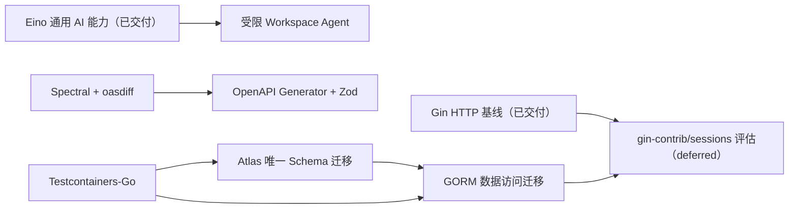

# 知序开发路线图

## 1. 边界

本路线图只维护未交付方向、优先级、依赖和不可破坏的迁移边界。实际拆分、负责人、状态、验收证据与发布时间在 `.trellis/tasks/` 管理；人天是熟悉项目的单人初估，不含需求澄清、外部协调和发布观察。

当前架构事实以 [架构文档](architecture/README.md) 为准。Gin 与 Eino 已是当前 HTTP/AI Runtime 基线；路线图中的 Atlas、GORM、Testcontainers、生成客户端，以及 `gin-contrib/sessions` 评估仍是候选或未来迁移，不得提前写成当前技术基线。

## 当前交付收口（未完成）

当前产品主体已有大量实现与局部验收资产，但发布收口仍缺 Proposal Revision 编辑和真正三方合并、跨领域 Audit 完整覆盖、目标环境容量/FPS 证据、可执行备份恢复/一致性演练，以及统一六 seam、AI Eval、SBOM 和交付包门禁。M10-02 已完成；M9-03 已满足当前导出范围，Evaluation/Audit JSON 不再作为当前缺口。

最终完成以 [需求文档](requirements.md) AC-01..AC-41、生产装配、直接自动化证据和 14 步最终演示为准。详细状态见 [产品交付父任务](../.trellis/tasks/07-16-product-delivery/)；代码对照依据见 [M9 漂移审计](../.trellis/tasks/archive/2026-08/08-10-docs-consolidation/research/product-task-drift-audit.md)、[M10 审计](../.trellis/tasks/archive/2026-08/08-10-docs-consolidation/research/m10-code-status-audit.md) 与 [M11 审计](../.trellis/tasks/archive/2026-08/08-10-docs-consolidation/research/m11-code-audit.md)。

## 工程质量收口（未完成）

已完成可重复静态质量基线和 Health 历史数据有界化；步骤 0 的 CI/迁移运行时观察仍待补。路由错误恢复、Fast/Selected Integration/Full 分层 CI、完整 E2E 接线、Go HTTP 边界 primitives、热点与 Domain 边界拆分、性能预算、全量路由契约和 SBOM 治理尚未完成或未获批准；共享 TypeScript codec、手写 OpenAPI checker 等局部基础不代表对应工作包完成。

精确批准范围和验收见 [架构质量父任务](../.trellis/tasks/08-05-architecture-quality-optimization/)；当前代码证据见 [架构质量状态审计](../.trellis/tasks/archive/2026-08/08-10-docs-consolidation/research/architecture-quality-code-status-audit.md)。

## 2. 依赖顺序

数据库方向按 Testcontainers → Atlas → GORM 推进；最终切换前 Atlas 必须成为唯一 Schema 事实源。OpenAPI 门禁先于生成客户端。受限 Workspace Agent 依赖已交付的 Eino AI Runtime 基线，并继续拥有自身产品与安全门禁。Gin 已交付；Session 框架评估仍晚于 GORM 收口。

## 3. 产品方向

### 3.1 TODO 2：打通受限 Workspace Agent 的真实用户链路

- **优先级/初估**：P1，20–30 人天。
- **目标**：让用户在 Workspace 内提出分析目标，由系统执行多步、可审计的只读工具循环，并把需要写入的结果收敛为 Proposal。
- **当前实现状态**：`/chat` 已具备独立的 `workspace_analysis` 模式、六阶段持久流程、受限时间线和恢复合同；默认 `rag` 路径、历史哈希和既有 RAG Definition 保持不变。真实旧/新 API/Worker 四组合、含新事实后的 current-API/legacy-Worker 回滚、固定 RAG 浏览器和 Worker 恢复演练已通过。该能力仍默认关闭，只有 API、Worker、Definition 与精确 Tool Registry 同时 ready 时才能接受新请求；在完成目标环境灰度和 OTLP 观察前，本条目仍不标记为路线图已交付。
- **首期范围**：只开放 `ReadGitStatus`、受证据约束的 RAG、`ReadSource` 和 `ValidateCitation`；其他自由查询或正文工具先完成 Receipt、输入上限、敏感信息处理和循环契约。
- **边界**：工具仅服务端授权；步骤数、单工具超时、总时限、并发、Token 和费用预算有硬限制；最终事实必须经过 Evidence/Citation 校验。模型不得直接写文件、提交 Git 或扩大 Capability。
- **验收门禁**：一次对话至少完成两次有依赖的只读调用；时间线区分 Token、工具请求/结果、等待和最终回答，刷新或 Worker 重投递能从持久事实恢复；各种上限以稳定错误终止。
- **关闭与回退**：先停止新提交，再让存量 Run 在安全检查点完成或稳定终止；保留 additive schema、receipt、candidate 与历史 Answer，确认没有可运行的新 Definition 节点后只回退 Worker，current API 继续承担兼容读取。不得把工作区分析请求改投固定 RAG。执行步骤见 [发布 Runbook](architecture/runbooks/workspace-analysis-rollout.md)。
- **依赖**：Eino AI Runtime 基线已交付；固定 RAG 与受限 Workspace Agent 模式仍需拥有独立产品入口、能力门禁和 Git 发布恢复路径，Eino 类型不得进入外部 API、领域对象或前端业务类型。

### 3.2 TODO 4：自动合成可持续演进的知识笔记

- **优先级/初估**：P0，25–35 人天。
- **目标**：围绕知识点持续合并多篇资料，去重、补全、并列保留冲突、标注缺口，并让每个结论回到原始来源。
- **边界**：只更新新增知识、证据、冲突或缺口，不重复改写已充分覆盖内容；更新仍通过 Proposal/Approval。合成笔记可作为复习与 AI 面试的可信上下文。
- **产品验收**：详见 [需求文档的附加需求](requirements.md#附加需求自动合成可持续演进的知识笔记)。

## 4. 平台与契约迁移

### 4.1 TODO 3：全量从 Goose 迁移到 Atlas

- **优先级/初估**：P0，5–8 人天。
- **目标**：统一 Schema 定义、版本迁移和漂移检查，并在 GORM 切换前消除迁移双轨。
- **不可破坏边界**：保持现有 Schema、迁移顺序和已部署兼容；新环境和已有数据库结果一致；失败有回滚/恢复路径。
- **完成态**：应用、Docker/CI、测试与运维不再依赖 Goose；GORM `AutoMigrate`/`Migrator` 在生产、测试和命令入口均禁止，Persistence Model 只能映射 Atlas 已批准结构。

### 4.2 已交付 5：后端 HTTP 已从 Chi 迁移到 Gin（2026-08-11）

- **结果**：生产 Router 已收敛为 Gin v1.12.0；严格解码、Problem Details、SSE、Session/API Token、CSRF/Origin、Capability、Workspace 隔离、限流和审计语义仍以 OpenAPI、实现与 Trellis 验收证据为准。
- **保留边界**：Domain/Application 不暴露 Gin Context；标准库 `http.Handler` 仅在 HTTP 适配边界互操作，不保留双 Router 或双 Middleware。
- **后续关系**：这只提供 Session 框架评估的前置 HTTP 基线，不代表 TODO 11 已采用或通过验收。

### 4.3 已交付 6：使用 Eino 收敛 AI 通用基础设施（2026-08-12）

- **优先级/初估**：P0，20–30 人天（已完成，仅作规模参考）。
- **结果**：Chat、OpenAI-Compatible/Ollama Embedding、五类 Structured Scheduler、RAG Graph、只读 Tool Agent 和最终正文 Stream 已固定使用 Eino/eino-ext；旧 direct 实现、selector 和运行时 fallback 已删除，见 [ADR-0027](architecture/adr/0027-eino-primary-ai-runtime.md)。
- **保留边界**：项目继续唯一拥有持久 Workflow、权限、Approval、Evidence/Citation、Model Run/Call、Receipt、Fence 与 PostgreSQL/River 状态机；Eino 类型不进入领域对象、外部 API 或持久化合同。
- **验收状态**：真实 Provider 六项 live gate 与 host-relay 桌面/移动浏览器闭环已通过；容器直连外部 HTTPS 网络路径及连续 7 天/100 个终态的稳定观察仍是独立发布质量证据，不得标记为已通过。

### 4.4 TODO 7：使用 Spectral 和 oasdiff 建立 OpenAPI 契约门禁

- **优先级/初估**：P1，3–5 人天。
- **目标**：使用成熟标准工具检查 OpenAPI 规范质量与兼容性，只保留项目专属断言。
- **边界**：锁定版本、规则、批准基线和升级方式；破坏性差异明确失败，基线变更必须审批，不能通过覆盖快照静默接受；当前生成、lint 和项目特有 Workspace/Auth/SSE 约束继续可验证；删除被成熟工具覆盖的重复脚本。
- **验收门禁**：lint、Breaking Change 和后续生成漂移检查进入 Makefile/CI，并有本地可复现命令；开发机与 CI 对同一输入得到一致结果。

### 4.5 TODO 8：生成前端 OpenAPI 客户端并接入 Zod

- **优先级/初估**：P1，8–12 人天；依赖 Spectral/oasdiff。
- **目标**：用锁定版本 OpenAPI Generator `typescript-fetch` 生成类型和请求客户端，接入认证、CSRF、Abort 与 TanStack Query；在关键不可信响应边界继续用 Zod 严格校验。
- **边界**：生成目录禁止手改或承载业务逻辑，单一命令可确定性再生成且 CI 检查漂移；生成代码与领域 UI Model 隔离。项目 Transport 继续统一 Cookie/API Token、CSRF、Workspace、请求 ID、取消和错误映射；流式下载、SSE、Blob 可保留最小 Adapter。
- **验收门禁**：关键不可信响应在进入 Store/组件前由 Zod fail closed，错误不泄露响应正文；按 feature 行为对等后删除重复手写 Transport/DTO/Decoder，不长期维护两套解析。

### 4.6 已完成 12：优先使用浏览器原生 EventSource（2026-08-10）

- **优先级/初估**：P2，3–5 人天。
- **目标**：让浏览器标准 API 接管可覆盖的 SSE 帧解析、连接状态和重连。
- **结果**：浏览器业务事件流已改用原生 `EventSource`；删除 `ReadableStream.getReader()`、`TextDecoder` 和手写 frame parser。
  服务端默认 legacy named-event wire 保持兼容，原生客户端用 `event_format=message` 与 `last_event_id` seed；Header 优先级、
  no-store、heartbeat 和 Workspace 重放语义由 Handler/OpenAPI 锁定。
- **保留边界**：项目继续拥有 strict Envelope、committed cursor、有界串行队列、generation 隔离与 fatal `CLOSED` 的最小
  Fetch probe。已建立连接的普通网络中断交给浏览器原生重连；probe 只分类 401/400/409/5xx/Content-Type，200 body
  立即取消，不解析 SSE。
- **验证**：Go Handler 单测与 integration 编译、OpenAPI check、前端 69 个 Event/Event Store 定向用例、lint、typecheck、build，
  以及 Chromium smoke（分块 CRLF、heartbeat、多行 data、EOF `Last-Event-ID`、页面刷新后恢复、Cookie、非法事件、
  fatal probe、A/B 切换）通过。

## 5. 数据访问与测试迁移

### 5.1 TODO 9：使用 Testcontainers-Go 管理数据库集成测试

- **优先级/初估**：P0，5–8 人天；是 Atlas/GORM 的前置。
- **目标**：自动创建、迁移和销毁与生产兼容的 PostgreSQL/pgvector 环境，验证 GORM、pgvector、River、事务和约束。
- **边界**：单一工厂负责健康等待、正式迁移、数据库/端口/容器命名、并行隔离、日志摘要和失败销毁；业务测试不得复制容器管理。保留显式外部 DSN 用于性能、故障注入和远程 CI，但两种模式不能竞争同一数据库，并应执行同一迁移和核心断言。
- **失败语义**：Docker 不可用时由开发者选择的集成测试明确 skip 或报可操作错误，不得伪装数据库测试通过；日志不得包含密码或完整 DSN。

### 5.2 TODO 10：将应用数据访问层全面迁移到 GORM

- **优先级/初估**：P0、高风险，80–120 人天；依赖 Testcontainers，最终切换依赖 Atlas。
- **目标**：让应用 PostgreSQL Repository 与事务统一经过 GORM 边界，消除普通业务代码对 pgx Pool/Tx 的直接耦合。
- **模型边界**：Persistence Model 与领域实体分离，显式表/列/nullable 映射；禁止 `gorm.Model`、隐式复数表名、软删除、自动时间戳、关联级联或 Hook 改变现有语义。
- **SQL 边界**：常规 CRUD/分页/批量使用 GORM；复杂 CTE、窗口、图、pgvector、`FOR UPDATE SKIP LOCKED`、advisory lock 和性能 SQL 使用受控 Raw/Exec/Clauses，但仍由 Repository 管理。
- **事务边界**：项目自有 Unit of Work 保持隔离级别、只读事务、Savepoint、跨 Repository 原子提交、Outbox 和 response-loss replay；GORM 类型不进入 Domain/Application。
- **pgx allowlist**：只允许 GORM PostgreSQL Driver、River、Atlas/迁移、连接级 lock、COPY/类型注册等经证据证明的底层能力；每个例外有接口、理由和测试。
- **配置边界**：Logger、NamingStrategy、PrepareStmt、SkipDefaultTransaction、NowFunc、连接池和错误翻译必须显式，不依赖会改变 SQL、事务、时间或脱敏语义的框架默认值。
- **门禁**：现有 Workspace/权限、分页、幂等、乐观锁、唯一约束、错误码不变；真实 PostgreSQL 覆盖事务、锁、Outbox、Workflow/River 和 response-loss replay，复杂查询通过 EXPLAIN/容量门禁；无 N+1、隐式预加载、无界查询或逐条写入退化；日志不得泄露 Credential、正文、完整 DSN、绝对路径或高敏参数。按简单只读→单聚合写→批量/分页→跨 Repository 事务→Workflow/Graph/pgvector/锁分批切换和回滚。

### 5.3 TODO 11：评估并接入 gin-contrib/sessions

- **优先级/初估**：P2，5–8 人天；依赖 Gin 与 GORM。
- **目标**：只替换框架完整覆盖的 Cookie/Session 通用传输机制。
- **强制保留**：PostgreSQL 是 Session、撤销、版本和用户绑定的权威状态；CSRF、Origin、API Token、Capability、Workspace 权限和 Approval Write Authorization 保持独立门禁。
- **采用规则**：按 [ADR-0019](architecture/adr/0019-mature-framework-first.md) 比较 Cookie、Session ID、Store 生命周期、轮换、撤销、CSRF、Origin、API Token 和 Capability 的强制约束与 80% 加权覆盖。不满足则记录证据并保留最小现有实现；采用后删除被覆盖的重复代码，不创建第二连接池、迁移或 Store 事实源。
- **验收门禁**：形成框架接管/项目保留/未采用能力和退出路径的覆盖矩阵；创建、读取、轮换、撤销、过期、并发登录、Cookie 与错误响应保持兼容，日志和错误不泄露 Cookie 或 Session ID。

## 6. 已建立的前置基线

**TODO 1：固定 Docker 页面入口并取消一次性控制凭证**已经建立，初始规模估算为 P0、10–15 人天。它是后续方向的前置事实而非本路线图的任务状态：Web 固定在 `127.0.0.1:8080`，Root 只能由本机命令选择，浏览器会话与挂载权限分离，Workspace A/B 数据与索引隔离；`down` 保留选择、数据库和模型密钥，经确认的 `reset` 也不删除宿主机文件。当前实现细节见 [系统设计](architecture/system-design.md) 和 [运行手册](operations.md)。

## 7. 长期交付顺序

1. 保持 Workspace、文件/Git/数据库一致性和安全写回基线。
2. 完善持久 Workflow、摄取、检索和证据门禁。
3. 完成整理、文章优化、问答和合成笔记闭环。
4. 完善图谱、集合、健康、时间线、Artifact、Review 与 Interview。
5. 用固定评测、安全、容量、备份恢复和发布演练收口。

所有新基础设施、框架和第三方集成都必须先执行成熟方案门禁；历史理由记录到 ADR，当前任务状态只记录到 Trellis。
